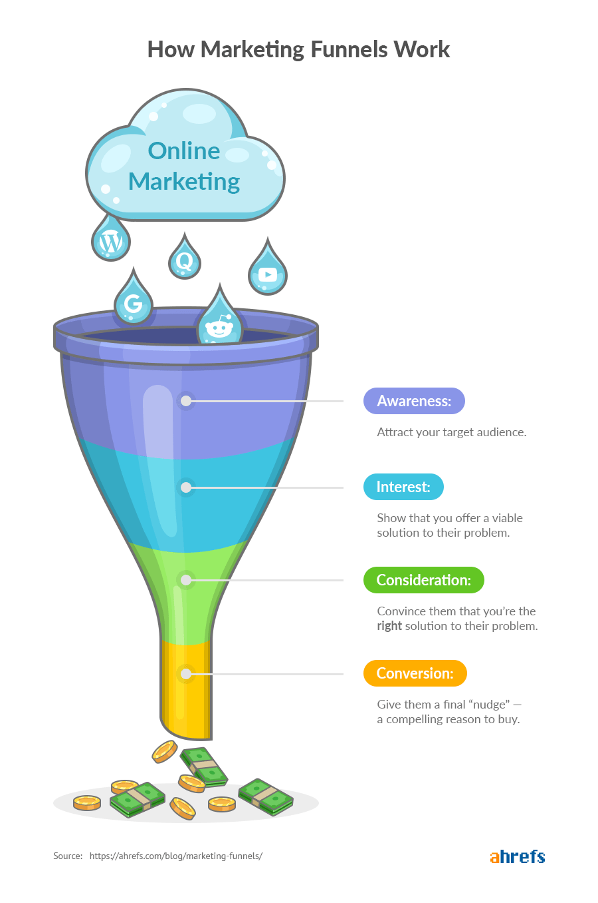

# Marketing Funnel

## 마케팅 퍼넬이란

- 고객들을 비지니스로 끌어오기 위한 시스템
  - 깔때기 구조로 되어있는 것은, 점점 참여하는 고객의 수가 적어지기 때문
- 시스템의 구성
  - Awareness
    - 문제를 갖고 있는 고객이 자사의 제품이 있다는 것을 인식
    - 마케터가 등장하는 장면
    - 거의 모든 채널에 사람들이 인식할 수 있도록 그물을 쳐야 함
    - 채널 예시
      - google
      - youtube
      - online communities
        - facebook
        - reddit
  - Interest
    - 보다 구체적인 니즈에 접근
    - 자사의 제품이 솔루션이 될 것이라는 것을 알려줌
  - Consideration
    - 그들이 왜 자사의 제품을 써야하는지 어필
  - Conversion
    - 진짜 사야할 마지막 넛지를 제공
    - 예시
      - 7-day trial for only 7dollars
      - 남은 방이 얼마 안남았어요!(10명의 유저가 보고 있습니다)
    - upsell하도록 함
- 시스템 구성에 허점이 있는지 확인(정량적인 지표로)
  - 어느 레이어에 허점이 있는지 확인하고 그곳을 개선
  - Awareness
    - 사이트에 오는 방문자들 수
  - Interest
    - 메일링 리스트에 가입하는 사람들 수
  - Consideration
    - 이메일들에 대한 CTR
  - Conversion
    - 그들의 제품을 구입하는 사람들의 수
- Funnel도중에 떠난 이들을 다시 데려오는 방법
  - Retargeting
    - pixel(쿠키)을 이용해서 사이트에서 이탈해도 해당 광고를 다시 보이게 함
  - Live chat
    - 유저가 직접적인 문제에 대한 해답을 못찾았을 때 활용
