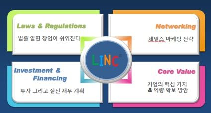

# 창업에 대하여

- [스타트업, 창업공학 - zdnet](http://www.zdnet.co.kr/column/column_view.asp?artice_id=20180309092739)

## LINC 컨셉

- 쪼개고 정복하라(Divide & Conquer)
  - 복잡한 문제를 분해. 그렇게 단순한 문제를 해결해서 하나로 취합해서 복잡한 문제를 해결
- 창업 문제
  - L
    - Law & Regulations
    - 법을 알면 창업이 쉬워진다
  - I
    - Investment & Financing
    - 투자 그리고 실전 재무 계획
  - N
    - Networking
    - 세일즈 마케팅 전략
  - C
    - Core Value
    - 기업의 핵심 가치 & 역량 확보 방안
    - 스타트업의 핵심 가치는 CEO

## 성공하는 창업? 실패를 줄이는 창업!

- 긴 호흡을 갖고 최소 3년 이상 준비
- 창업 3요소
  - 사업 아이템
    - 피드백은 고객으로 부터
  - 자본
    - **사업 계획서** 를 작성해봐서 필요한 자본금이 어느정도 되는지 확인 필수
    - 현재 아이템과 자본금을 가지고 창업을 할 것인지 말 것인지를 결정하는 가늠자로 사용해야 함
  - 창업자(팀)의 기업가 정신
    - **왜 사업을 하는가** 를 자기자신에게 끊임없이 물어야 함
      - 경영철학을 넘어, 신앙에 가까운 이유를 스스로 찾아야 함
      - 왜 해야하는지 신념이 없으면 조그마한 난관에 부딪혀도 쉽게 허물어지고 포기함
    - 가장 중요한 요소

### 창업에 성공하기 위해서

실패를 줄이는 창업을 해야 함. 준비는 매우철저히

- 성공하는 창업
- 실패를 줄이는 창업
  - 자원은 유한 창의는 무한
  - 하면 안되는 것을 가려내는 전략이 필요함
