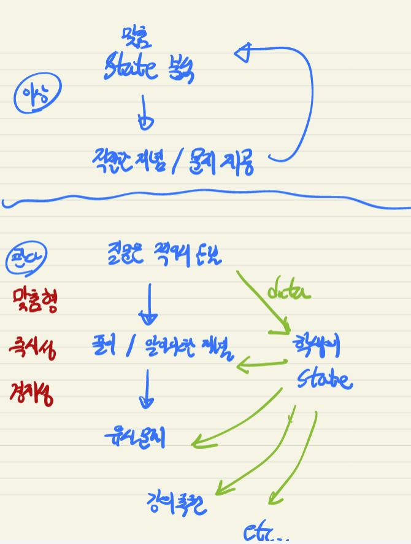
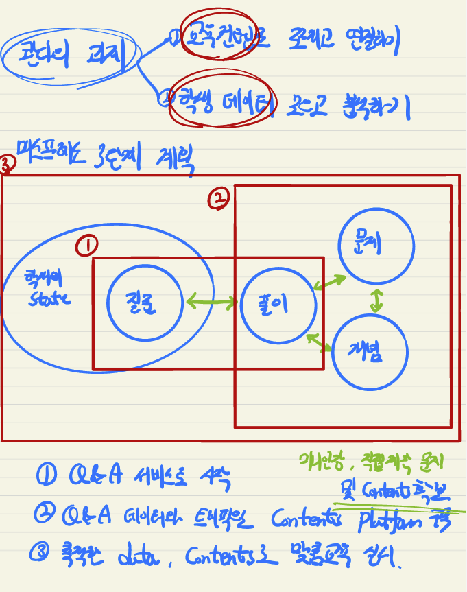

# 콴다

- 의문
- 미션
- 개요
- 과제
- 매스프레소 3단계 계획

## 의문

## 미션

- 교육의 상향 평준화
  - 진정한 교육의 격차는 자습할때

## 개요

콴다의 UX 프로세스

- 제품 정의
  - 맞춤형 교육 서비스 플랫폼
- 제품 특성
  - **맞춤형**
  - 즉시성
  - 경제성
- 하지 않는 것
  - 동기 부여
- UX 프로세스
  - 질문을 학생이 적어서 올림
    - 적어 올린 질문은 학생의 지식 state를 파악하기 위한 데이터로 환원
    - *알고 있다고 생각하지만 사실은 모르는 부분은 어떻게 커버하는가?*
  - 풀이 및 알아야 할 개념을 알려줌
  - 유사 문제를 제시해서 풀어보게 함

## 과제

- 교육 컨텐츠
  - 쪼개고 연결
- 학생 데이터
  - 모으고 분석

## 매스프레소 3단계 계획

매스프레소 3단계 계획

툴로 시작해서, 네트워크로 진화하라

- Q&A 서비스로 시작
- Q&A 데이터와 트래픽으로 Contents Platform 구축
  - 미니인강, 직접제작한 문제 출제
- 축적한 데이터, contents로 맞춤 교육 실시
