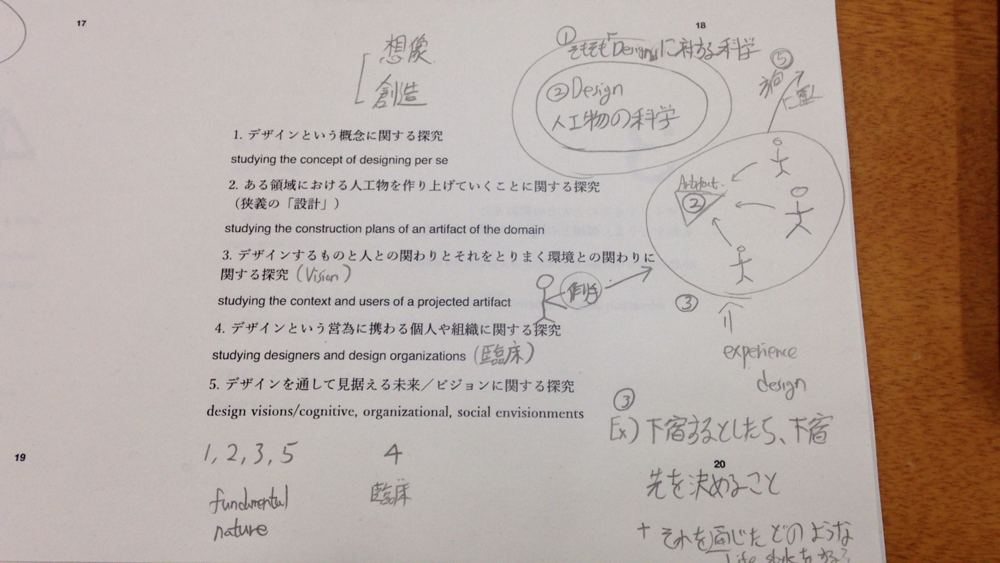

## 디자인

Design is the sciences of the artificial.

- **How things ought to be**
- **How they ought to be in order to attain goals, and to function**
  - current / future(1day ~ 10,000years)
  - myself / you / us / them / our group ...
- Most important
  - Understanding context / situation / constraints
- **Making 0 to 1**

target: physical / conceptual / symbolic / logical / procedural / ... things

人が**想像**して創造する。

## 다자인학

studies of what things ought to be

What makes "design" so difficult to deal with

- problem specification and solution construction are intertwined
답을 내기 전에 모든 문제를 발굴하기가 힘듬

- design as ill-structured / wicked problem solving
문제를 아름답게 정의하기가 힘듬

- hermeneutic circle in design
부분이 전체에 의존하고 전체가 부분에 의존한다.
ex) 성서의 단어와 문맥의 예

- the infinite space for problem specification
문제 규정이 무한대이다.

- the infinite number of solutions
해결책이 무한대이다.

- unbounded context for evaluation criteria
평가 기준의 문맥이 무한대이다.

- the existence of situations that humans are unable to articulate
애초에 인간이 주어진 상황을 완벽히 표현할 수 없다.

## 디자인학의 기준

1. 디자인 그 자체에 대한 탐구
2. 인공적인 물건에 대한 탐구(설계)
3. 디자인한 물건과 사람들의 관계 + 주변 환경 + 경험 탐구
4. 디자인 주체(디자이너, 디자이너 그룹)에 대한 탐구
5. 디자인을 통한 비전 or 미래 or 방향성

## 디자인에 관련된 연구의 역사

장인의 생산

공장 대량생산
(무엇을 만들지 생각하는것 / 만드는 행위의 분리)

분야별 디자인 탄생

## 디자인에 관련된 연구의 역사(계산기과학의 관점으로 부터)

컴퓨터의 출현

1970 - 1980 : 인공지능 연구 / expert system / automating design

1980 : 디자인의 자동화가 불가능하다는 것을 깨달음

1990 : 디자이너의 디자인을 도와주는 방식으로 진화
(AUTOCAD, Photoshop)

2000s : Interaction design / experience design / physical design / 3D printers / robots ...

2010s : social system design / Twitter Facebook ...

## 디자인 구성론(composition)

1. 디자인에 있어의의 체험의 생성과 상황의 구성
2. 디자인을 만들때 관련되는 사람의 성질이나 인지적 특성
