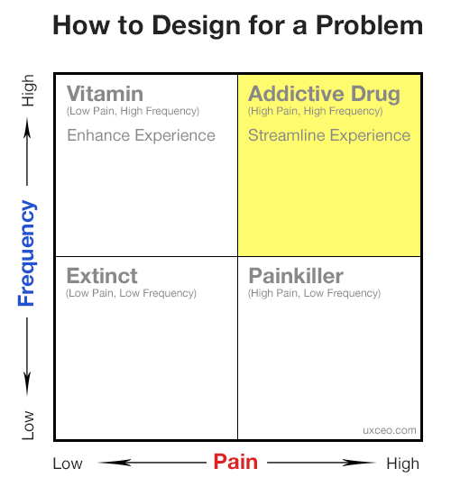

# Understanding user the user in ux

## When should your startup focus on UX?

가장 먼저 자기자신이 위의 framework중 어디에 속하는지 파악하고 그러한 특성에 맞게 UX디자인을 고려한다.

애초에 UX는 어떠한 위치에 존재하던 항상 중요하게 다뤄져야할 것이다.

## What causes behavior change?

`B = mat`
