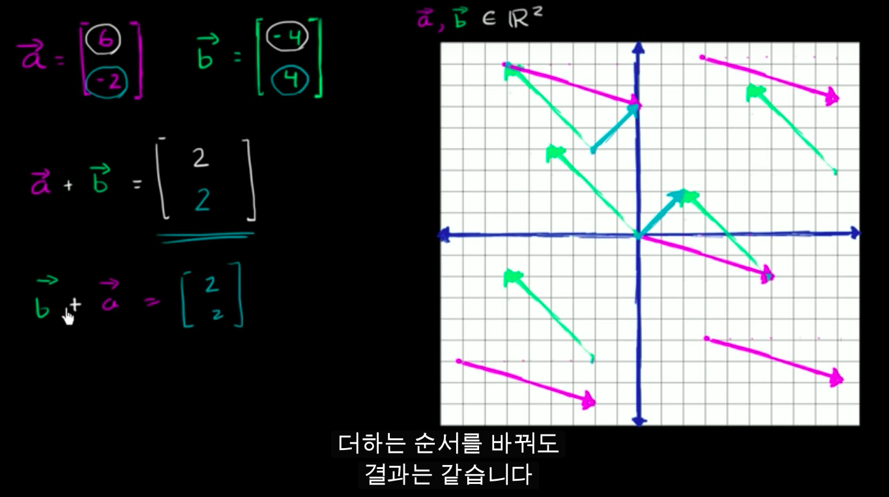
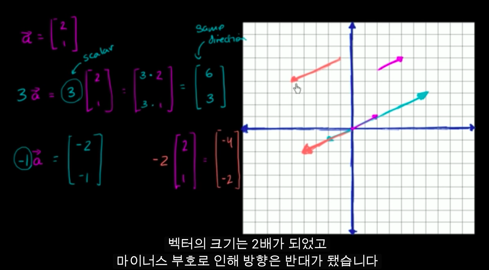
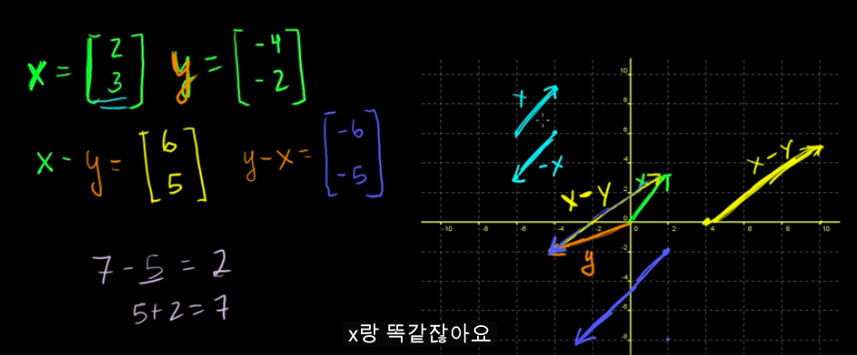
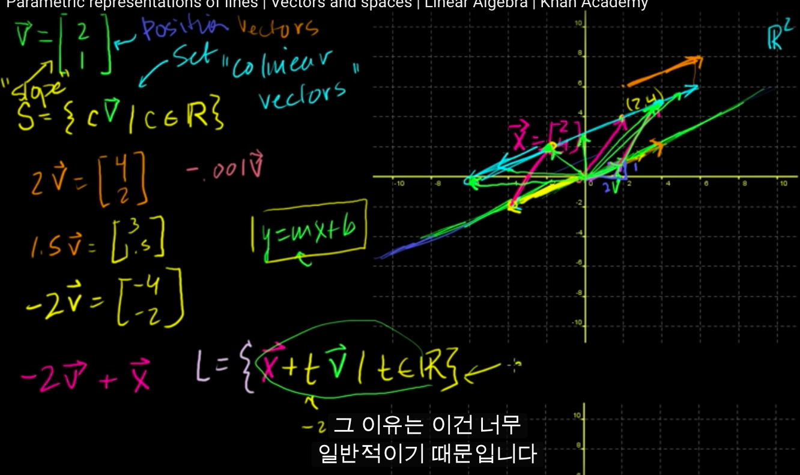
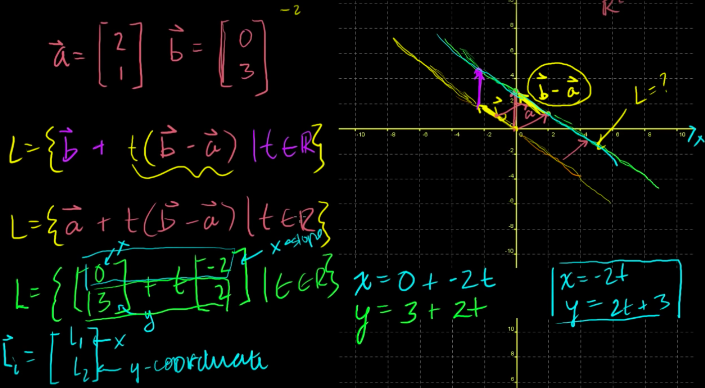
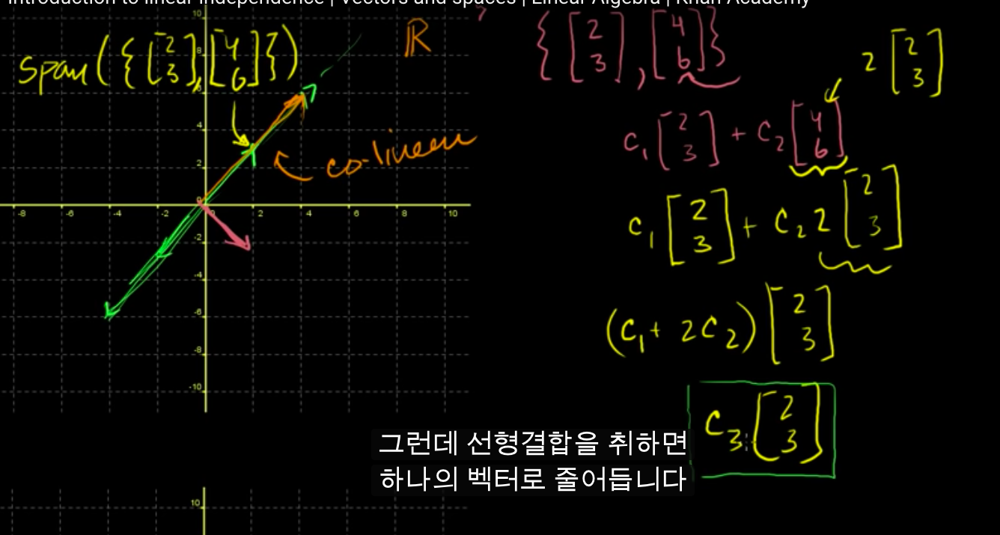

# 평면 및 공간 벡터

- 집합
  - 물건의 모임
  - `A={x1, x2, ..., xn}`
  - e.g
    - 실수의 전체, 자연수의 전체, 평면상의 점 전체
- 원소
  - 집합의 구성요소 하나하나
- 사상
  - 집합 A, B가 있을 때, A의 각 원소에 대하여, B의 하나의 원소를 대응하는 규칙을, 집합 A에서 집합 B에의 사상이라고 부름
    - 함수 개념의 일반화
- 상
  - T가 A로부터 B에의 사상인 경우, A의 원소 x에 대하여 T에 의하여 결정되는 B의 원소를, x의 T에 의한 상이라고 말하며, T(x) 혹은 Tx로 나타냄.
- 같은 사상
  - A에서 B에의 두 사상 T, S는 A의 모든 원소 x에 대하여 Tx = Sx 일 경우, 같다고 말하며, T=S로 작성
- 합성 사상
  - 집합 A, B, C가 있고, 또한 A에서 B에의 사상 T, B로부터 C에의 사상 S가 존재할때, A의 원소 x에 대하여 C의 원소 S(Tx) 를 다응시키는 A에서 C에의 사상을 T와 S의 합성 사상이라고 말하며, S.T혹은 ST로 나타냄
- 일대일 대응
  - 집합 A에서 집합 B에의 사상 T에 의하여, A의 모든 원소와 B의 모든 원소가 일대일로 빠짐없이 대응할 경우, T를 A와 B와의 사이의 일대일 대응이라고 함
- A의 변환
  - 집합 A에서 A자신에의 사상

## 평면 및 공간 벡터

- (기하)벡터
  - 정의
    - 평면 혹은 공간에 있어서의 벡터는, 방향과 크기를 합친 개념
      - 크기는 실수좌표공간에서 길이로 표현됨
    - **위치와는 무관계**
      - 자유롭게 위치를 옮길 수 있음
  - 같은 벡터
    - 다른 장소의 같은 방향과 같은 크기를 갖는 벡터는 같은 벡터라고 함
  - 표현
    - 각 차원에 대해서 얼마나 움직였는지 표시 **(결과의 표시)**
    - v = (5, 0)
    - 선형대수학에서는 열벡터로 표현
      - x차원으로 5만큼
      - y차원으로 0만큼 이동
    - 차원이 높아지면 그림으로 표현하는 것 보다 수학적으로 표현하는게 훨씬 낫다
- 위치 벡터
  - 좌표의 원점 O을 처음 점으로 공간 내의 임의의 한 P점을 끝 점으로 하는 벡터
- 영벡터
  - 길이 0, 방향이 없는 벡터
- 기하벡터
  - V^2: 평면의 벡터 전체 집합
  - V^3: 공간의 벡터 전체 집합

### 실수좌표공간

- 실좌표공간(real coordinate space)
  - R^2
    - 2차원 실수좌표공간
    - [0 0]
    - 모든 가능한 실수 값을 갖고 있는 2-tuple(순서가있는 리스트)로 표현
  - R^3
    - 3차원 실수좌표공간
    - [-1 5 2]
    - 모든 가능한 실수 값을 갖고 있는 3-tuple(순서가있는 리스트)로 표현
  - R^n
    - n차원 실수좌표공간

### 벡터의 연산

벡터의 덧셈

- 벡터의 결과에 다시 결과를 잇는다
- 벡터를 분해한 후 계산결과를 잇는다.

벡터와 스칼라의 곱셈

### 벡터 예제

벡터의 뺄셈

- 벡터는 위치가 상관없어서 어디에서든 작성할 수 있으나, 보통은 표준점(standard position)인 영점에다가 표시한다.
- 두 벡터의 뺄셈의 뺄셈은 두 벡터와 뺄셈의 결과인 벡터로 둘러쌓인 공간을 삼각형으로 만들어버림.
  - y + (x - y) = x 인데, 벡터의 경로를 따라간다고 생각하면 아주 잘 맞아떨어짐
  - x - y 와 y - x는 방향만 반대이다.
    - x + (y - x)를 해보면 쉽게 알 수 있다.

### 단위 벡터(unit vectors)

- 어떤 2차원 벡터든, 단위벡터 i, j로 표현 가능하다.
  - `i = (1 0), j = (0 1)`
    - 이 i,j는 물리에서 잘 쓰이는 단위 벡터일 뿐
  - `v = 2*i + 3*j`
- 어떠한 주어진 방향으로 길이가 1인 벡터를 단위벡터라 함

### 직선의 매개변수 표현

- 방법
  - 1 원점을 지나는 위치 벡터의 집합을 매개변수를 이용해서 표현
    - `S = { ta | t는 실수의 원소 }`
      - t는 실수
      - a는 방향 벡터(기울기 벡터)
      - 위는 **벡터** 의 집합임을 명심
  - 2 해당 위치 벡터의 집합을 벡터를 더하여 평행이동 시킴
    - `L = { x + ta | t는 실수의 원소 }`
    - 직선에 대한 집합적 정의
    - 벡터 x를 더해줌으로써, 벡터들의 집합을 평행이동시켜줌
- 왜 이와같은 표현을 쓰는가?
  - **벡터에서의 직선의 표현은 모든 차원으로 확장될 수 있다.**
    - `y = ax + b`는 오직 2차원에서만 쓸 수 있다.

## 선형 결합(Linear Combination)과 생성

- 벡터들의 합의 결합
  - `c1v1 + c2v2 + ... + cnvn`
  - 이 벡터의 선형 결합의 결과는 두 벡터가 한 직선 위에 있지 않는 한, 모든 R^2 의 벡터를 표현 가능하다.
    - 한 직선에 있는지 확인은 `v1 = (a, b), v2 = (c, d)`일때, `a/b = c/d` 인지 확인하면 된다.
- 벡터의 생성(span)
  - `span(v1, v2, ... , vn) = {c1v1 + c2v2 + ... civi ... + cnvn | ci 는 R에 속하고, 1 <= i <= n}`
    - 이 벡터들이 선형 결합으로 만들어낼 수 있는 공간 전체

## 선형독립

co linear -> 벡터가 동일선상에 있음을 나타내는 말

- 선형 종속(linearly dependent)
  - 벡터의 집합에서 적어도 하나의 벡터를 집합의 다른 벡터의 선형 결합으로 나타낼 수 있는 집합
    - `{(2, 3), (7, 2), (9, 5)}`
      - `v1 + v2 = v3`이므로, 선형 종속 집합(linearly dependent set)이다.
  - 벡터의 조합으로 만들어진 선 / 면 위에 벡터 집합에 속하는 다른 벡터가 존재하는 경우
- 선형 독립(linearly independent)
  - 벡터의 집합에서 어떠한 벡터도 다른 벡터의 선형 결합으로 나타낼 수 없는 집합을 의미
    - `{(7, 0), (0, -1)}`
      - 선형 결합으로 두 벡터는 서로를 나타낼 수 없으므로 이는 선형 독립
    - `{(2, 0, 0), (0, 1, 0), (0, 0, 7)}`
  - R^2 에서 효율적으로 기저(basis)를 만들기 위해서는 벡터 두개가 필요하며, 필요없는 벡터를 더할 필요가 없다
