# 선형대수

선형대수(linear algebra)는 덧셈과 곱셈의 연산 후에 나타나는 변화와 구조에 더 많은 초점을 두고 있다. 선형대수는 행렬이론이나 벡터공간이론 등을 활용해 선형방정식의 해를 구하는 것을 핵심적으로 하고 있다. 즉, 행렬은 주어진 선형시스템 내에서 현상을 보다 효과적으로 표현 가능하도록 해주며, 벡터(vector)는 제한된 공간 안에서의 선형사상을 표현하는데 유용하게 사용된다. 여기에서 선형(線型)이란 자연과 사회에서 나타나는 현상들을 선형사상(linear map)으로 표현하고 이해하고자 하는 하나의 패러다임이다.

- 의문
- 개요
- 좋은 자료
- Essence of linear algebra 정리
  - 1 Vectors, what even are they?
  - 2 Linear combinations, span, and basis vectors
  - 3 Linear transformation and metrices
  - 4 Matrix multiplication as composition
  - 5 Three-dimensional linear transformation
  - 6 The determinant
  - 7 Inverse matrices, column space and null space

## 의문

- *가우스 소거법 이란*
- *기본행렬과 기본열 연산 이란*

## 개요

키워드

1. 연립일차방정식
2. 행렬
3. 벡터공간

하나의 문제를 서로 다른 세 관점으로 볼 수 있게 도와줌

행렬은 벡터공간에서는 변환을 나타내며, 그 자체가 함수이다(정의역, 치역, 함수식이 표현되어있음)

## 좋은 자료

- [3Blue1Brown - Essence of linear algebra](https://www.youtube.com/watch?v=fNk_zzaMoSs&list=PLZHQObOWTQDPD3MizzM2xVFitgF8hE_ab)

## Essence of linear algebra 정리

수학에서 직관(궁리)은 철저히 배제해야 한다고 생각했으나, 수학의 드넓은 세계를 이해하기 위해서는 직관 역시 논리와 마찬가지로 매우 중요한 요소임을 깨닫게 되었다.

### 1. Vectors, what even are they?

- 벡터
  - 근본적인 선형대수의 구성조각
  - 크기(길이)와 방향을 가짐(숫자쌍)
    - 꼬리(원점)에서 시작한 벡터가 끝에 어떻게 다다를지를 알려줌
- 벡터에 대한 관점
  - 물리학
    - 공간을 가리키는 화살표
  - 컴퓨터 과학
    - 순서가 있는 숫자 리스트
  - 수학
    - 벡터의 합과 스칼라와의 곱셈과 같은 연산들 만족하면 추상적으로 전부 벡터라고 할 수 있음
      - ADT와 비슷한 느낌
  - 선형대수에서는 기본적으로는 원점에 꼬리를 둔 화살표라고 생각하자
- **벡터의 중심 연산(선형대수의 모든 주제는 이 두 중심 연산으로 귀결)**
  - 벡터합
  - 스칼라와의 곱
    - 스케일링
- 열벡터(column vector)
  - `n x 1`
- 행벡터(row vector)
  - `1 x n`

### 2. Linear combinations, span, and basis vectors

- 벡터를 바라보는 새로운 관점
  - 기존 관점
    - 크기와 방향을 갖는 화살표
    - 순서가 있는 숫자의 리스트
  - 새로운 관점
    - 각각의 좌표를 스칼라로 생각함
      - i-hat: x축의 단위벡터, 오른쪽 방향의 길이가 1인 벡터
      - j-hat: y축의 단위벡터, 위쪽 방향의 길이가 1인 벡터
    - 예시
      - (3, -2)
      - 3i + -2j
- 위의 i-hat, j-hat 둘을 xy좌표계(coordinate system)의 basis(기저)라고 함
- 기저를 바꾸면 완전히 새로운 좌표계가 탄생함
  - 수치로 벡터들을 표현할 때, 우리는 암묵적으로 특정 기저 벡터들을 선택한 상태임
  - **선형대수에서 고려하고 있는 좌표계는 직각좌표계**
    - (굳이 직각좌표계가 아니어도 됨)모든 좌표를 중심각과 반지름으로 표현 가능 (r, theta)
- 선형 조합(linear combinations)
  - 두 벡터를 스케일링 하고 더하는 것
  - 선형 조합의 결과
    - xy평면의 모든 벡터를 나타낼 수 있음
    - 벡터의 끝이 원점을 통과하는 직선 위로 제한 됨
    - 벡터가 원점으로 고정됨
- 벡터의 확장 공간(span: 생성)
  - **오로지 두 가지 기본 연산(벡터 합 / 스케일링)을 가지고 도달 가능한 모든 벡터들의 집합**
    - 임의의 벡터들의 선형 조합으로 나타내지는 모든 벡터들의 집합
  - 2차원에서는 xy평면에서 주어진 두 벡터 쌍의 조합으로 나타날 수 있는 결과 벡터들의 집합
    - xy평면의 모든 벡터를 나타낼 수 있음
    - 벡터의 끝이 원점을 통과하는 직선 위로 제한 됨
    - 벡터가 원점으로 고정됨
  - 예시
    - 3차원 공간에서 서로 다른 방향을 가리키는 두 벡터의 span은 어떻게 될 것인가?
      - 3차원 상의 평면
    - 3차원 공간에서 서로 다른 방향을 가리키는 세 벡터의 span은 어떻게 될 것인가?
      - 마지막 벡터가 기존 두 벡터의 span 평면에 놓이지 않는 경우
        - 새로운 방향을 가리키게 되므로, 3차원 상의 공간을 나타냄
      - 마지막 벡터가 기존 두 벡터의 span 평면에 놓이는 경우
        - 선형 조합의 결과역시 기존의 span 평면에 놓이게 되므로, 기존 span 평면에 갇힘
      - 기존의 두 벡터의 span이 직선인 경우
        - 마지막 벡터가 해당 직선 span에 갇히는 경우
          - 해당 직선 span에 갇힘
        - 마지막 벡터가 해당 직선 span에 갇히지 않는 경우
          - span 평면을 생성
- 선형 종속(linear dependent)
  - span의 축소 없이 하나 이상의 벡터를 제외시켜도 되는 경우 그러한 벡터의 집합을 선형 종속이라고 함 == 벡터들 중 하나가 다른 벡터들의 선형조합으로 표현 가능한 경우
- 선형 독립(linear independent)
  - 각각의 벡터가 기존 span에 또 다른 차원을 추가해주는 게 가능한 경우, 그러한 벡터의 집합을 선형 독립적이라고 함
- 기저(basis)
  - 벡터의 full space를 span(생성)하는 선형 독립적인 벡터들의 집합
    - **Question: 이 정의는 왜 맞는 말인가?**

### 3. Linear transformations and matrices

Unfortunately, no one can be told what the Matrix is. You have to see it for yourself. - Morpheus

행렬 자체가 하나의 함수(변환), 벡터공간의 선형변환을 나타냄

행렬은 함수적 정의의 한 표현이라고 볼 수 있다. 따라서 역행렬은 역함수.

`det(A)=0 <=> 역행렬이 존재하지 않는다 <=> 역함수가 존재하지 않는다 <=> 함수가 전단사가 아니다(단사가 아님)`

`f: R^2 -> R^2, f(x,y) = (2x+3y, 3x+4y)`

- 선형 변환(linear transformation)
  - 선형대수에서는 특수한 형태의 변환으로만 제한
  - **선형 변환**
  - 변환
    - 근본적으로 함수의 다른 말
      - *근본적으로 변환이 함수라면 왜 x축에 변환 전(a, b), y축에 변환 후 (c, d)이렇게 표현하지는 않는가? 이것이 우리가 배운 일반적인 함수의 표현 방법 아닌가?*
    - 입력을 받고 결과물을 반환하는 그 무엇
    - **특정 벡터를 입력받아 다른 벡터를 반환하는 변환**
  - 왜 "변환"인가
    - 입력 - 출력 관계를 시각화하는 특정 방법을 암시
    - 벡터 함수를 이해하는 가장 좋은 방법은 움직임으로 이해하는 것
- 변환의 선형성
  - 모든 선들은 변환 이후에도 휘지 않고 직선이어야 함
  - 원점은 변환 이후에도 원점을 유지해야 함
    - 선형변환이라면 격자 라인들이 변형 이후에도 여전히 **평행** 하고 **동일한 간격** 으로 있어야 함
  - 이러한 성질로 인하여, `f : R -> R^n`인 변환은 전단사가 될 수 없음
    - 결국 선형변환은 `f : R^n -> R^n`과 같이 `n=n`이어야 함
- 변환을 수학적으로 표현하는 법
  - 기저벡터 (i-hat, j-hat)가 어떻게 변화하는지만 알면 됨
  - 예시
    - (-1, 2) = `-1i + 2j`
    - 위의 선형조합은 변환후에도 유지됨. 그래서, 기저 벡터의 변화(`i, j`)만 반영하면 됨
  - 2차원의 선형 변환은 4개의 숫자로 설명 가능
    - 2 x 2 행렬
    - **이 행렬이 변환을 설명하는 언어를 제공**
  - 선형 변환
    - 어떤 벡터든 기저 벡터의 선형 조합으로 표현이 가능(기저 벡터의 정의로부터)
    - 선형 변환은 위의 선형 조합을 유지하므로, 기저 벡터의 변환만 생각해서 기존의 선형 조합을 계산
    - 변환된 벡터의 결과가 나옴
  - 만일, i-hat, j-hat의 변형의 결과가 선형 종속이면, 2차원 공간을 수축(squish)시켜, 두 벡터가 놓여있는 선이나 원점으로 만듬(1차원 span)
- 선형 변환과 좌표계
  - 선형 변환 전 v벡터의 위치 좌표를 (2, 3) 이라고 하자
    - 여기서 (2, 3)이라는 것을 암묵적으로 직각좌표계의 기저 벡터를 (1, 0), (0, 1)로 설정해 둔 것과 같다.
  - A라는 행렬로 나타나는 선형 변환 후에 v벡터의 위치 좌표가 (4, 5)가 되었다고 하자
    - 이 (4, 5)라는 위치 역시 그대로 직각좌표계를 사용한 좌표이다. 선형 변환을 행했음에도 불구하고 직각좌표계를 이용해서 벡터를 표현하므로써, 기존 벡터가 변환 전의 상태에 대비해서 변환의 결과를 파악할 수 있다.
    - 또한 변환의 횟수에 상관없이 직각 좌표계의 좌표로 표현 함으로 변환 자체보다 그 결과에 초점을 둠

형렬은 공간의 어떤 변환으로 생각

### 4. Matrix multiplication as composition

- 선형변환을 하고 또 선형변환을 하는 경우
  - 예시
    - 회전변환 후 shear
  - 기저를 이용한 선형변환의 구성을 기술 가능
    - 이는 연속적인 변환의 process를 무시하고 연속적인 변환의 결과만 나타냄
  - 선형변환
    - 선형변환을 나타내는 행렬의 det = 0 이면, 그 전의 기저 벡터들이 어떠한 위치 벡터를 가지고 있더라도 한 현재 기저벡터의 개수 - 1 이하의 차원 위에 위치하게 된다.
- 행렬의 곱(함수의 합성)
  - **한 선형 변환을 적용하고 나서 다른 선형 변환을 적용한 것과 같음**
    - 함수의 합성과 같음
  - 연속적인 선형 변환은 오른쪽에서 왼쪽으로 읽어나가야 함
    - 함수의 합성
  - `AB ≠ BA`
    - 행렬의 곱이 함수의 합성임을 생각하면 이는 자명
- 예제
  - 두 행렬을 곱하는 순서는 중요한가?
    - 행렬의 곱을 선형 변환을 적용하고 나서 다른 선형 변환을 적용한 것과 같다고 생각하면 알기 쉬움
  - 행렬곱의 결합법칙 증명
    - `(AB)C = A(BC)`
      - 왼쪽: C변환을 적용한 뒤에, B변환, A변환을 적용
      - 오른쪽: C변환을 적용한 뒤에, B변환, A변환을 적용
      - 다를게 없음
      - 또한, 행렬은 하나의 함수에 대응하므로, 위는 함수 합성의 성질로부터 자명

**행렬의 곱이 벡터에 대해서 한 선형 변환을 적용하고 나서 다른 선형 변환을 적용한 것과 같다고 의식하자**

### 5. Three-dimensional linear transformations

### 6. The determinant

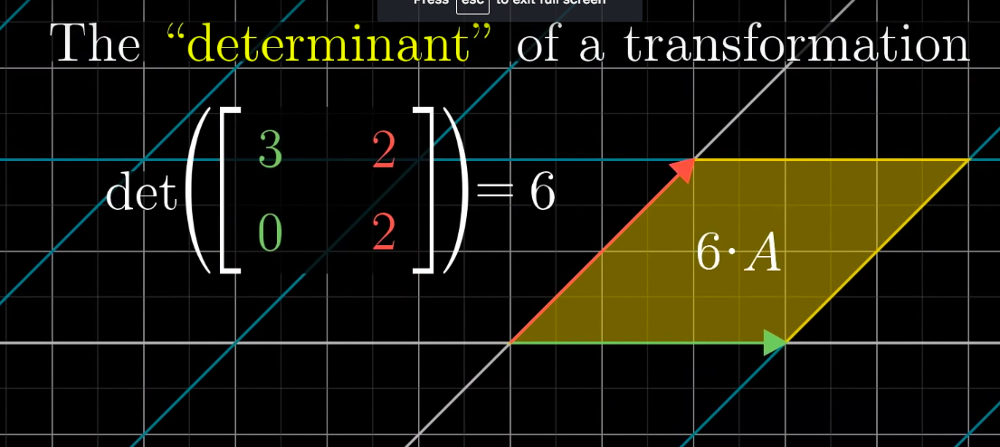

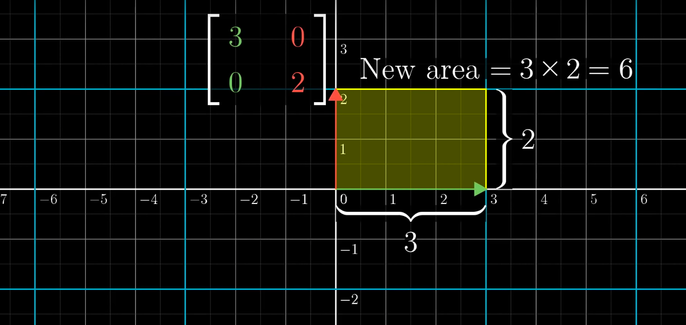

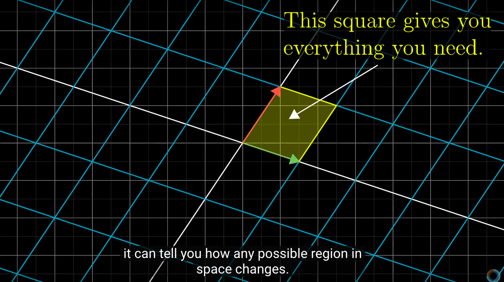

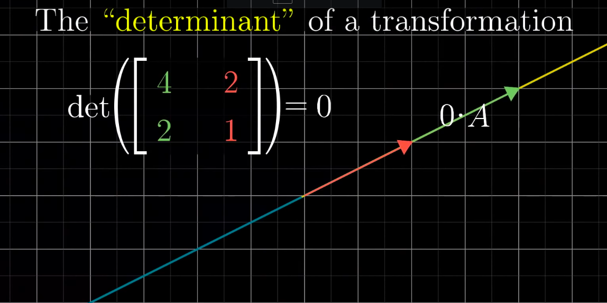

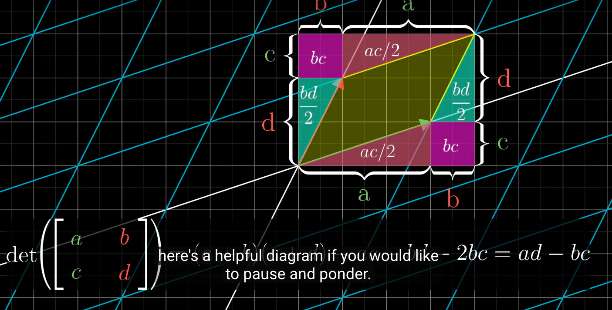

- determinant
  - 정의
    - `det : Matn(R) -> R`
      - 모든 성분이 실수인 n차 정사각 행렬 -> 실수
      - 전사이나 단사는 아님
  - 개요
    - 벡터공간의 관점에서의 의미
      - 어떠한 선형 변환에 대한 단위 면적(넓이나 부피가 1)의 변화 비율
        - 넓이가 1 / 부피가 1인 n차원 평행면체가 어떤 비율로 변화가 되었는지
    - 연립 일차방정식 관점에서의 의미
      - 주어진 연립일차방정식이 유일한 해를 갖는지 아닌지를 계수만을 이용해 판단하는 방법
  - 특징
    - 공간의 확장과 축소
      - 선형 변환에서 공간이 얼마나 확장되었는지 아니면 축소되었는지 확인하는것도 선형 변환을 이해하는 하나의 축
      - 단위 면적(**단위 벡터로 이루어진** 체적)이 몇배로 확장 / 축소 되었는가?
        - 선형 변환은 격자(grid) 라인들이 평행하고 동일한 간격을 유지하기 때문
        - 곡선으로 이루어진 면적도, 아주 작은 격자 직사각형으로 나뉠 수 있기 때문에 잘 맞아 떨어짐
    - 행렬의 열벡터를 배열하는 순서에 따라서 부호가 변화
    - 값에 따른 의미
      - 음수의 의미
        - orientation과 관계가 있음(단위 벡터인 i햇, j햇의 위치가 변환)
        - 2차원 종이라고 치면 종이를 뒤집은 것이랑 같음
      - 0의 의미
        - 차원의 축소
          - 사상이 의 정의역이 `R^3`이었을 경우, 평면으로 차원 축소(`R^2`) or 직선으로 차원 축소(`R^1`) or 원점으로 차원 축소
        - 역행렬이 존재하지 않음
    - 역행렬의 존재성
      - `n`차원 평행면체의 부피가 0이 아님
  - 성질
    - `det(v1, ..., vi+wi, ..., vn) = det(v1, ..., vi, ..., vn) + det(v1, ..., wi, ..., vn)`
    - `det(v1, ..., kvi, ..., vn) = k * det(v1, ..., vi, ..., vn)`
    - `vi = vj => det(v1, ..., vi, ..., vj, ..., vn) = 0`
    - `det(In) = 1`
    - 정리
      - `det(BA) = det(B) * det(A) = det(AB)`
        - 증명
      - `det(A^-1)` = `1/det(A)`
    - 행렬식을 쉽게 구하기위해 상삼각행렬(upper triangular matrix)을 구성한 뒤에 행렬식을 구하는 방법이 있음
      - 상삼각행렬은 대각성분 아래쪽이 모두 0인 행렬
      - `det(상삼각행렬) = d1d2d3...dn(주대각 성분의 곱)`
  - 3차원
    - 단위 정육면체의 체적이 몇배로 확장 / 축소 되었는가?

### 7. Inverse matrices, column space and null space

> To ask the right question is harder than to answer it - Georg Cantor

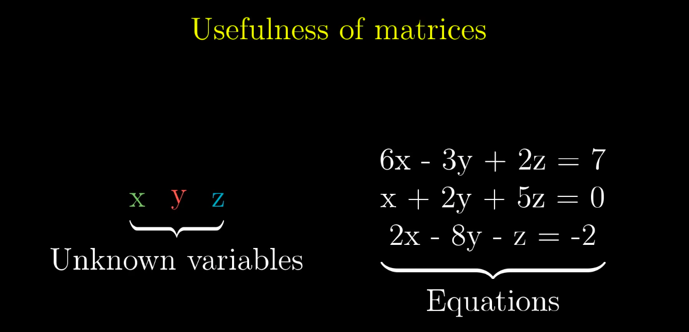

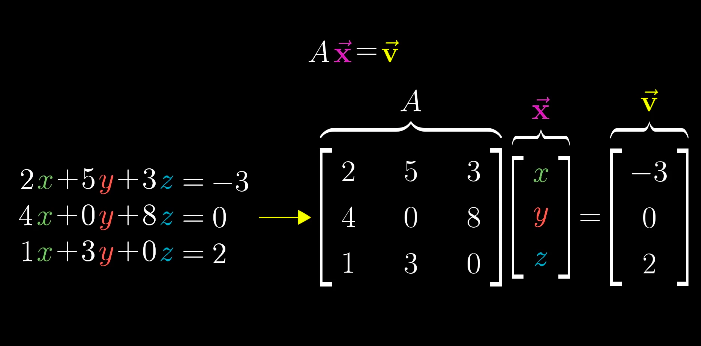

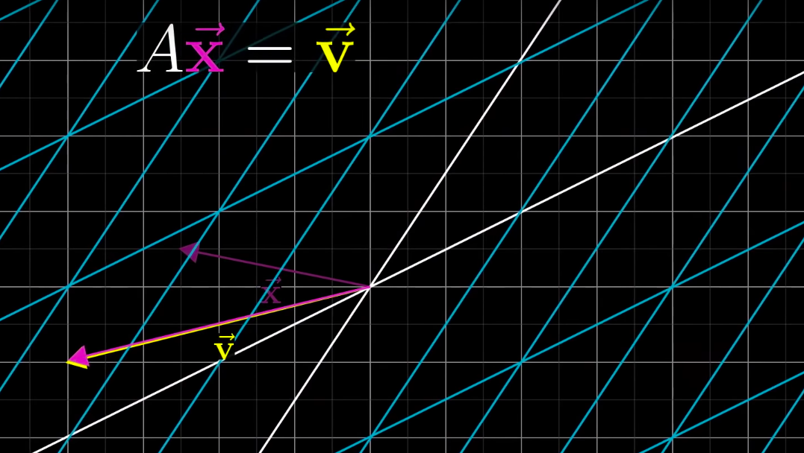

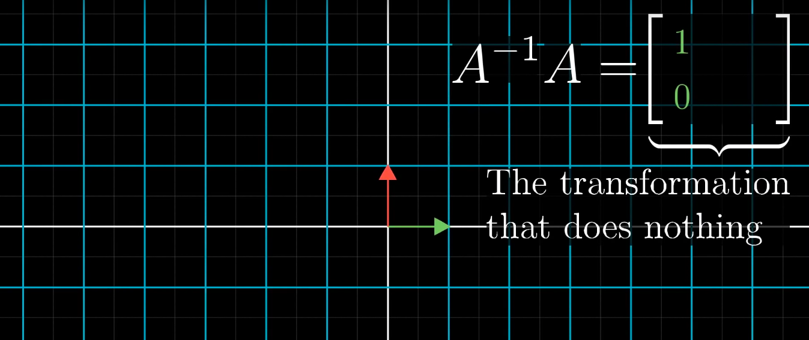

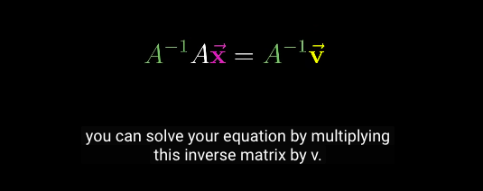

선형 변환은 함수라고 생각할 수 있다(input = 벡터, output = 벡터) 여기서, 선형 변환이 일대일 대응이라면(det != 0), 그것의 역변환이 존재하는 것도 타당하다. 하지만 선형 변환이 일대일 대응이 아닌 경우(det == 0), 그것의 역변환은 존재하지 않을 것이다.

일반적으로 선형 변환(행렬)의 역변환(역행렬)이 존재하지 않는 이유는, 전단사조건을 만족시키지 못했기 때문인데, 특히 단사 조건을 만족시키지 못했기 때문이다.

- 선형대수학의 유용성
  - **선형 방정식계의 문제를 해결하는데에 도움을 줌**
  - 컴퓨터 그래픽 / 로보틱
- 선형(계) 방정식(Linear system of equations)
  - 알지 못하는 임의의 벡터가 우리가 아는 선형 변환으로 인해서 알고있는 특정 벡터로 변화했을 때, 원래 우리가 알지 못했던 임의의 벡터는 무엇인가?
- 풀이(2차원 벡터의 선형 방정식의 경우)
  - 선형 변환후의 기저 벡터의 span이 여전히 2차원일 경우(det != 0)
    - 선형 변환의 가역성
    - 기저 벡터 span의 차원이 축소되지 않으므로 역변환 벡터의 존재가 있음을 알 수 있음
    - 변환 후 벡터에 대한 선형 변환의 역변환으로 우리가 알고싶은 원래의 벡터를 알 수 있음
    - 모든 차원에 적용 가능
  - 선형 변환후의 기저 벡터의 span이 1차원일 경우(det == 0)
    - 기저 벡터 span의 차원이 축소되므로 역변환 벡터의 존재가 없음
    - det == 0 인 변환은, 차원의 축소를 의미하며, 차원이 축소되었을 때는 그 역으로 돌아갈 수 없음
      - 변환의 불가역성 / 정보의 손실
      - 그런데 이것이 참이라고 한다면 1차원의 벡터 집합의 원소의 개수는 2차원의 벡터 집합의 원소의 개수보다 적다라는 결론이 필요함(무한집합과 무한집합의 개수비교) >> **이것은 잘못된 생각!**
        - 하지만 이는 잘못된 생각이다. `R ~ R^n(일반적으로 R과 R^n은 동등)`
        - 그럼에도 불구하고 여기서는 **선형** 변환이므로 역변환이 존재하지 않음
    - 역변환 벡터가 존재하지 않더라도, 우연히 차원이 축소되었을 때, 같은 선분 / 혹은 면적(축소된 차원) 등등에 벡터가 존재한다면 방정식의 해가 존재할 수 있음
- Rank(rank of number)
  - 선형 변환의 결과에서의 차원의 개수
    - 더 자세한 정의는, column space로 나타나는 차원
  - 예시
    - Rank1: 선형 변환을 적용한 후, 기저 벡터의 span이 선
    - Rank2: 선형 변환을 적용한 후, 기저 벡터의 span이 2차원 평면
  - full rank
    - 행렬의 칼럼의 숫자와 rank가 같을 경우 full rank라고 함
    - full rank 선형 변환
      - 오직 영벡터만 영벡터 그자리에 그대로 존재
        - 나머지는 변함
    - non full rank 선형 변환
      - 서로 다른 수많은 벡터가 영벡터 자리로 변환될 수 있음
- Column space
  - 어떠한 선형 변환(행렬 A)의 결과로 표현 모든 가능한 벡터들의 집합
    - 이름의 유래는, 기저 벡터가 어디로 변환 되는지를, 선형 변환의 관점에서, 행렬의 칼럼들의 span이 모든 공간상의 벡터를 나타내기 때문
  - 특징
    - [0 0]은 언제나 column space에 포함됨
- Null space(Kernel)
  - 어떠한 선형 변환으로 인하여 영벡터 자리로 변환되는 벡터들의 집합
    - a linear map L : V → W between two vector spaces V and W, is the set of all elements v of V for which L(v) = 0, where 0 denotes the zero vector in W
  - `Av = [0 0]`의 해집합

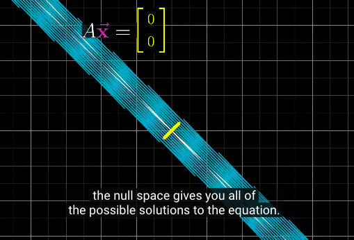

### 8. Nonsquare matrices as transformations between dimensions

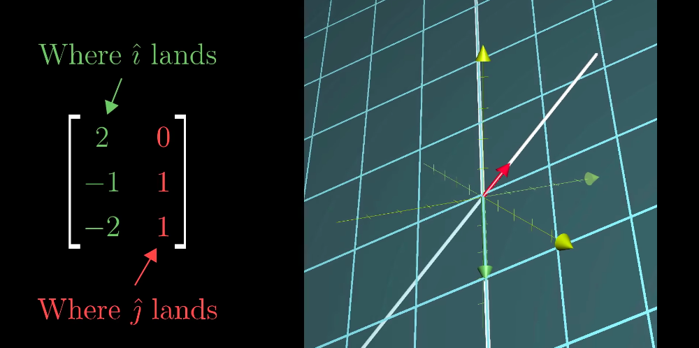

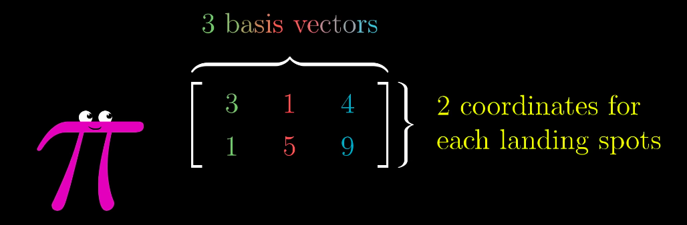

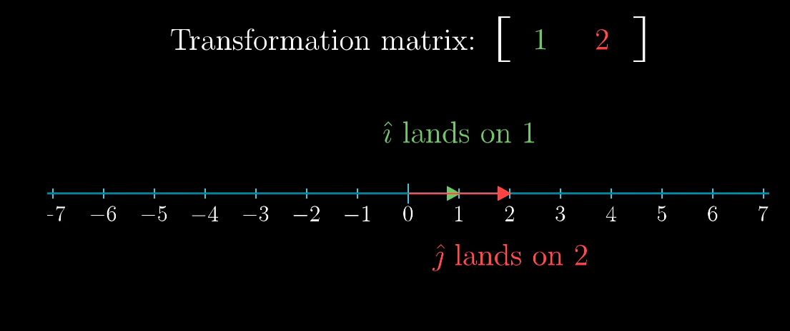

- 3 x 2 행렬
  - 2차원의 벡터를 3차원으로 변환
- 2 x 3 행렬
  - 3차원의 벡터를 2차원으로 변환
- 1 x 2 행렬
  - 2차원의 벡터를 1차원으로 변환

### 9. Dot products and duality

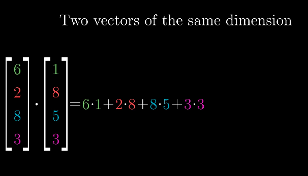

- dot product의 범위에 따른 분류
  - dot product > 0
    - 벡터가 같은 방향
  - dot product == 0
    - 두 벡터가 직교
  - dot product < 0
    - 두 벡터가 반대 방향
- dot proudct의 의미
  - *한 벡터를 다른 벡터에 projection하고 길이를 곱한다?*
- 1x2행렬과 2x1행렬을 곱함, 즉 1x2행렬로 선형변환을 함
  - 차원이 1차원으로 축소
  - 1x2행렬의 앞부분을 i햇이 변화한것, 뒷부분을 j햇이 변화한 것으로 생각
- Duality
  - natural-but-surprising correspondence of mathematical things

### 10. Cross products

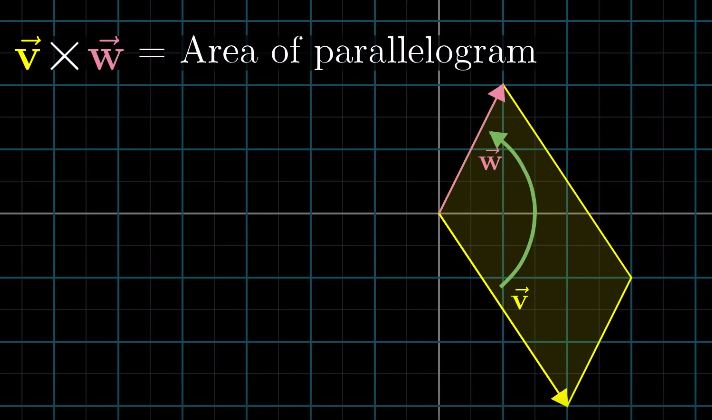

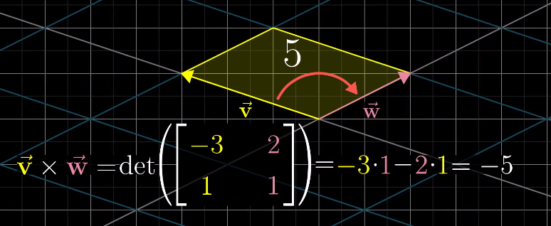

- 계산 방법
  - parallelogram의 넓이 + orientation
  - 따라서 `det(행렬 X(두 벡터를 결합한))`값이 cross product의 값이 됨
    - 만일, 해당 벡터의 결합의 선형변환에서 기저 벡터의 orientation이 변화한다면 부호가 반대가 됨
- 정의
  - 두 다른 3차원 벡터로부터 새로운 3차원 벡터를 생성하는 것
    - 새로 생성된 벡터의 길이: cross product의 결과 값
    - 새로 생성된 벡터의 방향: 은 평행사변형에 perpendicualr한 방향
      - 오른손 법칙을 이용함
- 계산방법
  - 계산방법은 duality와 관계가 있음
  - det를 사용하는 것도 이유가 있음
  - i, j, k의 기저를 사용하는 것도 이유가 있음

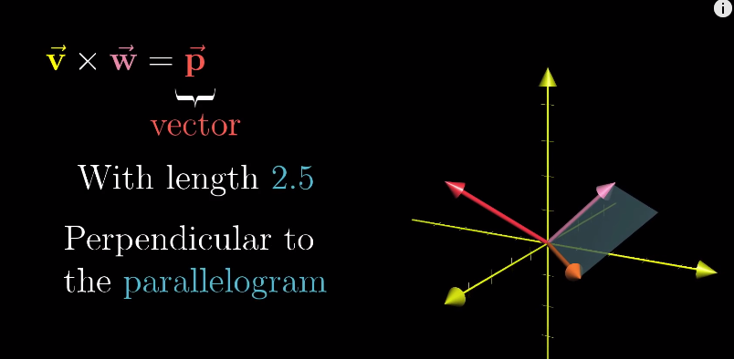

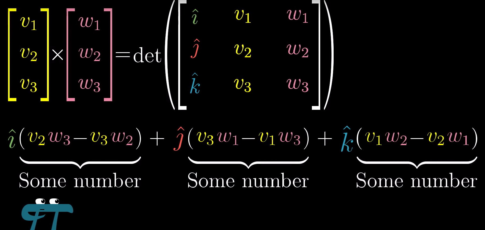
