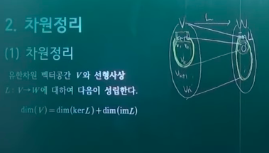
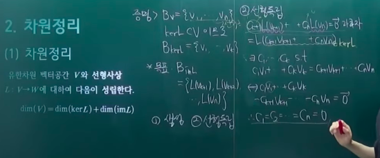
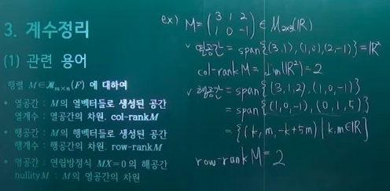
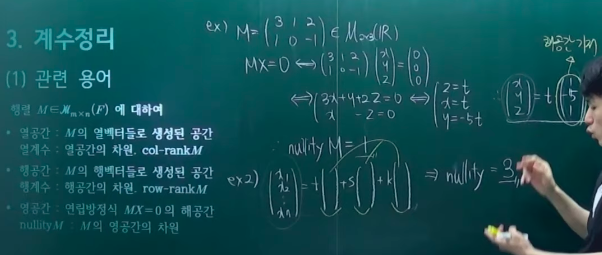
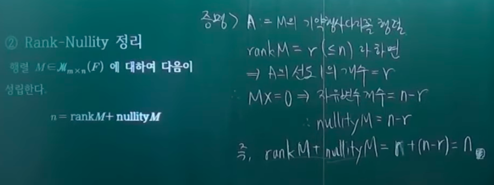
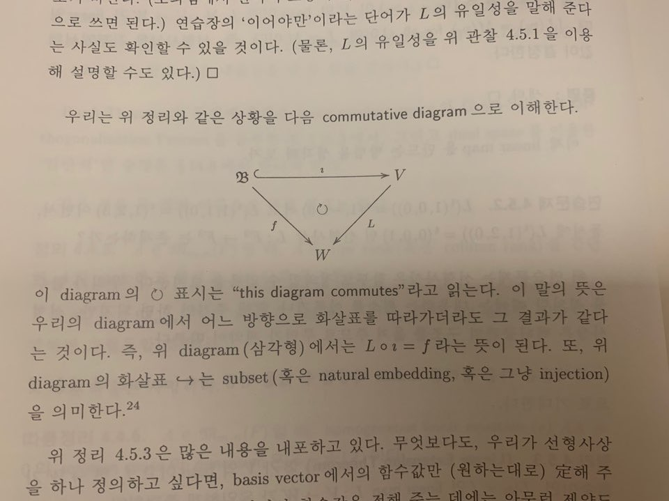
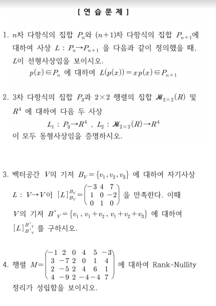

# 선형사상

- 의문
- 기존 내용 복습 질문
- ① 선형사상
  - 선형사상
- ② 여러 선형사상
- ③ 차원정리
  - 차원정리
  - 비둘기집
- ④ 계수정리
- ⑤ Linear Extension Theorem

## 의문

- 단순히 사상이 일대일 대응인 것이랑(동형사상) 그 성질을 그대로 쓸 수 있는 것이랑은 다른 것 아닌가?
  - 선형사상의 경우, 선형사상은 대수구조의 구조를 유지한다는 성질이 있으므로 그 성질을 그대로 쓸 수 있게 된다.
- 선형대수학의 기본정리 증명(동형사상 증명)
  - `L(V,W)`의 덧셈과 스칼라배를 구조상 애초에 `(L1+L2)(v) = L1(v)+L2(v)`로 정의할 수 있는가?
    - ≡ 애초에 선형사상의 집합은 벡터공간인가?
    - 선형사상의 집합의 덧셈을 위와 같이 정의할 수 있음은 자명. 왜냐하면, `L1(v)+L2(v)`는 이미 우리가 아는 값이고 새로 정의하는 것은 `(L1+L2)(v)`라는 선형사상끼리의 덧셈이기 때문
      - **연산은 정의하는 것이지, 천부인권처럼 주어진 것이 아님을 명심하자**
  - M1[v]_Bv = M2[v]_Bv => M1 = M2
    - 가 어째서 성립하는지?
      - 선형사상이기 때문(직접 증명 가능)
      - *v가 0벡터라면?*
- 기본행연산을 하면 하기전과 후의 row-space가 동일하다고 할 수 있는가?
  - 0을제외한 스칼라배 ok
  - 행바꾸기 ok
  - 서로다른 두 행을 스칼라배 하고 더한후 기존 행과 치환 ok
    - 직접 증명해보자
- 어떠한 행렬 M이 주어지면, column-space와 row-space는 같은가?
  - *선형대수와 군 1.3.12 참조?*
- *비둘기집의 원리에서*
  - 선형사상인 경우에는, 같은 차원이고 유한차원인 두 차원 사이라는 조건이 필요한데, 일반적인 비둘기집의 원리는 공집합이 아닌 서로 다른 유한집합 사이 라는 조건을 전제로 하는데, 선형사상인 경우에는 유한집합이 아닌데도 불구하고 성립하는가?
    - 물론 증명은 가능한데, 따름정리와 비둘기집 원리 사이의 관계가 다소 모호함
- *무한차원 벡터공간의 부분집합이 일차독립인 것을 어떻게 파악할 수 있는가?*
- Rank theorem
  - *증명 과정에서 A의 column space와 im LA는 왜 동일한가*
  - *A와 A의 row reduced echelon form(R)이 row space가 동일하다 => AX = 0의 solution space 는 RX = 0의 solution space와 같다는 명제는 어떻게 성립하는가?*
- **함수의 단사, 전사의 개념이 일차독립과 span=W의 개념과 유사점이 있는 것 같음**
  - 단사면 함수 값이 같으면 원소는 같다 ~~ 일차독립이면 벡터를 선형결합으로 나타내는 방법은 하나밖에 없다
  - 전사면 임의의 치역에 대해서, 각 치역에 대응하는 정의역의 원소가 존재 ~~ 임의의 W의 원소는 span으로 표현이 가능
  - *둘이 정확히 수학적으로 어떤 관계인지*

## 기존 내용 복습 질문

다음의 질문에는 반드시 대답할 수 있어야 함

- 대수 구조란 한마디로 무엇인가?
- 대수 구조가 형성된 의의는?
- 벡터 공간은 왜 그 많은 대수구조 중에서도 가군에 해당하게 되는 것인가?
- 벡터 공간의 본질을 설명할 때, 누락된 것이 존재했는데, 그 누락된 것은 무엇이고 그것은 어떻게 보완이 되는가?
- 다른 집합들(실수 집합 등)도 대수구조상 벡터공간이 될 수 있는가?
  - 실수의 집합도 벡터가 될 수 있는가?

## 1. 선형사상(linear map / morphism)

선형대수학은 벡터공간 이라는 대수구조을 탐구하는 학문

어떤 수학적 대상을 이해하기 위해서 가장 많이 쓰는 방법 -> 수학적 대상에 대해서 정의가 되는 함수들을 관찰하는 것

고등학교때 많은 함수를 배운 이유 중 하나 => 실수 체계를 이해하기 위해서

- 사상
  - 대수구조들을 다루는 함수
  - 함수보다 포괄적인 개념(함수와 혼용해서 쓰는경우도 있음)
  - 사실상 사상 = 함수
    - 두 집합의 곱집합이라는 의미에서
- 선형사상이 중요한 이유
  - **다루는 대수구조의 특성을 변형시키지 않고 그대로 보존시켜줌**
    - 가산성(additivity)
    - 동차성(homogeneity)
  - 선형사상을 정의해두면 그 보편성으로 인하여, 다른 선형사상의 조건을 만족하는 함수들의 공통적인 특성을 쉽게 파악할 수 있다.
    - 대수구조와 비슷한 느낌

**대수 구조이던 선형 사상이든 둘다 집합이고 그 집합에 속하는 원소들의 특징은 속하는 집합의 성질에 의존하게 됨**

### 1-1 선형사상

- 목표
  - 가능하다면 모든 상황을 선형사상의 언어로 표현
    - 벡터나 행렬보다 더 다루기 쉬움
- 정의
  - `V, W`가 F-위의 벡터공간일 때, 함수 `L: V -> W`가 다음 조건을 만족하면 `L`을 linear map(선형사상, linear mapping, linear transformation) from V into W 라고 부름
    - 조건
      - `L(v1+v2) = L(v1)+L(v2) (v1,v2∈V)`
      - `L(av) = aL(v) (v∈V, a∈F)`
    - linear map중에서 bijection인 것을 isomorphism이라고 부름
    - isomorphism을 이름바꾸기에 혼동이 없는 linear map으로 볼 수 있음
    - linear map은 이름 바꾸기에 혼동이 있는 그 무엇인가로 해석가능
      - e.g
        - `L(v) = w => L^-1(w)의 벡터들(L^-1(w) = {v∈V | L(v)=w})은 모두 W에서 이름이 w가 됨`
        - 만약 `L^-1(w)`들의 집합에도 벡터공간의 구조를 줄 수 있다면 그럴듯할텐데....
          - quotient space
- 특징
  - 벡터공간의 구조를 옮겨 주는 함수
  - `L: V -> W`가 linear map일 떄
    - L이 injective(단사) <=> L은 monomorphism
    - L이 surjective(전사) <=> L은 epimorphism
      - *단사라는 조건이 없으므로, 서로다른 V의 원소가 같은 함수값을 갖는 경우, 그 두 값을 집합으로 묶어주면 bijective가 되지 않을까?(아이디어)*
    - L이 bijective(전단사) <=> L은 isomorphism
    - V = W => L을 endomorphism 혹은 linear operator 혹은 간단히 operator
    - Bijective endomorphism = automorphism
  - `L: V -> W`가 linear map일 떄, 다음은 동치
    - L은 isomorphism
    - `∃M is linear map: W -> V s.t. M・L = Iv ∧ L・M = Iw`
- 관련 용어
  - `L : V -> W`가 선형사상일 때
    - 핵
      - `kerL = L^-1(0) = {v∈V | L(v) = 0}`
        - 영벡터의 원상집합
        - *여기서 0은 영벡터로 집합취급?*
    - 상
      - `imL = L(V) = {L(v)∈W | v∈V}`
- 관련 정리
  - `L: V -> W`가 linear map
    - `ker L ≦ V`
    - `im L ≦ W`
  - `L: V -> W`가 linear map
    - L이 epimorphism이기 위한 필요충분조건은 `imL = W`이다.
    - **L이 monomorphism이면, V와 imL은 isomorphic하다**
    - `U≦V => L(U)≦L(V)`
- 중요한 관찰
  - `L: V -> W`가 linear map일 떄, 다음 조건은 동치
    - L은 monomorphism
    - `u,v∈V, L(u)=L(v) => u=v`
      - 아래 조건과 동치인것이 핵심
    - `v∈V ∧ L(v)=L(0)=0 => v=0`
    - **`kerL = 0`**
  - `L: V -> W`가 linear이고, `S⊆V => L<S> = <L(S)>`
    - 쉬운증명
    - **센스있는 증명**
  - `L: V -> W`가 linear이고, S는 V의 subset, Bv는 V의 basis일 때
    - S가 일차독립이고 L이 monomorphism => L(S)도 일차독립
      - **S가 일차독립이므로 `<S>`의 기저는 S...**
      - 테크닉이 정말 멋지니 꼭 참조하자(우리의 철학)
- **monomorphism과 epimorphism과 L의 관계 (L은 L: V -> W인 linear map)**
  - monomorphism
    - L이 monomorphism <=> L(Bv)가 일차독립
  - epimorphism
    - L이 epimorhpism <=> L은 V의 generating set을 W의 generating set으로 옮김
  - isomorphism
    - 위의 두 조건을 만족시키면 됨
    - 즉, L은 basis를 basis로 옮김
      - 역으로, basis를 basis로 옮기는 L은 isomorphism
- coset 탐구
  - notation
    - `U≦V ∧ v∈V, v+U = {v+u | u∈U}`
  - 정리
    - `L: V -> W`가 linear map이고 `L(v) = w ∈ imL => L^-1(w) = v + kerL ∧ ker L 과 L^-1(w)사이에 bijection이 존재함 (ker L ~~ L^-1(w) 동등)`
      - 후에 '`X0∈F^n`이 연립방정식 `AX = B`의 한 solution이면, 그 연립방정식의 해집합은 `(LA)^-1(B) = X0 + kerL`임을 보여라' 와 동치

## 2. Linear Map의 보기

- L의 U로의 restriction
  - `U⊆V, L : V -> W`가 함수일 때, L의 U로의 restriction `L|U : U -> W`을 `L|U(u) = Lu (u∈U)`과 같이 정의
    - `L이 linear ∧ U≦V => L|U는 linear`
- zero map
  - 함수 `0: V -> W`을 `0(v) = 0 (v∈V)`로 정의
- **natural embedding**
  - 개요
    - 작은 대수구조에서 큰 대수구조로의 편입
  - `U⊆V, ιU = ι: U -> V, ι(u) = u (u∈U)`
    - `U≦V => ιU: U -> V는 monomorphism`
      - **ι를 natural embedding이라고 부름**
      - e.g 정수를 유리수로 natural embedding을 하여 수의 체계를 확장시킴
        - In mathematics, an **embedding** is one instance of some mathematical structure contained within another instance.
          - When some object X is said to be embedded in another object Y, the embedding is given by some injective and structure-preserving map f : X → Y. The precise meaning of "structure-preserving" depends on the kind of mathematical structure of which X and Y are instances. In the terminology of category theory, a structure-preserving map is called a morphism.
- **natural projection**
  - 개요
    - 큰 대수구조에서 작은 대수구조로의 사영(그림자)
  - `π1: F^3 -> F, π1(t(x,y,z))=x (x,y,z∈F)`
    - `π1`은 epimorphism
    - `π1`은 natural projection
      - 직선 위로 projection
    - `π2`를 둘째 좌표로의 projection으로 생각할 수도 있을 것
  - `P: F^4 -> F^2, P(t(x,y,z,w)) = t(x,y) (x,y,z,w∈F)`
    - P는 x,y평면 위로 projection
- V1,...,Vn이 f.d.v.s일 떄, product space `V = V1 x V2 x ... x Vn`을 생각하자.
  - i-th natural projection(product space를 이용한)
    - `πi: V -> Vi, πi(v1,...,vn) = vi (vk∈Vk for all k)`
  - j-th natural embedding
    - `ιj: Vj -> V, ιj(vj) = (0,...,vj,...,0) (vj∈Vj)`
  - Bj를 Vj의 basis라고 표기할 떄(단, j=1,...,n)
    - `ι1(B1) U ι2(B2) U ... U ιn(Bn)`은 `V1 x V2 x ... x Vn` 의 basis이다
    - `dim(V1 x ... x Vn) = dimV1 + ... + dimVn`
- **matrix A에 대응하는 linear map (L sub A)**
  - 개요
    - 우리의 논의의 엄청난 주인공
    - `A∈Mmxn(F), LA: F^n -> F^m, LA(X) = AX (X∈F^n)`
      - LA는 linear map
      - **선형 = 일차**
        - LA의 모든 좌표함수들이 일차함수이므로 LA를 선형사상이라고 부름
      - `LA(t(x1,x2,...,xn)) = t(a11x1 + a12x2 + ... + a1nxn, ..., am1x1 + ... + amnxn)`
        - LA는 선형사상
  - 특징
    - `A∈Mmxn(F) ∧ B∈Mnxr(F), LA・LB: F^r -> F^m`은 선형사상이다. 이때, `LA・LB = LC`인 `C∈Mmxr(F)`가 존재하는가? C는 유일한가?(C와 D가 위의 조건을 만족하고, 둘을 이항하면 `(C-D)X = 0`이 되는데 `C ≠ D`이면 `(C-D)X`가 0이 아닌 X가 존재하므로 가정에 모순)
    - `ker LA`는 `AX = 0`의 solution space
      - `AX = 0`이 non-trivial solution을 갖는다 <=> `ker LA ≠ 0`
      - `AX = 0`이 trivial solution만을 갖는다 <=> `ker LA = 0` <=> `LA`가 monomorphism
        - `AX = B`의 해집합은 `(LA)^-1(B)`
        - `LA(ej) = [A]^j (j=1,...,n) (단, {e1,...,en}은 F^n의 표준기저)`이므로 `im LA = <[A]^1,...,[A]^n>`
    - `X1,...,Xn∈F^n, A∈Mnxn(F)를 A = (X1,...,Xn)`으로 정의하면 다음이 성립한다
      - `LA는 injective <=> {X1,...,Xn}은 일차독립`
        - `{X1,...,Xn}`이 어떤 것을 의미하는지 생각해보라 `LA({e1,...,en})`
      - `LA는 surjective <=> <X1,...,Xn> = F^n`
      - `LA는 bijective <=> {X1,...,Xn}은 F^n의 기저`
    - `X0∈F^n`이 연립방정식 `AX = B`의 한 solution이면, 그 연립방정식의 해집합은 `(LA)^-1(B) = X0 + kerL`임을 보여라
      - 연립방정식 `AX = B`의 해집합을 구하는 문제가 한 개의 special solution과 `ker LA`를 구하는 문제로 바뀌게 됨
      - 일반적으로 row-reduced echelon form을 이용하는 것이 효과적
- `a: V -> F^n, a(v) = [v]Bv`
  - `dimV = n`이고, `Bv`가 V의 기저일 때, 함수 `a: V -> F^n`을 `a(v) = [v]Bv (v∈V)`로 놓으면, a는 isomorphism이다
- `t: Mmxn(F) -> Mnxm(F), t(A) = tA`
- `tr: Mnxn(F) -> F`

## 3. 차원정리

### 3.1 차원정리

- 차원정리
  - 개요
    - f.d.v.s `V,W`와 선형사상 `L: V -> W`에 대하여 다음이 성립한다
      - `dim(V) = dim(kerL) + dim(imL)`
  - 의의
    - 커널이 중요하다
      - 선형사상의 상을 파악하기 위해서, kernel에 해당하는 원소들을 제외시키고, 나머지 정의역 애들만 봐주면 상에 대한 파악이 된다.
  - 증명(아래)
    - 생성
    - 선형독립

- 차원정리의 따름정리
  - **`V,W`가 f.d.v.s이고 `dimV = dimW`일 때, `L: V -> W`가 linear map이면 다음 세 조건은 동치이다(big event)**
    - 동치인 조건들
      - L은 isomorphism
      - L은 monomorphism
      - L은 epimorphism
    - 참고
      - 위 정리와 본질적으로 같은 정리
        - 전제
          - `A∈Mnxn(F) ∧ L = LA: F^n -> F^n ∧ V = F^n`일 떄
        - `S⊆V, |S| = dimV < ∞`이면 다음은 동치이다
          - S는 V의 기저
          - S는 일차독립
          - `<S> = V`
    - 기본적으로 f.d.v.s를 주로 다루는 이유는, 위의 따름정리와 아래의 본질적으로 같은 정리가 f.d.v.s에서만 정립하기 때문이다
  - V,W가 f.d.v.s 이고, `L: V -> W`가 linear map일 떄
    - `L이 monomorphism => dimV ≦ dimW`
    - `L이 epimorphism => dimV ≧ dimW`
    - **주의**
      - `L이 isomorphism => dimV = dimW`는 어리석은 생각. 왜냐하면 우리의 철학인 같은것은 진짜 같을 뿐임
- 정리
  - `V,W`가 f.d.v.s, natural projection `π: V x W -> V`를 생각하자
    - `dim(VxW) = dim(V) + dim(W)`
      - `ker π ~~ W`
    - `Vi`가 f.d.v.s 일 떄, `dim(V1 x V2 x ... x Vn) = dim(V1) + ... + dim(Vn)`
      - `V1 x V2 x ... x Vn ~~ (V1 x V2 x ... x Vn-1) x Vn`

### 3.2 Pigeon Hole Principle

- 개요
  - `X, Y`가 non-empty finite set이고 `|X| = |Y|`일 떄, `f: X -> Y`가 함수이면 다음은 동치
    - f는 bijection
    - f는 injection
    - f는 surjection
- 특징
  - 차원정리의 따름정리는 f.d.v.s.의 비둘기집 원리 라고 생각할 수 있음
    - *본질적으로 다른 것 같은데 왜?*

## 4. 계수정리(Rank Theorem)

차원정리의 행렬버전

### 4.1 관련 용어

- 관련 용어
  - `A∈Mmxn(F)`
    - row
      - row space
        - `M1xn(F)`의 부분공간 `<[A]_1, ..., [A]_m>`
      - row rank
        - row space의 dimension
    - column
      - column space
        - `F^m`의 부분공간 `<[A]^1, ..., [A]^n>`
      - column rank
        - column space의 dimension
  - 행렬 `A∈Μ(F)`에 대하여
    - 영공간
      - 연립방정식 `AX = 0(영행렬)`의 해공간
    - nullityA(무효차수)
      - `A`의 영공간의 차원
        - c.f) rank-nullity 정리

### 4.2 Rank Theorem

증명은

`col-rankM = col-rankA` (기본행 연산은 *행렬 고유의 특성(?)* 은 변화시키지 않으므로, 자명함)
`row-rankM = row-rankM` (기본행 연산은 행렬 고유의 특성은 변화시키지 않으므로, 자명함)

- Rank Theorem
  - 개요
    - `A∈Μmxn(F)`에 대하여 다음이 성립한다.
      - `col-rankA = row-rankA = rankA`
      - 이때, 행렬 `A`의 행공간 및 열공간의 공통차원을 M의 계수 **rankA** 이라 한다.
        - `rk(A)`로 표기
    - full rank
      - `A∈Mmxn(F)`의 rank가 `min(m,n)`인 경우
- 따름정리
  - 행렬 A에 elementary row operation을 수행해도 (A의 column space는 변화하지만) A의 column rank는 변화하지 않는다

- Rank-Nullity 정리
  - 개요
    - 행렬 `A∈Mmxn(F)`에 대하여 다음이 성립한다.
      - `n = rankA + nullityA`
        - `n`은 변환전의 벡터공간의 차원(벡터가 ,로 n개 구분됨)
        - `rank(A)`는 선형변환후의 벡터공간의 차원(`col-rankA = row-rankA = rankA`)
        - `nullity(A)`는 선형변환으로 인한 커널의 차원
  - 특징
    - 앞서 선형대수학의 기본정리에 의하여, 선형 사상과 행렬이 같으므로, 선형사상의 버전으로 대응시킬 수 있음
      - `dim(V) = dim(ImL) + dim(kerL)`
  - 문제
    - `A∈Mmxn(F)`일 때 다음을 증명
      - `Q∈Mmxm(F)가 가역 => rank(QA)=rank(A)`
      - *`P∈Mnxn(F)가 가역 => rank(AP)=rank(A)`*
        - 도대체 어떻게 증명하지?

## 5. Linear Extension Theorem

- linear map을 만드는 방법을 공부
  - isomorphism도 만들 수 있음
  - 벡터공간 분류 가능
- **선형사상의 동치 조건**
  - `Bv = {v1,...,vn}`이 V의 basis이고, `L,M: V -> W`가 linear 일 때, `L(vi) = M(vi) (i∈{1,...,n}) => L = M`
    - 선형사상은 기저에서의 값(선형사상값)이 결정한다

### 5.1 Linear Extension Theorem

- Linear Extension Theorem
  - Bv가 V의 basis이고, `f: Bv -> W`가 함수라면, `L|Bv = f`인 linear map `L: V -> W`가 유일하게 존재한다
    - 의의
      - **선형사상을 하나 정의하고 싶다면, basis vector에서의 함수값만 원하는 대로 정해주면 된다**
        - 이 때, basis vector에서의 함숫값을 정해주는 데에는 아무런 제약도 없다
        - 그래서 F-vector space를 free F-module이라 부름
        - **3blue1brown 강의에서 선형변환을 했을 떄, 표준기저들이 어떻게 변화하는지만 주목하는 것과 같은 맥락**
    - commutative diagram
      - homological algebra
    - 보기
      - 회전변환
        - `Rθ: R^2 -> R^2, Rθ(t(x,y)) = (t(cosθ, sinθ), t(-sinθ, cosθ))`
          - Rθ는 표준기저 e1과 e2를 어디로 보내는지에 의해 결정
            - 좌표 평면은 좌표 자체가 좌표에 대한 표준 기저의 일차결합에서의 계수를 표현 하고 있음
            - 선형변환을 행렬로 표현 가능(행렬이 일차결합의 계수를 보여줌(표준 기저를 변형한))
          - `(Rθ)^-1 = R(-θ)`
      - 대칭변환
        - x축 대칭
          - `S: R^2 -> R^2, S(t(a,b)) = t(a,-b)`

- (기저 Bv에 관한 V의) i-th coordinate function
  - 개요
    - `Bv = {v1,...,vn}`이 F-vector space V의 basis일 떄, linear map `vi*: V -> F, vi*(vj) = ςij (1≦i,j≦n)`
      - `vi*(v) = vi*(a1v1+...+anvn) = ai = [a1v1,...,anvn]Bv의 i번 쨰 좌표 (v=a1v1+a2v2+...+anvn)`
  - 예시
    - i-th projection(ei* = πi)
      - `B = ε, ei*: F^n -> F, ei*(t(x1,...,xn))=xi (i=1,...,n)`
- `Bv = {v1,...,vn}`이 V의 기저이고, `Bw = {w1,...,wm}`이 W의 기저일 때, linear map `Eij: V -> W`를 `Eij(vk) = δjk*wi (1≦j,k≦n, 1≦i≦m)`으로 정의
  - linear map `Eij`들이 유일하게 잘 정의됨

### 5.2 Classification of Vector Spaces

- 벡터공간의 분류
  - 벡터공간을 모두 찾아내야 함
  - 모든 집합을 다 묘사할 수 없음
  - 그러므로 벡터공간 분류표에는 isomorphic한 벡터공간은 한번만 등록시킴
- **Classification of Vector Spaces**
  - 개요
    - `V,W`가 F-vector space일 때, 다음은 동치
      - `V ~~ W (isomorphic)`
      - `dimV = dimW`
  - 따름정리
    - `f.d.v.s V의 dimension이 n => V ~~ F^n`
  - 의의
    - 어떠한 유한 차원의 벡터공간을 갖고 오더라도 그 구조를 이미 알고 있게 됨
      - 결국은 `F^n`과 isomorphic이므로
      - abstract language 의 힘
    - 모든 n-dimensional vector space는 F^n과 identify할 수 있게 된 것
    - **dimension은 f.d.v.s를 완전히 결정해 주는 invariant**

---

## 연습문제

