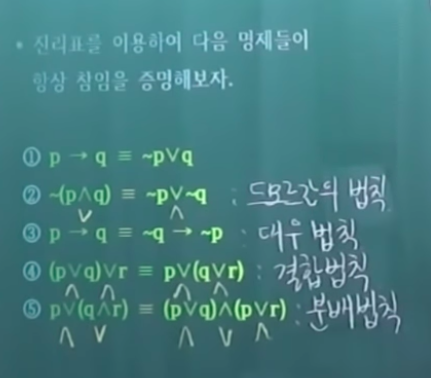
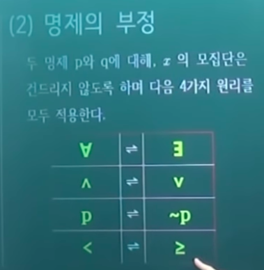
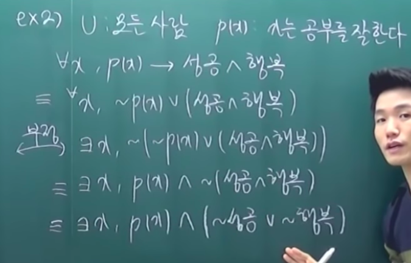
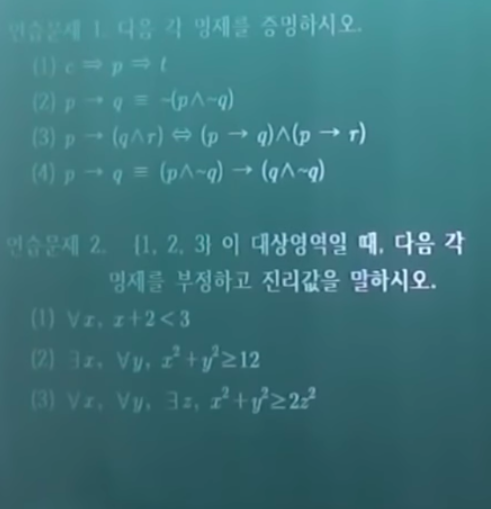

# 집합론

- 의문
- 0 공리적 집합론의 등장
  - 1 무한집합의 등장
  - 2 연속체 가설
  - 3 러셀의 역설
- 1 명제와 논리
  - 1-1 명제와 증명
  - 1-2 명제함수
  - 1-3 함의와 동치

## 의문

- `집합의 원소의 개수 = 집합의 크기 인가?`
- `p->q`의 진리값을 어떻게 진리집합으로 이해할 수 있는가?
- `p->q`에서 p가 거짓일 때, `p->q`가 참이라는 것은 정의인가?
  - 진리표에 기반한 정의
- *어쨰서 `p(x) => q(x) ≡ ∀x, p(x) -> q(x)` 인가?*
  - `∀`는 한정기호이다. 즉, 명제 함수를 명제화 시키는데 `∀`의 정의로부터, 모든 x에 대하여 `p(x) -> q(x)`라는 명제는 참이다 라고 해석됨
    - 이게 맞남?
- 함의는 명제인가?
  - `p->q`가 항진명제일 경우 함의라고 함
  - 명제

## 0. 공리적 집합론의 등장

전체는 부분보다 크다 -> 긴 선분이 작은 선분보다 결코 더 많은 점을 포함하지는 않는다 -> 무한의 조명

### 0-1. 무한집합의 등장

19세기 데데킨트가 무한집합을 정의함

- 무한집합
  - 고등학교때의 순환논리적 정의
    - 무한집합은 유한집합이 아닌 집합
    - 유한집합은 원소의 개수가 무한개가 아닌 집합
  - 데데킨트
    - 자기자신의 진부분집합과 1-1대응이 가능한 집합
    - 참고: 집합의 크기비교
      - 두 집합의 원소의 크기의 비교는 각각의 원소를 서로의 집합의 원소로 일대일 대응을 해서 비교하면 됨
        - 집합의 원소의 개수를 전부 셀 필요는 없음
  - 칸토어
    - 무한집합의 크기는 무한집합의 세계에서도 대소가 있다.
    - 칸토어의 정리
      - **무한집합에서 멱집합의 크기는 항상 원래 집합의 크기보다 크다**
        - 멱집합은 그 집합의 모든 부분집합을 모은 집합을 말한다.

### 0-2. 연속체 가설

- 칸토어
  - 자연수 집합 => 원소개수: 알레프 제로
  - (0, 1) 실수 개수 => 원소개수: 시그마 제로
  - 시그마 제로 집합의 크기가 알레프 제로 집합의 크기보다 크다.
- 연속체 가설
  - 시그마 제로의 집합보다 크기가 크고 알레프 제로의 집합보다 크기가 작은 집합은?
    - *시그마 제로의 집합의 멱집합이면서 알레프 제로의 집합을 멱집합으로 갖는 집합??*
    - 하지만 이 연속체 가설은 거짓이라고 증명이 불가능 - 괴델
    - 참이라고도 증명 불가능 - 코헨
    - 즉, 수학적인 명제이면서 참과 거짓을 결정할 수 없는 명제
    - *그렇다면 명제와 조건의 차이는 무엇인가?*

### 3. 러셀의 역설

- `알레프 제로 < 시그마 제로 < ?`
  - ?에 들어갈 수 있는 집합이 있을까?
  - 칸토어의 정리에 의하여 시그마 제로의 멱집합이 ?에 들어갈 것
- `모든것을 포함하는 절대 집합 X가 존재할까?`
  - X가 존재한다고 가정하고, X의 멱집합을 P(X)라 하면, P(X)는 칸토어의 정리에 의하여 X보다 크기가 크므로, X가 모든 집합을 포함한다고 가정한것은 모순
  - 러셀의 역설
- 러셀의 역설과 같은 논리적인 모순을 극복하기 위해서 집합이 될 수 있는것과 집합이 될 수 없는것을 정하는 공리화를 진행
- 공리화 이전의 집합론
  - 소박한 집합론
- 공리화 이후의 집합론
  - 공리적 집합론
  - 무한의 세계를 집합론으로 끌어올때 등장
  - 무한의 세계는 직관으로 이해하기 힘드므로 철저한 공리들과 논리로 접근 시도

## 1. 명제와 논리

### 1-1 명제와 증명

- 명제와 연결사
  - 명제
    - 참, 거짓이 분명히 판단되는 문장
    - 단순 명제
      - p, q, r 로 추상화
    - 합성 명제
      - 몇 개의 단순명제들이 연결사에 의해서 결합된 명제
      - e.g
        - 지수는 블랙핑크의 멤버이고 로제도 블랙핑크의 멤버이다
  - 조건
    - 특정한 변수의 값에 따라서 '참' 이거나 '거짓'을 명확하게 알 수 있는 식이나 문장
  - 연결사
    - 개요
      - 한 개 이상의 명제 기호에 덧붙여짐으로써 해당 명제(들)에 새로운 의미를 더함
      - 각 연결사의 의미는 진리표를 통해 엄밀하게 규정될 수 있다.
    - 종류
      - 두 명제 p와 q에 대해
      - 무정
        - `~p`
      - 논리곱
        - `p ^ q`
      - 논리합
        - `p v q`
      - 조건
        - `p -> q`
      - 쌍조건
        - `p <-> q`
- *진리표*
  - 명제의 진리값(T, F)을 표로 나타낸것
  - 진리 집합
    - 정의
      - 해당 명제가 참이 되도록하는 모든 원소들의 집합
      - 변수가 속해 있는 전체집합 U의 원소 중에서 어떤 조건을 참이 되게 하는 값 전체의 집합
    - `p -> P`, `q -> Q`
    - e.g
      - `p : 누군가는 블랙핑크의 멤버이다`
      - `P = {지수, 로제, 제니, 리사}`
      - `q : 대한민국에는 키가 160cm 이상의 남성이 적어도 한 명 존재한다`
      - `P = {나, ...}`
    - 명제 p가 참이다
      - 명제 p의 진리집합(P)의 원소가 존재한다.
    - 명제 p가 거짓이다
      - 명제 p의 진리집합(P)이 공집합이다.
  - 진리표에서
    - `~p`
      - 정의로부터 p가 참이면 거짓이고, 거짓이면 참임
      - `~p의 진리집합은 P의 여집합`
        - 왜냐하면 진리집합의 정의에서 P는 명제p가 참이 되도록 하는 모든 원소들의 집합
        - ~p의 진리집합은 명제 p가 거짓이 되도록 하는 모든 원소들의 집합
        - 따라서 ~p의 진리집합은 P의 여집합
    - `p->q`
      - 정의로부터 오직 p가 참이고 q가 거짓일 경우 해당 명제는 거짓
      - 정의로부터 `p->q`이 참이라는 것은 `진리집합 P가 Q의 부분집합이 될 경우`
        - p의 명제를 만족하는 진리집합의 원소들이 q의 명제를 만족하는 진리집합의 원소가 된다
      - `~(p-q) ≡ p∧~q`
    - `p<->q`
      - 정의로부터 p가 참, q가 참 혹은 p가 거짓, q가 거짓일 때만 참
- 연역적 추론
  - 이미 알고 있는 판단을 근거로 새로운 판단을 유도하는 것

### 1-2 명제함수

- 명제함수
  - 정의
    - 변수 x가 결정되어야지만 참, 거짓이 판단되는 문장
    - `p(x)`
    - 어떠한 대상(x)에는 반드시 범위가 반드시 존재한다
      - 대상영역(domain) / 모집단(universal)
  - 한정기호(명제함수를 한정시켜 줌으로써 명제로 만들어줌)
    - 전칭기호(`∀`) : for every
    - 존재기호(`∃`) : for some(there is)
- 명제의 부정

#### 전칭기호와 존재기호의 해석과 순서

- 참고
  - [위키피디아 - 수학의 기호](https://en.wikipedia.org/wiki/List_of_mathematical_symbols)
  - [Quora](https://www.quora.com/How-does-changing-the-order-of-universal-quantifier-and-existential-quantifier-changes-the-order-of-meaning-of-the-sentence)

매우 중요하다!!

- 해석(일반적으로)
  - `∀`(Universal quantification)
    - for every / for any
      - 모든 / 임의의
    - 어떠한 변수의 모든(임의의) 경우에 **주어진 명제 함수가 참이다.**
    - 모든 이라는 개념은 기본적으로 무한의 개념을 내포하고 있으므로, 인간의 인지를 넘어선다. 따라서 모든 대신 임의의 라는 말로 바꾸므로써, 인간의 인지 범위 내로 끌어내리 수 있다.
      - 예시
        - 모든 수에 대해 그 수를 제곱한 뒤 그 수의 두 배를 뺀 다음 1을 더하면 항상 0보다 크거나 같다 라는 명제
          - 이것이 성립하는지 확인하기 위해서는 정말 모든 수를 대입해보아야 함
          - 사실상 불가능
        - 임의의 수 x에 대해 `x^2-2x+1`이 항상 0보다 크거나 같다 라는 명제
          - 이는 형식적인 계산으로 `(x-1)^2`이 되어서 0보다 크거나 같음을 알 수 있음
        - 수학에서는 state란 존재하지 않기 때문에, '모든'이라는 것을 나타낼 만한 기호를 정의하지 않는 한 나타낼 수 없음
        - 그래서 임의의 로 변환한다면 위와같이 대수인 x로 치환이 가능
  - `∃`(Existential quantification)
    - there is
      - ∃ x: P(x) means there is at least one x such that P(x) is true.
    - `∃`를 갖는 명제에 대한 증명
      - constructive proof
        - 실제로 명제를 만족하는 대상을 제시
      - nonconstructive proof
        - 실제로 명제를 만족하는 대상을 제시하지는 못하나, 그것이 반드시 존재함을 증명
  - 명제함수와 한정기호로 이루어진 명제의 경우의 예시
    - `∀x, ∃y, x>y`
      - for every x, there is y s.t x > y
  - 예시
    - `∀a>0, ∃n∈N, 1/n < a`의 부정(진리값이 반대로 됨)
      - `∃a>0, ∀n∈N, 1/n >= a`
- **한정기호의 순서**
  - 한정기호의 순서는 명제의 의미를 변경하는 경우가 있으므로 매우 중요
    - 단, `∃, ∃`, `∀, ∀` 와 같이 동일한 한정기호의 경우에는 순서를 바꾸어도 상관이 없다
  - `∀x, ∃y, x>y` vs `∃y, ∀x, x>y`
    - `∀x, ∃y, x>y`
      - for every x, there is y s.t x > y
    - `∃y, ∀x, x>y`
      - there is y s.t for every x, x > y

### 1-3 함의와 동치

- 항진명제와 모순명제
  - 항진명제
    - 모든 논리적 가능성의 진리값들이 참인 명제
    - `t`
      - Tautology
    - 진리집합은 전체집합인 U
      - 어떠한 U의 원소라도 모든 논리적 가능성의 진리값이 참임
  - 모순명제
    - 모든 논리적 가능성의 진리값들이 거짓인 명제
    - `c`
      - contradiction
    - 진리집합은 공집합
  - 추이법칙(삼단논법)
    - `(p->q and q->r) -> (p->r)`는 참진명제
- 함의와 동치
  - 함의
    - 참진인 조건문 `p->q`를 논리적 함의라 하고, `p=>q`로 나타내며 p는 q의 **충분조건**, q는 p의 **필요조건** 이라 한다.
      - `인간=>동물`
        - 인간은 동물로 분류되기 충분한 조건
        - 무엇인가가 인간으로 분류되기 위해서는 동물로 분류될 필요가 있음
  - 동치
    - 참진인 쌍조건문 `p<->q`를 동치라 하고 `p<=>q`로 나타내며 p와 q는 서로의 **필요충분조건** 이라 한다.
    - 증명에서
      - `p <=> q`가 참임을 보이시오 = 모든 경우에 대하여 `p <-> q`가 참임을 보이시오

#### [Vacuous truth(수학적 개념)](https://en.wikipedia.org/wiki/Vacuous_truth)

- 수학적 예시(vacuously true)
  - `∀x, P(x) => Q(x) s.t. ∀x, 〜P(x)`
    - 모든 x에 대해서, P(x) => Q(x)는 모든 x에서 ~P(x)가 참인 경우에 참이다.
  - `∀x∈A, Q(x) s.t. A=φ`
    - 모든 집합 A에 포함되는 x에 대해서, Q(x)는 참이다. 특히 A=φ일 때
  - `∀ε, Q(ε) s.t. ε이 representative가 없는 타입으로 제한`
- 예시
  - 이 방에 있는 모든 핸드폰은 꺼져 / 켜져있다.
    - 이 방에 핸드폰이 전혀 없는 경우 항상 참인 명제
  - 너가 다이어트에 성공하면 내 손에 장을 지지겠다.
    - 다이어트에 실패할 경우에 손에 장을 지지던 지지지 않던 참거짓을 판단할 수 없는데 vacuous truth에 의하여 참인 명제가 됨
- 활용
  - 수학적 증명에 사용
    - 공집합은 모든 집합의 부분집합이다.
  - 수학에서

#### 귀류법

- `p`를 수학의 공리, 정의, 정리 라고 하자
  - 공리, 정의, 정리는 참인 명제
    - 공리는 증명없이 참이라고 가정된 명제
    - 공준 -> 특정 분야에만 한정된 공리
  - `p ≡ (페아노공리계의 공리들 ∧ 피타고라스 정리 ∧ 베르트랑 공준 ∧　...)`
    - *라고 할 수 있나?*
      - **할 수 없다. 왜냐하면, 공리계에 따라서 모순이 되는 것들도 존재**
        - e.g) 구면기하학, 유클리드 기하학
      - 따라서 p는 하나의 공리계와 그 공리계에 딸려오는 각종 정리와 정의라고 할 수 있겠다.
- `q`를 우리가 증명하고 싶은 명제라고 하자
- 일반적으로 우리는 `p -> q`가 참임을 보이고 싶다.
  - 수학에서는 `p -> q`가 참임을 보이므로써, `p`의 영역을 넓히는 것이다.
- `p -> q` (p를 기반으로 연역적으로 논리를 펼쳤을 때(이 때, p는 언제나 참) q는 참이다 (그래야지 p->q 가 참))
  - `≡ ~p ∨ q`
  - `≡ ~(p ∧ ~q)`
  - `≡ (p ∧ ~q) -> c`
  - 즉, 명제`p -> q`가 참임을 보이는 것은 결국 명제`(p ∧ ~q) -> c` 가 참임을 보이는 것과 같다.

#### 수학적 논리 확장 방식

- 수학적 논리 확장 매커니즘(`p`와 `q`는 복합명제 또는 단순명제)
  - `p->q`가 항진임을 밝혀내면서 p의 확장(수학적 논리 확장 - 함의를 통한 확장)
    - `p`
      - 기존의 공리 / 정의 / 정리 등
      - 참진명제들
    - `q`
      - 새로 증명하고자 하는 수학 명제
  - `p->q`가 항진임을 보이는 방법
    - ① `p->q`라는 복합명제 자체를 간단한 명제로 변환하면서 명제논리로 `p->q ≡ t`임을 증명
      - 예시
        - `p->q ∧ q->r -> p->r`은 항진명제이다.
    - ② 연역법(`p`의 각 항진명제들 이용해서 함의적으로 q를 도출)
      - 개요
        - 여기서 p는 항상 참일 경우만 생각
        - p가 거짓이라면 우리가 아는 공리 / 정의 / 정리 중 적어도 하나는 거짓이라는 얘기이므로 논의가 되지 않음
      - 예시
        - `p`는 무리수가 포함되지 않은 정리 / 공리 / 정의
        - `q`는 루트2는 무리수이다
- **구체적인 수학적 논리 확장 방식: (`p=>q`)임을 증명**
  - ① 수학적 귀납법(완전 귀납법)
    - 개요
      - **연역법의 일종**
      - 자연수에 관한 명제 `P(n)`이 모든 자연수(또는, 어떤 자연수보다 큰 모든 자연수)에 대하여 성립함을 보이는 증명법(기존의 `p`에 기반)
        - *well-ordered class일 경우에는 됨(자연수는 그 특별한 경우)*
    - 구성
      - 최소원 `n = n0`에 대하여 `P(n0)`가 성립함을 보임
      - `∃k, P(k) -> P(k+1)`이 항진임을 보임
  - ② 정공법
    - 개요
      - `p`의 각 항진명제들(공리 / 정리 / 정의) 이용해서 함의적으로 q를 도출
        - 여기서 p는 항상 참일 경우만 생각
        - p가 거짓이라면 우리가 아는 공리 / 정의 / 정리 중 적어도 하나는 거짓이라는 얘기이므로 논의가 되지 않음
    - 예시
      - `p`
      - `q`
  - ③ 귀류법
    - 개요
      - `p -> q`가 항진임을 정공법으로 증명하기 힘든경우에 그 동치인 `(p∧~q) -> c`가 항진임을 증명
    - 예시
      - `p`
        - 무리수가 포함되지 않은 정리 / 공리 / 정의
      - `q`
        - 루트2는 무리수이다
  - ④ 대우법
    - 개요
      - `p -> q`가 항진임을 정공법으로 증명하기 힘든경우이며, q가 `r -> s`과 같은 조건문 형태인 경우, 그 동치인 `~s -> ~r`가 항진임을 보여줌
    - 예시
      - `p`
        - 기존의 정리 / 공리 / 정의
      - `q`
        - 특정 함수가 단사임을 보여라
