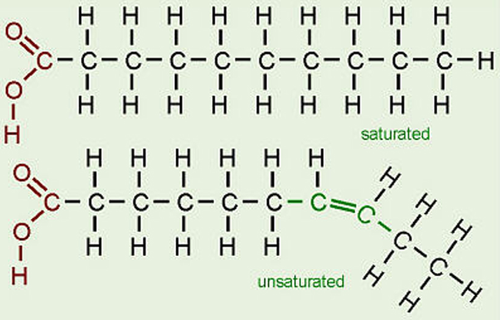

# 다이어트

- 의문
- 상식
- 음식 선택 팁
- 다이어트, 힘들이지 않고 현명하게
- ① 이상적인 몸매(우리 몸은 원래 어떤 모습이어야 할까)
- ② 식욕의 과학(아무리 먹어도 배고픔을 느끼는 이유)
  - 식욕 - 해부학
  - 내 마음대로 조절 가능한 배고픔
- ③ 소화(몸에서 이루어지는 음식의 여정)
  - 소화에 대한 3가지 오해
  - 음식의 세 갈래 길
  - 소화: 해부학
  - 몸이 영양소를 분해하는 방법
  - 위장 도로의 작동방식
- ④ 장 점검(뱃살에서 벌어지는 염증과의 위험한 전쟁)
  - 4.1 적인 음식과 아군인 음식의 기준
  - 4.2 염증이 생긴 장: 해부학
  - 4.3 소화기관 탐구
  - 4.4 뱃살에 저장되는 스트레스
  - 4.5 염증과의 싸움
  - 4.6 스트레스의 치명적 연쇄작용
- ⑤ 지방과 건강(지방에 당신의 운명이 달려있다)
  - 5.1 지방이 저지르는 일: 해부학
  - 5.2 동맥을 알아야 건강을 잡는다
  - 5.3 지방의 무서운 영향력
  - 5.4 비만이 초래하는 결과
- ⑥ 신진대사 모터(호르몬과 비만의 관계)
  - 6.1 신진대사에 관한 3가지 오해
  - 6.2 신진대사
  - 6.3 비밀리에 지방을 만드는 것들(호르몬)
  - 6.4 임무수행 중인 호르몬
- ⑦ 움직여라(지방을 더 빨리 연소시키는 법)
  - 7.1 운동에 대한 3가지 오해
  - 7.2 체력을 키워주고 지방을 연소시키는 근육
  - 7.3 우리가 운동을 해야 하는 진짜 이유
- ⑧ 감정의 과학(감정과 음식의 화학작용)
  - 8.1 감정에 대한 3가지 오해
  - 8.2 감정: 해부학
- ⑨ 누구를 비난해야 할까(실패한 다이어트의 심리학)
  - 9.1 다이어트에 대한 3가지 오해
  - 9.2 다이어트를 회피하는 이유
- ⑩ 유턴하기(다이어트에 대한 고정관념을 180도 바꾸는 법)
- 11 운동프로그램(뱃살관리를 위한 신체전략)
- 12 다이어트 식단(뱃살관리 식사 계획)
- 부록: 의학적인 해결책

## 의문

- *본문에서는 NPY와 CART가 서로 주도권을 갖기 위해 '싸움'을 벌인다고 했으나, 구체적으로 어느쪽이 우세하다고 뇌가 판단하여 몸의 상태에 알맞은 화학물질을 분비하게 하는가?*
  - 뇌가 판단하는게 아닌가?
  - 렙틴과 그렐린
- *CART, NPY와 렙틴, 그렐린의 차이*
- *칼로리는 에너지의 단위인가? 아니면 에너지 그 자체를 나타내는 물질인가?*
- *식품영양성분표*
  - 콜레스테롤 항목은 LDL인지 HDL인지 구분이 되어있지 않은데, 어떻게 파악할 수 있는가?
  - 지방 항목에서, 불포화지방은 보통 하위 카테고리로 나타나지 않은 경우가 많은데, 어떻게 함유량을 알 수 있는가? 단순히 지방에서 뺄셈으로 구하는가?
- 소화
  - *탄,단,지 모든 영양소는 일단 소장에서 흡수 된 뒤 무조건 간으로 보내지는 것인가? 그렇지 않다면 어떤 경로로 몸에 흡수가 되고 세포가 그 영양소들을 사용하는 것인가?*
- *어느 타이밍에 몸은 탄수화물을 사용한 뒤에 지방을 사용하고, 단백질(근육)을 사용하는가?*
  - 근육의 단백질이 가장 나중에 사용되는 에너지원인가?

## 다이어트의 원칙

- 우악스러움 대신 우아함을 선택하라
  - 다이어트 전쟁은 힘들게 싸우는 것이 아니라, 현명하게 싸울 때 승리를 거머쥔다
- 식습관계획을 자동화하라
  - 2주 동안 적절한 식습관으로 스스로를 훈련시켜라. 그러면 당신 몸이 리셋되어 다시는 먹을 것 때문에 고생하지 않게 될 것이다
  - 특히, 식단을 일정하게 자동화 해두면 아주 효과적이다
    - e.g 매일 하루 한 끼를 똑같은 음식으로 대체
- 허리 사이즈가 체중보다 더 중요하다는 사실을 기억하라
- 당신의 몸에 대해 알아두라
  - 내부기관의 작동 방식을 이해함으로써 당신이 그것에 영향을 미칠 수 있다는 사실을 제대로 알아두라
- 포만감을 유지하라
- 지원군을 두어라
- 실수가 치명적이지 않다는 사실을 명심하라
  - 유턴만 잘하자!

## 다이어트의 전략

- 지피지기 전략
  - 먼저 자신의 몸이 어떻게 작동하는지 이해해 문제를 명확히 파악하자
- 식습관 전략
  - 매일 하루 한 끼를 똑같은 음식으로 먹으면 식습관 자동화 하는데에 도움이 됨
    - 폭식할 위험성이 줄어듬
  - 포만감을 지속적으로 유지하기 위해 하루 세 끼를 규칙적으로 먹어라
    - 먹지 않으면 지방을 저장하는 몸으로 바뀜
  - 식품 라벨을 자세히 살펴보라
    - 포화지방 4그램 이하
    - 트랜스 지방(x)
    - 단순당이 4그램 이상 포함되어 있으면 구입(x)
  - 과일, 채소나 섬유질 및 건강에 좋은 지방(불포화지방), 통곡류 탄수화물, 단백질이 들어 있는 음식을 먹어라
    - 식사 전에 견과류 한 줌처럼 몸에 좋은 지방을 먹으면, 포만감 신호가 뇌에서 위로 전달되므로, 과식하지 않게 된다
    - 섬유질은 오전에 먹어서 과식하지 않게 하자
    - 항염증 효과가 있는 음식을 먹자
      - 녹차, 생선, 호두, 커피, 채소, 과일
  - 갈증과 배고픔을 제대로 구별하자
  - 비상시 유턴을 도와주는 음식을 준비하라
    - 당근, 사과 등의 비상음식
  - 칼로리 계산하지 말고 배부르게 먹어라
    - 대신 영양소를 균형있게 섭취
  - 될 수 있으면 작은 그릇을 사용하라
    - 그릇이 작으면 그만큼 먹는 양도 줄어든다
  - 실수해도 괜찮다!
    - 실수하면 유턴하면 된다
      - 다이어트 뿐 아니라 무엇이든지 자신이 결심한 것을 다시 유턴해서 행하면 되는것이다.
      - 장기적인 관점을 갖자
  - 음식 선택
    - 라벨이 적게 붙은 것을 골라라
      - 가공하지 않은 자연식품이라면 어떤 것이든 괜찮다고 생각
    - 포장에 현혹되지 마라
      - 표현을 무시하고 영양성분표를 보자
    - 교묘한 표현에 속지마라
      - 단순당
        - ~오스, ~올, ~시럽
      - 지방
        - 경화유, 팜, 팜유, 코코넛유
    - 느긋해라
      - 식품 쇼핑할 때, 영양성분표를 천천히 확인하면서 고르자
- 신체활동 전략
  - 매일 30분씩 걸어라
    - 이건 그냥 아무런 변명없이 무조건 하는 것이다
  - 일주일에 2~3일을 20분씩 다리와 복부, 상체 등의 중심근육에 초점을 맞춰 근육 운동을 하라
    - 근육운동을 하지 않으면 3개월 안에 50%, 3년 안에 80% 근육의 양과 체력이 감소
  - 스트레칭을 하라
  - 시간이 날 때마다 배꼽은 당기고 엉덩이는 조이는 운동을 하라(척추중립)
  - 일어나서 걸어라
- 상상하지 못했던 전략
  - 7~8시간 숙면을 취해라
    - 잠이 부족하면 먹을 것을 찾게 됨
  - 건강하고 안전한 성생활을 즐겨라
    - 성욕이 충족되면 식욕 충족에 도움이 된다
- 측정 전략
  - 허리 사이즈를 재라
    - 여성은 83cm 이하, 남성은 90cm 이하가 바람직하다
  - 체중에 따라 변하기 쉬운 혈압, 콜레스테롤, 혈당, CRP, 호르몬 수치를 검사하라
- 약물치료 전략
  - 의사와 상담

## 상식

- 운동 없는 체중감량의 비극
  - 운동 없이 체중감량 => 근육과 지방 감소
  - 근육보다 지방이 훨씬 찌기 쉬움 => 요요현상의 비극
- 신진대사(물질대사)
  - 우리몸에서 에너지를 소모하는 화학적 작용

## 음식 선택 팁

### 식품라벨을 반드시 확인하라

- 피해야 할것들
  - 탄수화물 블랙리스트
    - 액상: 설탕, 맥아엿, 물엿, 시럽, 올리고당, 꿀, 정백당, 황백당, 원당, 과당, 포도당, 유당, 농축과즙
    - 가루: 밀가루(소맥분, 소맥), 쌀가루, 감자전분, 감자분말, 옥수수전분(옥분), 대두분, 변성전분, 표백밀가루, 정제밀가루(영양분 제거된 밀가루)
  - 지방 블랙리스트
    - 트랜스지방산
      - 마가린, 쇼트닝, 경화유, 가공버터, 가공유지, 가공유크림, 식물성크림
    - 식용유
      - 식물성유지, 옥수수유, 대두유(콩기름), 해바라기유, 포도씨유, 카놀라유, 채종유, 미강유(현미유) 등
- 포화지방 대신 불포화지방을 선택하라
  - 포화지방이 상대적으로 많이 함유된 음식이 불포화지방이 상대적으로 많이 함유된 음식보다 렙틴 분비량이 적음

- 지방의 종류
  - 지방분자는 CHO가 연결된 구조
  - 불포화지방(Unsaturated)
    - 구조
      - H가 군데군데 비어있는 구조
        - 탄소사이의 이중결합이 존재
    - 특징
      - 세포막 형성, 뇌에 가장 많이 분포
      - 콜레스테롤 수치 낮춰줌
        - 혈액순환 도움, 혈관 질환 예방
      - 오메가3(등푸른 생선, 견과류, 푸른색 채소, 해조류), 오메가6(해바라기 씨유, 옥수수기름, 콩기름)
  - 포화지방(Saturated)
    - 구조
      - H가 꽉찬 구조
    - 특징
      - 동물성 지방(고기 비계)
      - 피하지방층을 이룸
      - 과다섭취하면 몸에 나쁜 저밀도 콜레스테롤 수치를 높이고, 심혈관 질환이나 뇌졸중 발병 위험 높임
    - 예시
      - 육류 지방, 버터, 치즈, 마요네즈, 크림, 코코아, 가공기름, 라면
  - 트랜스지방
    - 구조
      - 불포화지방의 일종, but 불포화지방을 밀어내고 자리를 차지하므로 몸에 나쁨
    - 특징
      - HDL(고밀도 콜레스테롤) 낮추고 LDL(저밀도 콜레스테롤) 수치를 높여 동맥경화/이상지질혈증 같은 각종 혈관 질환을 일으킴
      - 암 유발
      - 체내에 들어오면 배출이 쉽지 않음
      - 식물성 지방을 인위적으로 고체로만들기 위해서 만들어진 지방
    - 예시
      - 마가린, 쇼트닝, 케이크, 도넛, 튀김감자, 팝콘, 비스킷
      - 식용유 튀기는 횟수가 높아지면 트랜스지방 증가
- 과음을 자제하라
  - 과음은 렙틴 분비 억제
- 탄수화물 섭취를 줄여라
  - 고탄수화물 식단은 NPY 분비 증가
- 호르몬 수치가 갑자기 증가하는 상황에 대비하라
  - 참기 힘든 식욕을 달랠 수 있는 비상식량 목록 작성
    - 견과류, 과일 및 채소
- 섬유질은 아침에 섭취하자
  - 위장관의 포만감이 오래 지속하도록 함
- 천천히 먹어라
  - 포만감호르몬(CCK)이 제 역할을 다할 수 있도록 시간을 벌어줌
- 그릇의 크기를 줄여라
  - 시각적, 심리적 만족
- 고추를 먹어라
  - 오전에 고추를 먹으면 오후에 섭취하는 음식량이 줄어듬
    - 캡사이신 성분이 칼로리 섭취량을 줄여주고, 신진대사는 촉진시켜줌
- 염증에 효과가 있는 음식
  - 오메가-3지방산
    - 어류에 풍부, 호두 같은 견과류
  - 녹차
    - 카테킨 성분이 지방 분해를 억제 + NF-카파B의 분비도 억제
- 하나씩 제거해나가라
  - 어떤 음식이 당신에게 위장관 장애를 일으키는지 파악하기
  - 장애를 일으키는 음식을 하나씩 지워나가기
  - 이를 행할 떄 느끼는 모든 것을 기록
    - 활력 수준
    - 피로도
    - 화장실 횟수
    - 특정 음식 목록에서 삭제하거나 재등록한 시기 기록
- 과식한 후에는 무조건 움직여라
  - 적어도 몇 시간 동안 꺠어 있어야 함
  - 영양소 분해를 촉진하기 위해, 30분 걷기 실천
- 지방에 대해 정확하게 알아두라
  - **지방의 칼로리보다 중요한 것은 세포 기능을 촉진시키는 지방의 종류와 그러한 지방이 동맥의 기능과 염증에 어떠한 영향을 미치는가 이다.**
  - 몸에 좋지 않은 지방
    - 포화지방
      - 동물성지방, 버터, 마가린, 라드
    - 트랜스지방
      - 식물성기름을 상온에서 오랫동안 변질되지 않게 하기 위해 인위적으로 화학적 조작을 가하는 과정에서 생기는 물질
        - LDL 수치 증가
        - 염증 증가
        - 동맥 세포에 손상
  - 몸에 좋은 지방(불포화지방)
    - 상온에서 액체
      - HDL 수치 증가
      - 혈관의 노폐물 제거 기여
    - 종류
      - 단가불포화지방산
        - 올리브유, 카놀라유
      - 다가불포화지방산
        - 오메가-3지방산
          - 어류, 견과류
        - 오메가-6지방산
          - 참기름 등 식물성식용유
          - 기름의 발연점이 높아야 좋음
            - 발연점 이상으로 열을 받은 기름은 유독한 화학물질을 내뿜음
  - 포화지방과 트랜스지방의 섭취는 한끼에 4그램이 넘어서는 안된다 + 하루 총량 20그램 이하로 제한
    - 체중을 증가시키고, 동맥을 막히게 하는 음식이기 때문
- 혈관을 깨끗이 청소하라
  - HDL수치를 높이자
    - 올리브유, 어유, 아보카도, 호두에 함유된 건강한 지방 섭취
    - 적어도 하루에 30분씩 걷거나 운동하기
    - 탄수화물 대신 단백질과 불포화지방 섭취하기
- 어린이용 아스피린 두 알(162밀리그램)
  - 혈소판의 끈적거림 줄여줌
  - 동맥 공간을 좁게 만드는 염증도 줄여줌
  - 면역시스템 노화를 줄여줌
  - 아스피린 섭취 전후에 따뜻한 물을 반 잔 마시기
    - 위장관 출혈 병력이 있거나, 혈액응고 저해제를 복용하고 있거나, 운동을 과도하게 한다면 의사와 상담하길
- 건강 수치 읽기를 습관화하라
  - 목록
    - 혈압
      - 정상: 115/76 오전 오후 밤의 평균치
    - 혈중 지질 수치
      - 1년에 한번씩 정기적인 혈액검사를 받기
      - 의사와 상담해서 식이조절과 약물처방 받기
    - HDL 콜레스테롤
      - HDL 수치가 40mg/dl 이상이면 양호한 상태 높을 수록 좋음
    - LDL 콜레스테롤
      - LDL 수치가 100mg/dl 이하면 양호한 상태
      - 65세 이상이면 HDL 수치만큼 중요하지 않음
    - 공복 혈당
      - 100mg/dl 이하가 정상
    - CRP
      - 1mg/dl 이하면 양호
- 근력운동을 하라
  - 혈당이 낮게 됨(인슐린 수용 능력이 증가)
- 당분만 섭취하는 것을 피하라
- 크롬을 섭취하라
  - 인슐린에 대한 세포 감수성을 증가시켜, 혈당 조절에 도움
- 자신만의 시간을 가져라
  - 명상이 혈압이나 인슐린 저항 같은 관상동맥질환 예방에 상당히 도움이 된다
- 비만의 숨겨진 원인을 찾아라
  - 비만이 라이프스타일 때문이 아니라고 확신한다면, 혈액검사를 통해 호르몬 및 다른 화학물질의 수치를 알아낸 후 호르몬 이상을 치료할 수 있는 약물을 알아보는 것이 바람직
  - 예시
    - 갑상선자극호르몬
      - 5mlU/liter 이하
    - 코티솔
      - 하루 100mg이하
    - 칼륨
      - 3.5mg 이상
    - 칼슘
      - 8~10mg
    - 황체형성호르몬(LH) / 난포자극호르몬(FSH)
      - `LH:FSH = 3:1` 이 이상적인 비율
    - 유리 테스토스테론
      - 남성의 경우 200mg/dl 이상
      - 여성의 경우 20~70mg/dl
- 판타스틱한 4가지 기초운동법
  - 걷기
    - 하루에 적어도 만보는 걸어야 효과가 있다(하루에 30분)
  - 근력운동
    - 근섬유를 강화하고, 근육의 크기를 늘려 결국 여분의 칼로리를 모두 소모시킨다
    - 칼로리를 효과적으로 소모
    - 나이로 인한 체중 증가를 예방
    - 효과적인 근력운동
      - 다리나 상체의 근육, 복근같이 몸의 중심축을 구성하는 근육의 단련(기초근육)
      - e.g
        - 복근이 단단할 수록 허리가 받는 압박이 줄어듬
  - 심혈관 강화운동(유산소운동)
    - 일정 시간 심장박동을 빠르게 만듬
    - 심폐지구력 강화, 칼로리 소비, 심장기능 개선, 혈압 낮춰줌, 땀 배출로 독소 배출
  - 유연성운동
    - 관절에 부상이 생기는 것을 방지, 기분이 좋아짐
  - 복근을 조여라(척추중립)
    - 배꼽 부분이 쏙 들어가게 숨을 들이마시고, 엉덩이를 조이고, 머리꼭대기가 천장에 매달린 줄에 의해 당겨지고 있다고 가정하고 자세를 잡아라
    - 어디에서나 이 자세를 유지하라
- 자신에게 유리한 음식을 섭취하라
  - 모든 음식은 위와 혈액 그리고 뇌에 서로 다른 영향을 미침
  - 예시
    - 칠면조에는 세로토닌 분비를 자극하는 트립토판이 함유
    - 생선에 함유된 오메가-3지방산은 뇌를 활성화하고 콜레스테롤을 낮추는 효과 존재
- 맛을 음미하라
- 숙면을 취하라
  - 잠을 충분히 자야 날씬해진다(7-8시간)
    - 충분히 자야지 세로토닌과 도파민을 정상적인 양으로 분비할 수 있음
    - 그렇지 못한경우, 다른 방법으로 단 음식에 대한 욕망 충족으로 이뤄진다
    - 잠이 충분하지 않으면 NPY 수치가 증가
    - 나이가 들 수록 수면 호르몬인 멜라토닌을 더 적게 분비하고, 탄수화물 섭취에 대한 욕구 증가
- 진짜 배고플 때만 먹어라
  - 우리는 배가 고파서 뿐 아니라 감정적인 이유로 무언가를 아작아작 꺠물어 먹기도 한다
    - 이를 피하라
- 선택한 것을 고수하라
  - 다이어트에서 다양성은 죽음과도 같다
  - 한 끼 식사에서 선택할 수 있는 음식이 많을 경우, 좋은 식습관에서 벗어나 나쁜 식습관에 빠져들 확률이 높아짐
  - **먹을 수 있는 음식의 종류를 제한하는 것이 체중조절에 도움이 된다**
  - 다양한 맛이 나는 음식으로 식사를 하면, 포만감을 유지하기 위해 더 많은 칼로리를 섭취하도록 몸이 되어있다
- 손에 뭔가를 쥐어라
  - 비디오게임이든 정원손질이든 집안 청소든 손과 뇌에 일거리를 쥐어주면, 뇌를 자신이 원하는 상태로 만들 수 있음
- 걸어라
  - **매일 최소한 30분씩 걷기**
    - 불가피한 경우 3회에 나눠 10분씩 걷는 것도 괜찮음
    - 30분 걸은 후에 다른 사람에게 알리기
- 왜 살을 빼고 싶은가를 생각하라
  - 성공적인 다이어트를 위해서는, 자신이 몸에 무슨 짓을 저질렀는지 아는 것 뿐 아니라, 자신의 몸을 스스로 학대한 이유도 알아야 함

## 다이어트, 힘들이지 않고 현명하게

- 정신력으로 식욕을 이기려 하지말고, 자신의 몸의 시스템을 배워서 자신의 몸을 건강한 몸이 되도록 스스로 조종해야 함
  - 반드시 어떤 매커니즘으로 음식이 자신의 몸으로 흡수되는지 알아야 하고, 운동이 어떻게 칼로리를 소비하는지 알아야 함
- 허리둘레 관리에 집중하라
  - 비만과 관련된 사망률
    - 체중보다 허리둘레가 보다 중요한 지표

## 1. 이상적인 몸매(우리 몸은 원래 어떤 모습이어야 할까)

- 과거의 인류
  - 기근을 극복하기 위해, 지방을 저장하고 살을 찌우는 체질로 진화
- 인류의 몸무게가 늘어난 계기
  - 농업혁명
    - 반드시 필요하지 않아도 원하는 것이 있으면 생산해서 먹을 수 있게 됨
    - 신체를 보완하거나 미각에 맞는 음식이 아니라, 혀를 즐겁게 하고 주머니 사정만을 고려한 음식을 만들기 시작
- 팁
  - 지방세포
    - 비만인 사람
      - 지방세포의 크기가 일반인보다 더 큼
    - 일반적으로 사춘기때와 개수는 똑같음
    - 근육세포도 마찬가지
  - **지나친 소식을 삼가라**
    - 몸은 오랫동안 음식을 섭취하지 않거나 지나치게 적게 먹는 방식의 다이어트를 하게되면, 뇌가 기아 상태로 인식해 몸이 지방을 저장하는 방향으로 작동함
      - **즉, 몸에 좋은 음식을 자주 먹는 것이 중요**
  - **식사계획을 세워라**
    - 매일 언제, 무엇을 먹을 것인지 알아야 함
      - 배고픔과 폭식에서 벗어날 수 있음

## 2. 식욕의 과학(아무리 먹어도 배고픔을 느끼는 이유)

식욕으로 부터 음식물이 엉덩이로 안착하는 곳 까지 2장부터 7장까지 음식의 이동경로를 다룸

애초에 우리는 왜 주기적으로 먹어야만 하는가?

- 우리는 지방에 대해서 아무것도 모른다
  - 생크림 케이크가 어떻게 허벅지살로 변하는가?
- 식욕
  - 생리적 신호
    - 진짜 배고픔
  - 감정적 신호
    - 가짜 배고픔
- 충족감
  - 몸이 섭취한 음식을 효율적으로 처리하고 있는지 알려주는 지표

### 식욕 - 해부학

- 뇌의 시상하부
  - 개요
    - 음식, 갈증, 성욕에 관한 행동 조절
  - 식욕중추(식욕 통제)
    - 구성
      - 섭식중추와 포만중추
    - 식욕조절(화학물질)
      - CART
        - 식욕을 누르고 포만감이 생기게 하는 화학물질
        - 신진대사 촉진
        - 식욕 억제
        - 인슐린 분비 증가
          - 에너지가 지방으로 가지 않고, 근육세포에서 이용되도록 함
        - 체온 상승
      - NPY
        - 식욕을 촉진하는 화학물질
        - 신진대사를 떨어뜨림
        - 체온 떨어뜨림
    - 특징
      - 섭식체계가 정상적으로 작동하면, 섭식역시 정상적으로 작용
        - **애초에 몸은 원래 건강 체중을 유지하려는 성질을 갖고 있음**
      - 그러나 현대인은 정상적인 섭식체계를 방해하는 수많은 장애물에 둘러싸여있음

### 내 마음대로 조절 가능한 배고픔

원래 지방은 우리에게 먹는 일을 그만두라고 지시하는 화학물질을 혈관으로 분비. 즉, 지방은 자동으로 조절되는 것. 다만, 우리가 몸의 조절시스템을 무시한 채 배가 고프지 않은 상태인데도 계속음식을 먹는것이 문제

- 배고픔과 포만감을 관장하는 두 종류의 호르몬
  - 포만감 호르몬
    - **렙틴(leptos - 빼빼마른)**
      - 저장된 지방으로부터 분비되는 단백질
      - 특징
        - 배고픔 신호를 차단, CART자극
      - 렙틴 저항성
        - 렙틴 수치가 높아져도 몸이 반응하지 않고 체중이 줄지 않는 경우
          - 비만인 사람은 대부분 렙틴 수치가 높음(세포가 렙틴이 보내는 메시지를 받아들이지 않음)
        - 원인
          - ① 뇌의 쾌락중추의 자극이 배가 부르다는 랩틴의 메시지를 압도 or
          - ② 세포들이 렙틴이 보내는 메시지를 받아들이지 않는 경우(보통 비만인 사람들은 후자의 이유)
        - 해결(렙틴 저항성 줄이는 법)
          - 하루 30분 걷기
          - 약간의 근육운동
  - 배고픔 호르몬
    - **그렐린**
      - 특징
        - 위가 비었을 때, 분비하여 NPY 분비 촉진
          - 굶는 다이어트를 하면 더 많이 먹으라는 신호를 끊임없이 보냄, 강도도 세짐
          - 30분마다, 뇌에 심리적 자극 전달
        - 성장호르몬 분비를 촉진, 식욕 자극
- 그렐린 vs 렙틴
  - 음식과의 싸움은 뇌에서 분비되는 화학물질간(NPY vs CART)의 전쟁
  - 렙틴 수치를 높게 유지하는 것이 중요
    - 보디빌딩 하는 사람들이 음식을 소량으로 여러번 섭취하는 이유
  - 렙틴 수치 조절 방법
    - 적절한 음식 선택
      - 아군
        - 견과류
      - 적
        - 과당(특히 액상)
          - 뇌가 제대로 된 음식으로 간주하지 않고 NPY 억제 물질로 받아들이지 못함

## 3. 소화(몸에서 이루어지는 음식의 여정)

### 소화에 대한 3가지 오해

- 지방은 지방으로, 단백질은 근육으로, 탄수화물은 에너지로 변한다
- 배가 부른 것은 그만 먹으라는 신호다
- 단것은 허기를 달래는 데 도움이 된다

### 음식의 세 갈래 길

- 에너지로 사용되기 위해 분해되어 혈액과 간으로 **흡수**
- 분해되어 지방으로 **저장**
- 폐기물로 가공되어 변기로 **방출**

### 소화: 해부학

- 입
- 혀
  - 과거
    - 살아남기 위해 혀와 코에 의존
    - 혀에서 맛있다고 느껴지면 안전한 음식, 맛없는 맛은 독성분이 있을 확률이 높았던 것
  - 현재
    - **음식에 대한 정보 획득**
      - 결국 맛이라는 것도 정보에 불과함
    - 뇌에 메시지(단맛, 신맛, 짠맛, 쓴맛, 고유맛)를 보냄
      - 사실 맛을 느끼는 것이 후각과 크게 관계가 있다는 학설도 있음
    - 뇌가 계속 먹거나 그만 먹으라는 메시지를 보냄
- 이
  - 개요
    - 저작작용
    - 인간은 어금니로 음식을 분쇄할 때, 거의 열량을 소비하지 않음(다른 동물에 비해서 많이 발달)
- 식도
  - 입과 위장의 연결
  - 위액 역류 방지
- 위
  - 개요
    - 음식이 본격적으로 소화가 진행되는 시점
      - 사람이 삼킨 음식이 위에 도달하기까지는 약 8초가 걸림
    - 음식은 몸이 소장으로 가라고 지시할 때까지 위에 머물러있음
      - 음식마다 위에 머물러있는 시간이 다름
        - 밥 한 공기 2시간 45분
        - 생선 3시간
        - 소고기 0.1kg 4시간 15분
        - 돼지고기 0.1kg 4시간 15분
- 소장
  - 대부분의 영양분을 흡수한 다음 혈류에 태워 흡수된 영양분의 다음 기착지인 간으로 보내거나, 배설을 위해 대장으로 보냄

### 몸이 영양소를 분해하는 방법

- 몸에서 에너지로 사용되지 않은 칼로리는 지방으로 저장되거나 변으로 빠져나감
  - but 단백질과 수분을 많이 함유하고 있는 섬유질은 포만감에 큰 공헌, 단순당은 포만감에 거의 기여 못함
    - **배가 아무리 불러도 디저트를 베쯔바라라고 생각해서 더 먹을 수 있는 이유는, 포만중추에 거의 기여하지 않는 칼로리의 섭취 때문이다.**
  - 지방을 지방으로 저장하는 것은 매우 쉬움
    - 단백질을 지방으로 저장하는 것은 매우 어려움
- 다양한 영양소가 몸 속에서 처리되는 방식
  - 탄수화물
    - 단순당
      - 콜라와 같은 청량음료에 존재
      - 빠르게 흡수되어 간으로 보내짐
      - 즉시 에너지로 사용되지 않으면 지방으로 전환
    - 복합당질
      - 통곡물 같은 음식이 해당
      - 소화되는데에 단순당보다 시간이 오래 걸림
      - 장에서 서서히 흡수
        - 혈당이 서서히 오름
        - 소화기가 스트레스를 많이 받지 않음
      - 배출되었을 때, 몸이 즉시 사용하지 않으면 결국 지방으로 전환
  - 단백질
    - 작은 아미노산으로 분해되어 간으로 이동
    - 간이 그 아미노산을 근육으로 보낼 수 없을 경우, 포도당으로 전환되고, 그 포도당이 에너지로 사용되지 않으면 결국 지방으로 전환
  - 지방
    - 더 작게 쪼개져 지방산 형태로 흡수
    - 종류
      - 불포화지방
      - 포화지방
      - 트랜스지방
    - 운동에서 탄수화물을 모두 사용하면, 근육은 에너지를 내기 위해서 지방을 사용

### 위장 도로의 작동방식

- 음식이 소장에 들어오면 CCK가 위벽으로 분비되도록 자극
- CCK
  - 뇌에 직접적으로 포만감 메시지를 전달
  - c.f) 렙틴
    - 렙틴은 장기지표, CCK는 단기지표
- 소장
  - 음식은 담즙과 정면충돌
    - 담즙은 간에서 분비되고, 담낭에 저장되며, 소장에 분비
    - 지방은 췌장에서 분비되는 소화효소인 리파아제에 의해 더 작은 조각으로 쪼개짐
    - 이 지방 조직이 담즙과 상호 작용해 몸의 세포가 흡수하기 쉬운 형태의 혼합물로 바뀌게 됨
  - 흡수된 영양소가 혈액으로 들어오면, 배고픔과 포만감 정도에 지속적으로 영향을 미침
    - 혈당이 높아지면, 더 먹지 말라고 뇌가 메시지를 받음
    - 혈당이 낮아지면, 더 먹으라고 뇌가 메시지를 받음
      - 단순당이 함유된 음식의 경우, 리바운드 효과 때문에 계속해서 당을 찾게 만듬
- 대장
  - 영양소 흡수가 거의 이루어지지 않고, 음식물이 회맹판을 통과하면 음식물로부터 수분만 흡수
  - 섬유질이 식욕 저하시키는 이유
    - 포만감 유지
    - 소장과 대장 사이의 음식 이동 늦춤
- 음식이 필요한 이유
  - **오로지 에너지를 얻기 위함**
    - 신체기관이 제 기능을 다하도록
    - 근육이 움직이도록
    - 몸이 따뜻하게 유지되도록
- 신진대사
  - 소화단계
    - 시상하부가 신체 여러 곳에서 배가 고픈지 아닌지에 대한 신호를 받아 신진대사 조율
    - 간과 근육에 단순당을 글리코겐 형태로 잠시 저장해두는 단기 에너지 저장소가 존재(300칼로리)
    - 음식 섭취 -> 혈액 내에 포도당 흡수 -> 포도당을 나르기 위해 췌장에서 인슐린(포도당을 에너지로 쓰기 위해서 세포 안으로 들여보내는 열쇠) 분비 -> 세포가 포도당을 필요한 만큼 사용 -> 나머지는 글리코겐으로 저장
      - 혈당 수치가 떨어지면 췌장은 인슐린 분비를 멈추고, 글루카곤이라는 호르몬을 분비 -> 글루카곤이 글리코겐을 포도당으로 전환 -> 중추신경계에 에너지 보급
  - 단식단계
    - 단식을 그만둘 때까지 지방을 이용해 생명을 유지
- 지방의 분해는 글리코겐을 다 태우고 나서
  - 밥 먹음 -> 간은 글리코겐 형태로 여분의 당 저장(식후 단식해도 뇌에 포도당을 보낼 수 있도록) -> 글리코겐 저장이 포화 상태 -> 아이스크림은 지방으로 저장 -> 운동 -> 글리코겐 고갈 -> 지방 사용(운동후 30분 부터 몸이 자동적으로 지방을 태움)

## 4. 장 점검(뱃살에서 벌어지는 염증과의 위험한 전쟁)

### 4.1 적인 음식과 아군인 음식의 기준

- 몸은 음식물이 소화기관을 통과할 때, 그것이 염증을 일으키는 데 기여하면 적으로 돌리고, 그렇지 않으면 아군으로 맞이
  - **염증은 혈액에서 일어나는 화학적 반응**
    - 몸이 녹이 스는것과 같음
    - 활성산소가 몸에서 무고한 세포를 마구 공격할때 염증이 생김
    - 염증반응은 고혈압, 고콜레스테롤혈증, 인슐린 저항성 같은 문제를 일으키고, 이것이 동맥에 발생하는 염증을 더욱 악화시켜 심장병으로 가게 만듬
  - 특정음식을 먹었을 때, 속이 불편하면 해당 음식을 피하거나 줄이거나, 다른 음식으로 대체하면 됨

### 4.2 염증이 생긴 장: 해부학

- *장에 이른 (좋지못한?)음식물의 선택지*
  - 알레르기를 일으킴
  - 장내세균에 의해 분해됨
  - 다른 독소에 의해 장벽에 염증을 일으킴
- 장에서 염증이 발생하면
  - 혈액에도 많은 독소가 발생
  - 면역체계 가동
    - 체질과 맞지 않는 음식물은 외부 침입자로 간주
      - 건강에 해로운 음식들을 먹을 경우, 면역반응을 촉발시켜, 만성감염 같은 상태가 되어 염증이 생김
    - 보호세포들이 음식물을 포함해 정상적인 세포들도 공격
    - 혈관내 염증발생
- 지방을 줄이는 것 뿐 아니라, 몸의 염증반응도 줄여야 함
  - 염증이 곧 체중 증가로 이어짐
    - 염증 발생 -> 심리 불안정 -> 폭식 -> 다시 염증 발생
  - 염증이 많으면 아래와 같은 현상이 일어남
    - 당뇨병
    - 고혈압
    - 나쁜 콜레스테롤 증가(LDL)
    - 그 밖에 체중을 증가시키고 건강을 해치는 데 기여하는 다른 조건
  - 비만은 염증의 질병
  - **음식이 염증에 영향을 미치는 방식 / 염증이 지방에 영향을 미치는 방식을 앞으로 설명**

### 4.3 소화기관 탐구

- 음식 주간선도로: 소장
  - 개요
    - 길이가 무려 6미터
    - 제2의 뇌
      - 어떤 음식이 체질에 맞고 반항하는지 결정
      - 소장은 음식에 따라, 언짢아하거나(약간의 복부팽창), 분노하거나(가스), 고집을 피우거나(변비), 변덕스럽게 화를 냄(설사)
      - 체질에 맞는 음식과 맞지 않는 음식을 알려줌
  - 특징
    - 엄청난 영양소 흡수면적
      - 6km에 달하는 흡수면적(소화면적이 그 길이보다 천배나 넓음)
    - 소장벽에 염증이 생기면 소화 표면면적이 2백만 평방 센티미터에서 2천 평방 센티미터까지 급격하게 줄어듬
      - 장 표면세포가 팽창하거나 기능을 상실하기 때문
      - **소장이 영양분을 흡수하지 못할 경우 복통이 일어나거나 설사를 하게 됨**
        - 독소가 면역세포로부터 공격적인 반응을 이끌어냄
        - 그결과 염증이 발생해서 복부가 팽창하거나 가스가 차거나 복통이 일어남
    - 사람마다 장의 기능이 다름
      - 맞는 음식도 다름
    - 자신과 맞는 음식을 먹었을 때, 세로토닌을 생성해서 기분을 좋게 만듬
  - 장벽
    - 영양소는 장벽을 통과하도록 하고, 유해한 외부 물질들은 통과하지 못하게 해야함
- 지방 주차장: 그물막
  - 개요
    - 주요 지방 저장창고
  - 내장지방
  - 배가 나온 정도를 통해서 만성 염증의 원인인 만성 스트레스 정도를 가늠할 수 있음
- 신체 우체국: 간
  - 개요
    - 몸으로 들어온 영양소와 독소를 받아들이고 분류한 다음, 독성을 제거해 몸이 에너지로 이용할 수 있도록 다양한 목적지로 보냄
      - 담즙 분비
    - 우리 몸에서 두 번째로 무거운 기관
    - 신진대사 기계

### 4.4 뱃살에 저장되는 스트레스

- 뱃살이 두꺼움 -> 스트레스 큼
- 스트레스의 종류
  - 생사를 넘나드는 매우 긴박한 상황에서의 스트레스
    - 노르에피네프린(심장박동수를 빠르게, 호흡을 가쁘게, 신진대사 촉진)을 분비
    - NPY분비 억제
  - 가뭄과 기근에 맞서는 것처럼 장기간의 악전고투로 인한 스트레스
    - 만성 스트레스
    - 기근을 버틸 수 있도록, 신진대사율은 저하되었고, 영양소를 몸에 축적
      - 그물막에 저장
      - 간은 즉각 이 그물막 지방에 접근함
    - 코티솔이 지속적으로 분비
      - 그물막지방이 쌓이는 것을 촉진

### 4.5 염증과의 싸움

- 간
  - 몸에 들어온 모든 화학물질을 가공 처리해 인체가 사용할 수 있는 형태로 만들거나, 독소 배출
    - 장이 지방을 간문맥(장에서 간으로 물질을 보내는 통로)으로 한번에 쏟아내면, 간은 이 음식물을 대사시키기위해 노력 -> 몸을 보호하고자 염증 촉진 화학물질이 분비
  - 염증을 잡는 음식을 먹을 수 있음
- 세포
  - 인간의 세포는 미래 성장에 대한 청사진을 갖고 있는 DNA에 의해 조절됨
  - DNA가 돌연변이를 일어킬 경우, 빠르고 정확하게 재생하는 세포의 능력이 감소, 몸이 늙음
  - DNA를 망가트리는 것 -> 산화를 일으키는 몸의 염증반응
  - PPAR
    - 항염증, 콜레스테롤, 포도당, 인슐린 수치 감소
  - NF-카파B
    - 몸에 염증반응이 일어나게 하는 물질
      - 이러한 NF-카파B의 분비를 촉진하는 음식을 먹으면 안됨

### 4.6 스트레스의 치명적 연쇄작용

- 현대인의 만성 스트레스
  - 이유
    - 과중한 업무, 대인관계, 해야할 일 목록 등등
  - 결과
    - 코티솔, 인슐린 분비 증가
    - 식욕 증가
    - 고칼로리의 단음식과 기름진 음식을 탐닉할 기회 증가
    - 더 많은 지방 축적(그물막)
    - 간에서 더 많은 지방과 염증 촉진 화학물질이 나오게 함
    - 인슐린 저항성 유발
    - 췌장이 더 많은 인슐린 분비하도록 함
    - 배고프게 함
    - 폭식
    - 위의 악순환 반복

## 5. 지방과 건강(지방에 당신의 운명이 달려있다)

과잉섭취로 저장된 지방이 몸 전체에 어떤 역할을 하는가?

### 5.1 지방이 저지르는 일: 해부학

- 혈액속의 지방
  - 그물막은 지방을 쉽게 비축해둘 수 있고, 그렇게 비축된 지방은 신속하게 간으로 이동
  - 혈액 속의 나쁜 콜레스테롤과 중성지방 수치를 증가, 혈액의 인슐린 수치를 낮추어 혈당을 올라가게 함
  - 지방이 그물막에 기지를 차리고 모든 기관에 무차별 공격을 가함
- 지방의 종류
  - 중성지방 형태로 혈액을 도는 지방
  - 피하지방
    - 특징
      - 건강을 엉망으로 만들지는 않음
  - 그물막지방
    - 개요
      - 내장지방
    - 특징
      - 쉬지 않고 신속하게 간으로 이동하여, 간에서 가공된 물질이 동맥으로 보내져 나쁜 콜레스테롤처럼 건강에 위험한 인자들과 상호작용을 함
      - 아디포넥틴이란 물질을 거의 분비하지 않음
        - 아디포넥틴은 스트레스와 염증을 줄여주고 배고픔을 조절하는 호르몬인 렙틴과 관계가 있는 유익한 화학물질
        - 아디포넥틴의 수치가 높으면 지방의 수치가 감소
    - c.f) 허벅지 지방은 이러한 치명적인 결과는 가져오지 않음
      - 따라서 허리사이즈가 제일 중요함

### 5.2 동맥을 알아야 건강을 잡는다

- 동맥
  - 개요
    - 3개의 막으로 이루어짐
      - 내막
        - 혈액과 직접 닿는 막
        - 매끌매끌해서 혈액이 순조롭게 이동 가능
        - 외부로부터 공격받기 쉬움
      - 중막
        - 동맥 전체를 지탱
        - 우울하면 수축해서 혈액이 흐르는 공간이 좁아짐
      - 외막
        - 동맥을 외부와 분리해 동맥들끼리 똘똘 뭉치게 만듬
    - 영양분을 배달
- 동맥을 파괴하는 자
  - 고혈압
    - 동맥을 부시는 대형 쇠망치
  - 콜레스테롤, 니코틴, 고혈당, 스트레스, 분노 등등
    - 동맥을 위협하는 작은 곡괭이

### 5.3 지방의 무서운 영향력

- 중요한 것은 체중계의 바늘이 아니라, 혈액을 채취할 수 있는 주사 바늘
  - 간단한 혈액검사로 현재의 몸 상태와 이전의 건강한 상태로 몸을 리셋하는 데 필요한 정보를 얻을 수 있음
- 혈액 검사로 알 수 있는 것
  - **혈액이 몸 안에서 흐르는 방식**
    - 혈압
      - 혈액이 흐르면서 동맥벽에 가하는 힘의 양
      - 측정
        - 수축기압
          - 심장이 수축했을 때 동맥이 받는 압력으로 최고혈압
        - 확장기압
          - 심장이 이완됐을 때 동맥이 받는 압력으로 최소혈압
      - 고혈압 원인
        - 스트레스
        - 염분 과다섭취
        - 칼슘과 칼륨 부족
        - 신체활동량 부족
        - 비만
          - 신장이 지방에 짓눌릴 때, 간혹 높은 혈압으로 혈액을 공급하지 않으면 죽은 척하는 경우, 고혈압이 발생
          - 허리 사이즈를 줄이면 혈압도 효과적으로 내려감
      - 고혈압의 결과
        - 동맥의 부드러운 내막에 균열 -> 그러한 균열은 연쇄반응으로 중막에도 영향을 끼침 -> 염증반응과 혈액응고가 진행 -> 혈관벽이 좁아짐 -> 뻠핑을 효과적으로 하기 위해서 심장의 근육이 지나치게 두꺼워져 유연성이 없어져서 이완에 문제가 생김
  - **혈액 내에 있는 물질의 수치**
    - ① 콜레스테롤
      - 동맥벽 손상을 수리하는 물질
      - 종류
        - HDL
          - 입자가 조밀하고 튼튼해서 동맥벽의 균열을 깔끔하게 매움
          - 건강에 유익한 음식과 불포화지방을 충분히 섭취 하고 신체활동량이 많고 적당량의 여성호르몬이 있으면 수치가 높아짐
        - LDL
          - 입자가 크고 두꺼워, 동맥벽에 붙어도 갈라지거나 떨어지기 쉬움
          - LDL수치가 너무 높아지면 동맥벽 균열에 제대로 대응하지 못해서 LDL위에 LDL을 덕지덕지 붙이게 됨
          - 단순당이나, 포화지방이 많은 유해한 음식을 많이 먹으면 수치가 높아짐 / 유전
      - 지방 도미노 효과
        - 혈액에 나쁜 콜레스테롤이 지나치게 많음 -> 동맥에 쓰레기(플라크)가 쌓임 -> LDL 콜레스테롤이 중목으로 쉽게 들어갈 수 있는 상황이 만들어짐 -> LDL이 중막에서 상황을 악화시킴 -> 면역체계 자극 -> 백혈구 방어자 유인
        - 백혈구가 유독 물질을 누출 시켜 염증이 발생
        - 유독물질과 콜레스테롤이 대식세포에 의해 흡수 -> 동맥벽에 거품 모양의 공간이 형성 -> 플라크의 크기 증가 / 콜레스테롤 수요 증가 / 동맥벽 표면을 거칠게
        - 이상 현상을 감지한 몸은 염증반응을 더 많이 일으킴 -> 동맥벽 균열 발생 / 두꺼워짐 -> 위험한 플라크 생성
        - 동맥벽의 거칠거칠한 상처는 혈소판을 유인해 혈액 응고
        - 염증이 심화, 혈소판과 응고된 혈액이 동맥 전체를 차지하게 됨
        - 심장 혈관이 막힘 -> 산소와 영양분 공급 차단
        - 협심증, 심근경색증을 일으켜 급사의 원인, 뇌졸중, 기억력 장애, 등등
      - **신체활동량과 식습관 개선이 가장 중요**
    - ② 혈당
      - 수치가 지나치게 높으면 동맥벽에 균열을 일으킴
      - 정상
        - 공복
          - 100mg/dl
        - 식후
          - 140mg/dl
      - 당뇨병
        - 병에 걸린 사람을 1.5배 늙게 만듬
        - 제2형의 경우, 인슐린이 당을 근육과 지방세포로 보내지 못하게 됨
      - 단순당은 혈액에 흡수되면 동맥벽을 형성하는 세포 사이의 접합부분을 약하게 만들면서, 동맥벽을 서서히 깎아버림
      - 그물막지방도 포도당이 세포 안으로 들어가는 일과 포도당 배달이라는 인슐린의 임무 수행을 어렵게 만듦 -> 제2형 당뇨병이 발생하는 데 기여
        - 여성 허리 사이즈 85센티미터 이상, 남성 100센티미터 이상 => 인슐린에 대한 몸의 감수성 둔화
        - 그물막지방이 인슐린을 모두 사용(혈액 내 1/4의 인슐린을 흡수)
      - 혈당 수치가 너무 높으면
        - 동맥의 부드러운 내피세포 사이의 접합부를 약하게 만들어 내막 균열이 일어나기 쉽게 함
        - 혈관벽이 받는 압력이 증가(고혈압)
        - 백혈구가 감염에 맞서 싸우지 못하게 만듦으로써, 면역시스템을 약화
        - 적혈구에 화학적 반응 -> 적혈구가 산소를 보다 꽉 쥐고 있게 만듬 -> 산수가 조직으로 보내주지 못하게 됨 -> 포도당이 혈액이나 조직에 존재하는 단백질에 달라붙고, 그러한 단백질이 조직에 쌓여 백내장, 관절염, 폐질환 발생
        - 신경세포를 부어오르게 하거나 눌리게 해 기능을 잃게 만듬
          - 뇌에서 가장 먼 신체 부위인 손, 발에 작용
        - 소혈관이 작동하지 않게 만듬
          - 영양분 이동에 문제가 생김
      - 고혈당 예방
        - 단순당과 포화지방 및 트랜스지방이 든 음식을 피하자
        - 일주일에 1천 칼로리를 연소할 수 있는 운동을 하자
          - 매일 30분 걷기
    - ③ 동맥 염증
      - 혈관 안으로 부어오름(중막)
      - 혈액 내의 염증 정도 측정
        - CRP 수치
          - 높으면 높을 수록 심혈관질환 위험도 증가

### 5.4 비만이 초래하는 결과

- 암발생 위험 증가
  - 허리둘레와 여성의 유방암이나 남성의 전립선암 같은 호르몬 관련 암 발생과 직접적인 관련이 존재
- 수면무호흡증 발생 위험 증가
  - 호흡장애 발생
    - 렘수면에 들지 못함
    - 잠이 부족
    - 낮에 졸음
    - 고혈압 위험 증가
    - 피곤함으로 인한 에너지 보충 충동 증가
- 관절질환 발병 위험 증가
  - 체중 5키로 증가
    - 무릎 관절 부담 15킬로증가
    - 계단을 오르는 경우 부담 35킬로그램증가

## 6. 신진대사 모터(호르몬과 비만의 관계)

- 지방의 연소
  - 유전자에 의해 선천적으로 지방이 연소되는 방식
  - 자동 지방 연소 엔진의 마력을 높일 수 있는 방식

### 6.1 신진대사에 관한 3가지 오해

- 비만은 전적으로 습관 탓이다
- 대부분의 칼로리는 신체활동을 통해 연소된다
- 느린 신진대사에 적응하는 일은 불가능하다

### 6.2 신진대사

- 신진대사
  - 우리몸에서 에너지를 소모하는 화학적 작용
  - 에너지의 대부분은 몸의 구조물과 장기의 기능을 유지하는데에 사용되며, 우리가 의식하지도 못할 때 사용됨
  - 전체 칼로리 중 15~30%만 운동이나 걷기와 같은 의도적인 신체활동을 통해 연소됨
  - 신진대사율
    - 체온1도 상승 => 신진대사율 14% 상승
    - 잠자는 동안 => 신진대사율 10% 감소
    - 12시간 이상 굶음 => 신진대사율 40% 감소
    - **식사 건너뜀 => 몸이 연소모드에서 저장모드로 전환되어 굶는 다이어트가 효과가 없음 + 신진대사율 저하**
      - 아침을 챙겨먹는 사람의 신진대사 유전자는 항상 활동하는 상태이므로, 거르는 사람보다 평균적으로 더 날씬함

### 6.3 비밀리에 지방을 만드는 것들(호르몬)

생각보다 호르몬이 몸에 많은 영향을 미치고 있음

신진대사와 체중에 영향을 미칠 수 있는 유전적 조건은 내분비계를 구성하고 있으며 호르몬을 분비하는 선에 의해 결정됨

- 감상선
  - **갑상선 호르몬**
    - 신진대사의 속도에 영향을 미침
    - 과도할 때
      - 심장근육이 과도한 신진대사로 약해질 수도 있음
        - 불안
        - 가슴 두근거림
        - 불면증
        - 머리카락 및 손톱이 비정상적으로 빨리 자람
    - 과소할 때
      - 신진대사율이 느려지는 갑상선 기능저하증에 걸림
        - 무기력
        - 체중 증가
        - 식욕 저하
        - 손톱 부러짐
  - 혈액검사
    - 갑상선 자극호르몬(TSH) 수치가 5mlU/liter 이상이면 갑상선 기능저하를 의심해야 함
- 부신
  - 신장 위에 원추형 모자처럼 위치
  - 부신피질자극유도호르몬(CRH)에 의해 조절
  - 외부 자극에 민감함
    - 만성적인 스트레스를 겪고 있으면
      - **코티솔** 분비 => 식욕 감소시키는 호르몬 CRH의 분비 억제 => 체중 증가
      - 코티솔 분비 => 인슐린 감수성 감소 => 당뇨병에 걸림 => 지방과 단백질 신진대사에도 부정적 영향을 미침
      - 코티솔 분비 => 신장은 염분과 물을 보유하는 방식으로 대응 => 혈압 상승
  - 검사
    - 소변 샘플의 코티솔양이 100mg 미만이면 정상
  - 코티솔은 스테로이드의 한 형태
    - 일반족으로 아나볼릭 스테로이드랑은 다름
- 췌장
  - 주 기능은 인슐린 분비
    - **인슐린**
      - 혈액에 있는 포도당이 근육으로 이동해 에너지를 내거나 지방으로 축적되도록 돕는 호르몬
      - 렙틴과 비슷한 방식으로 동작
        - 세포에서 인슐린 저항성이 발생하면 식욕통제 기능이 저하됨

### 6.4 임무수행 중인 호르몬

- 체지방
  - 정상체중일 경우 약 7킬로그램의 지방을 갖고 있음
    - 이는 꼭 필요한 체지방
- 식욕과 관련된 호르몬
  - 더 먹으라고 지시하는 호르몬
    - 9개
  - 그만 먹으라고 지시하는 호르몬
    - 14개
  - 이러한 호르몬을 자신에 유리한 방향으로 작동하도록 만드는 것이 중요
    - 아디포넥틴이 많으면 많을수록 체중과 체지방이 줄어듬
    - 근육으로 하여금 지방을 에너지로 전환시키도록 만들고 식욕을 억제
- 성호르몬이 뱃살에 미치는 영향
  - 테스토스테론
    - 폐경기 여성이나 나이든 남성에게서 줄어듬
    - 수치가 감소하면, 성욕이 감소하면서, 근육은 줄고 지방은 많아져 체중이 늘어남
  - 테스토스테론 치료법은 아직 실험단계

## 7. 움직여라(지방을 더 빨리 연소시키는 법)

- 근육은 칼로리를 태우는데에 적극적
  - 지방 1킬로그램
    - 2~5 칼로리 소모
  - 근육 1킬로그램
    - 현재 상태를 유지하는데만 80 ~ 240 칼로리 소모
- 운동은 보약
  - 우울증 개선 / 발병 위협 낮춰즘
  - 매일 30분씩 걷기
    - 유방암 발병률 30% 감소, 생존률 70% 증가
    - 심근경색 환자의 생존률 80% 증가

### 7.1 운동에 대한 3가지 오해

- 웨이트트레이닝을 하면 몸집이 커진다
- 지방을 없애는 가장 좋은 운동은 유산소운동이다
- 근육을 키우려면 웨이트트레이닝을 해야 한다

### 7.2 체력을 키워주고 지방을 연소시키는 근육

- 근육
  - 개요
    - 일차적인 에너지 소비자
    - 칼로리를 마구 소비함
  - 종류
    - 불수의근
      - 심장이나 식도 같은 장기를 움직이고, 우리가 제어할 수 없는 근육
    - 수의근(골격근)
      - 힘줄과 인대로 뼈에 연결되어 있으며 서로 짝을 이룸
      - 한 근육이 뼈를 한쪽 방향으로 움직이게 함 => 다른 근육이 같은 뼈를 다른 방향으로 움직이게 함
- 근육운동
  - 근지구력운동
    - 근육을 더욱 강력하게 키워줌
  - 근력운동
    - 웨이트트레이닝(저항운동)
    - 근섬유에 자잘한 파열이 생기고, 그것을 회복하면서 더 큰 근육을 생성
  - 근육 유지를 위해
    - 매일 30분씩 걷기 => 근력과 근지구력을 제공하는 단백질을 재건하는 데 큰 도움이 됨
    - 저항운동은 일주일에 한 번 30분간 하거나, 두 번 15분씩, 세 번 10분씩 할 수 있음

### 7.3 우리가 운동을 해야 하는 진짜 이유

- 근육을 계속 키워가는게 중요
- **뱃살관리 운동 프로그램**
  - 근력운동
  - 심혈관 강화운동
  - 유연성운동
- 운동의 효능
  - 신진대사 활발 -> 에너지 소모 활발 -> 투쟁-도피반응 촉진시키는 교감신경을 자극하므로써 식욕 줄여줌
  - 체중감소
  - 엔돌핀 분비 촉진
  - 우울증 줄여주고 긍정적인 사고방식을 증가
  - 혈관을 깨끗하고 막히지 않게 함
- 지나친 운동(지양해야함)
  - 일주일에 6500 칼로리 이상을 운동으로 소모(13시간)
  - 연속 2시간 이상 유산소운동

## 8. 감정의 과학(감정과 음식의 화학작용)

- 감정이 많은 사람들이 과식을 하는 진정한 원인
- 시상하부
  - 포만중추가 존재하며, 마음과 육체가 함축적으로 연결된 부분이기도 함
    - 시상하부의 죽마고우인 뇌하수체가 다양한 메시지를 전달하기 위해 신체의 다른 부위에 화학물질을 보내기 때문

### 8.1 감정에 대한 3가지 오해

- 탐식하는 것은 극단적인 배고픔 때문이다
- 음식 섭취 욕구는 혀끝 입맛(맛봉오리)에 좌우된다
- 유혹에 저항할 수 있는 가장 강력한 무기는 의지력이다

### 8.2 감정: 해부학

- 감정에 영향을 미치는 뇌 화학물질(5)
  - 노르에피네프린
    - 생명이 걸린 상황에서의 큰 스트레스
  - 세로토닌
    - 기분을 좋게 해주는 신경전달물질로, 항우울제의 주요 표적
    - 뇌에서 세로토닌 수치가 떨어지면, 몸이 배고픔을 느끼게 됨
      - 세로토닌을 즉각 분비해주는 음식을 원하는 경우가 많음
        - 단 음식
      - 가라앉은 상태를 다시 높은 상태로 유지하기 위해서 단 음식을 찾음
  - 도파민
    - 쾌락과 보상시스템을 작동시키며, 중독에 민감, 고통을 느끼지 못하게 도움
  - GABA
    - 자연계에 존재하는 아미노산의 하나로, 신경전달 억제물질
    - 마취제와 비슷한 작용을 함
  - 산화질소
    - 진정시켜 주는 성분을 갖음
- 우리의 목표
  - 충족감을 주는 기분 좋은 호르몬의 수치를 일정하게 유지
  - 뇌에는 친절하지만 허리에는 불친절한 음식을 찾으면 안됨

## 9. 누구를 비난해야 할까(실패한 다이어트의 심리학)

- 우리는 체중과 음식에 대해서는 지내치게 생각하는 반면, 먹는 방식과 그 이유에 대해서는 충분히 생각하지 않는 경향이 있다
  - 일반적인 다이어트를 하는 사람들
    - 원칙과 자존심의 형태로 심리적 공격을 단행
    - 이러한 다이어트는 대개 실패
    - 자신의 의지력을 자책하며 스스로를 질책함
- 유두체
  - 음식에 대한 기억 저장
    - 배고픔을 느끼면 이전에 먹었던 음식에 대한 욕망이 샘솟게 됨
- 인내심으로 뇌를 이기려하는 것은 너무 어렵다

### 9.1 다이어트에 대한 3가지 오해

- 마른 사람이 되고 싶다는 의지력만 있어도 다이어트에 성공한다
- 다이어트를 시도하지 않는 것보다 시도해보고 실패하는 게 낫다
- 다이어트를 하는 동안에는 작은 실수도 해서는 안 된다

### 9.2 다이어트를 회피하는 이유

- 다이어트 회피자의 사고방식
  - 다이어트나 건강한 식습관 계획으로부터 조금이라도 일탈하게 되면 차라리 계획 전체를 포기하는 게 낫다고 생각
  - 이렇게 다이어트를 시작하고, 한 번 실수하고, 포기하고, 폭식하고, 다시 시작하고 ... 를 반복
  - 건강에 좋지 않은 음식을 피하는 대신, 그들을 도와주려는 사람이나 건강한 식습관 같은 것을 피하는 경향을 보임 특히 다음의 두 강력한 감정으로부터 스스로를 분리시키려고 안간힘을 씀
    - 죄책감: "제발 저들이 알아차리지 못하길"
      - 다이어트중 감자튀김 3조각 먹은 것은 약간의 일탈행위일 뿐이며, 다이어트가 망한 것이 아니다
    - 수치심: "이런, 저들이 알아버렸어"
      - 내가 다이어트를 할 때, 다이어트를 한다고 아는 주변 사람들이 어떻게 생각할까 의식하는 것, 그들의 비난으로부터 굴욕감을 느끼는 것
- **음식을 먹는 일을 감정적으로 통제하는 전략(불교의 진리와 비슷)**
  - 과거에 먹은 음식 때문에 자신을 책망하지 말고
  - 미래에 먹을 음식에 집착하지 않으며
  - 현재 먹는 것에 의미를 두라
- 다이어트에 대한 마음가짐
  - **다이어트에 한 치의 잘못이나 실수도 용납하려 하지 않는 것은 좋지 못하다**
    - 실수해도 포기하지 않고 유턴하면 된다
- 삶의 변화를 위한 팁
  - 긍정적이 되어라
    - 체중감량 전쟁에서 흔들리지 않는 자신감만 갖고 있다면, 언제든 부정적인 생각을 격퇴시킬 수 있음
    - 죄의식과 수치심을 떨쳐내자
  - 주위의 도움을 받아라
    - 서포터를 만들고, 자신의 성과를 공유하자
  - 작은 변화를 시도하라
    - 만보기나, 새 조깅화 구입하기, 헬스클럽 회원권 끊기, 싱크대 찬장과 냉장고에 가득 쌓인 불량식품 내다 버리기, 컴퓨터에 자신의 발전과정 기록하기 등 얼핏 사소해 보이는 작은 변화가 장기적인 성공에 결정적인 기여를 할 수 있음
      - 특정 계획을 실천할 확률이 무려 3배나 높음
  - 이제 실천하라
    - 하루에 무조건 30분은 걷자
    - 하루 채소섭취량을 두 배로 늘리고 가능하면 세 배까지 늘리자

## 10. 유턴하기(다이어트에 대한 고정관념을 180도 바꾸는 법)

**다이어트는 애초에 100% 완벽할 수 없다는 것을 깨닫자**

**나무가 아니라 숲을 보자**

- 유턴 주문을 외워라
  - GPS
    - GPS는 우리가 엉뚱한 방향으로 차를 몰아도, 차분하게 유턴하라고 알려줄 뿐
    - 다이어트도 마찬가지로, 이미 벌어진 실수를 인정하고 다시 원래 루틴으로 돌아오면 됨
  - 인정
    - 애초에 다이어트의 목표지점에 도착하기 전까지 자신이 수 많은 난관에 봉착하리라는 사실을 인정하면 좋음
      - 회피자나 패배자 마인드가 되지 않는것이 중요
  - 본질
    - **건강한 식습관을 해치는 것은 어쩌다 한 번 먹는 후식이나 피자 한 조각이 아니라, 그 이후에 연쇄적으로 일어나는 폭식**
    - 결국 실수를 인정하고 유턴만 하면 됨
- 다이어트의 비상대책을 세워라
  - 정신적 대책
    - 유턴 주문을 열 번 외워라
    - 다시 돌아올 수 있다는 자신감을 키우자
  - 신체적 대책
    - 요가를 하거나 엉덩이 스트레칭을 하라
    - ∧ 모양으로 땅바닥을 짚는 자세를 해보라
  - 영양적 대책
    - 냉장고 안에 당근이나 셀러리 등 좋아하는 야채나 사과를 가득 채워라
    - 화가 나거나 짜증날 때, 이것을 먹으면 달달해서 기분이 풀어진다
- 자동화하라
  - 음식을 접하는 것을 여러 실험을 통해서 최적화 하여 자동적으로 선택하도록 해야 함

## 11. 운동프로그램(뱃살관리를 위한 신체전략)

- 구성
  - 심혈관 강화운동
  - 근력운동
  - 스트레칭
- 매일 해야 하는 운동
  - 걷기
    - 30분씩
    - 무조건. 변명없다
  - 스트레칭
- 일주일에 세 번 해야 하는 운동
  - 근육운동 + 유연성운동

## 12. 다이어트 식단(뱃살관리 식사 계획)

- 노력하는 것은 그 자체만으로도 가치가 있다
  - 頑張るあなたは美しい
- 다이어트를 의지력만으로 힘들게 하면 할 수록 실패할 확률이 높아진다.
  - 지혜롭게 하자
  - 다이어트는 서둘러 억지로 하는 것 이 아니라 몸에 베도록 하는 것

### 12.1 있는 그대로의 삶을 살아라

- 무언가를 시도하려는 노력을 중단하고, 있는 그대로의 삶을 살아가야 함
  - 평소에 하던 대로 하면서, 몸을 리셋하기만 하면 됨
  - 심리적 부담감에서 벗어나면 음식 선택, 삶 그 자체가 즐겁고 상쾌하게 됨

### 12.2 다이어트의 개괄

- 식사전략
  - 세 끼 식사와 간식을 매일 챙겨 먹는다면 절대 배고픔을 느끼지 않음
  - 잠들기 3시간 이내에는 음식을 먹지 않음
  - 후식은 하루걸러 한번씩 먹는 것을 고려
- 꼭 챙겨 먹어야 할 음식
  - 통곡물 탄수화물, 식이섬유, 견과류, 단백질
- 피해야 할 음식
  - 단순당
  - 트랜스지방
  - 포화지방
  - 정제 밀가루
- 갑자기 허기질 때
  - 사과
  - 아몬드, 호두, 오이, 당근
  - 저지방 요거트 등
- 대체 음식
  - 입맛에 맞는것으로 알맞게 대체

## 부록: 의학적인 해결책

- 의사가 처방한 약물
  - 다이어트 정체기에 들어선 사람들의 재도약을 돕기 위해 사용
- 성형수술
  - 체중감량에 성공한 사람들이 몸매를 아름답게 조절하기 위해 사용
  - 튼살
    - 피부가 늘어나면 표피라고 불리는 바깥쪽 피부가 아니라, 새로운 세포를 만들어내는 안쪽 피부, 즉 진피가 찢어지게 됨
    - 튼살은 내부에 일어나고 결과는 외부에 일어남
- 비만수술
  - 고도비만을 치료하기 위해 위를 절제하거나 소장을 짧게 줄이는 수술법
  - 지나친 비만으로 생명에 위협을 받는 사람들이 선택할 수 있는 해결책
  - 비만도 병이다
  - 종류
    - 위 공간을 줄임
    - 흡수 불량의 상태로 만들어 몸이 여분의 칼로리를 흡수하지 못하게 함
