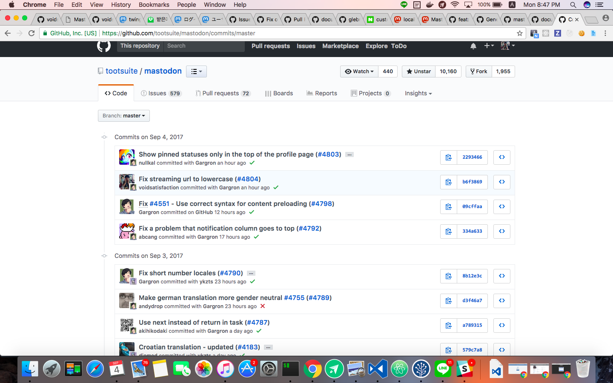
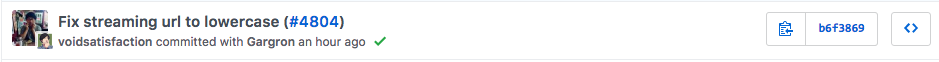

# Day1 Lessons

ピクシブインターンから感じたことを書き出します。

## オープンソースコントリビューターになる

いよいよ、私の夢を叶えたのである。

今まではOSSというものは自分には遠いものだと感じていた。そして、手につかないものかなと思ったが、プログラミングを始めて2年、物作りを始めて1年でオープンソースのコントリビューターとなった。

もちろん、メンターの「あべちゃん」のおかげが大きいが、それでも自分で成し遂げた成果なので非常に嬉しい限りである。

この一歩がこれからの私のプログラミング人生において非常に大事な一歩となるだろう。

## とにかくすごい人が多い。

百人を超える人から選ばれた9人であったので、みんなすごく賢く、実績も多かった。毎月何百万人が利用するWebサービスを出している人や、テレビに出た人、かなり有名なオープンソースのコントリビューターとか。。。メンターさんも含めてみんな本当にすごい人たちばかりである。ピクシブでは、ただのプログラミングずきよりかは、「ものづくり」を大切にしている印象が強かった。

逆に考えると、私自身も今はまだ足りないところがいっぱいあるが、やる気や根性では負けないことではないことが評価され、参加できるようになったと思う。少なくとも、同じく選ばれた時点で「自分なりの強み」があるはずである。

自分の力を信じて、ゆっくりだけど、毎日少しずつ歩んでいきたい。

## DDDは大事。

Mastodonのサーバサイドの設計もDDDの様々な概念を取り入れて作られている。

大規模システムをきちんと設計のことを考えようとしたら、もはやDDDは必須になっているようである。
