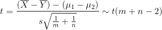

# 통계적 추정(estimation)

- 의문
- 추정
- 추정의 종류
  - 점추정
  - 구간추정
- 점추정
  - 추정량과 추정값
  - 점추정 방식
    - 모먼트 법
    - 최우법
  - 점추정의 기준(4가지)
  - 점추정의 예시
- 구간추정

## 의문

*통계량은 함수인가?*

- 통계량은 아직 관측에 의해서 값이 정해지지 않은 상태의 것임
  - 따라서, 통계의 관측 input(벡터)에 따라서 output이 달라지므로 일종의 함수라고 할 수 있음

*어떤 함수의 대수화를 한 후에 미분을 해서 0인 좌표는 기존 함수의 미분을 해서 0인 좌표와 같다고 할 수 있는가?*

- 직관적으로는 그렇다
  - log함수는 단조증가

*모집단이 균등분포인 경우의 추정에서 최우법으로 파라미터를 구하는 방법*

- 직관적으로 이해는가는데 엄밀하게 증명하려면?
  - 참고
    - [1](http://m.blog.daum.net/gongdjn/125?np_nil_b=-1)

*신뢰구간의 의미? 같은 크기의 서로다른 표본에서 신뢰구간을 계산한 경, theta를 구간 안에 포함하는 것의 비율이 1-alpha인 경우*

## 추정

- 표본을 바탕으로, 해당 표본이 추출된 원래 모집단의 모수(모평균, 모분산 등)의 값을 정하는 것
  - 데이터 = 시그널 + 오차
    - 시그널을 빼 내는것이 통계적 추정
- 통계학과 확률론의 차이
  - 확률론에서는 확률분포가 더 중요
  - 모수를 추정하는가? 아닌가의 차이
- parametric vs non-parametric
  - parametric
    - 모수를 알면, 모집단의 분포도 안다고 전제
  - non-parametric
    - 모집단의 분포 보다는 일부의 모수(모평균 등)만 알고싶은 경우
- 용어
  - 추정(estimation)
    - 표본으로부터 모수를 정하는 것
  - 추정량(estimator)
    - 모수를 추정하기 위해서 표본으로부터 구한 통계량
    - 예시
      - mu의 추정량은 X bar
      - sigma^2의 추정량은 s^2
- 표기
  - 추정하고자 하는 모수
    - theta
  - 추정량
    - theta^

## 추정의 종류

- 점추정(point estimation)
  - 모집단의 미지의 모수 theta를 추정하는 경우, 그것을 하나의 값 theta^로 지정하는 방법
  - 특징
    - 오차 존재(오차 평가가 필요 => 추정량의 표본분포를 생각한 확률적 취급이 필요 => 불편추정량, 일치추정량 등의 기준 필요)
- 구간추정(interval estimation)
  - 파라미터의 값이 포함되는 확률이 임의의 값 1-a 이상이라고 보장되는 구간 [L, U]를 구하는 것으로, 처음부터 추정에 어느정도 오차가 있음을 인정한 추정법
    - `P(L <= mu <= U) >= 1-a`
    - L, U는 X1, X2, ..., Xn의 함수, 즉, 통계량이며, 좌변의 확률이 1-a이상이 되도록 표본분포로부터 구함

## 점추정

### 추정량과 추정값

- 추정량
  - 모수를 추정하기 위해서 표본으로 부터 구한 통계량
- 추정값(estimate)
  - 실제로 n개의 관측값이 주어진 경우, 추정량을 실제의 숫자로 계산할 수 있는데, 이를 추정값이라고 함
  - 우리가 현실의 데이터로부터 계산하는 것은 추정값이며, 이것은 추정량의 가능한 값의 하나가 실현되는 것
  - 예시
    - 표본 평균은 어떻게 표본을 추출했느냐에 따라서 변화하는 추정량이나, X1=x1, X2=x2, ..., Xn=xn이 표본으로 주어진 경우에 이것을 대입하여 계산되는 값이 추정값
- **모수를 추정하기 위해서는 어떠한 통계량을 추정량으로 할지 결정하는 것이 중요**

### 점추정의 방식

#### 모먼트 법(적률방법 - method of moments)

- 모먼트를 통해서 모집단에 대해서의 정보를 흡수하는(?), 매우 전형적인 방법
  - 모먼트 도함수와 관계가 있음
- 예시
  - 모집단 분포 = N(mu, sigma^2)

모집단의 1차, 2차 모먼트(mu1, mu2)

표본으로부터 구한 표본 1차 2차 모먼트(mu1^, mu2^)

추정을 위해서, 모집단의 모먼트 = 표본 집단의 모먼트 라고 두면,

모평균 모분산의 추정량

- 일반적으로는 모집단이 k개의 미지의 모수를 갖는 모집단 분포를 따른다고 할 때, 이 분포를 따르는 확률변수를 X라고 하여, 그것을 1차부터 k차까지 모먼트(모모먼트) mu1 = E(X), mu2 = E(X^2), ..., muk = E(X^k)를 생각함
- 그리고 모모먼트 = 표본모먼트 라고 두어서
- mu1, mu2, ..., muk의 모먼트 방정식을 해결

#### 최우법(최대우도추정법 - maximum likelihood method)

- 예시
  - 1을 갖는 확률이 p, 0을 갖을 확률이 1-p인 베르누이 분포 Bi(1, p)가 모집단분포일 경우를 생각
  - 추정해야할 미지의 모수는 p
  - X1 = 1, X2 = 1, X3 = 1, X4 = 1, X5 = 0의 n=5의 표본이 얻어졌다고 함
  - p는 0부터 1까지의 사이의 값을 갖을 가능성이 있으나, 모수가 될 수 있는 값의 집합을 모수공간(parameter space)라고 부르며, Theta로 나타냄
  - 위의 표본이 나올 확률
    - `L(p) = p^4(1-p)`
    - p = 0.2, p = 0.8 중에서 p = 0.8인 경우가 L(p)가 더 크므로, 0.8이 최우값으로 적당
- 최우원리(principle of maximum likelihood)
  - 현실의 표본은 확률이 최대의 것을 실현한 것이라는 가정
- L(p): 우도함수
  - 모수공간 Theta에서의 p의 다양한 값에 있어서 가장 적합한 것을 나타내는 함수로 간주할 수 있으며, 이러한 적합도를 우도(likelihood), 그 함수를 우도함수(likelihood function)이라고 부름
- 최우법(maximum likelihood method)
  - 우도함수를 모수공간 Theta에서 최대가 되도록하는 것을 추정값이나 추정량으로 하는 것
- 최우추정값(maximum likelihood estimate)
  - 우도함수를 최대로 하는 값
  - 우도함수를 미분해서 구할 수 있음
    - 확률 p는 구간 [0 1]에서 존재
- 최우추정량(maximum likelihood estimator)
  - 함수

모수가 하나인 일반적인 우도함수(theta는 모수)

모수가 여러개인 일반적인 우도함수

일반적인 우도함수는 곱의 형태이므로 수학적으로 다루기 힘드므로, 로그를 취해서 합의 형태로 변환(**대수우도**)

최우추정량 theta^는 logL(theta)를 모수공간 Theta에 있어서 최대로 하는 추정량

베르누이 분포에서는

*to be continued*

### 점추정의 기준

- 점추정은 여러가지로 생각할 수 있음
  - 표본평균
  - 중앙값
  - 미드레인지
  - 표본 최대, 최소를 잘라낸 표본평균
- 점추정에서 추정량의 결정 기준
  - 본질
    - **추정량의 표본분포가 모수인 theta의 주변에 집중해있는 것을 타나내는 기준을 만족해야 함**
  - 기준
    - 1 불편성
    - 2 일치성
    - 3 점근정규성
    - 4 유효성

#### 1. 불편성(unbiased)

- 추정량의 기댓값이 모수의 값이 되는 것
  - 평균적 과대 / 과소 추정이 없는 것
- 불편추정량(unbiased estimator)
  - 위의 기준을 만족하는 추정량
- 특히 표본평균, 표본분산(불편분산)의 불편성이 중요함
  - E(X bar) = mu
  - E(s^2) = sigma^2

#### 2. 일치성(consistent)

일치추정량(consistent estimator)의 조건

- 표본의 크기 n이 커짐에 따라, thetan^(추정량의 표본분포가 n에 의해서 변화하므로, 여기서는 첨자 n을 붙임)이, 그림 11.4와 같이, 모수의 값 theta에 가까워지는 성질
- 확률수속
- 큰수의 법칙과 유사

**불편성과 일치성이 점추정을 하기위한 최소한의 조건**

#### 3. 점근정규성(asymptotic normality)

- 중심극한정리에 의하여 점근 분포(n -> 무한대 인경우의 분포)는 정규분포인 경우가 많음
  - 점근 분포가 정규분포인 경우의 성질을 **점근정규성** 이라고 함
- 점근정규추정량(asymptotically normal estimator)
  - 점근 정규성을 만족하는 추정량
- 예시
  - X bar의 점근분포는 정규분포이므로 X bar는 점근정규추정량임

#### 4. 유효성(efficient)

- 배경
  - 두 추정량 theta^, theta~가 있을 때, 먼저, 두쪽다 불편추정량이며, 일치추정량이라고 함
  - 두 분산을 생각해서 그 우열을 비교해야만 함
  - 불편추정량인 경우 추정량의 기댓값이 모수와 같기 때문에, 분산이 작을 수록, 모수의 값의 주변에 표본분포가 집중해 있다고 생각할 수 있기 때문
    - 그래서 분산이 작을 수록 보다 바람직한 추정량으로 생각할 수 있음
- 유효추정량(efficient estimator) / 최소분산불편추정량(minimum variance unbiased estimator)
  - 어떠한 불편추정량보다도 분산이 작은 추정량
  - 모집단이 N(mu, sigma^2)인 경우 표본평균이 mu의 유효추정량으로 알려져 있음
  - 발견 자체가 매우 어려움
- 점근유효성(asymptotic efficiency)
  - 유효추정량의 발견이 어려운 경우 기준을 좀더 느슨하게
  - 점근분포가 정규분포가 되는 추정량 중에서, 그 점근 분산이 최소가 되는 성질
  - 점근적유효추정량
    - 점근유효성을 만족하는 추정량
    - 최우법의 추정량은 보통 이 기준을 만족

### 점추정의 예시

#### 모집단이 정규분포인 경우의 추정

최우법

최우 추정량

보통은 불편성은 만족하기 위해서 S^2대신 s^2을 이용(n-1)

모먼트법도 최우법과 같은 결과가 나옴

#### 모집단이 이항분포인 경우의 추정

모집단 분포가 표본 Xi = 0, 1을 내는 모수 p의 베르누이 분포 Bi(1, p)의 이항분포일 때, 우도함수의 대수는 이하와 같음

여기서 최우추정량은 p^ = X bar(1이 나오는 상대도수)가 됨

모먼트법도 최우법과 같은 결과가 나옴

#### 모집단이 포아슨분포인 경우의 추정

모집단분포가 모수 lambda의 Po(lambda)일 때, 우도함수의 로그는

lambda^ = X bar

모먼트법도 최우법과 같은 결과가 나옴

#### 모집단이 균등분포인 경우의 추정

모먼트법

모집단 분포가 구간(a, b)의 균등분포(a < b)일 때, a,b가 모수이나,

mu = (a+b)/2, sigma^2 = (a-b)^2/12

이렇게 a,b를 풀면

a = mu - sqrt(3)sigma, b = mu + sqrt(3)sigma

이므로 모먼트법에의한 추정량은

a = X bar - sqrt(3)S, b = X bar - sqrt(3)S

최우법

a = Min{X1, X2, ..., Xn}, b = Max{X1, X2, ..., Xn}

이 경우에는 모먼트법과 최우법이 전혀 다른 추정량을 야기함

- 최우법의 경우
  - a, b가 위와 같지 않을 경우에는, 표본이 X1, X2, ..., Xn이 나올확률이 점점 줄어듬

#### Non-parametric인 경우의 추정

- 최우법으로는 확률 밀도 / 질량함수를 알 수 없기 때문에 구할 수 없음
- 모먼트법으로 모평균과 모분산을 추정

## 구간추정

- 모수인 theta에 대해서 확률적 사고방식을 적용한 추정
- theta가 어떠한 구간 (L, U)에 들어갈 확률이 1-alpha이상이 되도록 보증하는 방법
  - `P(L <= theta <= U) >= 1 - alpha`
    - L: 하측신뢰한계(lower confidence limit)
    - U: 상측신뢰한계(upper confidence limit)
    - 1-alpha: 신뢰계수(confidence coefficient)
      - 보통은 0.99, 0.95가 되도록 설정하는 경우가 많음
    - [L, U]구간: 신뢰구간(confidence interval)
- 특징
  - 동일 모집단으로부터 추출한 표본이어도, 표본마다 신뢰구간의 추정값이 변화함
  - theta는 알려지지 않았으나, 이미 정해진 정수
  - 결국 하나의 표본으로 부터 신뢰구간을 구체적인 수치로서 추정하면, 이것은 신뢰구간에 포함되거나 포함되지않거나 둘 중 하나.
  - 신뢰구간의 의미
    - 반복해서 많은 서로 다른 표본에 대해서 신뢰구간을 계산한 경우, theta를 구간 안에 포함하는 것의 **비율** 이 `1-alpha`임(o)
      - `P(L <= theta <= U)`에서, 통계량의 표본분포의 확률 밀도함수를 적분하여 1-alpha 의 넓이가 되는 구간에 theta^가 존재.
      - 즉, 반대로 생각하면 표본 추출의 경우의 수에서 alpha의 비율로 L보다 작고 U보다 큰 영역에 theta^가 존재한다는 것인데, 이러할 때에 theta를 추정하는 경우에는, 구간`[L, U]` 사이에 theta가 존재하지 않음
      - **어차피 mu는 정해져있으므로, mu가 구체적 X bar기반의 해당 신뢰구간에 속하는지 아닌지로만 경우의 수가 나뉨**
        - 즉, 표본 평균의 분포에서 mu가 해당 구간에 속하는 경우의 비율이 95%라는 소리다.
    - 구체적으로 수치로서 계산한 현실의 신뢰구간에 대해서, 1-alpha의 확률로 theta를 포함하는것(x)
  - 신뢰구간의 폭 `d = U - L`
    - alpha가 일정할 경우, 표본의 크기 n이 크게 될 수록 작게 됨
    - 보통은 1/sqrt(n)에 비례해서 0으로 가까워짐
    - 폭의 길이가 짧은 쪽이 보다 정확하다고 할 수 있음
      - n이 클 수록 정확하게 theta를 추정 가능
    - **추정 오차를 일정한 값 이하로 두기 위한 n의 크기도 구할 수 있음**
- 오차범위(margin of error)
  - 여론조사에서 A의 지지율이 50%, 오차범위 +-3%, 신뢰수준이 95%라는 결과가 나오면, 실제 지지율(모수)이 47 ~ 53%사이에 있을 확률이 95%라는 뜻
  - 표본을 늘릴 수록 오차범위는 줄어들고, 신뢰수준을 높일수록 오차범위가 늘어남

### 오차범위로 n의 추정

- 여론조사를 보면 간혹, 몇명을 조사했는지는 알려주지 않고 95%의 신뢰도로 += 3.1%오차범위 라는 말과 함께 여론조사의 결과를 나타내는 경우가 있음.
- 이 때에, 신뢰도와 오차범위를 기반으로 몇명을 조사했는지 n을 파악할 수 있음

여론조사 지지율에 대한 신뢰구간

오차범위(+-%)

- 여론조사는 그 모집단이 Bi(1, p), p는 해당 정당을 지지할 확률(모수) 를 따르므로, 여론조사 지지율에 대한 신뢰구간은 위의 식을 따름
- 또한, 오차범위역시 위의 두번째 식을 따름
  - 여기서 이미 z는 95%의 신뢰도이므로 1.96임
  - 그리고 위의 계산식의 결과가 0.031 이라는 것을 알고 있음
  - 하지만, p와 n둘다 미지수
- 여기서 n을 구해야 하는데, 해당 오차범위의 최댓값은 p = 0.5일 경우이므로, 그것을 가정했을 때의 오차범위를 구함.
  - 이를 최대오차허용범위 라고 함
- 결과적으로 n = 1000이 됨
- 최대오차허용범위 계산
  - n=500, +-4.4%
  - n=1000, +-3.1%
  - n=2000, +-2.2%
  - n=3000, +-1.8%
  - n이 커지면 커질수록 최대오차허용범위가 줄어듦

### 정규모집단의 모평균, 모분산의 구간추정

#### 모평균의 신뢰구간

**모분산을 아는경우 - 표준정규분포**

추정을 위한 식

신뢰 구간

**모분산을 모르는경우 - t분포**

추정을 위한 식

신뢰 구간

#### 모분산의 신뢰구간

*1-alpha/2인 점이 오히려 앞에 존재한다?!*

추정을 위한 식

신뢰 구간

### 두 정규모집단의 모평균의 차, 모분산의 비의 구간추정

#### 모평균의 차의 신뢰구간

- 배경
  - 모집단 분포가 `N(mu1, sigma1^2), N(mu2, sigma2^2)`인 두 정규모집단 존재
  - 개별적으로 두 표본 X1, X2, ..., Xm과 Y1, Y2, ..., Yn을 추출했을 때
  - 모평균의 차 mu1 - mu2의 구간추정에 대해서 생각

**두 모분산이 같을 경우 - `sigma1^2 = sigma2^2 = sigma^2`**

- 기본적으로 t-test를 이용함

표본분산

통계량

추정을 위한 식

신뢰 구간

**두 모분산이 같다고 할 수 없는 경우**

- 기본적으로 welch's t-test를 이용함

통계량

자유도

신뢰 구간

#### c.f) 오사카는 동경보다 어느정도 더운가

- 1988년 8월 전반의 최고기온 데이터를 동경과 오사카 둘다 같은 날 수집
- 각 관측값이 pair로 대응하는 paired sample의 경우에는, 2표본 t통계량이 아닌, 차를 만들어 그것을 데이터로 하여 그것에 대해서 통상 1표본으로 추정을 하도록 함
- 해당 차를 확률변수를 두어서, 확률 분포를 구하고 t분포를 이용해서 신뢰구간을 만들어서 추정 가능
- 다른 예시
  - 유사하게는, 마케팅에서 A/B테스트를 시행하므로써, 어떤 캠페인이 더 효과적인가 각 날짜마다 매상 데이터의 차를 구하고, 통계적 추정을 사용해서 어떤 캠페인이 더 효과적인지 판단

#### 모분산의 비의 신뢰구간

F분포는 카이제곱분포를 따르는 두 확률변수를 나눈 확률변수의 분포이며, 분산분석에 이용됨

추정을 위한 식

신뢰 구간

