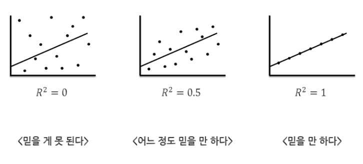

# 이차원 데이터

- 2차원 데이터란
  - 정의
  - 상관
  - 회귀
  - 다변량 해석
- 산포도와 분할표
  - 산포도
  - 분할표
  - 상관표
- 상관계수
  - 피어슨 상관계수
  - 상관관계와 인과관계
  - 허구적 상관과 편상관계수
  - 층별과 상관
  - 순위 상관계수
  - 시계열과 자기상관
- 직선 및 평면에의 맞춤
  - 직선의 맞춤
  - 결졍계수

## 2차원 데이터 란

### 정의

- 2변수 x, y혹은 3변수 x,y,z 등을 관측해서 n개(n조합)의 데이터를 얻은경우 그 데이터를 다차원 데이터라 함
  - 다차원 데이터의 통계학은 변수간의 **관계(relation)** 를 다루는 학문
  - (x1, x2, x3) 이렇게 벡터로 나타낼 수 있음
- 2차원 데이터의 분석을 위해서는 산포도를 그려보는 것이 가장 알기 쉬움

### 상관(correlation)

- 변수 x,y의 관계를 볼때, 두 변수를 구별없이 대등하게 보는 것 혹은 방법
- e.g
  - 형제 자매의 신장
- 두 변수가 직선관계에 가까운 경향을 보여줌
- 상관관계
  - 통계학에서는 두 변수 사이의 직선관계에 가까운 경향이 보일 경우 "상관관계가 있다" 라고 하는 경우가 많음
  - 방향
    - 정 / 부
  - 정도
    - 센 / 약한

### 회귀(regression)

- 변수 x에서 y를 보거나 변수 y에서 x를 볼 떄 회귀라고 함
- x에 의해서 얼마나 y가 결정되는가? 에 대한 모양이나 정도를 다룸
- e.g
  - 연령과 혈압
  - 소득과 소비

### 다변량 해석(multivariate analysis)

- 다차원 데이터를 분석하는 것으로, 복잡한 현상을 명확히 할 수 있도록 함

## 산포도와 분할표

### 산포도(scattergram)

- 관측대상(개체) n개로부터 데이터 (xi, yi)를 얻을 수 있고, **둘다 양적데이터일 경우** 가로축을 x, 세로축을 y로 하여 각 관측 데이터를 평면상으로 나타낸 것
- 2차원 데이터를 분석할 때 가장먼저 그려봄
  - 점의 분포가 어떠한 것을 의미하는 지 확인

### 분할표(contingency table or cross table)

- 두 데이터 변수가 적어도 하나가 질적데이터일 경우, 데이터의 관계를 보기 위해서 이용함
  - 상대도수를 이용
- 표두(가로) / 표측(세로) 로 나뉨
  - 보통은 표두에 근원적인 차원을 둠(e.g 성별)
- 양적 변수도 적당히 계급을 나눠주면 작성 가능
- c.f
  - 상관표
    - 두 데이터가 양적 데이터여도, 적당한 계급으로 나누면 분할표를 만들 수 있는데, 이를 상관표 라고 부르는 경우가 있음
    - 데이터의 크기가 매우 크고, 산포도로 나타냈을 경우, 같은 위치에 점이 잔뜩 겹치는 경우에 특히 유효한 방법

### 상관표

- 두 데이터가 모두 양적 데이터라도 적당히 계급을 나누어서 분할표를 작성하는 것
- 데이터의 크기가 매우 클 경우 유효
  - 단순 산포도를 작성하면 같은 곳에 많은 점이 찍히는 경우

## 상관계수(correlation coefficient)

### 피어슨 상관계수(적률 상관 계수)

- 서로 다른 2차원 데이터 사이의 상관 관계의 강함을 수치로 나타낸 것
  - 여러가지 정의가 있음
  - 주로 사용되는 것: 피어슨 적률상관계수(product-moment correlation coefficient)
  - 편차 (x - x평균), (y - y평균) 을 곱하므로, 편차 곱이라고 불림
    - 편차 곱의 평균인데, 이를 공분산이라고 부름
- 성질
  - 범위
    - `-1 <= r <= 1`
  - 최대 값(1) 최소 값(-1) 이 되는 경우
    - 모든 값이 직선위에 존재할 경우
      - 정의 완전 상관
      - 부의 완전 상관
  - 데이터의 크기가 작으면 (n <= 15) 상관계수 값이 0.7 이상이어도 실제로는 매우 약한 상관일 수 있음
    - 0.5의 경우에는 상관이 거의 없다고 생각할 수도 있다

### 상관관계와 인과관계

- 상관관계가 있다고 해서 인과관계가 있는 것은 아님
  - e.g
    - 신장과 체중
    - 수학 성적과 과학 성적
- 인과관계가 있다고 해서 (통계학적)상관관계가 있는 것은 아님
  - 통계학적 상관관계는 두 데이터간의 직선적인 관계가 있는 것을 의미
  - 실제 세상의 인과관계는 직선 외에 보다 복잡한 내용이 숨겨져 있음
  - e.g
    - `y = (x-8)^2`
- 사회현상의 분석에는 두 현상의 구분이 매우 중요

### 허구적 상관과 편상관계수(spurious correlation / partial correlation coefficient)

- 허구적 상관
  - e.g
    - 미국의 철로 위 충돌에 의한 운전자 죽음 수 / 노르웨이로부터 미국 원유 수입 양
    - 동경의 각 구에 대한 음식점수 / 금융기관 점포수
- 편상관계수
  - 변수 1 ~ 3 이 있을 경우, 변수 3의 영향을 제외한 변수 1과 변수 2의 사이의 상관계수를 뜻함

### 층별(stratification)과 상관

- 대영제국의 실업률과 보수당 지지율의 관계
  - 전체적으로는 약한 부의 상관관계를 보이는 듯
- 대영제국을 잉글랜드 / 스코틀랜드 / 웨일즈 세개로 분리 했을 경우
  - 잉글랜드와 보수당 지지율은 강한 부의 상관관계를 보여줌
- 층별(stratification)
  - 원래 데이터가 성격이 다른 몇개의 부분 집단을 포함하는 경우, 적당히 그룹을 나누면, 전체로는 상관관계가 없으나, 각 그룹에서는 상관이 나타나는 경우에 그러한 그룹을 나누는 것

### 순위 상관계수(rank correlation coefficient)

- 정의
  - 두 질적 기준(양적 변수를 대소 관계로 이것으로 변화 시키는 경우도 있음)이 있는 경우, 관측 대상 i의, 두 기준에 의한 순위(rank) Ri, Ri` 사이의 상관을 나타낸 지표
- 종류
  - 스피어맨(C. Spearman)
  - 캔들(M. G. Kendall)

### 시계열과 자기상관

- 시계열 데이터 정의
  - 데이터 x1, x2, ..., xn 이 시간적으로 관측된 것일 경우, 이러한것을 일반적으로 시계열(time series)라고 함
  - 데이터의 1, 2, ... n 에서 i < j 이면 j는 i 보다 시간적으로 뒤에 있음을 나타냄
    - 따라서, **현상의 인과관계** 를 생각할 때, xj는 xi의 결과와 생각하는 것이 가능하나, 역은 생각할 수 없음
- 예시
  - 백화점의 매월 매출을 1985년 1월 부터 1989년 12월까지 나열한 것은 n=60 의 시계열 데이터
    - 여기서 n을 시계열의 길이라고 함
- 분석 및 응용
  - 인과관계 해명
  - 예축
  - 추세
  - 주기
  - 계절
  - 불규칙 변동
- 자기 상관 계수(auto-correlation coefficient) / 계열 상관 계수(serial correlation)
  - i시점의 xi가 크면, j시점(단, i < j, j=i+1)의 xj는 크게 된다(혹은 작게 된다) 라는 관계를 분석하는 것이 기본임
  - 같은 x여도 다른 시점간의 상관관계를 나타내는 것을 **자기 상관 계수** 혹은 **계열 상관 계수** 라고 부름
  - 에시
    - (x1, x2), (x2, x3), (x3, x4), ...
      - 데이터를 t 시점만큼만 옆으로 옮겨서 그 상관계수를 만드는 것
      - **이를 lagt 의 자기 상관계수라고 함**
  - 성질
    - 상식적으로는 t와 함께 rt는 0에 접근하는 것이 보통
    - 예외
      - 백화점의 매출의 경우 어떤 해의 6월과 다음 해의 6월이 매출이 강한 상관 관계가 있는 것으로 부터 **계절성(seasonality)** 을 포함한 월별 시계열 데이터에서는 r12가 특히 크게 되는것을 볼 수 있음

## 직선 및 평면에의 맞춤

### 직선의 맞춤

- 독립변수와 종속변수
  - x가 y를 좌우 하거나 결정하는 경우
  - y를 종속 변수, x를 독립변수
  - 위의 x, y의 관계를 회귀 라는 관점이나 방법으로 다룸
- 보통은 1차식으로 표현
  - `y = b*x + a`
- 최소 제곱법 / 최소 자급법(method of least squares / sum of squares)
  - 어떠한 객관적인 기준으로 `y = b*x + a` 식을 도출할 것인가?
  - xi로부터 예상되는 y값인 b*xi + a 와 현실의 모든yi의 합이 가장 적은 차이를 보이는 직선이 최적 직선 `y = b * xi + a` 이라고 할 수 있음
  - a와 b에 대해서 편미분으로 **정규방정식(normal equation)** 을 도출
  - 이를 풀어서 그래프 위에 직선을 그리면 회귀 방정식(regression equation) / 회귀 직선(regression line) 이라고 함
  - `b`는 편회귀계수(slope, partial regression coefficient)
  - `a`는 회귀직선의 y 절편 (y-intercept)
- 회귀직선(simple regression)
  - `y - y평균 = b(x - x평균)`
  - **(x평균, y평균)을 지나는 기울기 b의 직선임**
- 회귀식의 가설검정
  - 해당 회귀식을 정말 믿을 수 있는가?
    - 귀무가설: 해당 회귀식은 유용하지 않다
    - 대립가설: 해당 회귀식은 유용하다
- 질문
  - *왜 기울기를 b로 놓았을까?*

#### 결정 계수(coefficient of determination)

- 결정 계수
  - `b = r * Sy / Sx`
  - 직선 대응의 정도는 r값의 척도이기도 함
  - 상관계수 r은 직선의 대응의 정도의 척도이기도 함
  - r^2가 1이면 정확히 모든 데이터가 `y = b*x + a` 위에 있는 것으로 **결정** 됨
    - r^2는 독립변수 x가 종속변수 y를 결정하는 강약의 정도를 나타냄
- 용어
  - SSE(Sum of Square Error)
    - 회귀식과 실제 값의 차이 제곱
    - 회귀 후
  - SSR(Sum of Square Regression)
    - 회귀식과 평균값의 차이 제곱
    - 회귀에 의한 감소
  - SST(Sum of Square Total)
    - 편차의 제곱합
    - 회귀 전
- 식
  - `SSE = (1-r^2) * SST`
  - `SSR = SST - SSE`

### 평면의 맞춤

- 중회귀(multiple regression)
  - 둘 이상의 x1, x2, ... xp 를 더한 회귀식도 구할 수 있음
  - `y = b1*x1 + b2*x2 + a`
  - 이는 평면의 맞춤문제
  - e.g
    - 연령, 최고 혈압, 폐활량

### 다항식 회귀

- 어떤 데이터는 2차식이나 3차식으로 회귀식을 나타내는 것이 더 정확함
  - 그럴떄, **다항식 회귀(polynomial regression)** 를 사용
