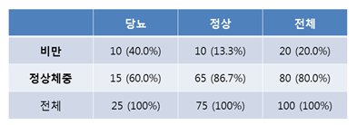

# 이차원 데이터

- 2변수 x, y혹은 3변수 x,y,z 등을 관측해서 n개(n조합)의 데이터를 얻은경우 그 데이터를 다차원 데이터라 함
  - 다차원 데이터의 통계학은 변수간의 관계(relation)를 다루는 학문
- 다차원 데이터를 다룰때는 다변량 해석(multivariate analysis)를 활용

## 상관(correlation)

- 변수 x,y의 관계를 볼때, 두 변수를 구별없이 대등하게 보는 방법
- e.g
  - 형제 자매의 신장
- 두 변수가 직선관계에 가까운 경향을 보여줌

## 회귀(regression)

- 변수 x에서 y를 보거나 변수 y에서 x를 볼 떄 회귀라고 함
- x에서 얼마나 y가 결정되는가?
- e.g
  - 연령과 혈압
  - 소득과 소비

## 산포도와 분할표

### 산포토(scattergram)

- 관측대상 n개로부터 데이터 (xi, yi)를 얻을 수 있고, **둘다 양적데이터일 경우** 가로축을 x, 세로축을 y로 하여 각 관측 데이터를 평면상으로 나타낸 것
- 2차원 데이터를 분석할 때 가장먼저 그려봄
  - 점의 분포가 어떠한 것을 의미하는 지 확인

### 분할표(contingency table or cross table)

- 두 데이터 변수가 적어도 하나가 질적데이터일 경우, 데이터의 관계를 보기 위해서 이용함
  - 상대도수를 이용

### 상관표

- 두 데이터가 모두 양적 데이터라도 적당히 계급을 나누어서 분할표를 작성하는 것
- 데이터의 크기가 매우 클 경우 유효
  - 단순 산포도를 작성하면 같은 곳에 많은 점이 찍히는 경우

## 상관계수(correlation coefficient)

- 서로 다른 2차원 데이터 사이의 상관 관계의 강함을 수치로 나타낸 것
  - 여러가지 정의가 있음
  - 주로 사용되는 것: 적률상관계수(product-moment correlation coefficient)
- 식
  - 공분산 / (표준편차1 * 표준편차2)
