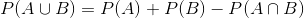
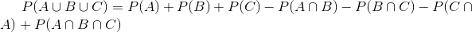

# 확률(Probability)

한정된 데이터로 부터 전체의 법칙성을 파악하기 위해서는, 확률이 높은 측량을 해야 함

- 무작위성과 확률
- 표본공간과 사상
  - 사상의 연산
- 확률의 정의
  - 라푸라스의 정의
  - 빈도에 의한 정의
  - 확률의 공리주의적 정의
  - 베이즈적 주관 확률 정의
- 가법정리
- 조건부 확률과 독립성
  - 조건부 확률

## 무작위성과 확률

- 통계적 추측
  - 판단은, 해당 데이터를 얻을 수 있는 확률에 기반
- 예시
  - 어떤 사람은 동전을 던졌을 때, 앞면인지 뒷면인지 맞출 수 있는데, 동전을 52번 던져서 40번 맞춘다면, 그 사람은 우연히 맞췄다고 해야 할까?
    - 주목해야 할 것은 40의 **확률론적 의미**
- 무작위성
  - 정확한 정의는 힘들지만
  - **무엇이 다음에 일어날 지 확률적인 예상을 할 수 없는 것**
- 확률론
  - 무작위성이 아니라, **무작위성의 법칙을 다루는 수학이론**
    - 코인을 던지면 다음에 무엇이 나오는지는 모름
    - 대신, 앞면 뒷면이 절반 절반 나온다는 것은 명제로서 성립

## 표본공간과 사상(事象)

- 표본 공간(전사상, sample space)
  - 가능한 결과의 집합
  - 길이, 무게, 온도등의 표본 공간은 구간 내 모든 점의 집합이며, 무한개의 점으로 구성됨
  - 예시
    - 전구의 수명
      - `O = (0, 무한대)`
    - 포커
      - 52장의 카드 중 무작위 5장을 뽑아서 그 집합의 희소성으로 승부 겨루기
        - 표본공간: 52C5, 2,598,960
- 표본점(sample point)
  - 가능한 결과
- 사상(event)
  - 표본 공간의 부분집합
    - 그러므로 표본 공간 자신도 사상에 포함
  - 공사상
    - 표본점을 하나도 포함하지 않는 사상(절대 일어나지 않는 이벤트)
  - 일어날 수 있는 것들
  - 집합을 사용하여 정리하여 설명할 필요가 있음
  - 예시
    - 주사위를 두번 던져서 합계가 7이 되는 사상
      - (1, 6), (2, 5), (3, 4), (4, 3), (5, 2), (6, 1)
  - 종류
    - 근원사상(elementary event)
      - 하나의 표본점으로 구성되어, 분해가 불가능한 사상
    - 복합사상(compound event)
      - 복수의 표본점을 포함하여, 두개 이상의 근원 사상으로 분해 가능한 사상
- 예시
  - 주사위를 1번 던지는 경우
    - 각각 하나의 가능한 결과(sample point)
      - 1
      - w(omega)
    - 가능한 결과의 집합(sample space) / 표본공간 / 전사상
      - 1, 2, 3, 4, 5, 6
      - O(capital omega)

### 사상의 연산

- 사상을 나타내는 경우, 표본점의 수에 관계없이 벤다이어 그램으로 나타내는 경우가 많음
- 사상의 관계
  - 배반사상(disjoint events)
  - 합사상(union of events)
  - 적사상(intersection of events)
  - 보사상(complementary event)
    - 사상A가 일어나지 않는 사상
  - 드모르간의 법칙

## 확률의 (수학적)정의

- 정의
  - 사상의 일어날 수 있는 정도를 정량적으로 나타낸 것
  - 사상 A가 일어날 확률을 P(A)라고 함
  - **다양한 정의가 있음**
    - 라푸라스 고전적 정의
    - 상대 빈도에 기반한 빈도설의 입장
    - 코르모고르푸의 공리주의적 입장
    - 베이즈적 주관확률

### 라푸라스의 정의(확률의 고전적 정의)

- 시행의 근원 사상이 전부 N개가 있으며, 그 근원 사상들이 동일 확률을 배당 받는다면, 근원 사상들 중 한 무리가 발생될 확률은 그 무리의 근원 사상들의 개수를 근원 사상들의 총 개수로 나눈 값
  - `P(A) = R/N`
  - 표본공간 오메가가 무제한개의 점으로 이루어지는 경우
    - 활을 쏘아서 과녁에 맟출 확률 = 과녁 면적 / 전체 넓이 면적
  - 확률이 결국 경우의 수를 세어나가는데에 귀속이 됨
    - 순열 / 조합의 모든 정리를 사용 가능
  - 연역적
  - 문제
    - **모든 표본점이 같은 정도의 확률을 갖는다고 가정한 점**
    - 주사위의 일부가 부셔지면 전부 같은 확률로 나온다고 할 수 없음
    - 그것을 제외하고는 주사위의 1에서 6까지의 눈은 동일확률로 나온다고 생각해도 타당함
      - 이유불충분의 원리(Principle of insufficient reason)

### 빈도에 의한 확률의 정의

- 확률의 빈도설(frequency theory)
  - 시행을 무한히 하여 해당 사상이 나온 횟수를 세어서 전체의 시행에서 그 사상이 나올 비율(relative frequency)을 기록한 것
  - 관측데이터에 기반한 확률
    - 귀납적
  - 문제
    - 실제로 무한번 할 수 없음
    - 엄청나게 많은 수를 시행해도 그것으로 구한 확률이 실제 확률인지 확인할 길이 없음

### 확률의 공리주의적 정의

- 확률과 사상의 관계를 규정하여, 확률론을 수학적으로 구성하기 위해서는, 공리를 설정하여, 그것에 기반하여 체계적으로 토론해야함
  - **수학적 토론을 위한 정의**
- 확률론의 공리
  - 모든 사상 A에 대하여 0 <= P(A) <= 1
  - P(오메가) = 1
  - 서로 배반 사상 A1, A2, A3, ...에 대하여, P(A1 U A2 U A3 U ...) = P(A1) + P(A2) + P(A3) + ...
    - 확률이 어떠한 특별한 종류의 측도(measure)임
- 측도
  - 길이 / 면적 / 체적 / 개수 등에 공통적인 성질을 추상화한 것

### 베이즈적 주관 확률

- 연구자가 주관적으로 어떤 확률을 부여하여 분석을 하는 방법이 존재
  - 연구자의 정보, 지식, 경험 등에 의하여 다를 가능성 존재
    - c.f) 라푸라스의 정의는 객관적으로 결정 됨
- 아직 일어나지 않았거나, 거의 일어나지 않은 사상이나, 실험마다 통계적 계측이 바뀌어버리는 사상의 분석도 가능
- **베이즈 정리를 사용하여 전개되는 베이즈 통계학**

## 가법정리

## 조건부 확률과 독립성

### 조건부 확률
