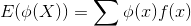
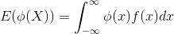
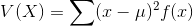

# 확률 변수(Random variable)

- 확률 변수와 확률 분포

## 확률 변수와 확률 분포

- 확률적으로 움직이는 양(변수), 또한, 그 값이 출현하는 모양을 나타낼 수 있으면 좋음
  - 확률 변수
  - 확률 분포
- 용어
  - 난수
    - 0에서 9까지의 숫자에서, 일어날 확률이 같은 것이 이론적으로 보증되었을 때, 그 나온 숫자를 난수(random number, random digits)라고 함
  - 확률변수(random variable)
    - **변수가 갖는 각 값에 대응하여 각각의 확률이 주어진 변수를 확률 변수라 함**
    - X로 나타냄
    - 사실상 함수에 가까움
    - 예시
      - 주사위를 던졌을 때, 나온 눈 X는 확률변수임
      - `P(X=1) = 1/6, P(X=2) = 1/6 ...`
      - 일반적으로는 `P(X=1)=p1, P(X=2)=p2, ... P(X=6)=p6`
        - `p1 >= 0, p2 >= 0, .... p6 >= 0`, `p1 + p2 + ... + p6 = 1`
      - 주사위를 두번 던졌을 때, 나오는 눈 X1, X2를 합한것 X1+X2 역시 확률변수
  - 확률 분포
    - 값의 확률 `P(X=xk) = f(xk) (k=1, 2, ...)` 을 X의 확률 분포 라고 함

---

- 이산 확률변수의 확률분포
  - 이산형(discrete type) 확률 변수(random variable)
    - 확률변수 X가 가산집합 `{x1, x2, ...}` 안에서 값을 갖는 경우
  - 이산형 확률 분포
    - 위의 f함수를 이산형 확률분포 라고 함
    - 확률의 "질량"의 분포의 모양을 나타냄
      - 확률 질량 함수
    - e.g
      - 이항분포
      - 포아슨 분포
      - 초기하분포

---

- 연속형 확률변수(continuous type)의 확률분포(random variable)
  - 연속 확률 변수
    - 확률변수 X가 적절한 구간 내의 모든 값을 취하는 경우
    - 확률을`P(X=x)`로 표기할 수 없음
  - 연속 확률 분포
    - 위의 f함수를 X의 확률 밀도 함수 라고 함
    - e.g
      - 정규분포
      - 지수분포(exponential distribution)
        - 기다리는 시간
        - 전구의 수명
        - 재해가 일어나기 까지의 시간
        - 우연적 요인에 지배되는 경우에 사용
      - 연속형 균등 분포(uniform distribution)
        - `f(x) = 1 (0 <= x <= 1), 0 (x<0, x>1)`
        - 구간 `[0, 1]`에서의 균등난수
    - 확률 밀도
      - 확률을 구하기 위한 길이 델타x에 곱해야 하는 "밀도" 라는 의미
      - f(x)가 큰 장소에서는 확률이 "진하게" 있다는 것을 나타내는 것
      - `P(X=a) = 0` (한 점의 확률은 0)
    - 확률변수 X가 확률분포 f(x)를 갖을 경우, X는 f(x)에 "따른다" 라고 한다.

---

- 누적 분포 함수
  - 확률변수의 어떠한 값 이하의 확률이 필요한 경우
  - 예시
    - 비행기의 안전성을 생각할 경우, 현실의 적재중량 X가 최대 안전값보다 낮은 경우의 확률은 그 비행기의 안전확률이 됨

---

- 최빈값(mode)와 중앙값(median)
  - 확률분포에서 특히 중요한 것은 그 분포를 대표하는 값
  - mode
    - f(x)를 최대로하는 x = x0 이며, 그 값이 가장 나올 확률이 높다라는 의미로 확률분포를 대표함
  - median
    - xm
    - P(X<=xm) = 1/2라는 의미에서 딱 중간의 값
  - 기대값(expected value)
    - 뒤에 설명

## 확률 변수의 기대값과 분산

확률변수 X 이산형

확률변수 X 연속형

확률변수 X의 함수의 이산형

확률변수 X의 함수의 연속형

- 기댓값
  - **얻을 수 있을 것같은 객관적인 예상값**
  - 어떤 확률 과정을 무한히 반복했을 때 얻을 수 있는 값들의 평균으로 기대하는 값
    - 동전을 4번 던졌을 때, 평균적으로 앞면이 몇 번 정도 나올까?
  - 계산
    - 일반적으로, 확률변수 X에 대하여 그것이 취할 수 있는 값에 확률을 곱하고 각각 더하여 구함
  - 특성
    - 하나의 정수
    - 무한합, 적분으로 구하므로, 존재하지 않는 경우도 있음
    - 확률분포의 대략적인 위치를 나타내는 지표
- 평균 vs 기댓값
  - 평균
    - 이미 나와있는 정확한 자료에 대해 그 값을 모두 더하여 도수로 나눈 값
  - 기댓값
    - 주어진 사상에 대한 확률을 반영하는 시행에 대하여 평균으로 기대하는 값
    - 重心(o), 中心(x)
- 기댓값의 성질
  - `E(c) = c`
  - `E(X+c) = E(X) + c`
  - `E(cX) = cE(X)`
  - `E(X+Y) = E(X) + E(Y)`
    - 주사위를 두개 던졌을 떄의 합을 확률변수로 두었을때의 기댓값

---

확률변수 X의 분산 식

이산적 확률변수 X의 분산

연속적 확률변수 X의 분산

계산하기 쉬운 식

- 분산
  - 예시
    - 주사위 1개를 굴렸을때 나타나는 눈의 값의 기댓값은 3.5, 주사위 2개를 굴렸을때, 두 값의 산술평균이 나타내는 기댓값은 3.5. 하지만, 둘의 확률 분포는 매우 다르다.
  - **값이 어떻게 분포하는지 나타내는 값**
- 표준편차
  - 분산의 루트값
  - 2승한것을 다시 루트값을 씌우므로, X와 같은 차원을 갖음
- 분산의 성질
  - `V(c) = 0`
  - `V(X + c) = V(X)`
  - `V(cX) = c^2 * V(X)`

---

- 표준화
  - 어떠한 확률변수도, 그 기대값을 빼고, 또한 표준편차로 나누면, 기대값은 0으로, 분산은 1로 조정됨
  - 활용
    - 확률변수의 다른 성질(수속)을 볼 수 있음
    - **다른 확률변수와의 비교 가능**

## 모멘트와 모멘트 모계수

- 확률분포의 모양
  - 확률분포의 모양은 매우 중요한 의미나 정보를 갖고 있음
  - 여기서, 확률변수의 기대값과 분산으로 어느정도 확률분포의 모양을 알 수 있으나, 완벽하게 안다고 할 수 없음
    - 비대칭일 수 있음(어느쪽으로 비뚤어 졌는지 나타낼 필요가 있음)
    - 탑처럼 뾰족할 수 있음
- 왜도와 첨도
  - 왜도(skewness)
    - 확률변수의 비대칭성
  - 첨도(kurtosis)
    - 3보다 크면 정규분포보다 더 뾰족하며, 작으면 뭉툭하다고 생각
