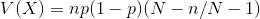

# 확률 분포

**항상 어떤 사상이 확률 번수가 되는지 의식하자.**

*확률 분포의 기댓값과 분산의 증명 / 그리고 확률 밀도함수나 질량함수의 유도도 직접 해보자*

*확률 분포와 도수분포의 관계는?*

- 이산형 확률분포
  - 초기하분포
  - 이항분포
  - 포아슨분포
  - 기하분포
  - 음이항분포
- 연속형 확률분포
  - 정규분포
  - 지수분포
  - 감마분포
  - 베타분포
  - 코시분포
  - 대수정규분포
  - 파레트분포
  - 와이블분포

## 이산형 확률분포

### 초기하분포(hypergeometric distribution)

확률 변수

두 종류의 A, B를 갖는 N개의 어떤 물체가 있는데, 개수의 구성은 각각 M, N-M개로 둠. 이 집단으로 부터 무작위로 n개를 추출할 경우, A가 x개 추출되는 것

확률 질량 함수

`f(x) = MCx * (N-M)C(n-x) / NCn`, `x=Max(0, n-(N-M)), ...., Min(n, M)`

기댓값

분산

- 두 종류의 A, B를 갖는 N개의 어떤 물체가 있음, 개수의 구성은 각각 M, N-M개로 둠. 이 집단으로 부터 무작위로 n개를 추출할 경우, A가 x개, B가 n-x개 라고 한다면, x의 최소값은 0(n < N-M의 경우)혹은 n - (N - M) (n >= N - M의 경우) 이며, 최댓값은 n(n < M의 경우) 혹은 M (n >= M 의 경우) 이다.
  - 이때, 위와같이 n개 추출에서 A가 x개가 될 확률은, `f(x) = MCx * (N-M)C(n-x) / NCn`, `x=Max(0, n-(N-M)), ...., Min(n, M)`
  - 이러한 확률분포를 초기하분포라고 함
    - 이것이 왜 확률분포가 되는지는 `(1+t)^M * (1+t)^(N-M) = (1+t)^N`의 n번째 계수를 x를 이용해서 구하면 됨
- 특징
  - 비복원 추출
    - 복원추출인 경우, 단순 이항분포가됨
- 확률변수의 기댓값, 분산
  - `E(X) = n(M/N) = np`
  - `V(X) = n{M(N-M)/N^2}{(N-n)/(N-1)} = np(1-p){(N-n)/N-1}`
    - N이 무한히 크면, 이항분포의 경우와 일치함
    - **증명이 재미있음**

### 이항분포(binomial distribution)

확률 변수

N번의 독립 베르누이 시행에서 S가 X회 나올 때, 그 X

확률 질량 함수

이항분포가 확률분포인 것의 증명

이항분포의 표현

이항분포의 기댓값

이항분포의 분산

증명이 재미있음

- 베르누이 시행
  - 두 종류의 가능한 결과(성공 S, 실패 F)를 발생시키는 실험이나, 관찰.
- 이항분포
  - 베르누이 시행에서 나온 확률 분포
  - 확률론에서 역사적으로 매우 오래되었고, 정규분포와 포아슨분포의 모양을 확인할 수 있음
- 이항분포 특징
  - 기댓값: p확률로 성공하니까 n번했을 때, 평균적으로 n*p회 성공하게 되는것
  - 분산: p=1/2 일 때, 최대가 되는데, 이는, 어떤 것이 일어날 확률이 1/2 일때, 예측하기 힘든것과 같다.
    - 만일 p=3/4 라면 p확률이 더 높기때문에 예측하기가 나름 쉬울것이다.

### 포아슨 분포(Poisson distribution)

확률 변수

단위 시간이나, 면적, 길이 등에서 어떠한 사상이 나타나는 횟수를 X라고 둘 때, 그 X의 횟수(독립 베르누이 시행에서 n이 무한히 커지고, p가 0으로 수렴할때의 분포)

확률 질량 함수

포아슨분포가 확률분포인 것의 증명

포아슨분포의 기댓값

포아슨분포의 분산

- 포아슨 분포
  - 이항 분포에서 n이 충분히 크고(즉, 대량의 관찰), p가 작을 경우(즉, 매우 희소한 현상), 두 경향에 의하여, 많지는 않지만 어느정도의 사상 x가 일어나는 것이 관찰된다.
    - 부동산 계약성립에 도달하는 확률(p=0.002)과 신청횟수(n=1000) 가 있을 때, 계약 성립이 3건이 될 확률은 1000C3 * p^3 * (1-p)^997
    - E(X) = np = 2
  - 단위 시간 / 단위 거리 / 단위 면적 / 단위 체적 안에 어떤 사건이 몇 번 발생할 것인가
  - 소수의 법칙에 적합한 사상의 확률 분포
  - 조건
    - 어떤 구간은 더 짧은 작은 단위의 구간으로 나눌 수 있고, 이 구간에서 어떤 사건이 발생할 확률은 전체 척도 중에서 항상 일정해야 함
    - 단위 구간 당 사상은 독립적으로 발생함
    - 단위 구간 당 사상이 일어날 확률은 시간의 흐름에 따라서 변하지 않음
    - 특정 구간에서의 사건 발생확률은 그 구간의 크기에 비례한다.
  - 예시
    - 하루동안의 교통사고건수
    - 대량생산의 불량품수
    - 파산건수
    - 화재건수
    - 포탄명중수
    - 유전자 돌연변이수
    - 안전관련 현상
    - 15초간 고속도로 톨게이트에 차가 몇대나 지나갈 것인가
    - 세계 2차대전 독일군에 의한 런던 폭격의 명중 수(0.25km^2 단위로)
- 포아슨 분포의 응용
  - 현실 사상이 발생될 확률의 근사를 위해서 사용됨
  - 확률 변수가 포아슨 분포를 따르는지 확인하는 것은 어려울 수 있음
- 포아슨 소수의 법칙(Poisson's law of small numbers)
  - np -> lambda가 되도록 n->무한대, p->0이 되는 극한에서는, 각 x에 대하여 `nCx*p^x*(1-p)^(n-x) -> e^(-lambda)*(lambda^x)/x!`이 성립함

### 기하 분포(Geometric distribution)

확률 변수

독립 베르누이 시행에서, 어떤 S가 나온 뒤에, 계속해서 베르누이 시행을 행해서 다시 S가 나올때, 그 다시 S가 나올때 까지 시행한 횟수 X

확률 질량 함수

기댓값

분산

- 기하분포
  - 베르누이 시행을 다른 관점에서 생각
  - 시행 횟수를 미리 결정하지 않고, 처음 성공 S가 출현할 때 까지 계속 시행.
  - **처음 S가 나올 때 까지 총 시행 횟수를 확률 변수 x로 둠**
  - 예시
    - 시간을 1, 2, 3 ... 등으로 이산적으로 생각할 때, 처음으로 S를 얻을 때 까지 기다리는 시간의 길이의 확률분포
      - 이산적 기다리는 시간 분포(waiting time distribution)
    - 어떤 풍수재해는 1년동안 일어날 확률이 0.04이면, 이것이 일어나는 것은 평균적으로 몇년후인가? 또한, 10년 이내에 일어나는 확률은 어느정도인가?
      - 재해의 확률이 매우 작다고 해도, 언제든지 충분히 일어날 수 있는 확률이 존재함
      - 표준편차가 매우 크다.
- 기하분포의 특성
  - 기댓값이 `1/p`가 되는것은, 예를들어, 확률이 `1/50`일때, 그 역수는 50, 즉, 50번은 시행해야지 S가 한 번 나온다는 것을 직관적으로 의미
  - `P(X=1)`일때, 언제나 최대값을 갖음(모든 사건이 독립이기 떄문에 그럼)
- c.f
  - 어떤 것이 일어난 횟수를 세는 것에 의해 생기는 데이터를 계수형(計数型)이라고 부름
    - 예를들어, 불량품의 개수, 교통사고의 건수 등
  - 애초에 "불량품이란 무엇인가", "교통사고란 무엇인가"를 미리 정의해두는 것은 모집단을 정하는 것과 함께 매우 중요함

### 음이항 분포(Negative binomial distribution)

확률 변수

독립 베르누이 시행에서 k번째의 성공을 얻을 때 까지 실패한 횟수

음이항분포 확률 질량 함수

기댓값

분산

- 음이항 분포
  - k번째의 성공을 얻을 때 까지 실패 횟수를 확률변수 x로 두었을 때의 분포
- 특성
  - 처음 성공을 얻을 때 까지의 실패 횟수를 확률변수 x로 두었을 때의 분포의 기댓값과 분산을 각각 k배 하면 음이항 분포의 기댓값과 분산을 구할 수 있음

### 이산형 균일분포(Uniform distribution of discrete type)

확률 변수

일어날 확률이 모두 같고, 합이 1인 경우의 사상 X

확률 질량 함수

`1/N, x = 1, 2, ..., N`

기댓값

분산

- 이산형 균일분포
  - 시행에 대한 표본 사상의 모든 표본점이 같은 확률을 갖는 확률 분포
  - 예시
    - 주사위를 던졌을 때 나온 눈을 확률변수 X로 둔 확률분포

## 연속형 확률분포

### 정규분포(normal distribution / Gaussian distribution)

확률 변수

정규분포의 확률 밀도함수를 확률로 갖는 확률 변수 집합

확률 밀도 함수

확률 분포임을 증명

기댓값

분산

표준 정규분포의 누적 분포함수

- 정규분포
  - `X ~ N(mu, sigma^2)`
  - 가우스의 오차이론에서의 **오차 함수** 가 현대의 정규분포의 기원
  - 정규
    - 흔한, 보통의 의미를 갖고있음
  - 생각보다 완전히 정규분포를 따르는 사상은 많지 않음
  - 예시
    - 측정오차가 이 분포를 따라서 생긴다고 하므로, 측정이 있는 곳에 거의 정규분포가 관계하고 있음
    - 생물 측정
      - 신장 측정
      - 체중 측정
- 특징
  - 1 X가 정규분포 `N(mu, sigma^2)`를 따를 경우, 그 선형변환 `Y = aX + b`는 `N(au + b, a^2sigma^2)`를 따름
  - 2 독립인 둘 이상의 정규확률변수의 합 및 차는 정규확률변수이다.
    - `X, Y ~ N(u1, sigma1^2), N(u2, sigma2^2)`일 때, `aX+bY ~ N(au1+bu2, a^2sigma1^2+b^2sigma2^2)`
  - 3 표준화변수 `Z = (X - u)/sigma`는 정규분포 `N(0, 1)`을 따른다.
    - **표준 정규분포** (standard normal distribution)
    - 어떤 정규분포의 확률계산도 표준 정규분포에 귀착함
- 중심 극한 정리
  - 동일 확률 분포 f(x)를 갖는 n개의 독립적인 확률 변수의 합 `X1 + X2 + X3 + ... + Xn`은, 원래 `f(x)`가 무엇이었든, 느슨한 가정을 만족한다면, n이 큰 경우 거의 정규분포에 따른다고 가정해도 된다.
  - 예시
    - 주사위의 눈의 합
      - n=4, X1 + X2 + X3 + X4의 확률분포 / 그 평균은 정규분포를 따름

### 지수분포(Exponential distribution)

*이 부분은 5단원 91페이지에 설명이 되어있다. 유튜브에 검색하는 등 자세히 공부해보자*

확률 변수

지수분포의 확률 밀도함수를 확률로 갖는 확률 변수 집합

확률 밀도함수

기댓값

분산

누적 분포 함수

- 지수분포
  - 기다리는 시간 분포
  - `X ~ Exp(lambda)`
  - lambda: 1단위시간당 평균 이벤트 수
  - 예시
    - 고장율이 일정한 시스템의 우발적 고장까지의 기다리는 시간(수명)
    - 내구연수
    - 재해까지의 연수
- 특징
  - `E(X) = D(X)`
    - `E(X) - D(X)`이 0까지 뻗어 있으므로, 지수분포에 의하여 일어날 가능성이 희박한 어떠한 사상은, 충분히 가까운 미래에 일어나도 이상하지 않음
    - **확률이 작은 것과, 먼 미래에만 일어나는 것은 동일하지 않음**
    - 항공기가 이틀 연속 추락하는 것도 충분히 있을 수 있다.

### 감마분포(Gamma distribution)

*미적분 배우고 나서 다시 복습하기*

확률 변수

감마분포의 확률밀도 함수를 갖는 확률 변수의 집합

감마값

확률 밀도 함수

기댓값

분산

- 감마분포
  - 지수분포의 일반화
    - **알파 번 사건이 일어날때까지 걸리는 시간 등**
  - 알파 값 > 0
  - 중요한 부분은 `x^(a-1)e^(-lambda*x)`
  - `Ga(a, lambda)`
  - 예시
    - 체중의 분포
    - 에이즈 잠복기간
- 특징
  - `Ga(1, lambda) = Exp(lambda)`
  - 확률변수 X1, X2, ..., Xn이 독립이며 지수분포 `Exp(lambda)`를 따른다면, X1+X2+X3+ ... + Xa는 감마분포 `Ga(a, lambda)`를 따름
  - 확률 변수 X가 표준정규분포 N(0, 1)을 따를 때, X^2는 감마분포 `Ga(1/2, 1/2)`를 따름. 또한, 감마분포 `Ga(n/2, 1/2)`는 자유도 n의 **x^2(카이제곱)분포** 라고 불림

### 베타 분포(Beta distribution)와 균일 분포

확률 변수

베타분포의 확률 밀도 함수를 갖는 확률 변수의 집합

확률 밀도 함수

베타 함수

적분해서 넓이가 1이 되기 위한 정수

기댓값

분산

- 베타 분포
  - 알파값, 베타값을 조절해서 자유롭게 형태를 고를 수 있음
  - 주관적인 확률을 나타낼 때 쓰면 됨
    - 내가 생각하기에 이 사상이 일어날 확률은 6-4다
      - 기댓값 0.6
      - 알파값 : 베타값 = 6 : 4
  - **베이즈 통계학에서의 역할이 매우 큼**
  - `Be(알파, 베타)`로 표현
- 특징
  - 확률 분포의 형태를 대강 알고있고, 그 형태에 함수를 맞출 때에 이 함수가 사용됨
  - 알파값 = 베타값 = 1 이면, 균일분포

### 코시 분포(Cauchy distribution)

*이 분포의 존재의 의의는?*

확률 변수

코시 분포의 확률 밀도 함수를 따르는 확률 변수의 집합

확률 밀도 함수

기댓값

없음

분산

없음

### 대수정규분포(log-normal distribution)

확률 변수

어떤 확률변수(X)에 로그값을 취한 확률변수가 정규분포를 따르는 경우, 원래 확률변수 X

확률 밀도 함수

기댓값

분산

- 대수정규분포
  - 확률변수의 값이 낮은 곳에서는 확실한 한도가 존재하나, 확률변수의 값이 높은 곳에서 확실한 한도가 존재하지 않는경우
  - 예시
    - 무작위로 세대를 선택하여 그 연간 소득을 확률 변수 X로 두었을 때의, 확률 분포

### 파레트 분포(pareto distribution)

확률 변수

파레트 분포의 확률 밀도 함수를 따르는 확률 변수의 집합

확률 밀도 함수

기댓값

분산

- 파레트 분포
  - x0 이상의 소득의 확률 분포(고소득층의 소득 확률 변수에 대한 확률 분포)

### 와이블분포(Weibul distribution)

확률 변수

와이블 분포의 확률 밀도 함수를 따르는 확률 변수의 집합

확률 밀도 함수

기댓값

분산

- 와이블 분포
  - 어떤 물체의 고장이 우발적 고장이라면, 순간 고장율은 항상 일정한데, 이럴때는 지수분포를 따름
  - 하지만, 현실적으로는 초기 고장 시기에는 순간 고장률이 낮고, 나중에 열화가 진행하여 고장율이 높아질 것임 이러한 내용을 반영한 확률분포가 와이블분포
- 특성
  - 모수 a, b는 각각 척도 모수, 형상모수라고 불림
    - b의 값을 바꾸면 분포의 모양이 변함, b가 크면 정규분포에 가까워짐
  - 확률변수의 분포가 정규분포를 닮았으나, 엄밀하게 정규분포가 아닌 경우의 정밀한 분포 찾기에 사용됨
