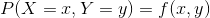
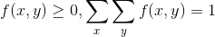
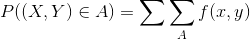
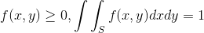
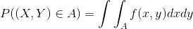
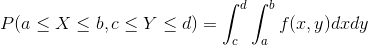

# 다차원 확률 변수

## 동시확률분포와 주변확률분포

### 동시확률분포(Joint probability distribution)

이산형 동시 확률 분포(동시 확률 질량 함수)

필요 조건

임의의 사상 A가 나타날 확률

연속형 동시 확률 분포(동시 확률 밀도 함수)

필요 조건

임의의 사상 A가 나타날 확률

- 동시 확률 분포
  - 확률변수 X, Y를 2차원 벡터로 나타냄 `(X, Y)`
  - 그 확률변수의 벡터 `(X, Y)`에 대한 확률의 매칭(함수)을 동시 확률 분포라 함
  - 2차원 확률 변수의 경우, 사상 역시 2차원 공간 안에 있음
    - 사상이란, (x, y)가 모인 어떤 부분집합

### 주변확률분포(Marginal probability distribution)
