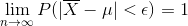
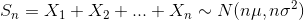
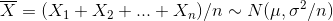
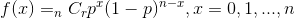

# 큰수의 법칙과 중심 극한 정리

큰 수의 법칙과 중심 극한의 정리는 비슷한 내용이나, 시각이 좀 다른듯?

## 큰수의 법칙

일반적인 공식

> 수학적 확률과 통계적 확률을 이어주는 매우 중요한 법칙

- 큰수의 법칙(law of large numbers)
  - 표본 관측값의 평균은 표본의 크기가 크다면, 진정한 평균(모집단의 평균 혹은 수학적 평균)으로 근사함
  - 베르누이 시행에서는
    - 어떤 시행에서 사건 A가 일어날 수학적 확률이 p이고 n번의 독립시행에서 사건 A가 r번 일어난다고 할 때 임의의 입실론 > 0 에 대하여 `lim P(|r/n - p| < 입실론) = 1` 이다.
    - 베르누이 시행인 경우에는 표본의 평균과 진정한 모집단의 평균이 우연히 확률이 되어버린 것
    - **표본 수가 많을 수록 실사건의 확률이 통계적 예측에서, 오차가 줄어간다**
  - 확률 수속(converge in probability)
  - 강한 큰 수의 법칙과 약한 큰 수의 법칙이 있음

### 진정한 값의 집중

- 베르누이 시행
  - 1회의 실험에 2종류의 사상 중 하나가 나타나며, 그러한 사상들이 일어날 확률이 항상 일정한 시행
- 동전 던지기의 예시
  - 10회 토스
    - 올바른 동전을 10번 던지는 경우에서, i번쨰 코인이 앞면이 나오면 1, 뒷면이 나오면 0, 그리고 그것을 xi라고 둠(이미 실현이 되어서 대문자가 아님)
    - r = x1 + x2 + ... + x10
      - r: 10번 동전을 던져서 앞면이 나오는 횟수(확률 변수)
      - `r/n`는 상대도수
      - `r ~ Bi(10, 0.5)`
    - f10(x) = 10Cx(1/2)^10, x = 0, 1, 2, ... 10
      - E(r) = np = 5
      - V(r) = np(1-p) = 2.5
      - E(r/n) = p
      - V(r/n) = p(1-p)/n = 0.025
    - **p = 0.5 는 진정한 성공률**
      - 베르누이 시행에서는 모평균이 이론적 확률(p), 표본은 시행적 확률(X1 + X2 + ... + Xn/n)을 **우연히** 의미하게 됨
    - 10번 시행했을 경우에는, 0.5및 그 주위의 발생확률이 높으나, 아직도 0.2이하 및 0.8이상에도 11%가까이의 확률이 존재
  - 여기서 n을 매우 크게 해보자
    - 분산이 매우매우 작아짐
    - `P(0.4 <= r/100 <= 0.6) = 0.9678`
    - `P(|r/n - 0.5| <= 0.1) -> 1`
    - `P(|r/n - 0.5| <= 입실론(매우 작은 수)) -> 1`
- 큰수의 법칙(law of large numbers)
  - 표본 관측값의 평균은 표본의 크기가 크다면, 진정한 평균(모집단의 평균 혹은 수학적 평균)으로 근사함
  - 베르누이 시행에서는
    - 어떤 시행에서 사건 A가 일어날 수학적 확률이 p이고 n번의 독립시행에서 사건 A가 r번 일어난다고 할 때 임의의 입실론 > 0 에 대하여 `lim P(|r/n - p| < 입실론) = 1` 이다.
    - 베르누이 시행인 경우에는 표본의 평균과 진정한 모집단의 평균이 우연히 확률이 되어버린 것
    - **표본 수가 많을 수록 실사건의 확률이 통계적 예측에서, 오차가 줄어간다**
  - 확률 수속(converge in probability)
  - 강한 큰 수의 법칙과 약한 큰 수의 법칙이 있음
- 큰수의 법칙 예시
  - 야구에서의 규정 타석수, 규정 투구수
    - 관측된 수치가 진정한 값(모수)라는 것을 보증하기 위함
    - 타율, 방어율
  - DTD
    - 승률
  - 카지노의 룰렛
    - 카지노는 수천 수억판을 돌리므로, 아무리 룰렛의 승률이 50에 살짝 못미치게 근접한다 하더라도 결국에는 카지노측이 이득을 볼 수 밖에 없음
    - 승률
  - 갤럽 조사
    - 지지율 등
  - 암호화폐의 화폐별 송금 시간
    - 관측된 송금 시간의 개수 n이 충분이 크면, 관측된 송금 시간의 기댓값이 실제 모집단의 송금시간(거래소별)의 기댓값에 가까워짐
    - 여기서 그치지말고, 중심 극한 정리를 이용해서 모집단의 송금 시간의 기댓값의 범위를 통계적 추측을 이용해서 구할 수 있다.
- 큰수의 법칙 의의
  - 베르누이 시행의 경우
    - 시행 횟수 n을 늘려가면, 현실에서 관측된 출현율(표본에서의 출현율)이 원래의 집단(모집단)에 있어서의 출현율(모출현율)p에 가까워짐
  - 충분히 큰 표본을 조사한다면, 모집단의 다양한 특성을 매우 정확하게 아는 것이 가능함
    - 통계적 추측
  - 큰 표본에서는 관측된 표본평균을 모집단의 모평균으로 간주해도 좋음

## 중심 극한 정리

*중심 극한 정리가 이항분포에서 어떻게 실현되는지 아직 감이 좀 잘 안잡힘*

*무작위로 추출된 표본 집합의 원소 하나하나는 모집단의 분포를 따르는 확률변수인가? >> 그렇다 >> 왜 그런가?*

1. 무작위 추출된 표본의 집합의 원소(구체적인 값이 정해지지 않았으므로 X1, X2, ... Xn)는 각각 모집단의 확률분포를 따름.
2. 실제로 무작위 추출된 구체적인 표본이 존재하는 경우, 그 표본 집단의 기댓값은 n이 커지면 커질 수록, 대수의 법칙에 의해서 모집단의 기댓값에 가까워지고, 중심극한정리에 의해서 표본 집단의 기댓값은 N(모집단의 평균, 모집단의 표본편차^2/n)를 따르게 됨. 그 표본집단의 기댓값은 중심 극한정리에 의해 해당 정규분포를 따르는 확률 변수 중 하나가 되는 것임

- 정의
  - 모집단이 어떠한 분포를 갖던, 서로 독립인 표본의 합(X1 + X2 + X3 ... )의 분포의 형태는, n이 클 경우, 대략 정규분포라고 생각할 수 있음
  - 모멘트 도함수를 이용해서 증명 가능
- 특성
  - 원래부터 모집단이 좌우 대칭인 확률 분포는 비대칭인 확률분포보다 훨씬 빠르게 표본 확률변수의 합이 정규분포가 된다.

## 중심 극한 정리의 응용

### 1. 이항분포의 정규분포에 의한 근사

- 원리
  - 이항분포의 성공 횟수 S는 각각 이항분포 Bi(1, p)를 따르는 확률변수 X1, X2, ..., Xn의 합 S = X1 + X2 + ... + Xn 으로 이루어짐
    - `S ~ Bi(n, p) ~~ N(np, np(1-p)), n이 매우 클 경우`
  - `z = S-np/root(np(1-p))`
    - 표준 정규분포로 근사
  - `P(k<=S<=k') = P(k-np/root(np(1-p)) <= z <= k'-np/root(np(1-p))) == Pi(..) - Pi(..)`
- 이항분포의 근사 필요 조건
  - `np > 5`
  - `n(1-p) > 5`
- 예시
  - 4만번의 코인을 던져서 20400번 이상 혹은 19600번 이하 앞면이 나올 경우는 어느정도의 확률인가?

### 2. 정규난수의 발생

- 범위가 0 ~ 1인 연속 균등 분포난수(r1, ... rn)를 충분히 큰 개수(n) 추출한다.
  - `r1 + r2 + ... + rn ~ N(1/2 * n, 1/12 * n)`
- 위의 난수의 합을 정규화 한다
  - 확률변수 z를 구함
- 확률변수 z에서 역으로 기댓값이 mu이고 분산이 sigma^2 인 정규분포를 따르는 확률 변수 x를 구함
- mu, sigma, n을 정하고, 연속 균등분포 난수를 n개 구하고 더해서 앞서 구한 x의 값을 구하면 그것이 정규난수이다.

## 큰 수의 법칙 vs 중심 극한 정리

- 큰 수의 법칙
  - 표본 관측값의 평균은 표본의 크기가 크다면, 진정한 평균(모집단의 평균 혹은 수학적 평균)으로 근사함
  - **베르누이 분포에서는**
    - n번 시행했다 => n개의 표본을 추출했다
    - `모집단 ~ Bi(1, p)`
    - `표본의 합 ~ Bi(n, p), n은 표본의 크기`
    - 표본의 크기가 크다면, 현실에서 관측한 출현율이, 모집단에서의 출현율(진실된 통계량) 혹은 수학적 출현율(혹은 확률)에 근사됨 (이데아 = 수학적 / 모집단에서의 출현율, 현실세계 = 현실에서 관측한 출현율)
      - 이항분포는 수학적으로 알려진 출현율이 존재
      - 야구의 타율은 모집단에서의 진실된 출현율이 존재
    - 여기서 출현율은 베르누이 시행인 경우에 우연히 확률이 되어버린 것. 만일, 시험 점수를 확률 변수로 생각해서 큰 수의 법칙을 적용한다면, `E(bar X) = mu, V(bar V) = sigma^2/n`
- 중심 극한 정리
  - 모집단이 어떠한 분포를 갖던, 표본의 합(X1 + X2 + X3 ... )의 분포의 형태는, n이 클 경우, 대략 정규분포라고 생각해도 됨
  - `표본의 합 ~ N(n*mu, n*sigma^2)`
  - `표본의 평균 ~ N(mu, sigma^2/n)`
  - **베르누이 분포에서는**
    - `모집단 ~ Bi(1, p)`
    - `표본의 합 ~ Bi(n, p) ~~ N(np, np(1-p)), n은 표본의 크기`
