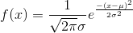
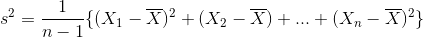
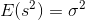
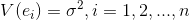
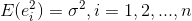
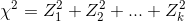
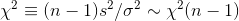
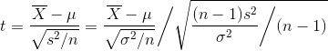
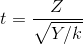
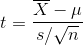

# 정규분포로부터의 표본

카이제곱 분포, t분포, F분포

*카이제곱 분포와 유래란?, 자유도란?*

*표본 평균과 표본 분산(불편분산)은 독립?*

- 자유도란
  - 수학, 물리학, 화학에서는 어떤 물체의 운동을 설명하기 위해 필요한 변수의 개수라고 생각
- 통계학에서는 아래와 같이 정의
  - The number of degrees of freedom is the number of values in the final calculation of a statistic that are free to vary
  - 변인의 수(자유로이 움직일 수 있는 변수) - 제약
    - 불편분산에서 자유도가 n-1인 이유는, 내가 가진 정보의 수는 n이고, 추정해야할 미지수는 모집단 평균 1개가 되므로 n-1
    - sum(표본 - 표본 평균) === 0
      - 여기서 마지막 (표본 - 표본평균)은 이전 값이 정해지면 자동으로 정해짐(항등식에 의해서 - 제약)

## 배경

- 정규모집단으로부터 표본 X1, X2, ..., Xn에 기초한 통계량의 표본분포를 계산하 것이 필요하게되나, 이 계산을 하는 것이 정규표본론임

### 관측, 측정, 측정오차

- 하나의 연필의 길이를 측정하는 것을 행함
  - n번 관측하고, 각 측정값은 서로 독립이며, 연필 그자체와 측정조건 자체가 동일하게 유지되도록 측정하는 것을 생각하여 X1, X2, ... Xn을 표본 이라 하고, 그것을 야기하는 것을 모집단이라 함
  - `Xi = 진정한 값(시그널 = mu) + 오차(노이즈 = e)`
  - 오차는 무엇이 나올지모르는 무작위 변수라고 생각하는 것이 타당
  - 모두 같은 표본 분포를 따르고 각 오차는 독립임
  - 가우스는 `ei ~ N(0, 1)`를 따른다고 생각했음
    - 즉, 오차는 확률변수이며, 양의값 음의값도 있고, 평균은 0이고, 정확도가 높은 측정에서는 오차의 분산 sigma^2이 작고, 나쁜 측정에서는 sigma^2이 큼
  - 위의 오차의 분포에서 + mu 를 하면 Xi의 확률분포가 됨
    - `Xi ~ N(mu, sigma^2)`
  - 모든 측정에는 위와같은 구조를 이용함

## 정규분포의 성질

정규분포(Gaussian distribution)

- 정규분포(가우스 분포) 성질
  - 모수(parameter)는 평균과 분산
  - 평균 = 중앙값 = 최빈값
  - 정규분포를 따르는 확률변수를 정규확률변수, 가우스 확률변수라 함
- 통계 분석에서 왜 정규 분포를 가정하는가?
  - 1 신장의 분포나 실험 오차의 분포등 분석대상이 되는 **현상들이 정규분포로 표현** 되는 경우가 많음
  - 2 체중이나 소득분포와 같은 **변수의 변환으로 인하여 정규분포로 나타내는 것이 가능** 한경우도 많음
    - log변환
  - 3 표본 평균등의 많은 통계량은, 확률변수의 합의 형태가 되어있는 경우가 많은데, 이러한 통계량의 표본분포는 **중심극한정리** 에 의하여 점근적으로 정규분포가 되며, 그 표본분포는 정규모집단의 경우의 결과를 근사적으로 그대로 사용할 수 있음
  - 4 **독립 정규확률변수의 합은 정규확률변수** 이고, 수학적인 처리가 용이하고 표본분포를 정확하게 구할 수 있음
  - 5 정규확률변수의 선형변환은 정규확률변수임
    - `X ~ N(mu, sigma^2)`
    - `aX+b ~ N(amu + b, a^2sigma^2)`
  - 6 독립인 두 정규확률변수의 합 및 차는 정규확률변수임
    - `X ~ N(mu1, sigma1^2), Y ~ N(mu2, sigma2^2)`
    - `aX + bY ~ N(amu1 + bmu2, a^2sigma1^2 + b^2sigma2^2)`

### 표준정규분포

확률 밀도 함수

누적 분포 함수(가우스 오차 적분, erf(z))

표준화 변수

- `mu = 0, sigma^2 = 1`

## 분산을 이미 아는경우의 표본평균의 표본분포

- 표본평균 X bar는 확률변수 X1, X2, ..., Xn의 합을 n으로 나눈 것
  - X1, X2, ..., Xn는 모집단 분포와 동일한 분포를 따르는 독립적인 확률변수
- 그렇기 때문에 X bar역시 정규분포임 `X bar ~ N(mu, sigma^2/n)`
  - 표준화 하면 `Z = (X bar - mu) / (sigma / root(n)) ~ N(0, 1)`
    - 여기서 sigma^2의 값만 안다면, X bar의 표본분포는 결국 표준 정규분포 N(0, 1)를 보는것으로 귀속됨
  - 이 N(0, 1)에 있어서 그 점 보다 위의 확률이 100a%가 되는 점을 퍼센트점이라고 부르며, Za라고 나타냄
- X bar의 표준편차는 sigma/root(n)
  - n이 증가하면 X bar는 mu의 보다 정확한 추정값이 됨
  - 측정오차는 1/root(n) 단위로밖에 감소하지 않음 즉, 정확도를 2배증가시키려면 n은 4배로 증가시켜야 함
- **X bar역시 정규분포가 되고, 분산이 작아져서 단독 Xi보다도 나은 측정값임**
  - 단독의 경우보다 측정의 정확성을 높이는 의미를 갖음
  - 기하평균은 정확성을 높이는 성질은 없음

## 표본분산의 표본분포

표본 분산

표본 분산의 기댓값

- 정규모집단을 가정하면, 표본 분산 s^2의 표본분포를 구할 수 있음
  - 그것을 알 수 있으면, 모분산 sigma^2에 대해서 다양한 통계적 추측을 시행할 수 있음
- 측정 오차의 예시
  - 측정오차의 분산 sigma^2가 알려지지 않은 상태인데, 각 측정오차의 분산의 크기가 sigma^2이라는 사실은 알고 있음

각 측정 오차의 분산

각 측정 오차의 분산으로부터

- *`e1^2 + e2^2 + ... + en^2`이 표본분산 s^2의 표본분포를 구하는 기초적인 통계량이 됨*
  - 왜지?
- 일반적으로 `e1, e2, ..., en`은 독립이고 정규분포 `N(0, sigma^2)`을 따르나, sigma = 1로 표준정규분포를 가정하면 충분함

### 카이제곱 분포

Z1, Z2, ..., Zk를 독립인, 표준정규분포 N(0, 1)를 따르는 확률변수라고 하자.

자유도 k인 x^2(카이제곱) 분포

증명은 설명은 불편분산 공식에서 참고할 수 있음(표본평균 대신 mu로 치환했다고 생각)

- 카이제곱 분포
  - 표준졍규분를 따르는 확률변수를 제곱한 확률변수의 분포
  - 정규표본론에서 표본분산을 다룰때에는 반드시 관계되는 확률분포임
  - 자유도 k의 카이제곱분포의 상측확률이 a가 되는 값을 xa^2(k)라고 쓰며, 상측확률 100a%의 퍼센트점이라고 부름
  - **통계량인 표본분산 s^2의 확률분포를 구할 때 사용됨**
- 응용 예시
  - 어떤 정규모집단은 모평균이 mu = 50, 모분산이 sigma^2 = 25라고 하자. 여기서부터 표본 n = 10을 추출할 때, 표본분산 s^2이 50을 넘을 확률은 어느정도인가?
    - 부등식 s^2 > 50을 chi^2 = (n-1)s^2/sigma^2 형태로 변형
    -  `P(s^2 > 50) = P(chi^2 > 9 * 50 / 25) = P(chi^2 > 18) = 0.038 (자유도 = 9)`

## 모집단의 분산이 알려지지 않았을 경우의 표본평균의 표본분포

- 현실적으로 모평균을 모를 때, 모분산을 알고있을 가능성이 매우 낮음
  - sigma^2 대신에 s^2를 사용하는 방법을 고안

t 분포

- t분포의 구성
  - *X bar와 s^2는 서로 독립*
    - 정규분포의 밀도함수의 계산으로부터 증명 가능
  - 그러므로, t밀도함수는 `N(0, 1)`과 `chi^2(n-1)`의 조합으로 구할 수 있음
- t분포
  - Z는 표준정규분포를 따름
  - Y는 자유도 k의 카이제곱분포를 따름
  - Z와 Y는 독립임

자유도 k의 t분포(스튜던트 t분포)

t의 통계량

- 표현
  - `t(k)`
  - 위의 t의 통계량은 자유도가 n-1인 t(n-1)에 따름
  - s/sqrt(n)을 표본평균의 표준오차(standard error)라 함
- 특성
  - x = 0을 기준으로 좌우대칭
  - k가 30이상으로 충분히 클 경우, 표준정규분포와 거의 다르지 않음
    - k가 무한대일 경우, N(0, 1)과 일치함
    - 이는, 자유도 k의 카이제곱분포의 평균이 k이므로, Y/k가 k가 클 경우 대수의 법칙에 의하여 거의 1에 가깝게 되기 때문
    - 혹은, 큰 표본(n->무한대)인 경우는, 표본과 모집단의 구별이 없어지므로 s^2 ~ sigma^2가 되기 때문
  - **t분포는 작은 표본의 엄밀한 표본분포라고 생각할 수 있음**
  - t(k)
    - k가 크면 클 수록, 동일 a%에 대해서 퍼센트점은 작아짐
