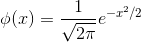

# 정규분포로부터의 표본

카이제곱 분포, t분포, F분포

## 배경

- 정규모집단으로부터 표본 X1, X2, ..., Xn에 기초한 통계량의 표본분포를 계산하 것이 필요하게되나, 이 계산을 하는 것이 정규표본론임

### 관측, 측정, 측정오차

- 하나의 연필의 길이를 측정하는 것을 행함
  - n번 관측하고, 각 측정값은 서로 독립이며, 연필 그자체와 측정조건 자체가 동일하게 유지되도록 측정하는 것을 생각하여 X1, X2, ... Xn을 표본 이라 하고, 그것을 야기하는 것을 모집단이라 함
  - `Xi = 진정한 값(시그널 = mu) + 오차(노이즈 = e)`
  - 오차는 무엇이 나올지모르는 무작위 변수라고 생각하는 것이 타당
  - 모두 같은 표본 분포를 따르고 각 오차는 독립임
  - 가우스는 `ei ~ N(0, 1)`를 따른다고 생각했음
    - 즉, 오차는 확률변수이며, 양의값 음의값도 있고, 평균은 0이고, 정확도가 높은 측정에서는 오차의 분산 sigma^2이 작고, 나쁜 측정에서는 sigma^2이 큼
  - 위의 오차의 분포에서 + mu 를 하면 Xi의 확률분포가 됨
    - `Xi ~ N(mu, sigma^2)`
  - 모든 측정에는 위와같은 구조를 이용함

## 정규분포의 성질

정규분포(Gaussian distribution)

- 정규분포(가우스 분포) 성질
  - 모수(parameter)는 평균과 분산
  - 평균 = 중앙값 = 최빈값
  - 정규분포를 따르는 확률변수를 정규확률변수, 가우스 확률변수라 함
- 통계 분석에서 왜 정규 분포를 가정하는가?
  - 1 신장의 분포나 실험 오차의 분포등 분석대상이 되는 **현상들이 정규분포로 표현** 되는 경우가 많음
  - 2 체중이나 소득분포와 같은 **변수의 변환으로 인하여 정규분포로 나타내는 것이 가능** 한경우도 많음
    - log변환
  - 3 표본 평균등의 많은 통계량은, 확률변수의 합의 형태가 되어있는 경우가 많은데, 이러한 통계량의 표본분포는 **중심극한정리** 에 의하여 점근적으로 정규분포가 되며, 그 표본분포는 정규모집단의 경우의 결과를 근사적으로 그대로 사용할 수 있음
  - 4 **독립 정규확률변수의 합은 정규확률변수** 이고, 수학적인 처리가 용이하고 표본분포를 정확하게 구할 수 있음
  - 5 정규확률변수의 선형변환은 정규확률변수임
    - `X ~ N(mu, sigma^2)`
    - `aX+b ~ N(amu + b, a^2sigma^2)`
  - 6 독립인 두 정규확률변수의 합 및 차는 정규확률변수임
    - `X ~ N(mu1, sigma1^2), Y ~ N(mu2, sigma2^2)`
    - `aX + bY ~ N(amu1 + bmu2, a^2sigma1^2 + b^2sigma2^2)`

### 표준정규분포

확률 밀도 함수

누적 분포 함수(가우스 오차 적분, erf(z))

표준화 변수

- `mu = 0, sigma^2 = 1`

## 분산을 이미 아는경우의 표본평균의 표본분포
