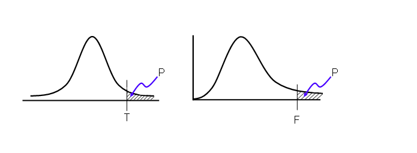
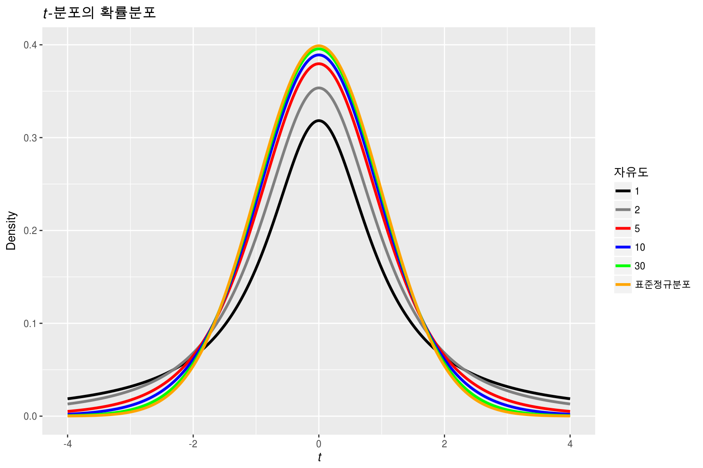

# hypothesis testing(가설 검증)

- 가설 검증의 아이디어
- 에러의 확률과 힘
- t-test와 z-test의 차이
  - z-test란
  - t-test란
  - Case1: Sampling from normally distributed populations with population variances known
  - Case2: Sampling from populations that are not normally distributed & no information about the population
- 참고
  - [수학 이야기 - 표본평균의 분포](https://suhak.tistory.com/entry/%ED%91%9C%EB%B3%B8%ED%8F%89%EA%B7%A0%EC%9D%98-%EB%B6%84%ED%8F%AC)
  - [Hypothesis Testing of the Difference Between Two Population Means](https://www.kean.edu/~fosborne/bstat/07b2means.html)

## 가설 검증의 아이디어

### 가설 검증의 아이디어 기본

- `P(a) = 99%`라고 하자(어떠한 사건 a가 참일 확률이 99%)
  - 이 a라는 사건을 100번 시행했을경우
  - `P(a 100/100)`(100번 시행해서 100번 모두 참인 케이스의 경우의 비율) == 36.6%
  - `P(a 99/100)` == 37.0%
  - `P(a 98/100)` == 19.5%
  - `P(a 97/100)` == 6.0%
  - `P(a 96/100)` == 1.5%
  - `P(a 95/100)` == 0.3%
- 어떠한 가설이 참일 확률이 99%라고 가정하자
  - 결과적으로 그 가설에 대한 시험을 100번 시행했는데, 참인 케이스가 95회
  - 이는 통계적 거짓임
  - 왜냐하면 가설이 참일 확률이 `99%`인데 100번중 95번만이 참이면, 그러한 일이 일어날 확률은 `0.3%`밖에 되지 않음
  - 그 가설은 기각됨
  - 통계적으로는 일정한 경계(threshhold)가 있음
  - **위의 경우 p값이 0.003이었던것임**

### 귀무가설(null hypothesis)와 대립 가설(alternative hypothesis)의 예

- 귀무가설(H0): no difference(일반적으로 원래 그래야 하는 것)
- 대립가설(Ha): difference (놀라운 결과, 뉴스가 되는 것, 의심하는것)
  - 결국은 표본으로 모수(population)을 추정하겠다는 것

### P-값을 비교하는 유의 수준(significance level)

- 유의수준을 먼저 정하자(실험하기 전에)
- p값
  - **귀무가설이 참이라고 했을 때, 귀무 가설을 어느정도 큰 표본으로(횟수) 시행했을 때 같은 결과를 얻을 수 있는 확률**
    - p값이 매우 작으면 귀무가설을 기각할 수 있음
  - 위의 가설 검증의 아이디어와 같음
  - e.g 귀무가설을 이 참일확률이 50%일때, 100번 시행해서 59번이 참인 경우가 등장하면? p값은 0.036
    - 유의 수준(알파) == 0.05
      - 0.036 < 0.05
      - 귀무가설 기각
      - 대립가설 채용(suggest)
    - 유의 수준(알파) == 0.01
      - 0.036 >= 0.01
      - **귀무가설 기각의 실패**
      - **귀무가설 채용(x)**
    - 그래서 유의 수준을 실험 전에 결정하는 것이 매우 중요

- 귀무가설은 위의 그래프의 곡선이라고 생각하면 된다.
- t/f값은 테스트(표본의 검사)에서 주어진 t/f값이 나온 위치이다.
- p값은 귀무가설이 참일때, t값이 나온 경우 실제로 그렇게 되거나 그렇게 될 이상의 확률이다.
- e.g
  - 두 집단의 평균에 유의미한 차가 있는지 없는지 분석하고싶음
  - 유의 수준을 정함(알파값)
  - t-test를 행해서 t값을 구함
    - 즉, 두 집단이 평균의 차가 없다고 생각한 뒤에 샘플의 평균 값의 차가 t값이 되었다.
  - t값에 대한 p값을 구함
    - 즉 두 집단이 평균의 차가 없다고 생각한 뒤에 t값이 될 확률값을 구함 그것이 p값임
  - p값이 앞서 정한 알파값보다 큰지 작은지 확인
    - 크면 귀무가설 기각할 수 없음
    - 작으면 귀무가설 기각 가능함

### 시뮬레이션에서 P-값을 추정(estimating)

## 에러 확률과 힘(Error probabilities and power)

유의 수준에 관한 이야기

- Type1 에러
- Type2 에러

### Type1 에러

- 귀무가설이 참인데 기각한 경우
- `1%`의 유의 수준인 경우 p-값이 `0.5%`일때 보통은 귀무가설은 기각됨
  - 그러나 진짜로 귀무가설을 채용했을 때 `0.5%`의 확률로 그러한 결과가 나올 수 있음
  - 따라서 `0.5%`가 type1 에러가 나올 확률(**p-값이랑 동일**)

### Type2 에러의

- 귀무가설이 거짓인데 기각에 실패한 경우

### 유의 수준 테스트에서의 파워(power)의 소개

- 일종의 확률
- 귀무 가설이 거짓일 떄, 올바른 판단(기각)을 할 확률
  - `Power = P(rejecting H0 | H0 false)`
  - `= 1 - P(not rejecting H0 | H0 false)`
  - `= 1 - P(Type2 error)`
  - Type2 에러를 저지르지 않을 확률
- 파워 상승법
  - 알파(유의수준) 상승 => 파워 상승 => 타입1 에러 확률 상승
  - **표본 크기 상승 => 파워 상승(그래프가 더 폭이 좁아짐)**
      - 이는 항상 바람직함
  - 데이터 다양성(varibility) 저하 => 파워 상승(그래프가 더 폭이 좁아짐)
  - 참 매개변수(true parameter)가 귀무 가설에서의 변수보다 멀리 떨어짐(이는 실험 설계자가 제어할 수 없음) => 파워 상승
- 파워 제어
  - 실험의 특징에 따라서 다른 파워를 두어야 함
  - 어떠한 실험은 Type1 에러에 치명적이고, 어떠한 실험은 Type2 에러에 치명적
    - e.g H0: 수영장의 물의 위생상태는 허용 수준, Ha: 수영장의 물은 허용이 불가능(오염)

## t-test와 z-test의 차이

- z-test는 일반적으로 모집단의 분산을 알고 있을 경우에 사용하는 기법
  - z분포는 언제나 표준정규분포를 따름
- t-test는 모집단의 분산을 모를 경우에 사용하는 기법
  - t분포는 정규화에서 쓰는 모집단의 표준편차 대신, 표본의 표준편차를 사용하므로, 표본의 크기에 따라서 분포가 달라짐
  - 이를 t분포라고 함
  - 표본의 크기가 작을때는 일반 표준정규분포와 큰 차이를보이나, 표본의 크기가 클 때는 표본정규분포와 거의 구분이 없다.

### z-test란

정규분포와 표준화를 통한 검정 방식

### t-test란

t분포를 통한 검정 방식(표준 정규분포와 유사하나, 모분산대신 표본분산 사용, 자유도 존재, 자유도가 크면 클 수록 표준정규분포에 매칭)

#### Case1: Sampling from normally distributed populations with population variances known

- 가설 검증을 위한 알파값 설정
- 두 모집단의 평균의 차를 알기 위해서 각각 random sampling을 하고 각각의 표본 집단을 A, B라고 하자
- 각 표본 집단 A, B의 평균의 분포 역시 정규분포이다. - 정규분포의 성질
- `A의 평균 ~ N(u1, sigma1^2/n1)` `B의 평균 ~ N(u2, sigma2^2/n2)` 의 분포를 따른다. - 정규분포의 성질
- 여기서 두 집단의 평균의 차를 알아보기 위해서 `A의 평균 - B의 평균`의 확률 분포를 알아보자
  - 확률변수인 `A의 평균 - B의 평균`은 역시 정규분포를 따른다. - 정규분포의 성질
  - `A의 평균 - B의 평균 ~ N(u1-u2, sigma1^2/n1 + sigma2^2/n2)` - 확률분포의 기대값, 분산의 성질
- 확률분포(정규분포) `N(u1-u2, sigma1^2/n1 + sigma2^2/n2)`를 표준정규분포로 변환시킴
  - `Z = (A의 평균 - B의 평균) - (u1 - u2) / root(sigma1^2/n1 + sigma2^2/n2)` - 확률분포의 변형
- 귀무가설 H0: u1 = u2 로 둔다.
  - 대립가설 H1: u1 != u2
- Z값을 구한다
- Z값이 알파값에 해당하는 범위보다 바깥쪽에 있으면 귀무가설을 기각하고, 대립가설 채택

#### Case2: Sampling from populations that are not normally distributed & no information about population

- 가설 검증을 위한 알파값 설정
- 두 모집단의 평균의 차를 알기 위해서 충분히 큰 표본 크기(n1, n2 >= 30)의 random sampling을 하고 각각의 표본 집단을 A, B라고 하자
- 각 표본 집단 A, B의 평균의 분포 역시 정규분포이다. - 중심 극한정리
- `A의 평균 ~ N(u1, sigma1^2/n1)` `B의 평균 ~ N(u2, sigma2^2/n2)` 의 분포를 따른다. - 정규분포의 성질
- 여기서 두 집단의 평균의 차를 알아보기 위해서 `A의 평균 - B의 평균`의 확률 분포를 알아보자
  - 확률변수인 `A의 평균 - B의 평균`은 역시 정규분포를 따른다. - 정규분포의 성질
  - `A의 평균 - B의 평균 ~ N(u1-u2, sigma1^2/n1 + sigma2^2/n2)` - 확률분포의 기대값, 분산의 성질
- 확률분포(정규분포) `N(u1-u2, sigma1^2/n1 + sigma2^2/n2)`를 표준정규분포로 변환시킴
  - `Z = (A의 평균 - B의 평균) - (u1 - u2) / root(sigma1^2/n1 + sigma2^2/n2)` - 확률분포의 변형
  - 여기서 우리는 모집단의 표준편차를 모르므로, 충분히 큰 표본 크기 (n1, n2 >= 30)에 대해서는 sigma1, sigma2를 각각 표본분산 s1, s2로 변환한다.(오차발생)
- Z분포로 오류가 큰 분석
  - 귀무가설 H0: u1 = u2 로 둔다.
    - 대립가설 H1: u1 != u2
  - 그대로 Z값을 구한다
  - Z값이 Z분포에 있어서 알파값에 해당하는 범위보다 바깥쪽에 있으면 귀무가설을 기각하고, 대립가설 채택
- t분포로 오류가 더 적은 분석
  - 귀무가설 H0: u1 = u2 로 둔다.
    - 대립가설 H1: u1 != u2
  - t-test가 가능한지 확인(만족하지 못하면 다른 테스트를 행해야함)
    - 대조하는 두 표본이 독립성을 만족하는지 확인
    - 각 표본이 정규성을 만족하는지 확인
      - *근데 어차피 중심극한정리로 표본 평균의 분포가 거의 정규분포를 그린다는것(t분포)을 확인하면 되는거 아닌가? 굳이 표본이 정규성을 만족해야하는가?*
    - 대조하는 두 표본이 등분산성을 만족하는지 확인
      - *이것의 이유는?*
  - t값을 구한다
  - t값이 t분포에 있어서 알파값에 해당하는 범위보다 바깥쪽에 있으면 귀무가설을 기각하고, 대립가설 채택

그래서 보통은 모분산을 알지 못하는 경우에는 충분히 큰 표본을 갖고 z-test가 아닌, t-test로 모집단의 평균의 차의 유의성을 검증한다.
