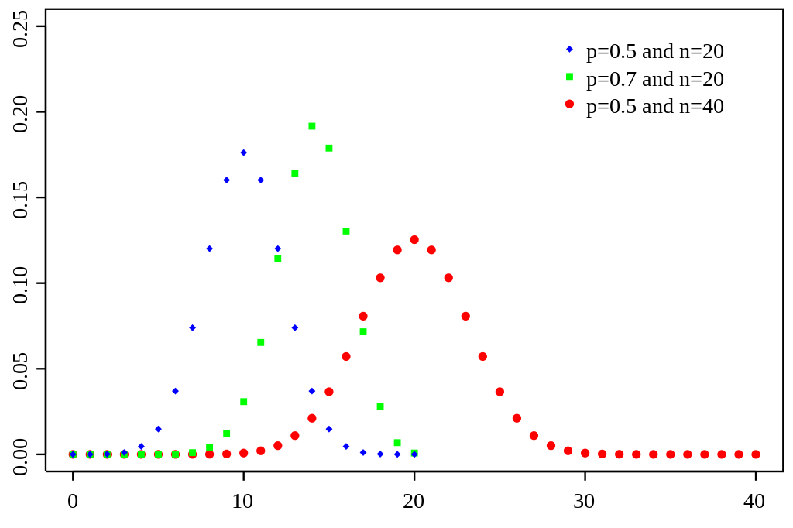

# 확률 분포(Probability distribution)

- 기초
  - 확률 변수
  - 확률 질량 함수
  - 확률 밀도 함수
- 정의
- 종류

## 기초

- 확률 변수
- 확률 질량 함수
- 확률 밀도 함수

### 확률 변수(Random Variable)

....

### 확률 질량 함수(Probability Mass Function)

- 질량
  - 어떤 물체에 포함되어 있는 물질의 양
  - c.f
    - 무게
      - 지구가 물체를 잡아 당기는 힘
    - 저울
      - 용수철 저울은 무게를 재는 저울. 용수철을 세게 당길 수록 많이 늘어난다는 성질을 이용
      - 양팔 저울은 질량을 재는 저울. 그래서 달에 가서도 평형은 유지된다.
- 정의
  - 이산 확률 변수 X가 취할 수 있는 값 x1, x2, x3, ... 의 각각에 대해서 확률 P(X=x1), P(X=x2), P(X=x3), ... 을 대응시켜주는 관계이다.

### 확률 밀도 함수(Probability Density Function)

- [밀도](https://namu.wiki/w/%EB%B0%80%EB%8F%84)
  - 물질의 질량을 부피로 나는 값. 물질마다 고유한 값을 지님
  - 어떤 물리적 양이 공간(空間)·면(面) 및 선상(線上)에 분포하고 있을 때, 미소(微小)부분에 포함되는 양의 체적·면적 및 길이에 대한 비를 나타내는 양
  - 이때 체적·면·선에 관한 것을 각각 체적밀도·면밀도·선밀도로 구별하며, 일반적으로는 체적 밀도를 가리킨다.
- 정의
  - 연속 확률 변수를 나타내는 함수. 확률 질량 함수의 연속형
    - 밀도가 확률 자체를 의미한다고 하면, 확률 밀도 함수는 x축에 대한 선밀도(linear density)를 의미
- 이름의 유래
  - 연속 확률 변수에서는 특 개별 값들에 대한 확률이 존재하지 않음 (5분 != 300.0000000001초). 연속의 경우에는 반드시 구간단위의 확률이 존재할 수 밖에 없는데, 확률밀도 함수는 특정 지점에 대한 값을 말함
    - 2차원 그래프의 경우, x축의 일정 구간에서의 확률 질량의 합(구간단위 질량의 넓이)
  - 확률 밀도함수 값은 미소구간에서의 미소확률(질량)에 대한 밀도값

### 확률 질량 함수와 확률 밀도 함수의 차이

## 정의

- 시행에서 확률 변수(random variable)가 어떤 값을 가질지에 대한 확률을 나타냄.

## 종류

- 이산 확률 분포
- 연속 확률 분포
- 분류기준은, 확률 변수의 종류에 기반

### 이산 확률 분포

- 확률 변수가 취하는 값들의 집합이 자연수의 부분 집합과 일대일 대응

#### 1. 이항 분포

- 정의
  - n번의 독립 베르누이 시행(한 번의 시행에서 결과가 성공 또는 실패로 결정되는 시행)에서 성공 확률이 p일 때의 확률 분포이다. n번의 시행 중 성공의 횟수가 x회 일 때,
  - `b(x; n,p) = nCx * p^x * (1-p)^(n-x)` 로 표현한다.
- 조건
  - 독립 베르누이 시행
- 특징
  - n이 커지면 이항분포는 폭이 점점 좁아지며, 정규분포에 근접해 감, p가 0.5에 근접해 가도 마찬가지임
  - `np >= 10` 이면 정규분포라고 생각함.
  - n = 1일 때의 이항분포를 베르누이 분포라고 함
- 대표값
  - mean = np / sd = root(np(1-p))

#### 2. 푸아송 분포

- 정의
  - 주어 시간 동안 어떤 사건이 발생하는 횟수를 나타내는 확률 분포
  - 사건이 발생할 기대값을 L이라고 하고, 주어진 시간 동안 사건이 일어난 횟수가 x회일 때,
  - `p(x; L) = e^(-L) * L^x / x!` 로 나타냄
- 조건
  - 주어진 시간 동안 일어나는 사건의 횟수는 다른 시간에서 일어나는 사건의 횟수와 독립이어야 함
  - 주어진 시간을 더 짧은 단위로 나눴을 때, 그 짧은 시간 내에서 사건이 두 번 이상 발생할 확률은 무시할 만큼 매우 작아야 함.
  - 주어진 시간을 더 짧은 단위로 나눴을 때, 시간의 길이와 사건이 한번 발생할 확률은 비례함.
- 특징
  - 평균과 분산이 같은 값을 가짐
- 대표값

#### 3. 기하 분포

### 연속 확률 분포

- 확률 변수가 취하는 값들의 집합이 실수의 구간을 이룸

#### 1. 정규 분포(Normal distribution)

#### 2. 표준 정규 분포(z-분포, Standard normal distribution)

#### 3. 스튜던트 t-분포(t-분포, Student's t-distribution)

#### 4. F-분포(F-distribution)

#### 5. 카이-제곱 분포(X^2분포, Chi-squared distribution)

#### 6. 지수 분포
