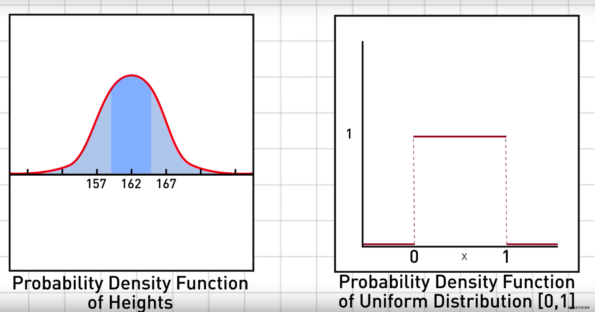
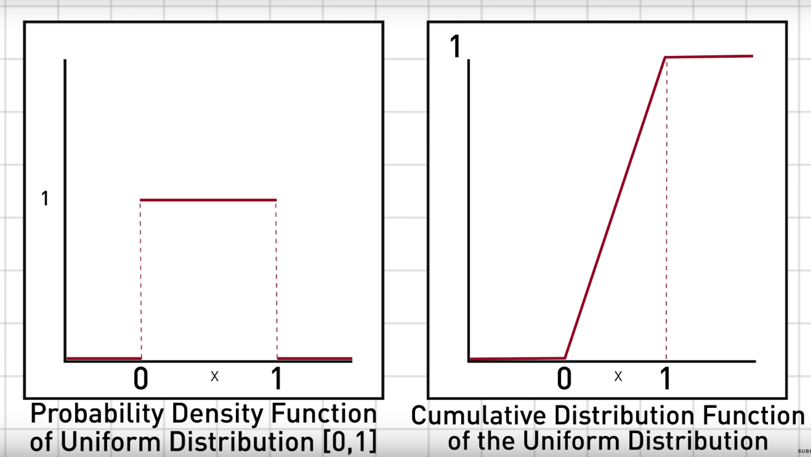
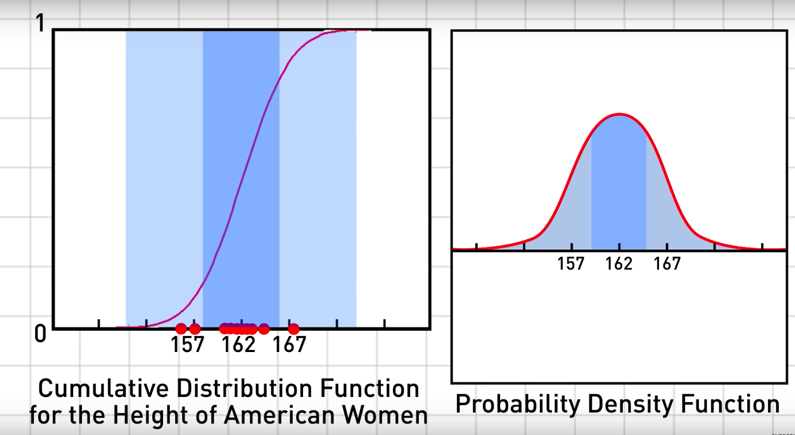

# 난수(Random number)

> In a sense, there is no such thing as a random number, For example, is 2 a random number? Rather, we speak of a sequence of independent random numbers with a specified distribution - Donald Knuth

## 진정한 난수 생성

- 자연의 상태를 이용한 이용한 진정한 난수 생성기
  - 방사선 측정기로 난수를 만들 수 있음
- 단점
  - 기기가 필요함
  - 느림
  - 난수의 재생산불가능

## 유사 난수 생성

- 애초에 대부분의 경우 완전한 난수는 필요가 없음
- 유사 난수 생성은 진정한 난수가 아니라는 것을 기억해야 함

### 주사위의 예시

주사위는 각 눈 1, 2, 3, 4, 5, 6에 대해서 다 같은 확률을 갖음. 즉 이는 확률 분포.

### 유사 난수 생성 방식

- Middle-Square Algorithm
  - 비효율적
  - X(n+1) = X(n)^2의 가운데 네자리 숫자
  - 주기가 짧은 경우 발생
- Linear Congruential Generator(선형 합동법)
  - 스탠다드
  - 필요 입력값
    - modulus(m)
    - multiplier(a)
    - increment(c)
    - seed(시작값)
  - `X(n+1) = (a*X(n)+c) mod m`
    - 값의 범위 [0, m-1]
- Mersenne Twister(메르센 트위스터)
  - 스탠다드
- XOR Shift

### 유사 난수 특성

- 결국엔 반복됨(sequence cycle)
  - 주기가 존재
  - e.g)
    - Middle-Square Algoritm
      - 2916 -> 5030 -> 3009 -> 540 -> 2916 ... (주기가 4)
      - 0 -> 0 -> 0 -> ...
      - 어떤 수로 시작하든 주기가 4096보다 낮고 때때로는 훨씬 낫다
    - Linear Congruential Generator
      - 좋은 m, a, c를 고르면 주기가 m이 될 수 있음

### 특정 분포를 따르는 난수

- Inverse Transform Sampling을 이용
  - Cumulative Distribution Function을 이용

- Cumulative Distribution Function의 y값이 0과 1사이인데, 임의의 0과 1사이의 난수를 이용해서 Cumulative Distribution Function의 역함수로 해당 확률의 키를 계산
  - 진한 파랑색의 면적이 대부분의 미국 여성의 키가 들어있는 구간이므로, Cumulative Distribution Function에서는 기울기가 가파르게 나타남(그 구간의 길이가 기므로 더 많이 해당 구간의 y값이 나올 확률이 증가)
