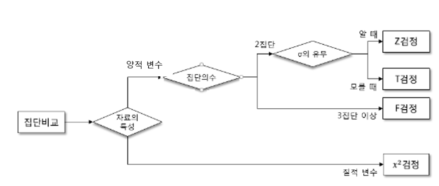

# T-test

- 참고
- 정의
- 사용 타이밍
- 종류

## 참고 자료

- [T-test와 ANOVA](http://blog.daum.net/_blog/BlogTypeView.do?blogid=0FlLK&articleno=5351858&totalcnt=2021)

## 통계 검정의 순서도

## T검정의 정의

- 두 모집단간의 평균의 차이가 통계적으로 유의한지 파악할 때 필요한 통계적 기법
- T-distribution is basically any continuous probability distribution that arises from an estimation of the mean of a normally distributed population using a small sample size and an unknown standard deviation for the population.
- c.f) z-test
  - 두 집단의 평균이라는 확률변수가 정규분포를 따를 때, 이를 표준화 해서 비교하는 방법

## 사용 조건

- random sampling
  - 두 그룹은 독립적 (독립성)
- 두 집단의 데이터는 연속 확률변수의 성질을 갖음
- 확률변수의 분포가 정규분포 (정규성)
- 충분히 큰 크기의 표본 크기
- 분산값이 거의 일치해야 함 (등분산성)

## 사용 타이밍

- 모집단의 분산을 알지 못하는 경우
  - c.f) 모집단의 분산을 아는 경우
    - z-test
- 표본의 크기가 작을 경우

## 종류

- 독립표본 t-test(independent-sample t-test)
  - 두 집단간의 차이
  - e.g) 남 / 여, 환자군 / 대조군
- 대응표본 t-test(paired-sample t-test)
  - 동일한 집단에 있어 처치 전후의 차이
  - e.g) 교육 프로그램의 효과 전 후, 약물 처치 전 후
- 단일표본
  - 특정 집단의 평균이 어떤 숫자와 같은지 다른지를 비교

## 예시

- "t 테스트에서는 귀무가설은 두 집단의 평균의 차는 같다" 임
- 그러므로, p값이 0.05(5%의 유의수준일경우) 보다 클 경우에는 귀무가설을 채택하고, 그렇지 않으면 기각, 즉 두 집단의 평균의 차는 유의하게 다르다 라고 볼 수 있음
