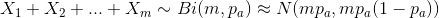
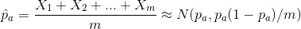
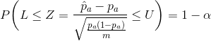
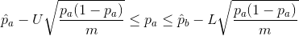
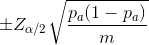
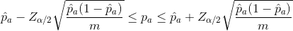

# 삶 속에서의 통계학

- 확률 분포 편
  - 사람의 특징과 확률 분포
- 통계적 추정 편
  - 스시집 뽑기의 당첨 확률은 몇 퍼센트 일까?
- 기타
  - 이제까지 내린 강우량의 99%를 커버 가능한 댐을 만드려면?
  - 나의 운전 기록, 차 정보, 보장 범위를 생각했을 때, 보험료를 얼마로 두는 것이 합리적인가?
  - 어떠한 약이 환자들에게 100번 투여되어서, 56명은 효과가 있었으나, 44명은 아무런 차도가 없었으면 그 약은 효과가 있었다고 할 수 있는가?
  - 유전자 실험

## 확률 분포 편

### Ep1: 사람의 특징과 확률 분포

- 너는 혼혈인데 왜 안이쁘니?
  - 아는 지인에게서 자신의 친구가 저러한 이야기를 들었다고 한다.
  - 물론 저렇게 타인에게 이야기하는 것 자체도 실례이다.
  - 하지만 통계학적으로 "너는 혼혈인데 왜 안이쁘니?" 라는 말은 확률 분포를 잘 이해하지 못했기 때문에 발생하는 논리적 오류이다.
  - 어떠한 절대적인 이쁨이 있다고 가정하고, 이를 0 ~ 100사이의 양의 실수를 이용해서 나타낼 수 있다고 하자.
  - 그럴 때 우리는, x축이 절대적 이쁨도, y축이 그렇게 될 확률을 기준으로 확률 밀도 함수를 작성할 수 있다.
  - 물론 이 분포는 일반 한국인과는 다르게, 우리가 혼혈은 경험적으로 더 이쁠 확률이 높다는 것을 알 수 있는 것 처럼, 오른쪽으로 봉우리가 치우쳐진 보아뱀 곡선을 그릴 수 있을 것이다.
  - 여기서 알 수 있는 것은, 언제까지나 이쁨도가 낮은 사람도 존재할 수 있다는 사실이다. 물론 그 확률은 다소 낮을 수 있다.
  - 따라서 "너는 혼혈인데 왜 안이쁘니?" 라고 말한 것은, 혼혈은 반드시 이뻐야한다는 오류에 빠져서, 혼혈 절대 이쁨도가 낮은 사람도 있을 수 있다는 확률을 고려하지 않은 것이 된다.
- 감상
  - 우리가 평소에 생각하는 것들을 통계적 관점으로 생각해보면 오류일 때가 다소 존재한다. 그것을 잘 캐치해서 최대한 논리적으로 의사결정을 할 수 있도록 하면, 보다 나은 의사선택을 할 수 있지 않을까 싶다.

## 통계적 추정 편

### Ep1: 스시집 뽑기의 당첨 확률을 몇퍼센트일까?

- 배경
  - 일본의 쿠라스시에는 스시 5접시마다 1회 장난감 뽑기 찬스가 있음
  - 나와 지인이 함께 스시집을 가면 보통 20접시를 먹음
    - 10번 갔을때, 7번은 꽝이 되고
    - 10번 갔을때, 3번은 당첨이 됨
  - 그렇다면 스시집 뽑기의 당첨 확률은 몇 퍼센트일까?
- 관점
  - 애초에 5번에 한 번 정도 뽑힐 수 있도록 프로그램을 해둠
    - 분명히 가능성이 있음
  - **정말로 확률적으로 정해져있음**
    - 우리는 이 경우에 초점을 맞춰서 생각해보자
- 생각
  - 경우1
    - 예를들어, 뽑기의 꽝이 될 확률 `p`를 `0.6(즉 60%)`이라고 가정하자
    - 그러면 나와 지인은 20접시를 먹으므로 총 4번의 기회가 주어지는데, 대게(70% 확률)는 꽝
    - 여기서 4번다 꽝일 확률은 매번의 뽑기가 독립이라면, `0.6 * 0.6 * 0.6 * 0.6 = 0.1296` 즉, 13% 밖에 되지 않으므로 이는 70%와는 충분히 많은 차이를 보인다.
    - 물론 13%의 확률이 우연적으로 계속 나왔다 라고 생각할 수 있지만, 이는 통계적으로 거의 나오기 힘들다.
      - 사실 여기서 13%의 확률로 참인 경우 나와 지인이 직접 방문한 횟수 n번 시행했을 때 70%의 참의 결과가 나올 확률을 계산해서 그 값의 검정을 해야 엄밀하게 올바르다.
      - e.g
        - 10번 방문했을 때, 13%의 확률로 7번이 참이 될 확률은?
        - 이항분포에 따르면 거의 0에 가까움(p=0.13, x=7)
    - 따라서 가설을 기각할 수 있다.
  - 경우2
    - 예를들어, 뽑기의 꽝이 될 확률 `p`를 `0.9(즉 90%)`라고 가정하자.
    - 뽑기가 모두 꽝이 될 확률은 `0.9 * 0.9 * 0.9 * 0.9 = 0.65` 즉 65% 가 된다
    - 여기서 이항분포에 의하여 65%의 확률로 10번의 방문 중 7번이 꽝일 확률은 `0.25`즉, 25%이다.
    - 이는 자기자신이 정한 5%의 오차 수준의 범위 내에 있음(그렇게 될 확률이 5%이하이면 가설을 기각)
    - 그렇다면 충분히 가설을 채택할 수 있음
      - 사실은 가설을 기각할 수 없다가 맞음
- 결론
  - 이렇게 어떠한 가설의 확률을 p 라고 두고, 그 가설이 참이라고 두었을 때, 많은 경험적 시행을 해서 그 결과가 될 확률을 q라고 했을 때, q가 미리 정한 채택 기준 확률(a) 보다 더 크다면 그 가설은 기각 할 수 없으며, 그 확률 a보다 작다면 그 가설은 기각 된다.
  - 이는 통계적 추정
- 감상
  - 통계학은 우리의 일상에서도 이렇게 찾아볼 수 있어서 너무 재미있었다. 사실 칸아카데미에서 들었던 수업의 설명이 너무 적절했다. 그리고, 그것을 TIL에 적어 둔 덕분에 이러한 발상이 생겼다고 생각한다. 뜬금없이 스시먹다가 말이다.

### Ep2: 도서관의 화장실의 좌석칸이 비어있을 확률이 얼머나 될까?

### Ep3: 모집단이 이항분포를 따르는 경우 A/B 테스트에서, 어떻게 모집단의 평균을 비교할 수 있을까?

- 자료
  - [The Math Behind A/B Testing](https://web.archive.org/web/20150921174256/https://developer.amazon.com/public/apis/manage/ab-testing/doc/math-behind-ab-testing)
- 배경
  - 어떠한 A, B마케팅 캠페인을 실행해서, Conversion과 Conversion Rate와 Change(두 캠페인간의 Conversion Rate의 차이), Confidence(해당 결과의 신뢰도)를 다음과 같이 구했다.
  - A
    - Conversions / Views = 320 / 1064
    - Conversion Rate 30.08% +- 2.32%
  - B
    - Conversions / Views = 250 / 1043
    - Conversion Rate 23.97% +- 2.18%
    - Change -20.30%
    - Confidence 99.92%
  - 원래는 물론 Conversions와 Views만 우리는 알 수 있는데, 이를 바탕으로 어떻게 Conversion Rate와 Confidence와 진짜 A, B사이에 Significant하게 다르다는 것을 알 수 있었는가?
- 관점
  - 표본의 각각의 요소는 모집단의 분포를 따르며, 표본의 요소는 각각 독립이다.(문제에서)
  - 이항분포는 재생성을 갖고 있으므로, 이항분포를 따르는 확률변수의 합 역시 이항분포를 따른다.(재생성)
  - 이항분포는 n이 충분히 크다면 정규분포로 근사가 가능하다(중심극한정리)
- 생각
  - 캠페인 A의 모집단의 Conversion Rate를 pa라고 표현하고, 실제 마케팅을 실행해서 얻은 Conversion Rate를 pa^라고 하자.
  - 즉, 모집단 확률변수 ~ Bi(1, pa)
  - 그럼 이항분포의 재생성과 중심극한정리에 의해서 다음이 성립한다.
    - X1, X2, ... Xm은 표본의 각 확률변수(0과 1의 값을 갖으며, 1은 Conversion했을 경우, 0은 Conversion하지 않았을 경우)

추정식

pa의 신뢰구간

위의 신뢰구간에서 신뢰구간의 폭은 다음과 같다.

- 해당 폭에서는 pa가 사용되고 있는데, 이는 모집단의 Conversion Rate이므로, 우리는 알 수 없다.
- 하지만 m이 충분히 클 때, 우리는 큰 수의 법칙을 적용할 수 있으므로, pa를 pa^ 로 치환해서 생각 할 수 있다.
  - 사실은 이 방법 말고도, 이항분포의 경우 신뢰구간을 생각할 때에 m이 작은 경우나 pa가 매우 작다고 예상되는 경우에 다른 보다 좋은 식이 존재한다.
  - [참고](https://web.archive.org/web/20150919204533/https://en.wikipedia.org/wiki/Binomial_proportion_confidence_interval)
- 결국은 우리는 pa의 신뢰구간을 다음과 같이 변경할 수 있다.

이렇게 모집단이 이항분포를 따를 경우에 이항분포의 재생성과 점근정규성을 이용, 또, 큰 수의 법칙을 사용해서 모수(pa)를 구할 수 있다.

## 가설 검정 편

### EP1: 특정 게임의 리밸런싱 전의 특정 레벨의 성공률과 리밸런싱 후의 특정 레벨의 성공률이 통계적으로 유의미한 차이가 있다는 것을 어떻게 검증할까?

- 배경
  - 앵그리버드 등과 같은 게임에서는 1부터 1000(많게는 그 이상)의 레벨들이 존재하고 각 레벨당 성공률이라는 개념으로 해당 레벨의 난이도를 측정한다.
    - 성공률 = 전체성공횟수 / 전체게임시도횟수
  - 이 때에, 기획자의 판단에 의해서 레벨을 전반적으로 (쉽게 혹은 어렵게) 리밸런싱을 한다고 하면, 실제로 그 리밸런싱이 해당 레벨에서 통계적으로 유의미한 결과를 나타냈다고 어떻게 판단할 수 있을까?
  - 물론 표본의 크기가 엄청나게 크다면 큰 수의 법칙으로 인해서 표본의 성공률이 모집단의 성공률로 확률 수렴하는것은 알지만, 충분히 크기가 큰 표본이라 하더라도 상대적으로 덜 수렴했을 수도 있고, 또한 표본이 작은 경우에는 적용하기에 무리가 있다.
- 관점
  - 우리가 알고싶은 것은 리밸런싱 전과 리밸런싱 후의 '모집단'의 성공률의 차이
  - 각 레벨에 대한 게임 try 사건의 결과는 성공이냐 실패냐 두가지의 결과가 나오고, 각각의 결과는 이전 플레이한 게임의 결과에 영향을 받지 않는다
    - 독립 베르누이 시행
  - 표본은 일정기간 동안, 리밸런싱 전 후에 해당 게임의 레벨을 즐겼던 사람들이고, 리밸런싱 후의 표본집단의 각 1회 시도당 성공, 실패를 1, 0값으로 두고 그것을 확률변수 X로 두면 X ~ Bi(1, p1) (여기서 p1은 리밸런싱 후의 모집단의 성공률) 이고 마찬가지로 리밸런싱 전의 표본집단의 확률 변수를 Y로 두면, Y ~ Bi(1, p2) (p2는 리밸런싱 후의 모집단의 성공률)
  - 이렇게 되면 표본의 모든 시도에 대한 확률변수의 합은, 이항분포의 재생성에 의해서 다음과 같이 구할 수 있음
    - `X1 + X2 + ... Xn1 ~ Bi(n1, p1)`
    - `Y1 + Y2 + ... Yn2 ~ Bi(n2, p2)`
  - n1, n2가 충분히 크면(n >= 30) 중심극한 정리에 의해서 이항분포가 정규분포로 근사됨
    - `X1 + X2 + ... Xn1 ~ Bi(n1, p1) ~~ N(n1\*p1, n1\*p1\*(1-p1))`
    - `Y1 + Y2 + ... Yn2 ~ Bi(n2, p2) ~~ N(n2\*p2, n2\*p2\*(1-p2))`
  - 양변을 각각 n1, n2로 나눠줌
    - `p^1(리밸런싱 후 표본의 레벨 성공률) = (X1 + X2 + ... + Xn1) / n1 ~~ N(p1, p1(1-p1)/n1)`
    - `p^2(리밸런싱 전 표본의 레벨 성공률) = (Y1 + Y2 + ... + Yn1) / n2 ~~ N(p2, p2(1-p2)/n2)`
  - 여기서 확률변수 p^1과 p^2가 정규분포를 따르므로, 정규분포의 재생성에 의해서 확률변수 p^1 - p^2 역시 정규분포를 따름
    - `p^1 - p^2 ~ N(p1 - p2, p1(1-p1)/n1 + p2(1-p2)/n2)`
  - 가설의 설정
    - 귀무가설 H0: 두 성공률 간의 유의미한 차이가 없다(p1 = p2 이다)
    - 대립가설 H1: 두 성공률 간의 유의미한 차이가 있다
  - 귀무가설 하에서, 확률변수 p^1 - p^2를 정규화 시켜준 뒤에, Z값을 구함
  - 해당 Z값이 미리 신뢰계수인 알파값보다 작은지(예를들어 95% 구간 이내에 존재하는지) 검증
- 생각
- 감상
