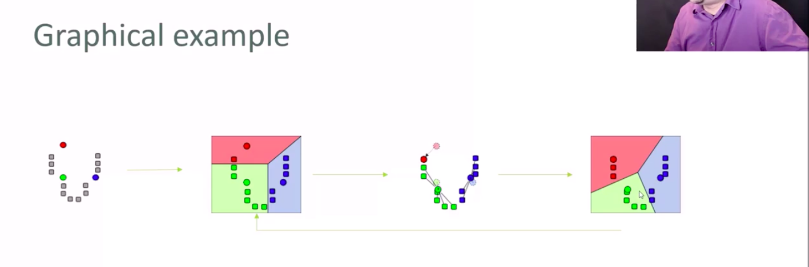
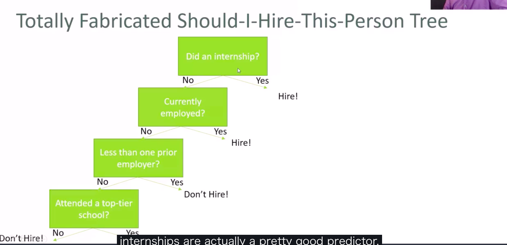

# 기계 학습

- 관측된 데이터에 기반해서 모델을 생성하는 알고리즘
- 생각보다 간단한 개념
  - 회귀분석도 마찬가지
- **어떠한 학습 모델이던, 자기자신의 문제에 맞는 가장 심플한 방법이 최적이다**

## 기계학습 타입

- 교사 없는 학습
  - 어떠한 정답도 주지 않음
  - 그저 관찰에서만 모델을 도출해야 함
    - e.g 두가지의 그룹으로 클러스터링을 하나, 올바른 분류방법을 제시하지 않음
  - 자기 자신도 무엇을 찾을지 명확하지 않을 경우 유효
  - e.g
    - 유저 행동에 기반한 데이트 장소 클러스터링
      - 연구자의 선입견에 반발하는 사람도 존재할 수 있음
    - 영화 클러스터링 하기
      - 다양한 분류 방법이 나올 수 있음
    - 제품 소개 문서에서 가장 의미가 관련있는 어구 분석
- 교사 있는 학습
  - 알고리즘은 올바른 답을 **배움**
  - 모델은 새로운 값의 예측에 사용됨
  - e.g
    - 차의 특징 데이터와 역대 판매 데이터를 기반으로 차 가격 예측모델
      - 아직 판매되지 않은 차들의 가격 예측에 사용
  - 평가
    - 데이터를 나누어야 함
      - 훈련 데이터(80%)
      - 테스트 데이터(20%)
      - 두 데이터 모두 모든 데이터의 극단값과 다른 variations를 대표하는지 확인해야함
      - 데이터셋은 반드시 무작위로 선택되어야 함
      - `overfitting`을 방지
      - 데이터셋이 너무 적은 경우에는 위와같은 방법이 좋지 않을 수 있음
    - 오직 훈련 데이터만 가지고 모델을 만들어야 함
    - 테스트 데이터를 가지고 만들어진 모델이 적합한지 아닌지 체크를 함
  - k-fold cross validation
    - 과교정(overfitting)방지
    - 방법
      - 데이터를 k개의 임의로 할당된 부분으로 나눔
      - 하나의 부분을 테스트 데이터로 남겨둠
      - 나머지 K-1 부분으로 학습시키고, 테스트 데이터로 성능 측정
      - K-1 r-squared 점수로 평균을 낸다

## Bayesian Methods

- `P(A|B) = P(A) / P(B) * P(B|A)`
- 교사 있는 학습
- 스팸분류기에 사용
  - `free`라는 단어가 등장했을때 그 메일이 스팸일 확률?
  - `P(spam|free) = P(spam) / P(free) * P(free | spam)`
  - 다른 단어도 학습 단계에서 스팸단어로 지정하는 것이 의미가 있는 것들을 `P(Spam|Word)`로 만들어 나감
  - 새로운 이메일을 분석할 때 앞서 구한 확률을 가지고 스팸일 확률을 계산
  - **다른 단어들이 존재하는 경우는 각각 독립이라고 가정**
    - `Naive Bayes`

## K-Means 클러스터링

- K centroid에 가까운 K 그룹으로 데이터를 나눔
- 교사 없는 학습
  - 각각 데이터의 포인트 위치만을 이용
- 사람 / 사물 / 행위의 관심 그룹을 발견
  - e.g 백만장자는 어디에 사는가?
  - 어떠한 음악 / 영화가 보통 fall out of data하는가?
  - 인구통계데이터의 자신만의 `stereotype`을 만듬
- 방법
  - K를 선택
    - squared error가 큰 삭감이 있을 때 까지 K값을 계속해서 증가시킴(각각의 점에서 centroids까지의 거리)
    - 너무 큰 K는 아무런 클러스터링의 의미도 부여하지 못함
  - local minima를 회피
    - 첫 centroids의 임의의 선택은 각각 다른 결과를 야기
    - **첫 centroids가 너무 이상한 것은 아닌가 확인하기 위해서 여러번 실행해봄**
  - 클러스터들을 라벨링함
    - K-Means 클러스터링은 찾아낸 클러스터들에게 어떠한 의미도 부여하지 않음
    - 데이터를 더 상세히 분석하는 것은 사람의 몫

## 결정트리

### 엔트로피

- 데이터의 무질서도의 척도
  - 얼마나 동일한가 얼마나 다른가
- 만일 데이터를 N개의 다른 클래스로 분류하면
  - 모든 데이터가 다 같으면 엔트로피는 0의 값
  - 모든 데이터가 다 다르면 엔트로피는 높음
- `H(S) = -p1*ln(p1) - p2*ln(p2) ... -pn*ln(pn)`

### 결정 트리

- 기계학습을 이용한, 분류 기준 결정을 위한 플로우 차트
- 교사가 있는 학습
  - 샘플 데이터와 분류 결과를 입력
  - 트리를 생성함
- 방법
  - 각각의 단계마다 데이터의 엔트로피를 최소화하는 속성을 찾음
    - ID3 알고리즘
    - 그리디 알고리즘
  - 최적의 트리는 아니어도 충분히 잘 작동함
- 한계
  - **결정 트리는 과적합(overfitting)문제에 취약**
  - `Random Forests`: 그러므로, 여러개의 결정 트리를 만들고 최종 분류를 위한 투표를 진행하도록 함
    - 각각의 트리마다 입력 데이터를 임의로 재 추출함(bootstrap aggregating or bagging)
    - 각각의 단계마다 임의의 속성의 부분집합에서만 속성을 선택하도록 함
- e.g
  - 나가서 놀지말지 결정(날씨는 좋은가?, 바람은 많이 부는가? 습도는 어떤가?)
  - 역대 채용 데이터를 바탕으로 레쥬메를 분류하는 시스템 개발
    - 채용자와 비 채용자의 다양한 속성값이 데이터베이스에 저장되어있음
    - 데이터를 바탕으로 결정 트리를 훈련시키고, 지원자가 결정 트리를 바탕으로 채용될지를 예측

## 앙상블 학습

- 다양한 모델을 비교 투표해서 더 좋은 결과를 얻음
- **거의 언제든 고려하는게 좋음**
- 랜덤 포레스트도 앙상블 학습의 한 종류
  - 다양한 모델을 같은 문제를 해결하기 위해서 사용. 그리고 결과를 투표함
  - `bagging(bootstrap aggregating)`해서 앙상블 학습 하는데에 기반을 만듬
    - **임의로 추출된 데이터의 샘플로 모델들을 훈련시킴**
  - `boosting`은 각각의 연속된 모델들이 이전 모델들에 의해서 잘못 분류된 특성을 부스트 함
    - 잘못 분류된 것에 더 집중해서 다음 모델이 바로잡음
  - `bucket of models`은 훈련 데이터를 사용해서 많은 다른 모델들을 만들고, 테스트 데이터에 가장 잘 맞는 모델을 선택함
  - `Stacking`은 다양한 모델을 데이터에 한번에 작용시킴, 그리고 그 결과를 조합함
- 진보한 앙상블 학습(별로 추천은 안함)
  - 베이지안 최적 분류기(Bayes Optimal Classifier)
    - 이론적으로는 최고. 하지만 실용적이지 않음
  - 베이지안 파라미터 평균(Bayesian Parameter Averaging)
    - BOC를 실용적으로 만드려는 시도
    - 단순한 bagging 접근이 더 좋을떄도 있음
  - 베이지안 모델 조합(Bayesian Model Combination)

## SVM(Support Vector Machine)

- 고차원 데이터, 즉 많은 특징을 갖는 데이터를 분류(clustering)하기에 좋음
- 고차원적 서포트 벡터를 데이터를 분류하기 위해서 찾음
- 저차원에서는 명확하지 않을 수 있는 hyperplanes를 찾기 위해서 `kernel trick`을 사용
- **교사가 있는 학습**
- SVC(Support Vector Classification)
  - SVC를 SVM을 사용해서 데이터를 분류하기 위해서 사용
  - SVC를 서로 다른 커널들과 사용할 수 있음
    - 경우에 따라서 잘 맞는 커널이 따로 있음
