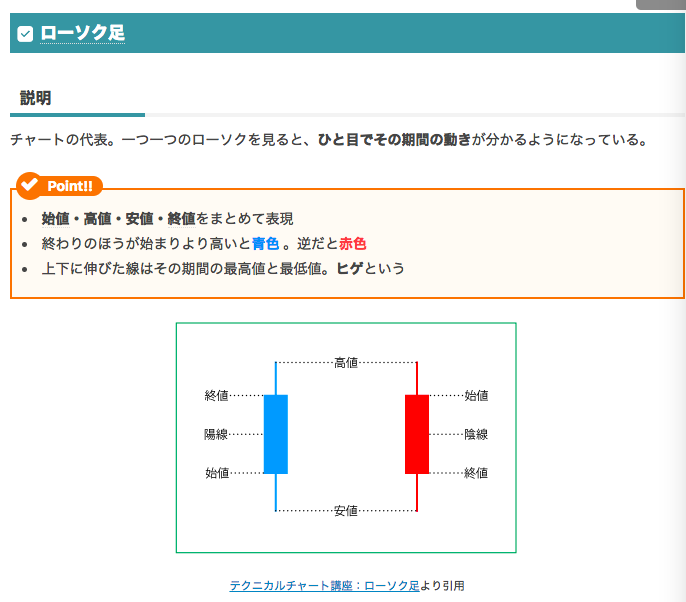
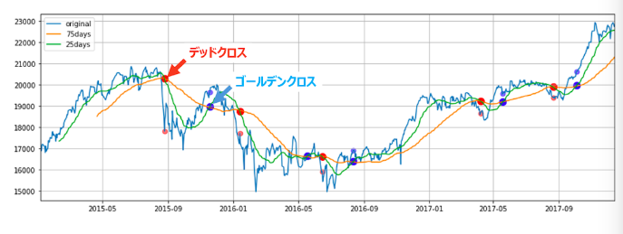
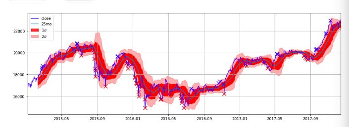
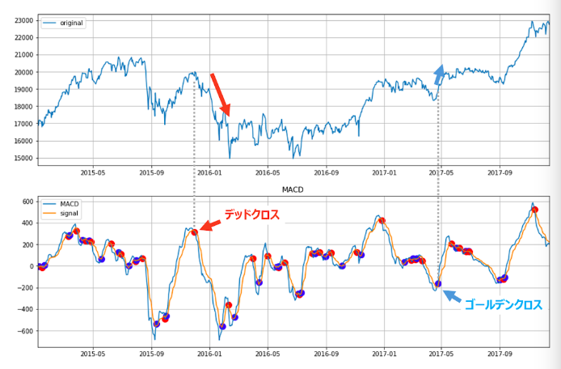
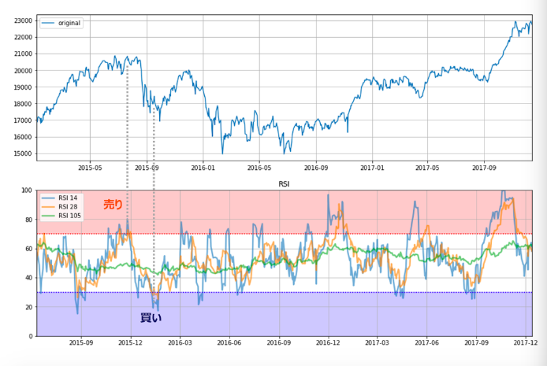

# 차트 분석 기본

## 테크니컬 분석과 펀디멘털 분석

참고: http://www.procrasist.com/entry/14-technical-analysis

- 펀디멘털 분석
  - 정보를 모아, 가격이 어떻게 변화할지 판단. 주식의 경우는 회사의 정보나, 가상통화에서는 기술적인 요소나 방침과 같은 **코인 가격의 메타 정보 분석**
- 테크니컬 분석
  - 차트 정보로부터, 가격이 어떻게 될지를 판단. 차트만 보면 되나, 큰 변동등을 예측하기 어려움
  - 쉽게 접근할 수 있으나 리스크도 큼

### 트레이더가 자주 사용하는 지표

1. 이동평균선(36.6%)
2. [볼린저밴드(17.1%)](https://www.slideshare.net/anthouseadmin/7-bollinger-band)
3. MACD(13.2%)
4. RSI(8.4%)

### 캔틀스틱 차트 보는 법

### 이동평균선

- 차트 자체는 노이즈가 많음
  - 노이즈 제거를 위해 일정 기간 단위로 평균값을 잡음
  - 25MA -> 25일단위의 이동평균선
- 골든 크로스
  - 주가가 하락한 다음 단기 이동평균선이 장기이동평균선을 아래에서 위로 교차해 나가는 현상. 매수 사인
- 데드 크로스
  - 주가가 상승한 다음에 단기 이동평균선이 장기이동평균선을 위에서 아래로 교차해 나가는 현상. 매도 사인

### 볼린저 밴드

- 이동평균선과 이동표준편차를 사용한 분석
- 정규분포를 가정
- 1표준편차 차이
  - 68% 확률로 주가가 그 범위 안으로 수렴
- 2표준편차 차이
  - 95% 확률로 주가가 그 범위 안으로 수렴
- 3표준편차 차이
  - 99% 확률로 주가가 그 범위 안으로 수렴
- 분석
  - 밴드가 좁을때는 상황을 두고 봄
  - 밴드가 위 아래가 열렸을 때에는 트랜드에 들어간 기세이고, 상승장일때는 찬스
  - 2표준편차의 라인이 무너지면 매우 강한 트랜드

### MACD(Moving Average Convergence/Divergence)

- 이동평균선을 조금더 개량
- 시계얼 데이터는 바로 전의 데이터의 경우가 오래전의 데이터보다 데이터로서의 가치가 높은 경향이 있음. 그것을 고려한 평균계산. 두개의 이동평균선을 그음
- 종류
  - MACD
    - 12일의 EMA - 26일의 EMA
  - 시그널
    - MACD의 9일 EMA
- 시그널을 MACD가 아래에서 위로 크로스하면 **골든 크로스(매수 기회)**
- 시그널을 MACD가 위에서 아래로 크로스하면 **데드 크로스(매매 기회)**

### RSI(Relative Strength Index)

- 과도하게 매수한 시장과 과도하게 매도하 시장에서의 투자가는 불안감을 갖음. 그 심리상태를 정량화 하려는 것이 RSI지표. 가격 상승과 가격하락의 밸런스를 봄
- 기준
  - RSI지표가 70%이상이 되면 과도 매수존
  - RSI지표가 30%이하가 되면 과도 매매존
