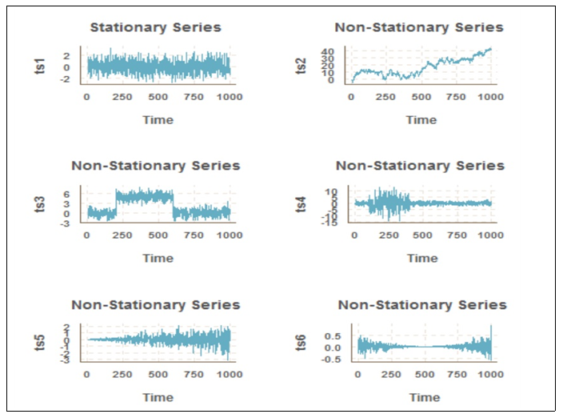

# ARIMA분석

## Stationary, Non-stationary

- 안정적인 시계열(stationary)란, 시간의 추이와 상관 없이 평균 및 분산이 불변하거나, 시점 간의 공분산이 기준시점과 무관한 형태의 시계열이다.
- 시계열이 안정적이지 않을때는, 로그를 사용하거나, 차분을 통해 시계열을 안정적으로 변환한뒤에 분석을 진행한다.
- 정상성
  - 평균이 일정함
  - 분산이 존재하며 일정함
  - 두 시점 사이의 자기 공분은 시간의 차이에 의존한다.
