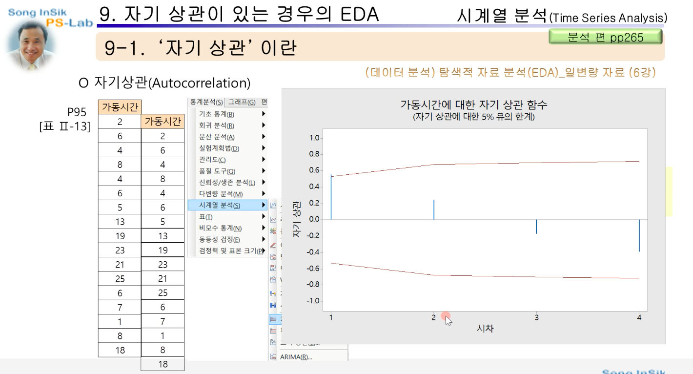
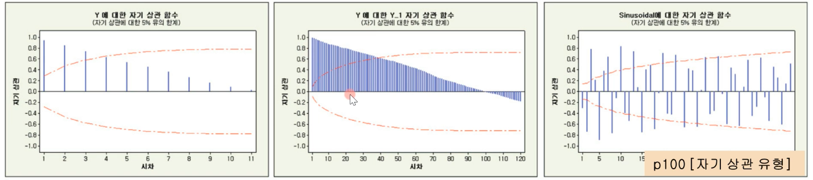
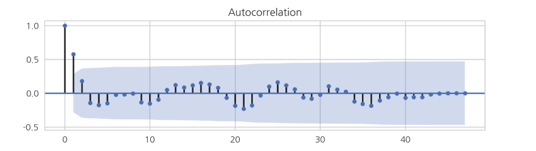
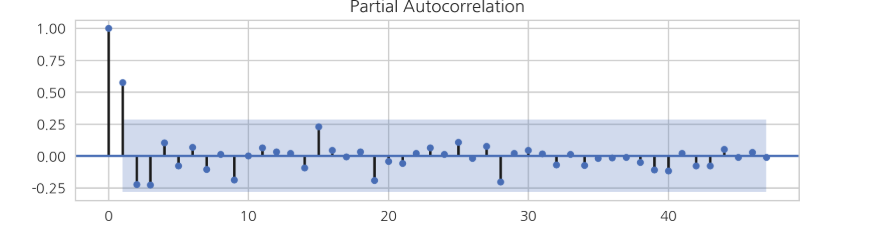

# ARIMA분석

## Stationary, Non-stationary

- 안정적인 시계열(stationary)란, 시간의 추이와 상관 없이 평균 및 분산이 불변하거나, 시점 간의 공분산이 기준시점과 무관한 형태의 시계열이다.
- 시계열이 안정적이지 않을때는, 로그를 사용하거나, 차분을 통해 시계열을 안정적으로 변환한뒤에 분석을 진행한다.
- 정상성
  - 평균이 일정함
  - 분산이 존재하며 일정함
  - 두 시점 사이의 자기 공분은 시간의 차이에 의존한다.

## AR 모형

- p 시점 전의 자료가 현재 자료에 영향을 주는 자기회귀모형 AR(p)
  - AR(1)
    - 현 시점의 자료가 과거 1 시점 전의 자료에만 관계가 있을 때
  - AR(2)
    - 현 시점의 자료가 과거 2 시점 전의 자료까지 관계가 있는 모형
- 판단 조건
  - 자기상관 함수(ACF) 빠르게 감소
  - 부분자기함(PACF) 어느 시점에서 절단점 갖는 경우

### 자기 상관(Autocorrelation)

- 시계열데이터를 일정 시간차를 밀어두고 상관 관계를 조사하면 상관관계가 발견됨. 그것이 자기 상관
- 위의 그림에서는 time lag가 1일때, 0.5의 상관도가 있고(양의 상관관계가 매우 강함), 2일때 0.2의 상관도가 있으며, 4일때 -0.4의 상관도가 있음
- 두번째 그림은 다양한 자기 상관함수의 모형을 나타냄

### 자기상관계수 함수

### 편자기상관계수 함수

- 두 시각 t와 t-k사이의 값, `Y(t-1) ... Y(t-k+1)`의 영향을 배제함
- 위의 케이스
  - 자기상관계수 함수가 지수함수적으로 감소
  - PACF가 1차항에 대해서만 유의한 값을 가짐
    - AR(1)

### 자기 회귀

## MA 모형

- 유한한 개수의 백색잡음의 결합
- 판단 조건
  - ACF에서 절단점을 갖고
  - PACF가 빠르게 감소

## ARIMA 모형

- 비정상적 시계열 자료에 대해 분석하는 방법
  - 시계열의 변동 형태 파악 / 예측 가능
  - 시계열 자료 단독으로 예측 가능
  - 어떠한 시계열에도 적용이가능 / 시간의 흐름에 따라 자료 변동이 빠를 떄 민감하게 반영할 수 있음
- 분석 단계
  - 모형의 식별
    - 정상성의 여부 확인
      - 우리가 구한 시계열 자료 값들의 평균이나 분산등의 모멘트를 의미 있는 값으로 두기 위해서
    - 정상성이 없으면 정상화 시켜줘야 함
      - 차분을 이용함
      - `Z(t) = Z(t-1) + e`
    - ARIMA(p,q,r)의 차수 결정
      - AR(p)모형과 MA(q)모형이 각각 몇 차시까지 상관성을 갖는가
      - ARIMA(2,1,2)
        - 1차 차분이 완료된
        - AR항이 2차시 까지 존재하는 모형
        - MA항이 2차시 까지 존재하는 모형
    - 적정 차수 추정 방법
      - ACF(자기 상관함수) / PACF(부분자기상관함수)
      - AIC / BIC
        - 모형의 적합도를 나타내는 수치를 확인하고 적합도 수치가 가장 적절한 모형을 찾는 방법
  - 모수 추정
  - 모델 적합
  - 예측
