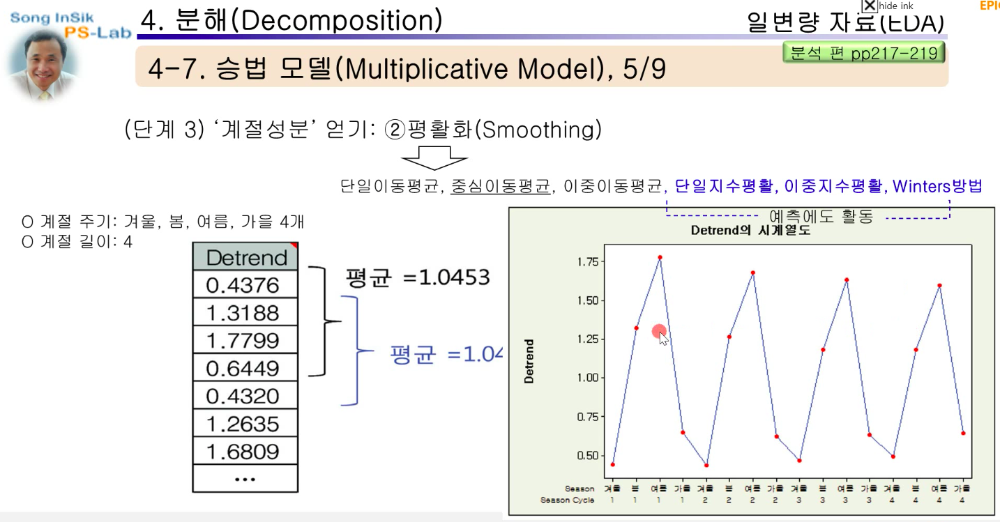
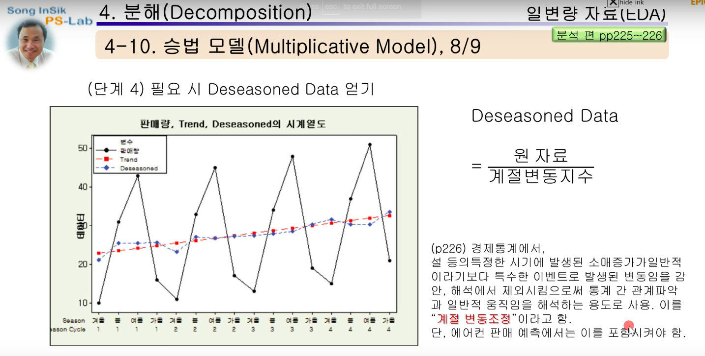

# 시계열 분석(time-series analysis)

시계열 자료를 분석하고 여러 변수들간의 인과관계를 분석하는 방법론

## 모형(모델)

- 한 시점의 변수가 그 이전 변수들의 영향, 과거 오차의 영향을 받는다고 가정
  - 그것이 꺠지면 랜덤워크
- 이동평균법, naive methods, simple exponential smoothing, Box-Jenkins methods, auto regression(자기 회귀), 스펙트럼 분석, 조건부이분산성(ARCH), GARCH
- 구성
  - 추세(trend)
  - 순환(cycle)
  - 계절변동(seasonal variation)
  - 불규칙변동(irregular fluctuation)
  - 분석을 시작하기 전에, 자료의 계절성과 주기성, 순환성을 파악하기 위해서 분산분석(ANOVA)와 다중비교(multiple comparision)를 통해 계절효과가 있는지 확인해야 함

### 시계열의 형태(components of time series)

- 추세(trend variation)
  - 장기간에 걸쳐 지속적으로 증가 또는 감소하거나 또는 일정한 상태(stationary)를 유지하려는 성향을 의미
- 순환(cyclical variation)
  - 일정한 기간을 주기로 순환적으로 나타남
  - 시간의 경과에 따라 상하로 반복되는 변동으로 추세선을 따라 변화하는 것이 순환변동임
  - 경기변동곡선은 불황과 경기회북, 호황과 경기후퇴로 인하여 수년 주기로 나타나고 있는데, 순환변동을 나타내는 좋은 예임
- 계절 변동(seasonal variation)
  - 계절적 영향과 사회적 관습에 따라서 일정한 주기로 발생하는 변동요인
  - 순환 변동보다 순환주기가 짧다

## 시계열

한개의 열로 수렴이 되므로, 일변량 자료

## 추세분석

- 추세
  - 어떤 현상이 일정한 방향으로 나아가려는 경향
  - 일정한 방향은 증가 또는 하락 으로 나뉨
  - 장기간에 걸쳐 지속적으로 증가 또는 감소하거나 또는 일정한 상태(stationary)를 유지하려는 성향을 의미
- 추세 분석
  - **과거의 추세치가 앞으로도 계속된다는 가정** 하에 시계열 자료를 분석해 그 변화의 미래를 예측하는 분석 방법

### 추세 종류

- 피팅: 어떠한 데이터에 대해서 어떠한 모형이 잘 맞는지 확인하는 것
- 모형을 찾으면 과거의 데이터를 바탕으로 파라미터를 추정
- 미래 값을 예측
  - 예측이 잘 되었는지를 파악하는 척도
  - MSD(Mean Squared Deviation)
    - `실제 값 - 예측 값` 의 제곱의 평균
  - MAD(Mean Absolute Deviation)
    - `실제 값 - 예측 값` 의 평균
  - MAPE
    - 정확도를 백분율로 표현
- 간단한 선형 모형같은 경우는, 최소 지승법을 사용해서 직선을 구할 수 있음

## 분해

여러 부분이 결합되어 이루어진 것을 그 낱낱으로 나눔.

시계열에 **계절 성분**이 있을 때 예측 값을 구하려는 경우, 또는 단순히 성분 요소의 특성을 조사하려는 경우에 이 절차를 사용

계절성분은, 일정한 주기마다 진폭이 증가하거나 감소하는 것을 말함

- 분해의 방식
  - 승법 모델(Multiplicative Model)
    - 진폭이 점점 증가
  - 가법 모델(Additive Model)
    - 진폭이 대체로 일정함

### 승법 모델

- 계절 성분(진폭)이 점점 증가
- 시계열의 관측 값(Ot) = 추세 성분(Tt) * 순환 성분(Ct) * 계절 성분(St) * 불규칙 성분(It)

#### 분해 단계 1: 최소 제곱밥을 이용한 추세선 적합(직선 식 구함)

- 적합 값(fitted value)
  - 모델에서 나온 값

#### 분해 단계 2: 계절 성분 얻기, 추세 제거

- 추세 제거(Detrend)
  - 적합 값을 상대적으로 1로 두었을 때, detrended data값을 구함

#### 분해 단계 3: 계절 성분 얻기, 평활화

*Q) 이 부분에서 이동평균을 이용하는데 어떤식으로 계산되는지, 왜 밸런싱이 필요한 것인지 궁금함*

여기서 구한 계절 변동 지수(알파)는 나중에

> 시계열의 관측 값(Ot) = 추세 성분(Tt) * 계절 성분(St) * 불규칙 성분(It)

위의 모델을 구하기 위해서 사용됨

#### 분해 단계 4: 필요 시 Deseasoned Data 얻기

- 계절 변동이 필요 없는 경우는, 원래 데이터 값을 알파값으로 나눔

#### 분해단계 5: 모델 확정과 예측

- 앞서 구한 파라미터를 조합해서 모델을 작성

### 가법 모델(Additive Model)

- 일정한 진폭을 보여줌
- 시계열의 관측 값(Ot) = 추세 성분(Tt) + 순환 성분(Ct) + 계절 성분(St) + 불규칙 성분(It)

#### 분해 단계 1, 2: 추세 방정식(회귀방정식)을 통한 적합값과, Detrended Data

- 승법 모델에서는 실제 데이터에서 트랜드의 적합값을 나눴으나, 가법 모델에서는 실제 데이터에서 적합값을 빼줌(detrended data)

#### 분해 단계 3: Raw Seasonal을 얻음: 중심 이동평균을 구해서 계산됨
