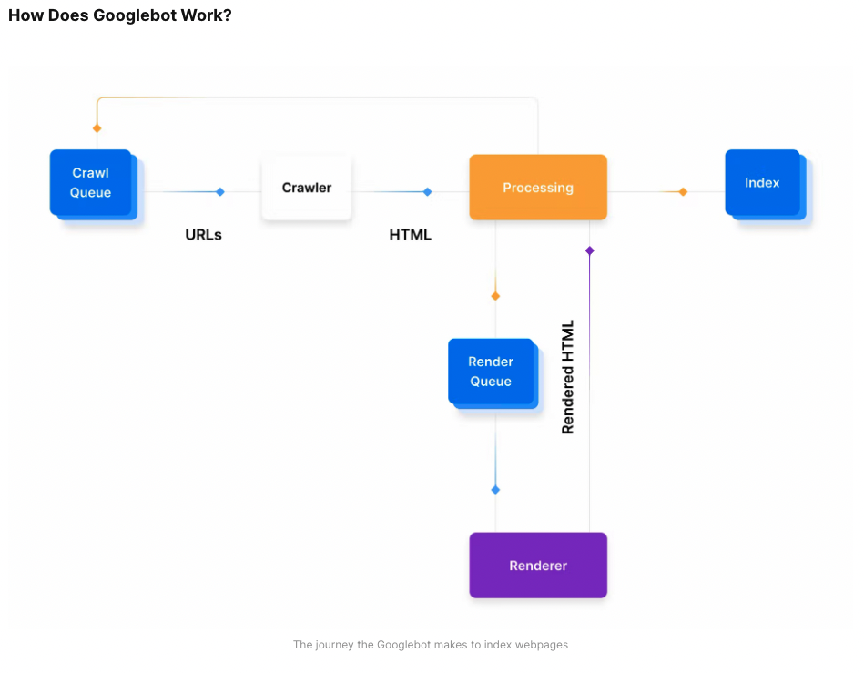

# SEO

- 의문
- SEO 실전
- 개요
  - SEO(Search Engine Optimization)
  - Search System
  - 웹 크롤러

## 의문

## SEO 실전

- [Google Search Console](https://search.google.com/search-console/welcome)
- [네이버 웹 마스터 도구](https://searchadvisor.naver.com/guide/seo-basic-intro)
  - [가이드](https://searchadvisor.naver.com/doc/wmt_guide_ps_websearch.pdf)

## 개요

### SEO(Search Engine Optimization)

- 개요
  - 검색 엔진 최적화
    - 검색 엔진 결과에서 랭킹을 증가시키는 것이 목표
- 중요한 이유
  - organic 방문자수의 증가에 중요
  - Qualitative
    - 방문자가 고객으로 컨버젼될 확률 증가
  - Trustable
    - 브랜드나 미션에 더 높은 컨피던스를 갖을 수 있음
  - Low-Cost
    - 무료
- c.f) SEM(Search Engine Marketing)
  - Sponsored 딱지가 붙은 지불된 광고 엔진
- Optimization 방법
  - Technical
    - 웹 사이트를 제작할때, 크롤링이 가능하고 웹 퍼포먼스가 좋게 제작
  - Creation
    - 특정 키워드들을 타겟팅하는 컨텐츠 전략을 생성
  - Popuplarity
    - 백링크를 사용하여, 사이트가 신뢰받을 수 있다는 것을 알려야 함

### Search System

- 개요
  - Search Engine이라고 불리는 것
- 역할
  - 크롤링
    - 모든 웹사이트들의 컨텐츠를 파싱하는 단계
      - 인터넷에는 3억5천개 이상의 도메인이 등록되어있음
  - 인덱싱
    - 크롤링에서 모은 데이터를 접근할 수 있게, 인덱싱을 함
  - 렌더링
    - js와 같은 바다온 리소스들을 실행하는 것
    - 일부 크롤링 봇은 리소스를 실행하기 전에 인덱싱을 끝냄
  - 랭킹
    - 유저의 인풋에 기반하여, 관련 결과 페이지들을 쿼리해서 가져오는 것
- 특징
  - 크롤링 / 인덱싱은 대부분의 검색 엔진이 유사하게 동작
  - 렌더링 / 랭킹은 대부분의 검색 엔진이 다르게 동작

### 웹 크롤러

구글봇이 동작하는 원리

- 개요
  - 웹 사이트와 웹 페이지를 발견하는 크롤러
- 동작
  - 1 URL 찾기
    - Google Search Console, 웹 사이트들 간의 링크, XML sitemap등 으로부터 링크를 찾음
  - 2 크롤 큐에 추가
    - 보통은 몇초간 대기하나, 렌더가 되어야 한다거나, 인덱싱이 되어야 한다거나, 이미 인덱싱이 되어서 리프레시가 되는 경우에 며칠동안 대기가 필요
  - 3 HTTP 리퀘스트
    - HTTP 리퀘스트를 보내서 헤더를 얻어오고, status code에 따른 행동을 취함
      - 200 - HTML 파싱
      - 30X - 리다이렉트를 따름
      - 40X - 에러를 파악하고, HTML을 로딩하지 않음
      - 50X - 나중에 다시 돌아와서 status code가 변했는지 체크할 수 있음
  - 4 렌더 큐
    - js와 같은 클라이언트 사이드 렌더링이 필요한 경우, 크롤러 봇이 렌더하는 큐
    - 일반적으로 비쌈
  - 5 인덱싱 될 준비
    - 모든 기준이 만족되면, 검색 결과에 인덱싱되고 표시될 자격이 생김

### 크롤링과 인덱싱

- HTTP status code 기초
- Metadata와 웹 컨텐츠를 파싱할때 웹 크롤러가 보는것
- 우리의 사이트에 있는 새 컨텐츠가 올라왔을때 Google과 소통하여 크롤러가 발견하게 하는 법
- meta robot 태그들과 정식 링크를 사용하여 바람직한 인덱스 상태를 나타내는 법

### 렌더링 / 랭킹
