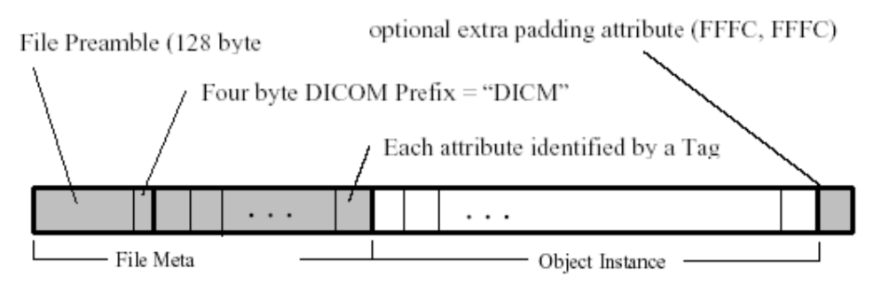
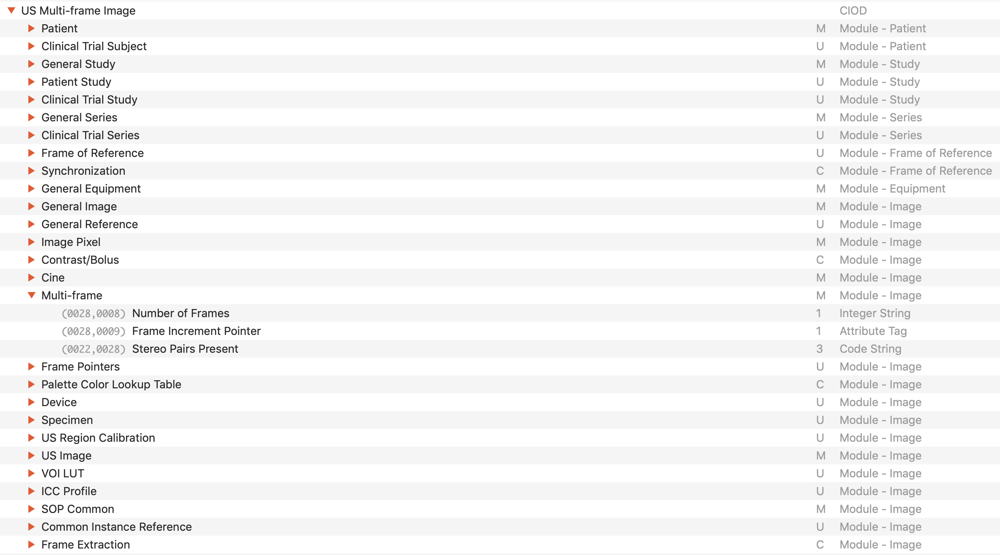
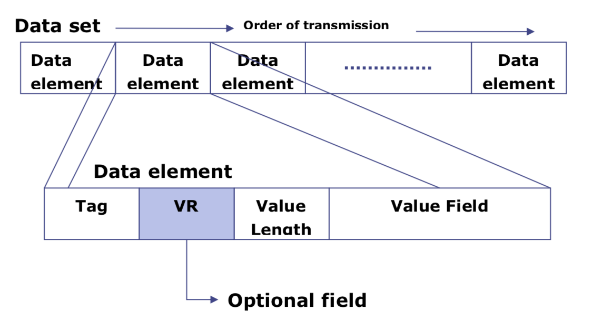

# DICOM(Digital Imaging and Communications in Medicine)

- 의문
- 참고
- DICOM 개요
- DICOM 데이터 포맷
- DICOM 네트워크

## 의문

- 이론 레벨에서의 질문
  - *DICOM이라는 것은, 하나의 인터페이스의 역할을 하는것인지, 아니면 특정한 구현체를 말하는 것인지?*
    - DICOM의 service들은 인터페이스인지?
  - *DICOM data object에서 image pixel data를 저장하는 attribute가 따로 있는데, 여러개의 frame들을 갖는다는게 무슨말이고, 왜 그래야 하는지?*
  - *CS, IS, ST* 이런 건 무엇?
- 구현 레벨에서의 질문
- *normalization?*
  - 프로그래밍 오브젝트
  - 통계
  - 데이터베이스

## 참고

- [DICOM - Wikipedia](https://en.wikipedia.org/wiki/DICOM)

## 큰그림

- 의료용 기기에서 디지털 영상표현과 통신에 사용되는 여러 가지 표준을 DICOM이라고 함
  - 주로 Capture, Store, Communication을 위한 표준
- Pydicom은 python으로 dicom data를 다루기 위한 라이브러리
- Pynetdicom은 python으로 dicom data의 communication을 위한 라이브러리(클라이언트 - 서버를 위한 모듈같은 느낌?)

## DICOM 개요

- DICOM(Digital Imaging and Communications in Medicine)
  - 정의
    - 의료용 기기에서 디지털 영상표현과 통신에 사용되는 여러 가지 표준을 총칭
  - 용도
    - 의학 이미지를 **저장** 하거나 **전송** 하는데에 사용
      - 다양한 제조업자들의 여러 장치들(스캐너, 서버, 워크스테이션, 프린터, 네트워크 기기, PACS(Picture archiving and communication systems))의 이미지 호환을 가능하게 해줌
      - 대형병원이나, 작은 병원에서도 사용중
  - 특징
    - DICOM파일들은 DICOM 포멧에 있는 환자 데이터와 이미지를 받을 수 있는 두 엔티티 사이에서 교환가능함
    - DICOM Conformance Statements *(서로 다른 디바이스끼리 커뮤니케이션 하기 위한 protocol같은 개념?)*
      - 어떤 DICOM class들을 서포트 하는지 정의
      - file format 정의
      - network 커뮤니케이션 프로토콜 정의(TCP/IP를 사용하는)
  - 응용
    - 엑스선 / 초음파, CT, MRI, 방사선 치료의 기준 포함
    - 이미지 전송
    - 이미지 압축
    - 3-D 가시화
    - 이미지 표현
    - 결과 보고

### DICOM 데이터 포맷

DICOM 파일의 구조

- DICOM 파일의 구성
  - File Preamble (128byte)
    - 특별한 사용이나, application profile을 위해 사용 될 수 있음
  - DICOM prefix (4byte)
    - DICM이라는 문자열로, 해당 파일이 DICOM인 것을 명시
  - File Meta elements
    - 파일에 대한 Attribute를 Data Element 모음으로 나타냄
  - Information object
    - 이미지 / 영상 데이터

US Multi-frame IOD를 구성하는 모듈들과 그 중 Multi-frame 모듈에 속하는 Attribute들

- DICOM 파일과 attribute
  - 수천 개 가량의 attribute는 연관성에 따라 소분류인 "module", 대분류인 "Information Entities(IE)"로 분류된다
    - 예시
      - Multi-frame 이미지의 프레임 개수를 나타내는 "Number of Frames" attribute는 "Multi-frame" module에 속하며, 이 모듈은 "Image" IE에 속함
  - 한편 CT Image, MR Image, Digital X-Ray Image등 영상의 종류에 따라 데이터를 규정하기 위해 필요한 attribute들이 다를 수 있는데, 이에 따라 각 영상의 종류는 **IOD(Information Object Definition)** 이라는 것으로 정의되고 각 IOD마다 필요한 attribute들이 정의되어 있음

File Meta elements

- Data Element의 구성
  - Tag (4byte)
    - 앞서 정의된 attribute의 tag로 어떠한 attribute인지 명시
  - VR (2byte)
    - 속성 값의 타입을 명시
  - Value Length (2 or 4byte)
    - Value Field의 길이를 명시
  - Value Field
    - 해당 attribute에 대해 실제 담긴 정보

---

- 정보를 데이터 셋(data set)으로 그룹화 함
  - 예시
    - 흉부 x-ray가 환자 ID를 포함할 수 있음 -> 정보가 분리되는 실수 방지(JPEG가 exif데이터 갖고있는 맥락이랑 비슷)
- DICOM data object
  - attributes
    - name
    - ID
  - special attribute
    - image pixel data
      - 1 DICOM object에서 1 pixel data속성을 갖을 수 있음
      - 다양한 기준으로 압축될 수 있음
        - JPEG, lossless JPEG, JPEG 2000, run-length encoding 등으로..
        - LZW(zip) 압축은 픽셀데이터 뿐 아니라, 모든 데이터셋을 압축하는데에 사용될 수 있으나, 거의 구현되지 않음
    - 여러개의 frame들을 포함할 수 있음 *allowing storage of cine loops(이게 모임?) or other multi-frame data*
- *3가지 다른 데이터 요소 encoding schemes*
  - DICOM uses three different data element encoding schemes. With explicit value representation (VR) data elements, for VRs that are not OB, OW, OF, SQ, UT, or UN, the format for each data element is: GROUP (2 bytes) ELEMENT (2 bytes) VR (2 bytes) LengthInByte (2 bytes) Data (variable length). For the other explicit data elements or implicit data elements, see section 7.1 of Part 5 of the DICOM Standard.
- 네트워크나 파일 사용 등과 같은 모든 애플리케이션에서 위와같은 기본 포맷이 사용되나, 하나의 파일로 작성될 때에는, 일반적으로 true "header"(containing copies of a few key attributes and details of the application which wrote it) 라는게 추가됨
- 이미지 표현
  - GSDF
- 값의 표현
  - 각 attribute은 하나의 value multiplicity를 갖고, 해당 attribute속에 있는 데이터 요소의 수를 나타냄
  - 하나 이상의 데이터 요소가 encoded되면, 연속된 데이터 요소가 "\\"로 분할된다

---

## DICOM 네트워크

- 개요
  - Server / Client 모델로 동작
    - SCP(Server Class Provider) => Server역할
    - SCU(Server Class User) => Client역할
    - 참고
      - AE(Application Entity)
        - SCP/SCU 등 통신의 대상이 되는 단위
        - 한개의 장비가 SCP/SCU 동시에 수행할 수 있음
- SOP(Service-Object Pair) Class
  - 하나의 완전한 행위를 의미하는 단위
  - AE에 대해 특정한 작업 수행 전에 이를 등록
  - 예시
    - Storage Service Class
      - 촬영 영상장비 등이 DICOM 파일을 워크 스테이션 또는 아카이브 등에 전송하여 저장하는 서비스
      - SCU가 SCP에게 C-STORE 요청 메시지를 보내고 SCP가 받은 후 응답 메시지를 보냄
    - Query / Retrieve Service Class
      - SCU가 특정 필터 조건으로 SCP에 저장된 많은 DICOM 파일들을 검색(C-FIND), 검색 조건에 맞는 파일을 SCU에 가져오기(C-GET), 검색 조건에 맞는 파일을 SCP로 전송 (C-MOVE)시키는 데 사용되는 서비스

---

### DICOM Services

- **Services(*정확히 무엇을 의미하는건지?*)**
  - 정의
    - 대개는 네트워크를 통해 데이터를 전송하기 위한 서비스로 구성됨
    - file format for offline media도 나중에 추가됨
  - 종류
    - Store (service)
      - 이미지를 보내거나, 다른 영속적 object들을 PACS나 workstation으로 보내기 위해서 사용됨
    - Storage commitment
      - 이미지가 영구적으로 디바이스에 저장되었는지 확인하기 위해 사용되는 서비스
      - Service Class User(SCU - 클라이언트와 유사)가 Service Class Provider(SCP - 서버와 유사)에 이미지 파일을 로컬에서 지워도 되는지 확인하기 위함
    - Query / retrieve
      - 워크스테이션이 이미지의 리스트와 같은 것들을 찾을 때, 그리고 사진 archiving 시스템으로 부터 가져오는 것을 가능하게 함
    - Modality worklist
    - Modality performed procedure step
    - Print
    - **Off-line media (files)**
      - DICOM media의 일부분에 속하는 경우
        - 의미없는 8문자
      - DICOM media의 일부분에 속하지 않는 경우
        - 확장자는 `.dcm`
          - *DICOM media는 무엇을 의미하는가?*
      - MIME type은 `application/dicom`
      - DICOM files typically have a .dcm file extension if they are not part of a DICOM media

---

- Application areas
  - core application of DICOM standard
    - (의료 이미지의) 찍기 -> 저장하기 -> 분배하기
- IP의 포트넘버 지정
  - 104(TCP, UDP)
  - 2761(TLS - TCP, UDP)
- 단점
  - optional fields가 너무 많아서 잘못 입력되거나, 입력되지 않는 경우가 많음
  - 파일 포맷이 executable code나 malware를 포함할 가능성이 있음
