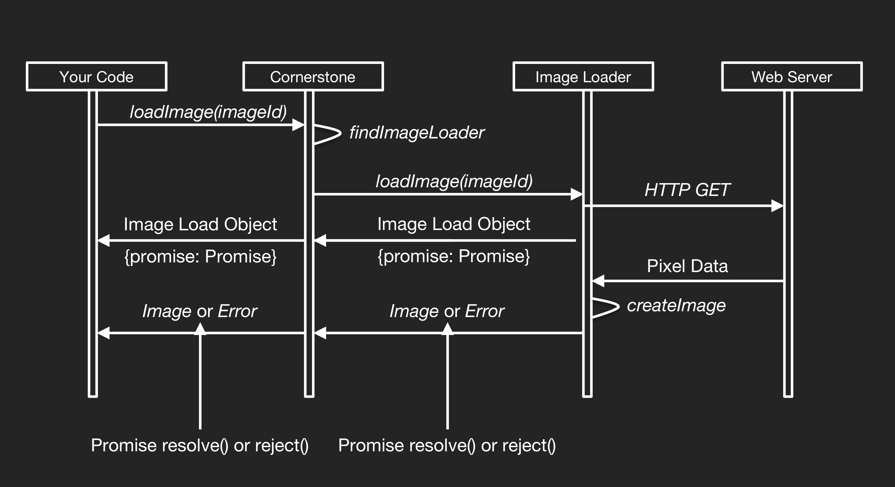

# cornerstone js

- 의문
- 개요
- 컨셉
  - Enabled Elements
  - Image Ids
  - Image Loaders
  - Viewports
  - Images
  - Pixel Coordinate System
  - Rendering Loop
  - Libraries
  - Rendering Pipeline
  - Metadata Providers
- Advanced
  - Image Cache
  - Enabled Element Layers
  - Modality LUT and VOI LUT
  - Color Lookup Tables
  - WebGL Rendering Pipeline
  - Retrieving Pixel Data
  - Legacy Browser Support

## 의문

- *VOI, LUT이 무엇인가?*
  - https://docs.cornerstonejs.org/advanced/modality-lut-and-voi-lut.html
  - VOI
    - Value of Interest
  - LUT
    - LookUp Tables?
- WebGL이란 무엇인가?

## 개요

- 웹 기반 medical imaging platform
  - DICOM 파일의 웹 뷰어 역할
    - 히트맵 표현
    - viewport 조작 등이 가능

## 컨셉

### Enabled Elements

- interactive medical image를 보여주는 `div`태그
- 이미지 출력 과정
  - ① cornerstonejs 라이브러리 import(script tag or commonjs import)
  - ② 하나 혹은 그 이상의 image loaders(cornerstone이 pixel data를 업로드하기 위해서 사용하는) js 파일을 참조
  - ③ DOM에 이미지를 표시하기 위한 DOM element를 추가
  - ④ CSS를 사용해서 해당 element를 원하는 width와 height에 맞춰서 위치를 배치시킴
  - ⑤ `enable()` api를 호출해서 element가 이미지를 표시하는 것을 준비시킴
  - ⑥ `loadImage()` 를 호출해서 image를 로드함
  - ⑦ `displayImage()`를 호출해서 loaded image를 표시함
- cornerstone tools library를 사용해서 windowing, pan, zoom, measurements를 수행할 수 있음
- cornerstoneWADOImageLoader를 사용해서 WADO로부터 직접 데이터 uri를 제공받아서 데이터를 표시할 수 있음
  - 대신 그 떄에는 [여기](https://github.com/cornerstonejs/cornerstoneWADOImageLoader/blob/master/src/imageLoader/wadouri/register.js)에서 지정된 `dicomweb`, `wadouri`, `dicomfile`을 scheme으로 갖는 imageID를 생성해야 함

### Image Ids

- 개요
  - cornerstone이 표시할 하나의 이미지를 특정하는 URL
  - cornerstone은 url의 scheme을 보고 어떤 이미지를 로드할 지 결정함
    - 동시에 다른 프로토콜을 써서 다양한 방법으로 데이터를 가져올 수 있게 함
  - image loader가 URL의 컨텐츠와 포맷을 결정함
- 예시
  - `wadouri://localhost:5000/static/images/123.dicom`

### Image Loaders

Image Loader의 논리적 흐름도



```js
// Register the url scheme 'myCustomLoader' to correspond to our loadImage function
cornerstone.registerImageLoader('myCustomLoader', loadImage);

// Images loaded as follows will be passed to our loadImage function:
cornerstone.loadImage('myCustomLoader://example.com/image.dcm')
```

- 개요
  - ImageId를 인자로 받고 그에 대응하는 Image Load Object를 반환하는 js function
    - Image Load Object는 Promise를 포함
  - 반드시 서버와 통신할 필요가 없음(custom Image Loader를 만들어서 직접 이미지를 load할 수 있음)
- 흐름
  - ① cornerstone 오브젝트에 ImageLoader들을 URL scheme에 대응해서 등록
  - ② 애플리케이션이 `loadImage()` api를 사용하여 이미지를 로드하는 요청을 보냄
  - ③ cornerstone은 해당 요청을 URL scheme에 대응하여 등록된 ImageLoader에게 위임
  - ④ 해당 ImageLoader는 Promise를 포함하는 Image Load Object를 반환. 해당 Promise는 pixel data를 획득하면 Image Object와 함께 resolve
    - 여기서 remote server와 통신을 하는 경우도 있고,
    - pixel data를 압축 해제 하는 경우도 있고,
    - pixel data를 Cornerstone이 이해할 수 있는 포맷으로 변환할 수 있음
    - image를 base64로 암호화 한 것을 ImageLoader plugin자체에 삽입하는 경우도 있음
  - ⑤ resolved Promise와 함께 Image Object를 반환하고, `displayImage()`API를 사용해서 표시함

### Viewports

- 개요
  - 각 Enabled Element는 어떻게 Image가 렌더링 되어야 한다라고 정해 놓은 Viewport라는 개념을 갖고 있음
- 속성
  - scale
    - zoom
  - translation
  - voi
    - windowWidth & windowCenter
  - invert
    - 이미지가 뒤집혀졌는지

### Images

- 개요
  - Image Loader가 반환한 이미지 오브젝트

### Pixel Coordinate System

- 개요
  - (0.0,0.0) -> 왼쪽 위
  - (0.5,0.5) -> 정중앙

### Rendering Loop

- 개요
  - Viewport(e.g windowing, pan, zoom, 등등..) 변화는 `requestAnimationFrame`에 기반한 rendering loop를 통해서 업데이트 됨
    - `requestAnimationFrame`은 `setInterval`과 비슷한 역할을 하는 함수이나, animation구현에 더 적합
- 렌더링 과정
  - `draw()` callback이 RAF(Request Animation Frame)에 등록됨
  - `draw()`는 스크린에 한 프레임이 나타난 바로 다음에 호출됨
  - `draw()`함수가 호출되면
    - element가 re-rendering 예정이면, 렌더링 되고, `draw()`가 RAF와 함께 다시 등록됨
    - element가 re-rendering 예정이 아니면, 아무런 일이 일어나지 않고, callback이 RAF와 함께 다시 등록됨
    - element가 `disabled()` 호출 받으면, callback자체가 등록되지 않고, rendering loop를 종료함
- 의미
  - 각각의 cornerstone element는 각자의 RAF loop를 등록함
  - 모든 인터렉션(windowing, pan, zoom 등)은 결합되고 다음 프레임에 render됨

### Libraries

cornerstone 라이브러리 관계도


- 개요
  - cornerstone 이외에도 다양한 modular library 제공
- 구성
  - Cornerstone Core
    - 이미지 렌더링 파이프라인, 로딩, 캐싱, 뷰포트 변환
  - Cornerstone Tools
    - 확장 툴 제작 지원, 마우스, 키보드, 터치 기기 지원
  - Cornerstone WADO Image Loader
    - DICOM Part 10 파일들을 위한 이미지로더
  - Cornerstone Web Image Loader
    - Web 이미지 파일들(PNG, JPEG)를 위한 이미지 로더
  - Cornerstone Math
    - 툴 개발을 지원하는 수학적 유틸리티 함수나 클래스들
  - DicomParser
    - DICOM Part 10 parsing library

### Rendering Pipeline

rendering pipeline의 workflow 예시


- 개요
  - 이미지 타입(grayscale, label map, viewport pseudocolor) 에 따라서 다양한 이미지 렌더링 파이프라인을 선택

### Metadata Providers

- 개요
  - 코너스톤에서 이미지와 관련된 메타데이터를 접근하기 위한 interface 역할을 하는 js 함수
  - 유저가 각각 특정 이미지 마다 반환하고 싶은 메타데이터를 반환하기 위해서 custom provider를 정의할 수 있음
- 기초
  - 다수의 Metadata Providers를 등록 가능
  - 각각의 provider는 개발자가 원하는 정보를 제공
  - provider는 prioirty 값과 함께 추가될 수 있는데, 이는 호출 순서에 영향을 준다
  - DICOM 이미지의 경우에는, Cornerstone WADO Image Loader에 의해서 불러와질 때, 그것들의 메타데이터는 metadata provider로 자동적으로 파싱되고 추가된다
  - Cornerstone Tools 에서는 특정 metadata types가 tools에게 메타데이터를 제공해주기 위해서 사용됨

Metadata Provider의 예시(특정 imageId에 대한 Image Plane metadata 반환)

```js
function metaDataProvider(type, imageId) {
  if (type === 'imagePlaneModule') {
    if (imageId === 'ct://1') {
      return {
        frameOfReferenceUID: "1.3.6.1.4.1.5962.99.1.2237260787.1662717184.1234892907507.1411.0",
        rows: 512,
        columns: 512,
        rowCosines: {
            x: 1,
            y: 0,
            z: 0
        },
        columnCosines: {
            x: 0,
            y: 1,
            z: 0
        },
        imagePositionPatient: {
            x: -250,
            y: -250,
            z: -399.100006
        },
        rowPixelSpacing: 0.976562,
        columnPixelSpacing: 0.976562
      };
    }
  }
}

// Register this provider with CornerstoneJS
cornerstone.metaData.addProvider(metaDataProvider);

// Retrieve this metaData
var imagePlaneModule = cornerstone.metaData.get('imagePlaneModule', 'ct://1');
```

## Advanced

### Image Cache

- 개요
  - Image를 Image Cache에 저장
    - LRU(Least-Recently-Used) cache

### Enabled Element Layers

- 개요
  - Enabled Element에 레이어를 추가할 수 있고, 그렇게 하면 labels maps를 표현하거나 image를 합성할 수 있음
  - 하나의 enabled element에 레이어를 추가할 수 있고, 각 레이어들은 Image를 갖고 Viewport를 갖음
  - 한번에 한 레이어만 active할 수 있음
    - `setViewport`, `getViewport`와 같은 일반적인 함수는 `active layer`에만 적용
  - 레이어들은 visibility, opacity 속성을 갖으며, Layer ID에 의해서 unique하게 참조될 수 있음

### Modality LUT and VOI LUT

### Color Lookup Tables

### WebGL Rendering Pipeline

### Retrieving Pixel Data

### Legacy Browser Support
