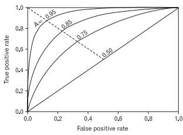
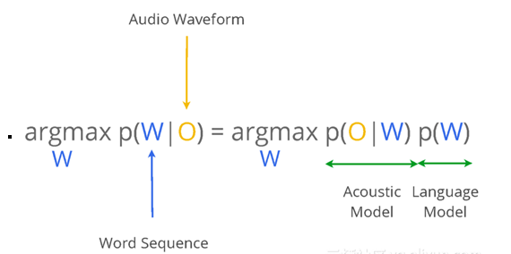
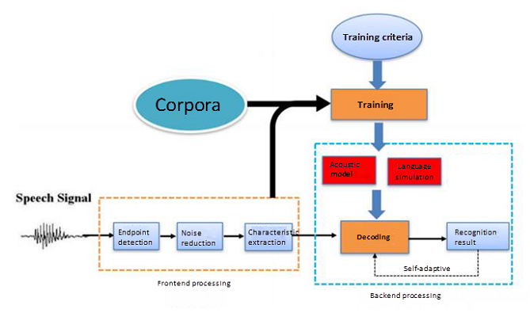
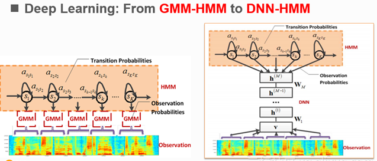
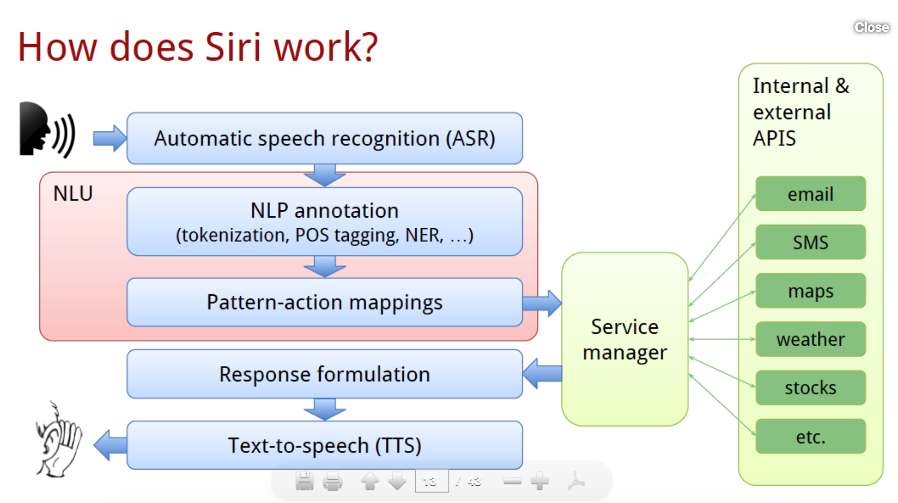
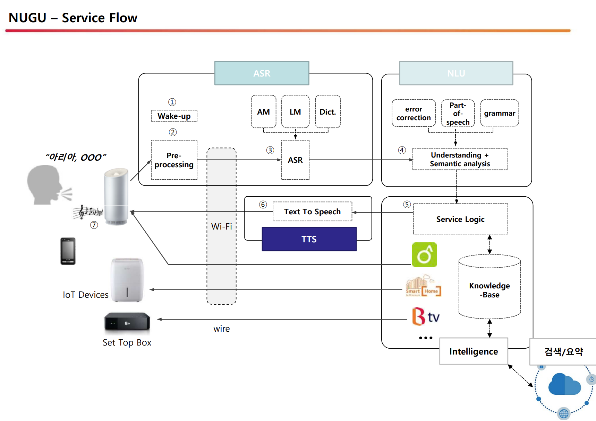
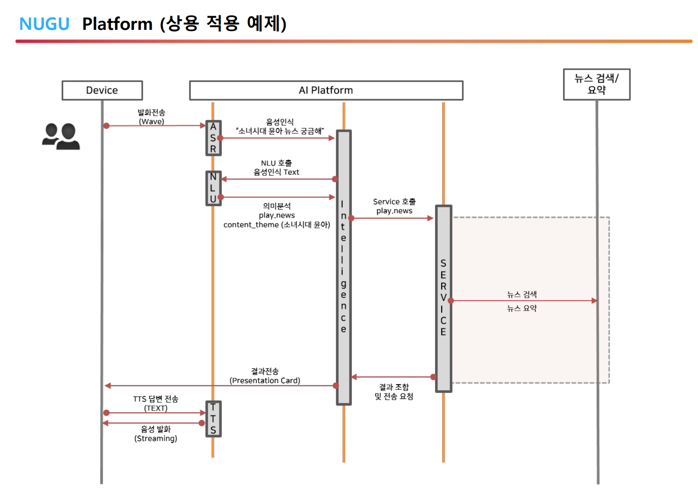
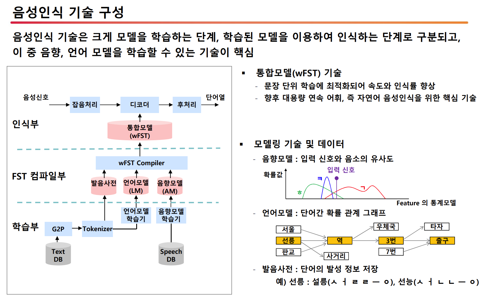
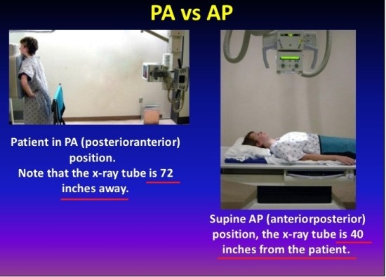

# @@VUNO

- 의문
- 알아두면 좋은 용어들
  - Research
  - Medical term
- Domain지식
  - ASR
  - Signal

## 의문

- *ASR과 NLP의 차이는?*

## 알아두면 좋은 용어들

### Research

[참고](http://www.cbgstat.com/method_sensitivity/sensitivity.php)

- 민감도(sensitivity) & 특이도(specificity)
  - 개념
    - Sensitivity
      - **질병이 있는 사람을 얼마나 잘 찾아 내는가에 대한 값**
      - 양성(질병이 있는 개체)에 대해 양성이라고 진단하는 비율
    - Specificity
      - **정상인 사람을 얼마나 잘 찾아 내는가에 대한 값**
      - 음성에 대해 음성이라고 판단하는 비율
  - 특징
    - 좋지 않은 진단 방법일 경우 한 쪽이 증가하면 다른 한 쪽이 감소
      - 민감도와 특이도 둘 다 높은 진단 방법을 찾는 것이 관건
    - 질병인지 아닌지 이미 정답을 알고 있는 개체(이미 잘 알려진 진단 방법(gold standard))를 이용하여 새로운 진단 기기의 성능을 시험하는 상황에서 필요한 개념
      - True Positive(TP)
        - 새로운 진단 방법(양성 - 질병), 실제(양성)
        - **새로운 진단 방법이 양성으로 판단했는데, 그것은 진짜로 맞는 결과다**
      - True Negative(TN)
        - 새로운 진단 방법(음성 - 정상), 실제(음성)
      - False Positive(FP)
        - 새로운 진단 방법(양성), 실제(음성)
      - False Negative(FN)
        - 새로운 진단 방법(음성), 실제(양성)
    - 수식
      - Accuracy
        - `(TP + TN) / (TP + FP + FN + TN)`
          - gold standard와 얼마나 유사한 판단을 했는가
          - *FP, FN가 비슷한 cost를 가질 때 유용*
            - *무슨소리고 왜?*
      - Precision
        - `TP / (TP + FP)`
      - Sensitivity(Recall)
        - 환자라고 판명한 사람 중 진짜 환자인 사람 / 실제로 환자인 사람의 수
          - `TP / (TP + FN)`
      - Specificity
        - 정상인이라고 판명한 사람 중 진짜 정상인인 사람 / 실제로 정상인인 사람의 수
          - `TN / (TN + FP)`
      - F1 score
        - `2 * Recall * Precision / (Recall + Precision)`
          - Precision과 Recall의 weighted average
            - 1에 가까울 수록 낮은 false positives, 낮은 false negative
          - uneven class distribution을 갖을 때, accuracy보다 유용
          - Recall과 Precision의 조화평균
      - Youden's J statistic
        - 양자 진단 테스트의 성능을 나타내는 통계량
        - `J = sensitivity + specificity - 1 = TP/(TP+FN) + TN/(TN+FP) - 1`
          - 0은 진단 테스트가 실제 질병을 갖고 있거나 갖고 있지 않은 그룹에 같은 비율로 양성으로 판단하는 경우
          - 1은 false positive, false negative가 없다는 소리
    - 해석 예시
      - 질병의 특징에 따라서 민감도를 높일 것인지 특이도를 높일 것인지를 고려하기도 함
        - 매우 심각한 질병 => 민감도를 높임 대신 재검사를 실시해서 FP를 줄임
      - **Sensitivity가 올라가는데 Specificity가 낮아지는 경우, 모델의 민감도가 증가해서 그 trade-off로 FP이 증가해버려서 Specificity가 낮아지는 경우가 발생할 수 있음**
      - 치과의 경우, 치과 진료는 기본적으로 비가역적이기 때문에 Specificity가 매우 중요하다고 할 수 있을 것이다.

ROC curve

*아직 이 커브에 대해서 이해가 완전히 다 되지 않은 듯 하다*

- ROC curve(Receiver Operating Charateristic curve)
  - 개요
    - x축은 False Positive rate
    - y축은 True Positive rate
    - Precision과 관련있는 그래프
  - 특징
    - 밑면적(AUROC)가 1에 가까워 질 수록 좋은 성능을 의미함(0.5에 가까울 수록 랜덤에 가까운 성능)
  - 장점
    - 커브의 면적을 재어 **다양한 기준(CAD에서는 모델)** 에서의 TPR, FPR을 복합적으로 평가 가능
      - `TPR = TP/(TP+FN) = Sensitivity`
      - `FPR = FP/(FP+TN)`
    - 실제로 진단의 기준을 어디로 잡을지 결정하는 데에 도움이 됨
  - AUC(Area Under the Curve)
    - 개요
      - 임의의 curve에 대하여 그 아래의 면적을 계산한 것
  - ROC AUC or AUROC
    - 개요
      - ROC 커브의 밑면적

### Medical term

- clinician
  - 임상의
- CAD(Computer-Aided Detection)
  - 개요
    - 소프트웨어를 이용하여 영상의학 진단에 도움을 주는 프로그램
- EMR(Electronic Medical Record) & EHR(Electronic Health Record) & EPR(Electronic Patient Record)
  - 개요
    - 디지털 형태로 체계적으로 수집되어 전자적으로 저장된 환자 및 인구의 건강정보
    - 포함되는 데이터
      - 병력, 약물복용 및 알레르기, 예방접종 상태, 검사실 검사결과, 영상의학 이미지, 생체징후, 나이, 성별, 청구정보
- ECG(Electrocardiogram)
  - 개요
    - 심전도. 심장의 전기적 활동을 해석한 것

## Domain지식

ASR시스템의 통계적 모델링

ASR시스템의 구조

Backend processing의 Decoding 프로세스는 주로 train된 AM / LM을 사용하여 최적의 output character sequence를 얻는 것

AM에서의 deep learning 등장

### ASR(Automatic Speech Recognition)

How does Siri work?

How does Nugu work1?

How does Nugu work2?

How does Nugu work3?(음성 인식 기술 구성)

- NLP(Natural Language Processing) vs SR(Speech Recognition)
  - SR
    - 사람의 말을 **인식** 하는 소프트웨어의 능력
    - Sound -> text
  - NLP
    - 컴퓨터 시스템이 사람의 언어를 **이해** 하는 능력
    - 종류
      - NLU(Natural Language Understanding)
        - 서울 날씨 알려줘 -> `Domain: Weather, Intent: ask.weather, Entity: date.tomorrow, location.Seoul`
      - NLG(Natural Language Generatation)
        - `Domain: Weather, Intent: ask.weather, Entity: date.tomorrow, location.Seoul` -> 내일 서울은 쌀쌀하고 구름이 다소 낄 예정입니다. 최저 기운은 영하1도, 최고 기온은 ...
  - TTS(Text-To-Speech)
    - 텍스트를 말로 변환
    - 내일 서울은 쌀쌀하고 구름이 다소 낄 예정입니다. 최저 기운은 영하1도, 최고 기온은 ... -> 음성
- AM(Acoustic Model)
  - 개요
    - Acoustic Model로서, 음성 신호와 음소 또는 음성을 구성하는 다른 언어 단위간의 관계를 나타내기 위해 음성 인식에 사용됨
    - 오디오 녹음 및 해당 녹음의 transcription으로부터 학습
    - 소리의 통계적 표현을 생성하여 각 단어를 구성
      - *통계적 표현이 무엇일까*
    - `p(O|W)`를 계산 하는 것
      - 모드에 대한 음성 파형을 생성할 확률을 계산
      - 오버 헤드의 상당 부분을 차지하며, 시스템 성능을 결정함
        - (GMM-HMM (Gaussian Mixture Model - Hidden Markov Model))기반 AM이 전통적인 음성 인식 시스템에서 널리 사용
        - DNN-HMM(Deep Neural Network - Hidden Markov Model)
            - GMM-HMM 과 비쇼하여 TIMIT dataset에서 우수한 성능을 보임
            - Convolutional Neural Network / Recurrent Neural Network 의 사용으로 AM modeling을 크게 향상
            - LSTM 활용
- LM(Language Model)
  - 개요
    - 언어의 단어단어 시쿼스 모델링
- 최신 음성 인식 시스템
  - AM과 LM을 둘다 활용하여 음성의 통계적 특성을 나타냄
  - AM과 LM이 결합되어, input으로 주어진 오디오 세그먼트에 해당되는 top-ranked 단어 시퀀스를 얻는 역할을 함
    - 아마도 `P(W|O)`가 최대가 되도록하는 W를 AM(`P(O|W)`)・LM(`P(W)`) 값을 선택한다는 것 같음
  - 목적
    - **입력 waveform sequences를 해당 단어 또는 character sequences에 매핑**
      - *채널 디코딩* 또는 패턴 분류 문제로 간주 될 수 있음

### Signal

- EWS(Early Warning Score)
  - 개요
    - 환자의 병세의 정도를 빨리 판단하기 위하여 사용되는 의료 서비스들이 사용하는 가이드
    - vital sign에 기반
      - respiratory rate, oxygen saturation, temperature, blood pressure, pulse/heart rate, AVPU response
  - 배경
    - 1990년대 후반에 많은 연구들이 병원 내에서 특정 vital sign이 비정상적으로 증가하게 되면 cardiac arrest(심정지)나 in-hospital deterioration이 나타난다는 연구결과들이 나타남
  - 최적의 사용
    - 특정 지표는 심정지 위험도를 급격히 증가시키는 것을 확인
    - 반드시 정해진 지표는 없고, 추가할 수 있음
  - 종류
    - **MEWS(Modified)**
      - 일반적으로 다양한 치료 상황에서 많은 사람들의 요구조건을 맞춘 디자인
    - PEWS(Paediatric Early Warning System)
      - 나이 16세 이하의 환자들을 대상으로 디자인
    - MEOWS(Modified Early Obstetric Warning Score)
      - 임산부 여성 환자들을 대상으로 디자인
    - NEWS & NEWS2(National)
      - UK 국가의 기준으로 디자인
- DEWS
  - 개요
    - MEWS에 비해서 DEWS가 더 효과적일까?(Sensitivity, Specificity)

### BoneAge

### Pathology

- 병리학
  - 개요
    - 질병이나 상처의 원인과 결과를 연구하는 의학 분야
      - 세포, 조직, 장기의 표본을 육안이나 현미경 등을 이용하여 검사해, 그것들이 질병에 침범되었을 때에 어떤 변화를 나타내는지에 대해서 연구하는 학문
    - 해부학 및 조직학과 밀접한 관련이 있음
    - 병원에서 병리의사는 병리학적 지식을 바탕으로 임상의사들에게 병을 알려주는 역할을 함
      - 기초의학과 임상의학의 중간자
      - 임상의사에 의해 채취된 인체의 표본으로 병리검사를 시행하여 정확한 진단에 이르게 하여 환자의 치료방향을 결정하는데 근거를 제공
    - 법의학도 병리학에 기반을 두고 있음
- 병리과
  - 개요
    - 환자의 질환에 대해 정확하고 신속한 진단을 제시 -> 치료방침 결정 -> 예후 판정 -> 치료 적정성 판단하는 근거 제공
    - 병리보고서 기록은 질병분류 및 등록, 통계의 근간이 되며, 질병연구의 토대 및 기초가 됨
  - 종류(서울대병원 기준)
    - 조직병리(외과병리)
      - 내시경 등을 이용한 생검 및 수술로 채취한 인체조직을 대상으로 조직의 형태학적 변화를 현미경으로 관찰하여 질병을 발견하고 진단하는 분야(암의 최종 진단)
      - 수술중에서도 응급동결절편검사 시행
    - 세포병리
      - 인체 조직의 세포를 검사하여 질병을 발견하고 진단하는 분야
      - 조직 검사에 비해 침습성이 덜함
    - 면역조직화학염색검사
      - 병변 조직이 발현하는 특이한 항원에 대한 항체를 반응시켜 그 양상을 관찰함으로써 병변을 진단하는 방법
      - 특이성과 민감도가 높음
    - 전자현미경검사
      - 전자파를 이용하여 조직을 수만 배로 확대시켜 세포내의 미세한 형태학적 변화를 관찰하여 진단하는 검사법
    - 분자유전체병리검사
      - 염기 서열 분석
    - 부검
      - 사망 후 시체를 해부하고 현미경으로 조사하여 질병의 원인과 경과를 학문적으로 조사

### Chest X-ray

X-ray PA vs AP

- X-Ray
  - Chest PA(Posterior Anterior) vs Chest AP(Anterior Posterior)
    - Chest PA
      - 흉부 X-ray를 뒤에서 앞으로 찍음
      - 먼 거리에서 촬영하기 때문에 상이 작고 선명하게 촬영
      - 반듯이 서 있을 수 있는 경환자 or 일반인에게 시행
    - Chest AP
      - 흉부 X-ray를 앞에서 뒤로 찍음
      - 가까운 거리에서 촬영하기 때문에 상이 크고 흐릿하게 촬영
        - portable X-ray 기기 사용하기 때문에 먼 거리 촬영 어려움
      - 반듯이 설 수 없고 검사실까지 거동할 수 없는 중환자 or 소아 환자에게 시행 -> 누운자세 or 반좌위 자세로 촬영
