# 가설 검정

- 의문
- 검정의 기초
-

## 의문

## 헷갈리는 용어 정리

- 유의성
  - 모집단에 대해서 가정된 명제를, 표본에 의거하여 검증 하는 경우, 검증결과가 이론상의 비율 오차의 범위내인지, 아니면 그 이상의 의미가 있는 것인지를 알 수 있는 성질
- 유의 수준
  - 어떤 정도의 희소확률로 생각하는가에 의하여, 가설 검정 결과가 유의한지 아닌지가 변하는데, 그러한 기준 확률을 유의 수준이라고 표현하며 alpha로 나타냄
  - 예시3에서는 유의 수준이 0.1 이라면, 가설 기각, 0.001이라면 X = 14는 충분히 일어날 수 있는 확률임
- 통계량
  - 표본을 요약하여, 모집단의 모수의 여러가지 추정에 사용되는 값
- 추정량
  - 모수를 추정하기 위해서 표본으로 부터 구한 통계량
- 검정 통계량
  - 가설 검정을 하기 위해서 표본으로 부터 구한 통계량

## 검정의 기초

- 통계적 가설의 유의성의 검정
- **가설에서 기대한것과, 관측한 결과와의 차이**
  - 이러한 차가 단순히 우연에 의해서 일어난것인지 아닌지
  - 확률의 기준에서 평가
- 의의
  - 통계적 판단의 논리학
  - 과학 방법론

## 검정의 사고방식

### 유의성(significance) 검정

- 유의성
  - **모집단에 대해서 가정된 명제를, 표본에 의거하여 검증 하는 경우, 검증결과가 이론상의 비율 오차의 범위내인지, 아니면 그 이상의 의미가 있는 것인지**
    - 그 이상의 의미가 있는 경우를 유의하다고 함(significant)
  - 예시1
    - 콩의 형태의 도수분포가, 이론상의 가설에 합치하는지
    - 엄밀하게 9:3:3:1이 되지 않음
    - 관찰을 해서 위의 도수분포의 표본 생성
    - 표본과 이론상의 비율(모집단)의 차이가 오차 범위 내인지 확인
- 가설(통계적 가설)
- 유의성 검정(test of significance)
  - 가설 검정의 본질
    - 해당 가설이 유의한지 아닌지에 따라, 기각할지 기각하지 않을지 결정
  - 예시2
    - 흡연과 폐암의 인과관계 유무
      - 둘 사이의 관계는 확률적 관계식으로 이루어질 수 있는가? 라는 가설을 세울 수 있음
  - 유의성
    - 표본이 유의미한 벗어남(고려할 수 있는 오차구간으로부터)을 나타낼 확률로 나타냄
    - 확률분포
  - 예시3
    - 가설: 어떤 동전은 생김새에 왜곡이 없다
    - 그 동전을 20번 던져서 14번 앞면이 나옴
    - 왜곡이 없다는 것 == p가 1/2인 코인이라는 모집단분포에 대한 가설
    - 만일 이 가설이 참이라면, 앞면이 나올 횟수 X에 대하여, P(X >= 14) = 1 - 0.9423 = 0.0577
    - X = 14 라는 표본은, 가설을 고려해보면, 해당 표본이 발생하지 않는 매우 떨어진(오차 구간에서의 벗어남이 유의한) 값이다.
    - 결국 p = 1/2 라는 가설은 잘못되어있다고 판단할 수 밖에 없음
    - 가설이 **기각** 되었음
- **유의 수준** (significant level)
  - 어떤 정도의 희소확률로 생각하는가에 의하여, 가설 검정 결과가 유의한지 아닌지가 변하는데, 그러한 기준 확률을 유의 수준이라고 표현하며 alpha로 나타냄
  - 예시3에서는 유의 수준이 0.1 이라면, 가설 기각, 0.001이라면 X = 14는 충분히 일어날 수 있는 확률임

### 귀무가설과 대립가설

- 가설 채택(accept)
  - 어떠한 가설이 기각되어, 그 가설의 부정이나 다른 조건의 가설이 채택되는 경우
- 가설의 종류
  - **귀무가설(null hypothesis)**
  - **대립가설(alternative hypothesis)**
- 귀무가설과 대립가설의 관계
  - 대개 귀무가설을 기각하면 대립가설을 채택하는 것이 됨
  - 귀무가설을 기각할지 안할지 결정에 대한 모든 경우의 수
    - 제 1종 **오류**
      - 귀무가설이 참인데, 그것을 기각해버리는 경우
      - 생산자의 리스크
    - 제 2종 오류
      - 귀무가설이 거짓인데, 그것을 채택할 경우
      - 소비자의 리스크
      - e.g
        - 참치캔에 들어있는 수은의 양은 유해한 수준이인가?
          - H0: 참치 캔 속에 들어있는 수은의 양은 인체에 유해하지 않다
          - H1: 참치 캔 속에 들어있는 수은의 양은 인체에 유해하다
    - 예시
      - 대량 생산의 품질관리
      - 형사 소송에서의 무죄를 유죄라고 하는 오류
      - 유죄를 무죄라고 하는 오류
  - 현재는 유의성 검정 이상의 발전된 사고방식이, 일반적인 가설검정의 방법이 됨
- 귀무가설의 채택
  - 유의성검정에서는 가설을 기각, 부정하는 것이 주요 내용
  - 귀류법
  - 가설이 기각되지 않았다고 해도, 적극적인 지지 / 증명을 의미하지 않음

### 기각역과 양측 / 단측 검정

- **기각역(rejection region)**
  - 귀무가설을 기각해야만 하는 통계량의 값의 집합
  - 양측대립가설(two-sided alternative hypothesis)인 경우, t의 값이 현저히(유의 수준으로 정해짐) 0으로부터 좌우에 떨어진 영역 `|t| > talpha/2(n-1)`
    - 양측 검정(two-sided test)
    - 단측 검정(one-sided alternative hypothesis)
      - `t < -talpha(n-1)`
      - `t > talpha(n-1)`
    - 양측 / 단측 검정은 현실 문제의 내용에 따라서 우리가 결정함
- **채택역(acceptance region)**
  - 귀무가설을 기각하지 않는 영역
- 단측검정 vs 양측검정
  - 양측
    - 모수 theta의 값이 어떤 목표값과 같은지 아닌지 알아볼 때 사용
    - e.g) 기계의 정확도가 크게 빗나가는지 확인
  - 단측
    - 모수의 크기가 이론적 / 경험적으로 예측되는 경우
    - e.g) 영어 특별강의의 효과 검정에서, 특별강의는 대개 득점이 향상에 도움이 될 것으로 예상 가능

## 정규모집단에 대한 가설검정

- 모평균에 관한 양측검정
- 단측검정
- 두 정규모집단의 모평균의 차의 검정
- 중심극한정리로부터의 응용

### 1. 모평균에 관한 검정

#### 양측검정에서의 귀무가설과 대립가설

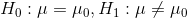

X bar가 mu0으로부터 얼마나 떨어져있는지 비교하는 것으로 행해짐

sigma^2가 이미 알려진 경우 -> z검정

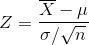

표본정규분포표로부터 얻어지는 퍼센트점 Zalpha/2와 비교해서 `|Z| > Zalpha/2`에서 H0을 기각하고, `|Z| <= Zalpha/2`에서는 H0을 기각하지 않음

sigma^2가 미지인 경우 -> t검정

#### 단측검정에서의 귀무가설과 대립가설

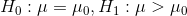

- 위와 같이 귀무가설과 대립가설을 세울 수 있음
- 단측검정은 양측검정에서의 확률변수의 분포를 따름
  - 그러나, 유의수준이 다르게 설정되므로 그것에 맞춘 계산이 필요함(이미 모평균보다 더 높거나 낮다는 가정이 포함되어있음)
- 예시
  - 영어 특별강의 전후의 스코어 비교

### 2. 모분산에 대한 가설 검정

**정규모집단의 모분산에 대한 카이제곱 검정**

검정 통계량

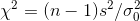

검정의 유의 수준을 alpha로 두면, chi^2분포표에서 아래와 같은 chi^2(n-1)의 퍼센트점을 구함

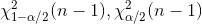

대립가설이 `모분산 != 가정한 분산`이면 양측검정 시행

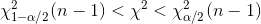

대립가설이 `모분산 > 가정한 분산`이면 우측검정

왜냐하면, chi^2 값에서 우리는 모분산 대신 가정한 분산을 대입할 것이므로, 대립가설이 모분산이 더 큰 경우는, 가정한 분산을 대입한 chi^2 값이 채택역의 최댓값보다 클 것이다.(왜냐면 `chi^2 = (n-1)s^2/sigma_0^2`)

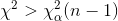

대립가설이 `모분산 < 가정한 분산`이면 좌측검정

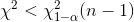

### 3. 모평균의 차의 검정

- 2표본 검정(two-sample test)
  - 새로운 치료법을 한 그룹에만 시도하여, 두 그룹의 결과의 차이를 검정
  - 처리군(treatment group)
    - 치료를 행한 그룹
  - 제어군, 대조군(control group)
    - 실험을 관리하기 위한 그룹

- 두 정규모집단 N(mu1, sigma1^2), N(mu2, sigma2^2)각각으로부터 크기 m, n의 표본, X1, X2, ..., Xm, Y1, Y2, ..., Yn을 추출했다
- 귀무가설
  - H0: mu1 = u2
- 대립가설
  - 양측검정: H1: mu1 != mu2
  - 단측검정: H1: mu1 > mu2 혹은 H1: mu1 < mu2

검정방법1: 두 분산이 같은 경우

합병 분산 이용

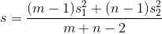

t통계량 구함(t(m+n-2))

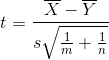

양측검정에서는 `|t| > t_alpha/2 (m+n-2)`일 때, 귀무가설을 기각, 이외에는 기각하지 않음

단측검정에서는 mu1 > mu2 라고 가정할 떄는, `t > t_alpha (m+n-2)`일 때 귀무가설 기각, mu1 < mu2라고 가정할 때는 `t < - t_alpha (m+n-2)`일 때 귀무가설 기각

검정방법2: 두 분산이 같다고 할 수 없는 경우

웰치의 t검정

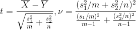

### 4. 모분산 비의 검정

- F검정
  - F통계량(피셔 분산비)을 검정 통계량으로 사용하는 검정
- 두 정규모집단의 모평균이 같은지 아닌지 검정하는 방법은, 모분산이 같은지 아닌지(모분산의 비 = 1)에 의해서 다르므로, 분산이 같은지 아닌지의 검정이 필요함
- 모분산이 같다는 것 자체가 의미가 있음

귀무가설

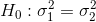

대립가설

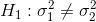

귀무가설에서의 피셔 분산비

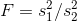

표본 분산들

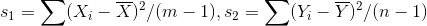

양측검정에서의 채택역

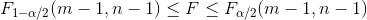

양측검정에서의 기각역

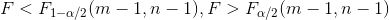

## 다양한 카이제곱 검정

- 분포의 불규칙성에(ばらつき) 대해서의 검정 기준으로서도, 근사적으로 사용됨
- 예시
  - 확률분포의 적합도 검정
  - 독립성의 검정

### 1. 적합도 검정(chi^2-test of goodness of it)

- 가정된 이론상의 확률분포에 대해서, 표본으로부터 관찰되어진 도수가 적합한지 아닌지 검증

### 2. 독립성의 검정
