# 다차원 확률 변수

- 개괄
- 동시확률분포와 주변확률분포
  - 동시확률분포
  - 주변확률분포
  - 공분산과 상관계수
  - 포트폴리오
- 조건부 확률분포와 독립 확률변수
  - 조건부 확률
  - 독립 확률변수
- 다차원 정규분포
  - 2차원 정규분포의 구성
- 독립 확률 변수의 합
  - 분산의 가법성
  - n개의 경우
  - 동일 분포
  - 상가평균
  - 합의 확률분포
  - 정규분포의 재생성
- 현실 예시
  - 포트폴리오
  - 비행기에서 중량이 엄청 많이 나가는 사람들이 신경쓰이는 경우
  - 시스템의 수명과 안전성 분석

잘 모르겠는 것들

- convolution이란 무엇인가

## 개괄

### 다차원의 확률 변수가 서로 관계가 있는 경우

- 기댓값의 선형성 만족

### 다차원의 확률 변수가 서로 관계가 없는 경우

#### 서로 상관이 없는 경우

- 기댓값의 선형성 만족
- 공분산과 상관계수 값 = 0
  - 분산의 가법성 만족

#### 서로 독립인 경우

- 기댓값의 선형성 만족
- 공분산과 상관계수 값 = 0
  - 분산의 가법성 만족
- 동시 확률 분포
  - `f(x, y) = g(x) * h(y)`
- 확률변수가 이항분포 or 포아슨 분포 or 정규분포를 갖는 경우
  - 확률변수의 합 역시 같은 분포를 갖음(재생성)

## 동시확률분포와 주변확률분포

### 동시확률분포(Joint probability distribution)

이산형 동시 확률 분포(동시 확률 질량 함수)

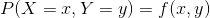

필요 조건

임의의 사상 A가 나타날 확률

연속형 동시 확률 분포(동시 확률 밀도 함수)

필요 조건

임의의 사상 A가 나타날 확률

- 동시 확률 분포
  - 확률변수 X, Y를 2차원 벡터로 나타냄 `(X, Y)`
  - 그 확률변수의 벡터 `(X, Y)`에 대한 확률의 매칭(함수)을 동시 확률 분포라 함
  - 2차원 확률 변수의 경우, 사상 역시 2차원 공간 안에 있음
    - 사상이란, (x, y)가 모인 어떤 부분집합

### 주변확률분포(Marginal probability distribution)

주변 확률 분포 식

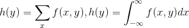

- 주변 확률 분포
  - 주변 확률 질량함수
  - 주변 확률 밀도함수
- 특성
  - 주변 확률 분포는 동시 확률 분포로부터 유도됨
    - 역은 성립x
    - 아버지의 신장의 분포 / 아이의 신장의 분포 개개를 알고 있다고 해서 둘 사이의 관계를 알 수 없고, (아버지의 신장, 아들의 신장)에 관한 이차원 분포를 알아야만 함

### 공분산과 상관계수

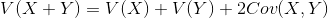

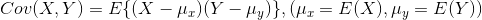

- 2변수의 분산
  - 두 변수 X, Y 사이에 관계가 있으면 하나의 변화는 다른 하나에 영향을 미친다고 생각
- 공분산
  - 확률 변수 X, Y가 각각의 평균으로부터 어떻게 관련되면서 분포되는지를 나타냄
  - 특성
    - `Cov > 0`
      - X, Y는 대소가 같은 경향
    - `Cov < 0`
      - X, Y는 대소가 반대 경향
    - X, Y의 관계의 방향을 나타내지만 그 강함의 절대적 정도를 판단할 기준이 없음
      - 또한, 측정 단위의 크기에 따라 값이 크게 차이가 나므로 비교가 불가능(단위의 차원)
  - 예시
    - 주식 투자에서 A석유 회사, B석유 회사 주식에 동시 투자를 하는 것은 일반적으로 좋지 못함
      - 두 주식의 같은 방향으로의 연동 성이 강하면(Cov > 0) 위기에 대한 리스크가 크다

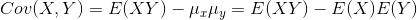

- 상관계수
  - 범위가 -1 <= p <= 1
    - 증명은 `Q(t) = V(tX + Y) = E{tX + Y - E(tX + Y)}^2`
  - 두 확률변수의 관계의 절대적 정도를 표현 가능
  - 특성
    - p > 0
      - X, Y는 같은 대소의 방향으로 변화하는 경향이 있음
    - p = 1 or -1
      - X, Y는 `Y = aX + b`로 표현가능 (a > 0 when p = 1)
    - p = 0
      - `Cov(X, Y) = 0`이므로 무상관(uncorrelated) != 독립

공분산

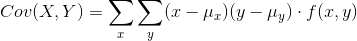

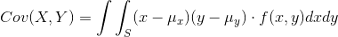

평균

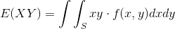

### 포트폴리오

- 마르코비츠의 포트폴리오 이론
  - 가정(투자상품에 대해서)
    - 수익률의 평균은 클 수록 바람직함(수익성)
    - 수익률의 표준편차는 작을 수록 바람직함(안전성)
  - 위의 두 가정을 동시에 만족시키는 것이 어려움
  - 포트폴리오
    - 서로의 가격변동을 상쇄할 수 있는 여러 자산으로 분할해서 투자하면, 표준편차를 최대한 낮출 수 있음
    - 각 투자상품의 서로의 상관관계를 최대한 낮게 만들어야 함
- cf
  - CAPM(Capital Asset Pricing Model)
    - 가정
      - 1 투자자들은 투자의 수익성을 판단하는 데 예상 수익률을 사용하고, 리스크를 판단하는 데는 이러한 예상 수익률의 표준편차를 사용해서 투자자산의 포트폴리오를 구성함
      - 2 무위험 자산이 존재(국채)
      - 3 모든 투자자들은 개별 자산의 예상 수익률과 예상 수익률의 표준편차에 대해서 모두 같은 생각을 갖고 있음

## 조건부확률분포와 독립 확률변수

### 조건부 확률(Conditional probability)

- 조건부 확률은 사상 B가 일어나는 경우에 사상 A가 일어날 확률을 말한다. P(A|B)
- 사상 B가 발생했을 때 사상 A가 발생할 확률은 사상 B의 영향을 받아 변하게 된다.
  - **사상 B가 먼저 발생했다는 것이 핵심이 아니라 사상 B가 일어났다는 정보를 알게 되므로써(정보의 획득), 그러한 상황에서 사상 A가 발생할 확률이 변화한다는 것이 핵심이다.**
  - e.g
    - 미국 국민의 소득 분포에서 성별이 남성일 경우의 임금의 로그값의 기댓값은 `E(log(wage) | sex = man)` 이는 성별이 남성이라는 것이 먼저 일어나서 기댓값이 결정되는 것이 아니라, 성별이 남성이라는 정보의 획득으로 인하여 임금의 로그값의 기댓값이 영향을 받아 결정되는 것이다.
    - 허니버터칩이 수업을 갔다왔는데 그대로 있을 확률은 60%, 학생 A가 허니버터칩을 훔쳤을 확률은 20%, 학생 B가 허니버터칩을 훔쳤을 확률은 20% 라고 할때, 허니버터칩이 사라졌을 때 학생 A가 훔쳤을 확률은?
      - 50%
    - 주사위의 눈을 던졌는데, 그것이 짝수라는 것을 알았을 때 6이 나올 확률은?
      - 주사위를 던져서 짝수가 나온것과 특정 눈이 나온것의 시간상 순서는 같은데 짝수라는 정보의 획득이 있었으므로 P(6이나옴|짝수) 를 계산하면 되므로 답은 1/3.
    - 9회말 투아웃에 만루인 경우, 대타를 쓰려고한다. 대타 선수 A는 시즌 타율이 3할 B는 2할8푼이다. 다만 상대 투수는 좌투수인데, A는 시즌 P(안타 | 좌투수) = 0.250 B는 시즌 P(안타 | 좌투수) = 0.331 이면 우리는 B를 대타원으로 내보내는게 타당하다고 할 수 있다(물론, A, B는 규정타석을 채우고 둘다 좌우 투수에서 선 타석이 많다)
    - 로또 5등이 될 확률은 0.05, P(5등 | 로또당첨) = 0.94
  - 사상이 서로 독립일 경우에는 정보의 획득으로 인해서 확률이 변화하지 않음
    - 주사위를 처음 던져서 6이 나왔다는 정보를 취득해도 다음 주사위를 던지는 것과는 관계가 없다.

조건부 확률

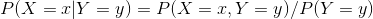

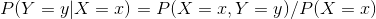

조건부 확률 밀도 함수(conditional probability density function)

조건부 확률 밀도 함수가 확률 분포임을 증명

기댓값

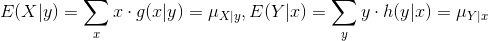

분산

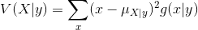

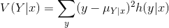

연속형 확률 변수일 경우에는 시그마 대신 적분기호를 써서 표현

- 상관 계수 p는 확률변수 X, Y사이의 관계의 전체적인 경향을 보기 위한 지표이고, X, Y의 관련의 근원 정보는 동시확률분포에 포함됨 >> 이를 조건부확률의 시점으로 보자
- 조건부 확률 분포
  - 이 역시 확률 분포임
  - 조건부 기댓값
  - 조건부 분산

### 독립(independent) 확률 변수

독립의 정의

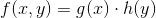

독립의 특성

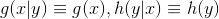

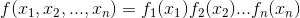

- 독립
  - `f(x, y) = g(x) * h(y)`이 만족하면 독립 이라고 함
    - *만일 위의 식을 만족하는 확률 변수 X, Y가 존재하나, 독립이 아닌데도 우연히 저 식이 만족되는 경우는 존재할까?*
  - **관계가 없음을 의미하지만 "무상관" 이라는 개념보다 강한 개념**
    - 독립 => 공분산은 0(상관계수 0) (o)
    - 공분산이 0 => 독립 (x)
      - 확률변수가 X, X^2 이고 X의 확률분포가 확률 밀도함수로 -1 <= X <= 1에서 uniformly distributed되어있을 경우 `Cov(X, X^2) = E(X * X^2) - E(X) * E(X^2)`
    - 독립성은 확률분포 자체에 대한 가정이고, 무상관은 확률분포에서 나타나는 평균적 성질
- 특성
  - 두 확률변수가 독립이면, X, Y의 동시 확률분포는 X, Y의 각각의 분포를 아는 것으로 구할 수 있으며, 동시 확률 분포를 개별적으로 알지 않아도 됨
    - 두 확률변수가 관계가 없음을 의미
- 예시
  - 주사위를 두번 던졌을 때, 첫번째 던졌을 때의 눈을 확률변수 X, 두번째 던졌을 때의 눈을 확률변수 Y로 생각한 경우
  - 확률 밀도 함수의 곱의 2차원 그래프

기댓값의 곱

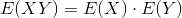

독립과 무상관

- 독립 => 무상관 (o)
- 무상관 => 독립 (x)

*독립 확률변수의 합과 모멘트 모함수*

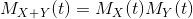

## 다차원 정규분포

- 배경
  - 복잡하고 다양한 현상을 통계학에서 다룰 때에는, 많은 변수를 생각해야 하고 각각의 관계에 대해서 생각해야 함.
    - e.g) 경제현상 => 국민총소득, 국제수지, 물가지수, 실업률 등등
    - e.g) 인간의 지적능력 평가 => 언어 테스트 점수, 수행 테스트 점수 등등
- 다차원 정규분포
  - 독립이 아니라, 오히려 관련하는 다수의 확률변수를 처음부터 가정해서 사용되는 확률분포(n차원 정규분포)

### 2차원 정규분포의 구성

*유도공식에 변환 이라는 개념이 사용됨*

- 어떤 2차원 정규분포도 표준 정규분포 N(0, 1)에 따르는 난수(정규 난수)로부터 간단히 만들 수 있음
  - `Y1 = aX1 + bX2, Y2 = cX1 + dX2`
  - *선형대수와 유사성이 있어보임(2차원의 기저벡터로 어떠한 2차원 벡터도 선형 조합을 통해서 만들 수 있음)*

Y1, Y2의 기댓값

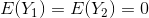

Y1, Y2의 분산과 공분산과 상관계수 p

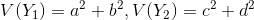

Y1, Y2의 동시확률밀도함수 g(y1, y2)

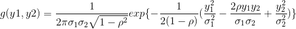

이를 일반화 하면 다차원 정규분포(multivariate normal distribution)를 정의할 수 있음

## 독립 확률변수의 합

- 배경
  - 기본적으로 확률변수의 합의 분포를 구하는 것이 의외로 어려우나, 두 확률변수의 확률 분포가 독립 이라 다루기 쉬워짐

### 분산의 가법성

합은 확률 변수가 독립이 아니어도 다음 식이 성립

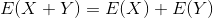

분산은 확률 변수가 독립일 때 다음 식이 성립

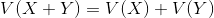

일반적인 경우

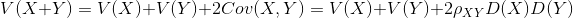

### n개의 경우

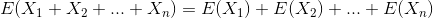

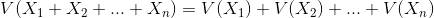

### 동일 분포

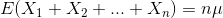

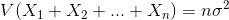

### 상가평균(additive mean)

*이 내용은 확률변수가 다 같은 분포를 갖는다고 가정했을 때의 이야기인가? 아니면 일반적인 경우의 이야기인가?*

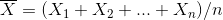

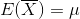

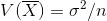

- 상가평균의 분포
  - 평균은 `mu`
  - 분산은 n에 반비례하면서 감소하며, 0에 수속함
    - 안정화의 경향
    - **대수의 법칙과 연관이 있음**

### 합의 확률분포

*convolution이라는 개념을 잘 모르겠다*

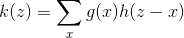

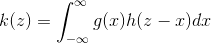

- convolution
  - 확률 변수 X, Y가 독립이며, 그 확률 분포가 각각 g(x), h(y)라고 하자. 합 X+Y의 확률 분포 k(z)는 확률 P(X + Y = z)를 생각하면 얻을 수 있음
    - X = x, Y = z - x의 형태로 x, z-x를 더하여 z가 되는 모든 조합을 구할 수 있음 그것을 확률의 곱으로 표현
    - k = g *(convolution) h
- 활용
  - 이미 잘 알려진 확률 분포에 대해서, 자명한 결과를 얻을 수 있음

이항 분포

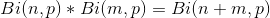

포아슨 분포

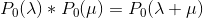

정규분포

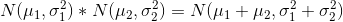

- convolution의 결과로서, 전혀 다른 분포가 아니라 다시 같은 종류의 확률 분포가 얻어지면, 이를 재생적(reproductive)라 함
  - 이항분포, 포아슨 분포, 정규분포, 감마분포, 부의 이항분포는 재생성이 성립

### 정규분포의 재생성

정규분포에 대해서, 재생성은 큰 메리트를 갖고, 통계적 추측에서 잘 사용됨

- X1, X2, ... Xn이 독립이고, 각각이 정규분포 N(mu1, sig1^2), N(mu2, sig2^2), ... N(mun, sign^2)에 따른다면
  - `(X1+X2+ ... +Xn) ~ N(mu1+mu2+...+mun, sig1^2+sig2^2+...+sign^2)`
  - `c1X1+c2X2+ ... +cnXn ~ N(c1mu1+c2mu2+...+cnmun,c1^2sig1^2+c2^2sig2^2+...+cn^2sign^2)`
- 특히 X1, ..., Xn의 혹률분포가 전부 정규분포 N(mu, sig^2)라면
  - `(X1+X2+ ... +Xn) ~ N(nmu, nsig^2)`
  - `Xbar = (X1+x2+ ... +Xn)/n ~ N(mu, sig^2/n)`

## 현실 예시

### 포트폴리오

- 서로 수익률의 음의 상관이 있는 여러 투자자산을 일정 비율로 결합해서 안전성 확보

### 비행기에서 중량이 엄청 많이 나가는 사람들이 신경쓰이는 경우

- 예시
  - 어떤 비행기에 타는 승객의 총 중량의 확률분포를 계산하고 싶음
  - 한명의 체중은 기댓값 mu=58kg, 표준편차=6kg인 확률분포를 따름
  - 비행기에 탈 수 있는 인원 n=450이라고 함
  - 각각의 승객의 체중이라는 확률변수는 서로 독립 이라고 가정
- 분석
  - `E(X1 + X2 + ... + Xn) = E(X1) + E(X2) + ... + E(Xn) = 26,100kg`
    - 이는 확률 변수의 특성
  - `V(X1 + X2 + ... + Xn) = V(X1) + V(X2) + ... + V(Xn) = 450 * 6^2 = 127.3`
    - 이는 확률 변수가 서로서로 독립이므로 성립
    - 표준편차는 저 값에 루트
    - 거의 2인분정도의 표준편차 밖에 되지 않음
    - 이를 root(n)의 법칙 이라 부름
- 결론
  - 확률변수가 서로서로 독립인 경우 플러스, 마이너스가 서로 상쇄되어 생각보다 크게 확률변수의 값이 분산되지 않음

### 시스템의 수명과 안전성 분석

- 시스템 S1, S2의 수명 X1, X2이 확률변수이며, 서로 독립이고, 지수분포 Ex(lambda)를 따르는 경우
  - S1, S2가 병렬로 결합되어있는 전체 시스템의 수명Y의 확률분포
  - 직렬인 경우의 확률 분포
