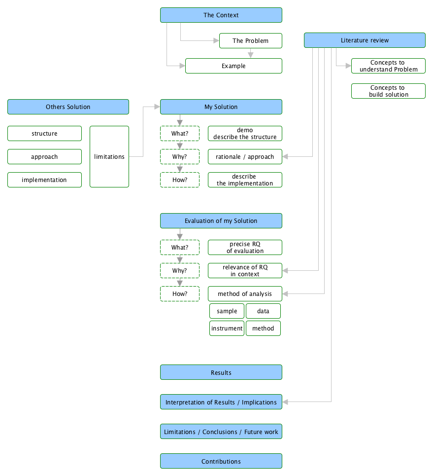

# Research

- 연구 시나리오
  - **문제가 있어**
    - 이건 이래서 겁나 중요한 문제야
  - 이 문제를 보다 자세히 다루기 위해서 배경 지식을 설명해줄게
    - 이건 이러한 개념이야
    - 이게 그 문제와 직결된다구
  - **이제까지는 이렇게** 문제를 다뤄왔어
    - 그런데 거기에도 이런문제가 있어
    - 이걸 해결하려면 이러이러한 조건이 필요해
  - 그래서 나는 이걸 이렇게 **해결** 할거야
    - 이건 이런 구조야(What)
    - 이건 이러해서 이런 구조야(Why)
    - 이건 이렇게 구현할거야(How)
  - 나의 해결방법이 얼마나 유효한지 설명할게
    - 나는 이걸 **누구에게** 어떠한 방식을 바탕으로 **실험**했어
    - 이건 이러해서 이렇게 실험한거야
    - 그리고 난 이제 그 결과를 해석할게
      - 실험 결과 이런이런 것이 있었어
  - 이제 정리를 해볼까
    - 나는 이런걸 했었지
    - 그런데 내 연구에는 **한계**가 있어
    - 그래서 **앞으로는 이런걸 하고싶어**

## Tips

- 항상 아이디어를 적자
  - 다른 논문에서 문제 해결을 검증한 방법이 자신의 연구에 적용할만 하면 그것을 항상 적어두자
  - 다른 논문에서 신기한 연구 결과가 나타나면 적어두자
  - 표를 그리는것도 큰 도움이 됨
- 연구는 스토리다
  - 나 자신의 제안 수법보다는, 왜 이문제가 중요한지, 이제까지는 이 문제를 어떻게 다루었고 그 한계가 무엇이었는지와 같은 배경 스토리를 잘 설명하는것이 매우 중요하다.
  - 발표에서도 마찬가지로 처음부터 제안 수법을 막 이야기하지 말고, 왜 이 연구가 중요하고 어떻게 해결할것인지, **Research Question은 무엇인지** 쉽게 알 수 있도록 한다.
- 연구의 무엇이 포인트인지 분명히 하자
  - **구체적으로 정확히 무엇** 을 이 연구를 통해서 보여주고 싶은것인가?
  - 해당 시스템의 어떠한 기능이 좋았던 것인가?
