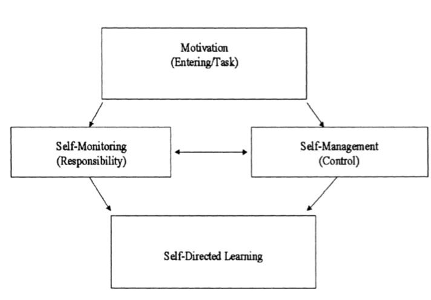

# SDL: toward a comprehensive model

## What is SDL

https://www.youtube.com/watch?v=YoE480mzrk0

- Education is the child's responsibility
- Unlimited Opportunity to play
- Play with the tools of the culture
- Caring adults that are helpers not judges
- Free age mixing
- Stable moral democratic **community**

## Abstract

- comprehensive **theoretical** model
  - self-management(contextual control)
  - self-monitoring(cognitive responsibility)
  - motivational dimension(entering and task)
- **practical** application GEMC(R)
  - Goal-Setting
  - Execution
  - Monitoring
  - Change(Reflect)
    - + motivational dimension

## Concept of Self-Directed Learning

- control of deciding what to learn and how to learn it
  - desire == need
  - until now(1990) only focus on external issues
  - critical
    - awareness of meaning, self-knowledge
    - sociological
    - pedagogical
    - **psychological(cognitive)**

## A Comprehensive Model

- comprehensive theoretical model
  - self-management
  - self-monitoring
  - motivational dimension

### Self-management

- social, behavioral implementation of learning intensions
- goal management
- material available
- flexible pacing
- questioning and feedback provided when needed
- external task control
- !== isolated, === collaborative experience
