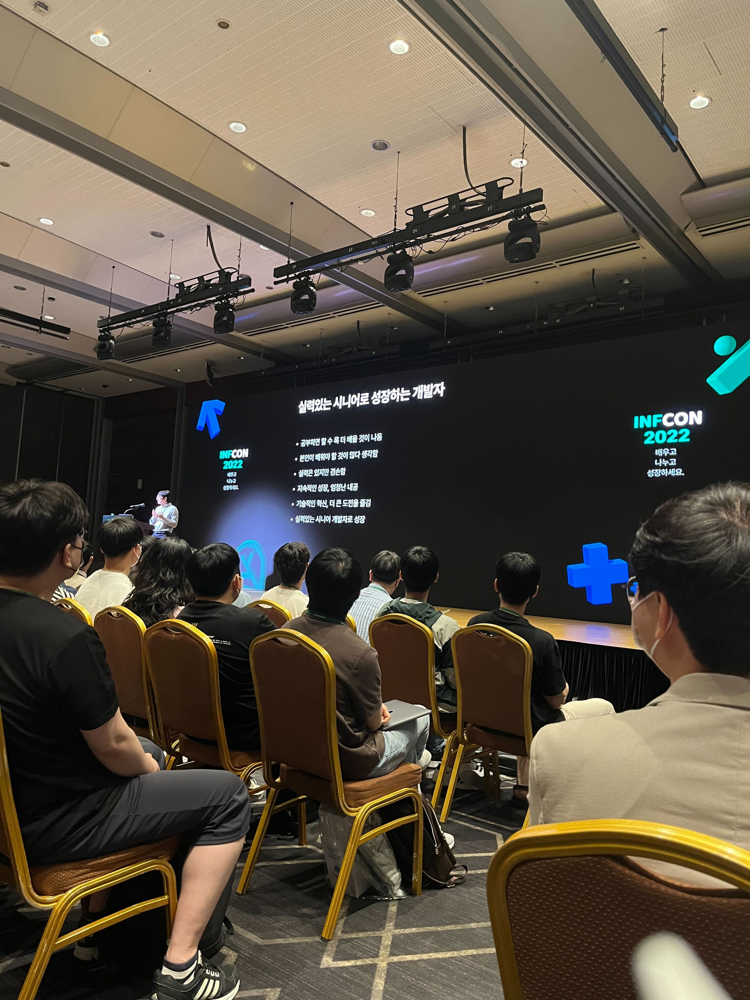

# 2022 인프콘

## 1. 사이드 프로젝트 만세!

- 논의 보다는 출시
  - 간단한 MVP
    - 광고 삭제 기능
    - 개인보안 강화
    - UI 커스터마이징
- 개발보다 중요한 것은 마케팅
  - ASO(App Store Optimization)가 중요
    - 스토어에 검색하는 경우 노출 될 수 있는 키워드를 중심으로 설정
  - 광고가 중요
- 상호 신뢰할 수 있는 환경 만들기
  - 1 모두 주도적일 것이라는 환상에서 벗어나기
    - 평균이상의 성과를 낼 수 있는 환경 시스템 만들기
      - 제품보다 팀이 중요
    - 매니저 필요
  - 2 적절한 커뮤니케이션 동기화
    - 스크럼 보드
    - 진행상황 공유
    - 일주일에 최소 1회 미팅(회사와는 다른 만남 유지)
  - 3 팀원에게 작은 성공 제공
    - 태스크 잘게 쪼개기
    - 패치 사이즈 줄이기(코드리뷰 효율 높이기, 100줄 이하)
    - 패딩 일정 도입
  - 4 회고 횟수를 줄이고 아예 없애서, 죄책감 유발을 줄였다
  - 5 아키텍처 개선하여 작업 의존성을 낮춤
    - 의존성 낮추고 응집도를 높인다
    - 기술부채를 최대한 잘 활용하여, 언젠가 쉽게 개선 가능하도록 한다
  - 6 코드리뷰 & 테스트를 완화
  - 7 1:1 면담을 통한 칭찬 타임
- 플러스 알파
  - 제품 비전보드 만들기(비전 워크숍)
  - 신규멤버 지속적 영입을 통한 분위기 전환
  - 외부 영향력 확장
    - 외부 발표

## 2. 인프런 아키텍처의 과거와 현재, 그리고 미래(리스크 기반의 적정 소프트웨어 아키텍처)

- 적정
  - A라는 목표를 B라는 일정안에 달성하기 위한 아키텍처

### 시즌1) 개발자 = 대표, 일단 만들자

- 개발자 = 대표
  - 최대한 외부자원을 활용해서 서비스를 만들자(워드프레스)
  - 회원수 10만까지

### 시즌2) BE1 FE1 DevOps1 대표1, 한명이 빠져도 개발 가능하게

- 리팩토링 진행(full js로 포팅)
  - 기술 스택 통일
    - js
  - 낮은 러닝커브
    - FP
  - 최소 관리
    - AWS, CircleCI, Fargate
- 문제
  - 신규 개발자 채용 및 적응으로 문제가 생김
  - 타입 및, 테스트 코드(x)
    - 심리적 불안감
  - 부족한 생태계(FP)
  - 컴포넌트 개념 적용 불가

### 시즌3) BE3 FE3 DevOps1 CTO1, 심리적 안정감

- 리팩토링을 '점진적'으로 진행
  - 심리적 안정감
    - Class & Type 도입
    - 테스트 코드 작성
    - 정적분석 툴 도입
    - eslint, 프리티어
  - 낮은 진입장벽
    - TypeScript, React, Nextjs
    - Nestjs & TypeORM
    - 계층형 아키텍처 & DI
    - 테라폼 & Go
  - FE BE 독립성
    - FE & BE 계층 분리
    - API 명세 기반
    - 분리된 깃헙 리포지토리

### 시즌4) BE8 FE11 DevOps4 CTO1, 장애격리

- 장애격리(fault tolerant)
  - 독립적으로 운영하는 서비스를 분리한다
  - 메모리 / CPU 많이 점유하는 작업 장애 격리
  - DB 분리는 시즌5에서
    - 분산 DB는 복잡도가 올라감
    - 비즈니스 서비스 요구사항을 도입하면서 진행하기엔 무리
  - 기술의 가지수를 줄이고, 2~3년동안 버틸 수 있는 적정기술을 선택하자
- **위대한 글쓰기는 존재하지 않는다. 오직 위대한 고쳐쓰기만 존재할 뿐이다**

인프런 검색엔진 구성

### 질문

- Node의 커넥션 풀은 어떻게 관리하는가?
- 리팩토링에 대한 부서 설득은 어떻게 하였는가?
  - 과거 장애때문에 최대 마케팅 효과를 거둘 수 없었다고 수치적으로 이야기하니, 마케팅 부서에서 오히려 요청함
    - 장애내역 정리 & 예상지표

## 3. 오늘도 우리는 성장합니다.

- Sprint QA를 진행해서, 문제를 빠르게 개선하고 프로젝트를 예측 가능하게 하자
- 회고 3F
  - Fact
  - Feeling
  - Finding

## 4. AWS로 알아보는 서비스 아키텍처의 변화

- 아키텍처
  - 좋은 아이디어를 얼마나 빠르게 적용시킬 수 있는가
    - Martin Fowler
- 클라우드
  - 복잡한 이프라구조 / 인터넷을 추상화 한 것
- 시기별 시스템 아키텍처
  - 2012
  - 2015
    - 트러블 슈팅, 로드 테스팅
  - 2016
    - MSA, IOT
    - 삼성 스마트 띵스, 250여개의 Microservices
    - IaaS
    - CI/CD
    - **Immutable Infrastructure**
    - Regional failure를 극복하기
  - 2017
    - 겸손이란, 나보다 치열한 친구들을 알고 있는 것
    - DevOps의 철칙
      - 모든 사이클에서 측정(Measure)한다
      - 모든 부분을 코드로 대체한다
        - 구현
        - 문서화
  - 2018
    - 부채와의 정면승부
    - Retry Storm(DDoS)
      - 서비스가 잠시라도 불안정하면, 데이터 보내기 retry가 쇄도함
    - On-premise에서 Cloud로
    - 부채관리의 중요성
      - 기술은 유산처럼 쌓여가는것
  - 2019
    - 스타트업 위버스
    - 갑작스런 트래픽 서징
      - 스타가 메시지나 사진을 업로드하면 곧바로
  - 2020
    - DevOps / SRE
    - 누군가를 성장시켜보자
      - **Growth Mindset**
    - **성장에 있어서는 내가 얼마만큼 쌓아나가고 고민하느냐가 중요함**
  - 2022
    - **Accept Difference**
      - 새로운 것을 받아들이고, 열린 마음을 가지는 것(영화 ARRIVAL)
      - 내가 거기서 어떤 의미있는 서비스를 만들 수 있는가?
        - 편견없이
      - 해보고 싶었던 일
        - 대기업의 장 / 단
        - 스타트업의 장 / 단
    - **내가 어떤 위기를 겪고, 어떻게 극복했는가가 중요**
- 여러분들의 지난 3년은 어땠나요?
- 일과 삶의 분리가 되지 않는 삶을 사는데, 너무나도 재미있습니다.
- 전세계 최고의 엔지니어와 이야기를 나누는 삶
- 이곳에서 여러분을 기다리고 있겠습니다

## 5. 지금 당장 DevOps를 해야 하는 이유

- 프로젝트에서 가장 중요한 것
  - 속도 / 일정
- 따라서, 개발과 배포를 어떻게 빠르게 할까?

### 개발과 배포를 빠르게 하는 방법

- 공부(강의 듣기)
- 채용
- 애자일 / 각종 방법론 도입
- MSA?
- DevOps

### DevOps

- 개요
  - **조직이 빠르게 개발 / 배포하는것이 목적**
    - 주의) 단순히 좋은 도구를 잘 사용하는게 아님
    - 목적과 타이밍이 중요
  - 철학 + 방법론 + 문화
    - 도구는 자연스럽게 발전하며 도입되는 것
    - **문화 / 자동화 / 측정 / 공유(문서화, 발표) / 축적**
    - **느린대로 그냥써요가 아닌, 도입해보고 개선해보기(자동화)**
- 예시
  - npm install이 느려요
    - yarn의 zero install을 써보자
  - git clone이 느려요
    - shallow log를 써보자
  - 주간보고가 느려요
    - git change log 써보자
  - QA 시간이 길어요
    - e2e test 도입해보자
  - 로그인 승인이 귀찮아요
    - chat bot을 써보자
- why DevOps
  - 하루 10분 절약 = 1달 200분 x 개발인원수 = 새기능 몇개
- 데브옵스 장점
  - 인프라를 잘하게 됨
  - 개발 시야가 넓어지고 깊이 이해할 수 있음
  - 회사 홍보 / 채용에 도움 됨
  - 잠을 잘 잘 수 있음
  - yaml 마스터

## 6. 인프런 DevOps 엔지니어의 Terragrunt 도입기

- 개요
  - 인프라의 중복을 IaaC로 해결
- 기존 구성
  - AWS CDK
    - CDK <-> Cloud Formation <-> AWS
  - GCP terraformer를 이용해서 계정의 리소스를 terraform 코드로 변환
- 현재 구성
  - terragrunt
    - 구조 중복 제거(include)
    - 값 중복제거
    - 의존 경로 계산 및 병렬 처리 실행
    - 테스트

## 7. 어느날 고민이 많은 신입 개발자가 찾아왔다

- 초반의 성장
  - 개발 + 운영 + 개선 다 경험할 수 있는 3티어 회사를 가자
- 채용
  - 확률
  - 실력있는 개발자 TO는 무제한
- 이력서 팁
  - 프로그래머 = 문제 해결사
  - 이력서에는 문제와 해결방법을 자세하게 쓰자
- 깊이
  - 하나만 파는것이 아니라, 주변까지 파고 들어가는 것

### 학습

- 학습의 3요소
  - 학습
    - 강의 & 책
  - 체득
    - 적용해보기
      - 회사
      - 토이 프로젝트
  - 정리
    - 노트, 블로그, 세미나 만들기

### 시스템

- 학습 시스템을 구축하자
  - 과정에 충실한 것
  - 루틴
    - 열정이나 열심히가 아닌, 그저 하는것
    - e.g) 몇시부터 몇시까지 공부시간 등
  - 시스템은 지속적으로 돌리고 개선이 필요
    - e.g) 몇시에 집중이 잘된다, 집중되는 장소 등
- 피드백은 빠를 수록 좋다
  - 내부
    - 회사 내부에서의 피드백
  - 외부
    - 면접
      - 면접에서 부족한 부분을 찾고 개선하자

### 성장

- 시니어로 성장하는 개발자
  - 아직 부족하다고 생각하는 개발자
    - 오히려 잘한다고 생각하는 개발자는 같은 업무만하는 경우가 많아서 문제가 많음
  - 기술적 혁신 / 도전을 즐기는 개발자
  - 기술적 겸손함을 갖고 있는 개발자
- 개발은 팀워크
  - 내가 성장해서 주변에 영향력을 끼치자
  - 함께 일하고 싶은 개발자로 남자
  - 그게 개발자 인생을 멀리보면 나만 아는것 보다 훨씬 값어치 있는 것
