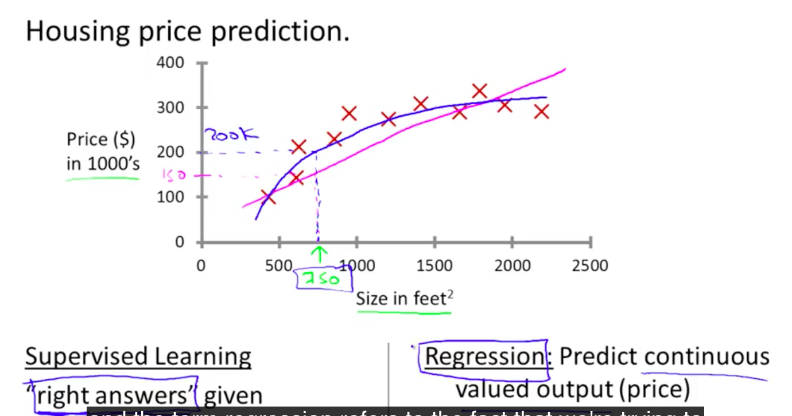

# Introduction

- 참고
  - Coursera Andrew Ng교수님의 머신러닝 강의
  - [테리 - 머신러닝 1시간으로 입문하기](https://www.youtube.com/watch?v=j3za7nv7RfI)

## 머신러닝의 정의

- 아직 완벽하게 합의된 정의는 없음
- Arthur Samuel(1959)
  - 명시적으로 프로그램 되지 않아도, 컴퓨터가 학습할 수 있는 능력을 주는 연구 분야
- Tom Mitchell(1998)
  - 컴퓨터 프로그램이 학습한다고 하는 것은, 그것의 성능 측정기준인 P(Performance measure)로 측정된, 태스크 T(Task)에 대한 성능이, 경험인 E(Experience)와 함께 향상되었을 경우를 말한다.
  - computer program is said to learn from experience E with respect to some class of tasks T and performance measure P, if its performance at tasks in T, as measured by P, improves with experience E.
  - TPE
    - E: 프로그램이 몇천 몇만 게임을 직접 시행하는 것
    - T: 게임을 플레이 하는 것
    - P: 승률

## 머신러닝의 분류

- 교사 학습
- 비교사 학습
  - g씨의 말에 의하면, 비교사 학습도 결국에는 어떠한 문제를 정답이 있는 문제로 치환해서 푸는 것이되므로 엄밀히 말하면 비교사 학습이라고 할 수 없을 것이다.
- 그 외
  - 강화 학습
  - 추천 시스템

## 머신러닝의 응용

- 데이터베이스 마이닝
  - 웹 클릭 데이터, 의료 기록, 생물학, 공학
- 손으로 프로그램을 짤 수 없는 애플리케이션
  - 자율 조종 헬리콥터
  - 손글씨 인식
  - 자연 언어처리
  - 컴퓨터 비전
- 커스터마이징 작업
  - 아마존 유저를 위한 추천

## 교사학습(Supervised Learning)

- 정답(label)이 주어짐
- 다양하고 무한한 피처(데이터 벡터의 차원)를 이용해서 학습을 할 수 있음
  - 학습의 결과는 하나의 함수
- 분류
  - 회귀(Regression)
    - 연속적인 값의 출력을 예측
    - 값 하나하나에 의미가 있는 것이 아님
    - 예시
      - Given a picture of a person, we have to predict their age on the basis of the given picture
  - 분류(Classification)
    - 이산적 값의 출력의 예측
    - 값 하나하나에 분류의 의미가 존재
    - 예시
      - Given a patient with a tumor, we have to predict whether the tumor is malignant or benign.

## 비교사학습(Unsupervised Learning)

- 정답(label)이 주어지지 않음 / 아에 데이터에 대한 이해가 없을 때도 접근 가능
- 변수의 효과에 대한 이해가 없이 데이터의 구조를 파악할 수 있음
- 비교사학습의 결과를 피드백할 길이 없음
- 분류
  - 클러스터링(clustering)
    - 어떠한 사상의 집합을 서로 보다 유사한 것들 끼리 그루핑 하는 일
    - 클러스터링 자체는 문제이며, 다양한 알고리즘으로 클러스터링 문제를 해결 가능함
    - 다양한 cluster model이 존재하며 클러스터링을 이해하는 것의 핵심이 그 모델을 이해하는 것임(어떻게 클러스터링을 할 것인가?)
    - 용도
      - 머신 러닝
      - **데이터 마이닝**
      - 패턴 인식
      - 이미지 분석
      - 정보 취득
      - 생명 정보학
      - 데이터 압축
      - 컴퓨터 그래픽
    - 예시
      - 컴퓨터 클러스터 구성
      - SNS 분석
      - 소비자 정보를 이용한 마켓 구분
      - 천체 데이터 분석
      - Take a collection of 1,000,000 different genes, and find a way to automatically group these genes into groups that are somehow similar or related by different variables, such as lifespan, location, roles, and so on.
  - 비클러스터링(non-clustering)
    - 예시
      - The "Cocktail Party Algorithm", allows you to find structure in a chaotic environment. (i.e. identifying individual voices and music from a mesh of sounds at a cocktail party
