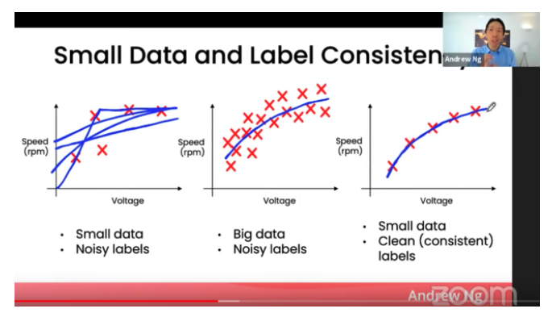
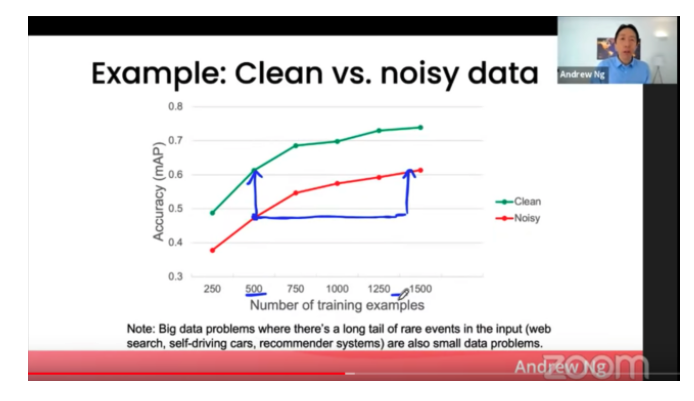

# Machine Learning

- 의문
- 참고
- 명심해야 할 것
  - `AI system = model(algorithm, function) + data`
    - Data
    - Model
- 기계학습 개요
  - 표의 이해
- 대표적 종류
  - Supervised learning
  - Unsupervised learning
  - Reinforcement learning

## 의문

## 참고

- [모델 중심에서 데이터 중심의 AI 개발로](https://jiho-ml.com/weekly-nlp-35/)

## 명심해야 할 것

- 핵심
  - **기계학습은 문제 해결을 위한 '도구'이다**
  - **일단 만들어보고, 그 다음에 블랙박스를 공부하라**
    - 중요한것은 만드는것!
  - 데이터 사이언티스트나 기계학습 엔지니어의 대부분의 일은 데이터 수집과 전처리에 있다.
    - 모델 짜는데에는 10%의 시간밖에 들이지 않음
- 깨달음
  - 모델 그 자체와 테크닉 보다 데이터의 quantity와 quality가 훨씬 더 중요하다
    - 데이터의 양과 질을 개선하면 금방 성능이 향상됨
    - 데이터의 질 향상
  - Overfitting은 생각보다 잘 일어난다

### `AI system = model(algorithm, function) + data`

- model(function)
  - architecture
  - hyper parameter
  - optimizer
- data
  - quantity
  - quality
    - consistency
- 참고
  - MLOps
    - **AI시스템 개발 사이클의 모든 부분에서 일관성 있고, 질 좋은 model과 data를 유지하는 것**

#### Data

데이터 중심 관점을 갖고 ML 문제의 개선 방법을 찾는 것이 효과적

**질 좋은 데이터를 어떻게 일관성 있게 확보하는가가 key**

- 개요
  - quantity
  - quality
    - consistency
      - labeling은 정확한 가이드라인이 필요
        - 데이터 수집 과정을 디자인하는 사람들이 직접 자신들의 라벨링 테스크를 여러 번 해보고 문제를 미리 찾아내는 것이 중요
        - crowdworker의 품질관리가 어렵고, 품질이 100% 완벽하다고 가정하면 안됨
          - 1 두 명의 독립적인 labeler에게 데이터 일부분을 레이블링 하도록 함
          - 2 두 명의 레이블이 얼마나 일치한지 계산
          - 3 일치하지 않는 레이블에 대하여 가이드라인을 수정하고, 일관적인 레이블링을 얻을 수 있을 때까지 반복

데이터 양과 질의 상관관계

clean vs noisy data

- 데이터의 양과 질의 상관관계
  - 데이터가 많은 경우
    - noisy한 데이터가 있어도, 모델이 올바른 decision curve를 찾을 수 있음
  - 데이터가 적은 경우
    - 레이블의 일관성과 질이 모델 퍼포먼스에 큰 영향을 끼침(*Garbage in, Garbage out*)

#### Model

## 기계학습 개요

- 개요
  - **간단한 선형 함수로 이루어진 거대하고 복잡한 함수를 과거의 방대한 데이터를 기반으로 생성**
    - *음 근데 이건 deeplearning과 관련깊은거 아닌가?*
- 의의
  - 공식의 대중화
    - 과거에는 일부 지식인들만 수학을 사용하여 함수를 정의하고 이해하는것이 가능했으나, 이제는 누구나 함수를 제작할 수 있도록 가능하게 만든 툴이 ML

### c.f) 표의 이해

인류 최대의 발명품?

- 표(데이터 셋)
  - row = instance, record, case, observed value
  - column = feature, attribute, variable, field

## 대표적 종류

- Supervised learning
- Unsupervised learning
- Reinforcement learning

### Supervised learning

Supervised learning 큰 그림

키워드: 역사 -> 예측

- 대표 문제
  - classification
    - 예측결과가 이산적인 값
  - regression
    - 예측결과가 숫자나 연속적인 값

### Unsupervised learning

키워드: 탐험 -> 인사이트

- 대표 문제
  - clustering
    - 비슷한 데이터를 그루핑 & 그룹에 identity부여
    - 행렬의 행을 기준으로 비슷한 그룹끼리 묶어주는 역할
  - transforming
    - *??*
  - association
    - 비슷한 특성을 그루핑 & 그룹에 identity부여
    - 행렬의 열을 기준으로 비슷한 그룹끼리 묶어주는 역할

### Reinforcement learning

강화학습 기본 모델링 도식

키워드: 경험 -> 개선
