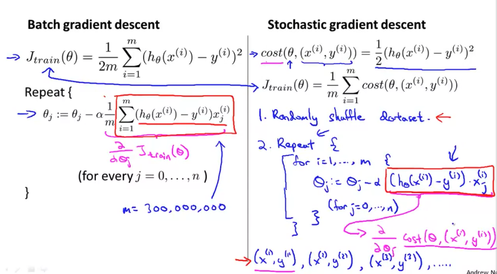
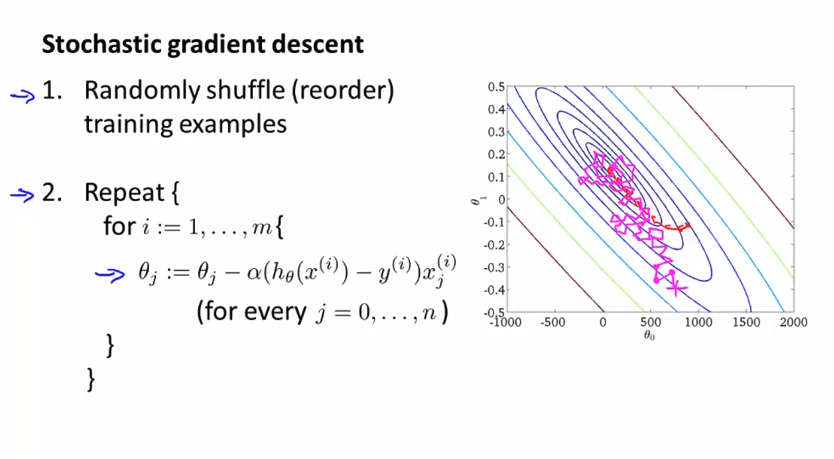
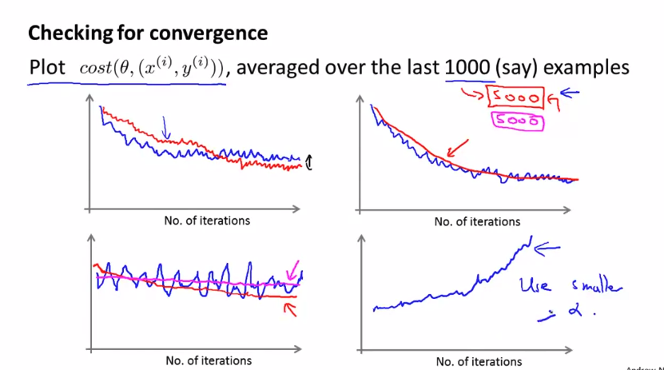
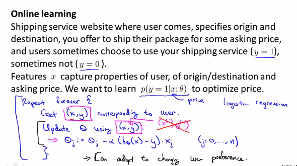
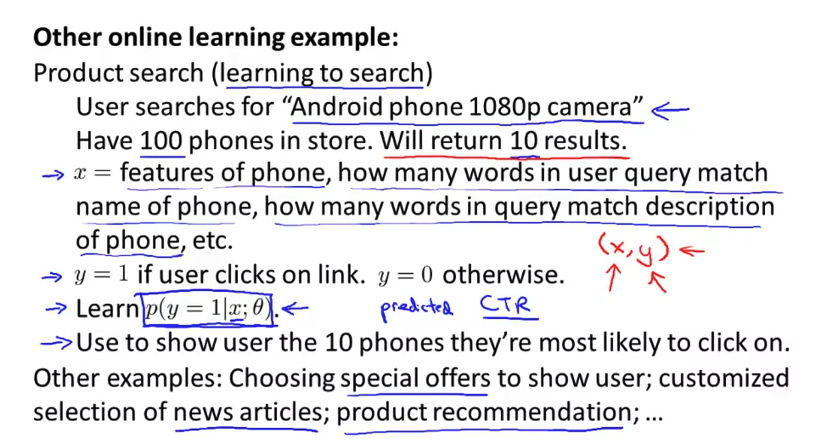

# Large Scale Machine Learning

- 의문
- Gradient Descent with Large Datasets
  - Learning With Large Datasets
  - Stochastic Gradient Descent
  - Mini-Batch Gradient Descent
  - Stochastic Gradient Descent Convergence
- Advanced Topic
  - Online learning
  - Map Reduce and Data Parallelism

## 의문

## Gradient Descent with Large Datasets

### Learning With Large Datasets

- It's not who has the best algorithm that wins. It's who has the most data.
- 데이터가 1,000,000,000 개가 있는데, 모든 데이터에 대해서 gradient descent를 시행하는가?

### Stochastic Gradient Descent

Batch gradient descent vs Stachastic gradient descent

Stochastic gradient descent convergence diagram

- 개요
  - 각 example마다 parameter를 해당 example에 대한 cost를 줄이도록 함
- 특징
  - 많은 데이터셋이 있을 때, vanilla gradient descent보다 효율적인 방법
  - 실행할 때 마다 다른 결과
  - 완전한 global minimum에 도달하지 않음
    - 거의 global minimum에 도달함

### Mini-Batch Gradient Descent

- Batch gradient descent
  - use all m examples in each iteration
- Stochastic gradient descent
  - use 1 example in each iteration
- Mini-batch gradient descent
  - use b examples in each iteration
    - b = mini-batch size
  - vectorization이 잘 되면, 병렬프로그래밍을 사용하여 stochastic gradient descent보다 더 efficient하게 동작시킬 수 있음

### Stochastic Gradient Descent Convergence

Checking for convergence

- 개요
  - 특정 iteration마다 loss value를 계산해서 plot
- stochastic gradient descent convergence technique
  - `alpha = const1/(iterationNumber + const2)`
    - iteration이 많아지면서 alpha값이 점점 줄어들도록 설계

## Advanced Topic

### Online learning

Online learning example1 and algorithm to learn model

Online learning example2

- 문제
  - model학습에 필요한 데이터가가 계속적으로 stream으로서 들어오는 경우, 어떻게 모델을 learning할 것인지
    - e.g) 온라인 배달회사
      - 특정 가격을 제시했을 경우, 유저가 shipping service를 이용할지 안할지를 예측 `p(y=1|x;θ)`
    - e.g) 제품 검색(predicted CTR)
      - 유저가 제품을 검색어로 검색했을 때, 10개의 제품 결과를 보여주는데 어떤 제품을 보여주는게 가장 CTR을 높일 수 있을 것인지
    - e.g) recommendation
      - news, product, youtube
- 개요
  - stream으로 들어오는 데이터를 가지고 모델을 학습시키고 해당 데이터를 버림(진짜 규모가 큰 경우)
    - 만약, 들어오는 스트림 데이터가 적을 경우에는, 데이터를 버리지 말고 모아두고, 한번에 학습시키는것이 나음
- 특징
  - user의 preference에 따라서 변화함

### Map Reduce and Data Parallelism

- 개요
  - 병렬계산을 machine단위로 나누어서 병렬적으로 행함
    - 각 machine에서는 multiprocessing을 행하자
- 단점
  - network latency
