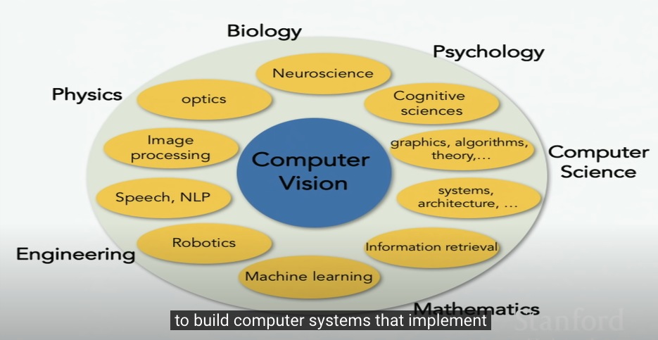
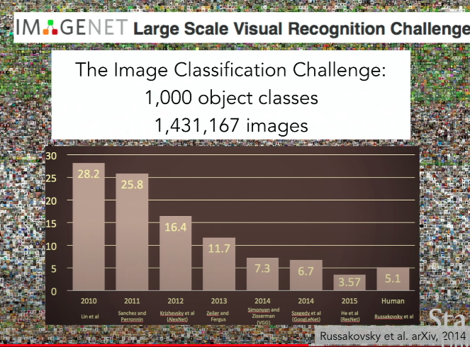
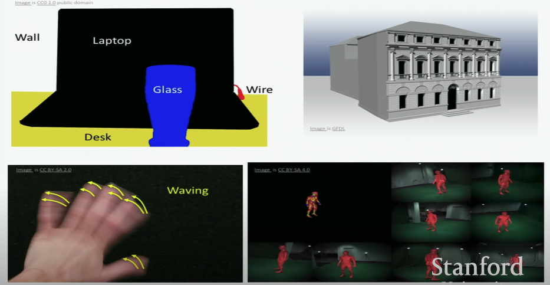
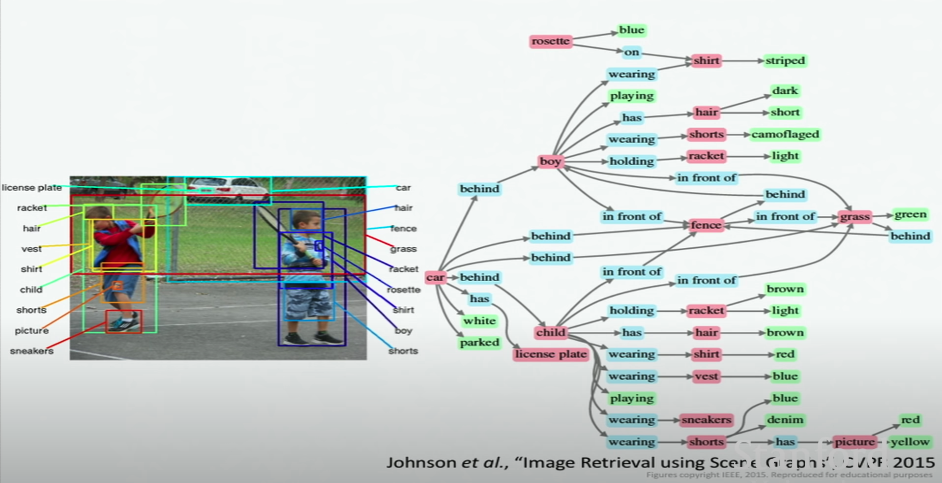

# Lecture1: Introduction to Convolutional Neural Networks for Visual Recognition

- 의문
- Background
  - History of computer vision
- CS231n 목표
- CNN
- Quest for visual intelligence

## 의문

## Background

Computer Vision and its related domains

- Digital data가 인터넷에서 넘쳐나고 있음
  - 이러한 데이터를 자동적으로 해석하고 활용할 방법이 필요

### History of computer vision

- 고대
  - 눈이 생기고부터 동물의 종이 proactive하게 변화
- 현대 인간
  - 뇌 뉴런의 50% cortex가 visual processing과 관련
- 카메라
  - 16세기 처음 등장
    - 동물의 초기 눈과 비슷함
  - 1960, 70년대
    - 실제 포유류의 visual processing의 메커니즘은 어떻게 되어있는가?
  - 1960, 70, 80
    - Object recognition 해결이 매우 어려워서 실제 세상에 가치를 전달해주기는 힘든 상태였음
  - Statistical machine learning technique의 등장
    - techniques
      - SVM
      - boosting
      - graphical model
      - NN
    - 해결하고자 한 문제
      - Object segmentation
      - Face detection
    - SIFT
      - 전체 오브젝트의 pattern recognition을 시도하지 말고, 일부의 feature(invariant)만 pattern recognition하자

Imagenet challenge

- 21세기
  - 데이터의 퀄리티가 전보다 훨씬 좋아짐
  - benchmark dataset이 생겼음
    - object dataset
    - e.g)
      - Image-NET
  - 전 세계의 모든 object를 인식할 수 있을까?
    - Image-NET project
  - ImageNet Large-Scale Visual Recognition Challange
    - 2012년에 CNN이 다른 모든 알고리즘을 제치고 엄청난 성능향상을 이뤄냄
      - 이번 강의에서 다룰 대상

## CS231n 목표

- image classification
  - related problems
    - Object detection
    - Action classification
    - Image captioning
- CNN에 대한 공부
  - 직접 0부터 다 짤거임

## CNN

- 1998 LeCunt로부터 시작
- 2012 ImageNet challenge에서 큰 반향을 일으킨 이후, 우승 알고리즘들은 CNN의 변형이었음
  - Image classification에 탁월한 성능을 보임
  - c.f)
    - 2017부터는 인간보다 성능이 좋아져서 더이상 대회 개최 안한다고 함
    - 그래서 segmentation등의 새로운 문제 도전
- 그런데 왜 이제와서 인기를 끌게 되었는가?
  - Computation
    - Moore's law
      - 컴퓨터 성능이 점점 좋아짐
  - Data
    - 사용가능한 데이터셋이 많아짐

## Quest for visual intelligence

Application example of visual intelligence1

Application example of visual intelligence2

- object recognition이상의 것들을 할 수 있음
- Holy grail
  - 단순히, detection이나 분류를 넘어서 이미지 자체의 다양한 의미와 해석을 이끌어내는 것
