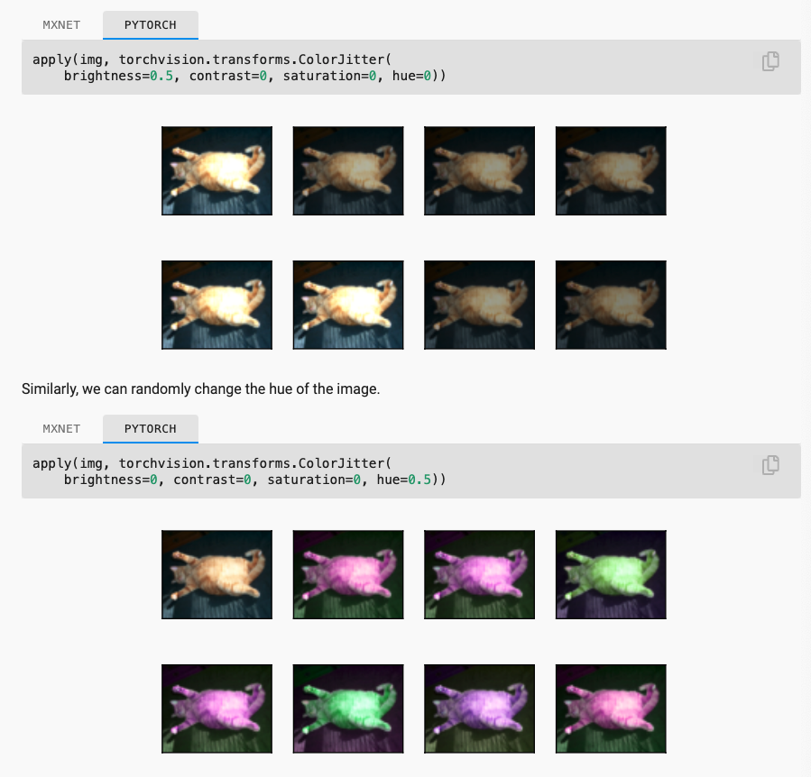

# Ch13 Computer Vision

- 의문
- 13.1. Image Augmentation
- 13.2. Fine-Tuning

## 의문

## 13.1. Image Augmentation

- 배경
  - 성공적인 모델의 학습을 위해서 이미지셋을 늘리는것이 반드시 필요함
- 개요
  - training dataset에 몇가지 random change를 주므로써, 유사 하지만 다른 이미지를 traning example을 생성해서 training dataset의 개수를 늘리는 기술
    - 결국 overfitting을 줄이는 기술
  - 예시
    - image를 다른 위치에서 crop해서, 모델이 object의 position에 대한 dependency를 줄임
    - image의 밝기를 조절해서, 모델이 color sensitivity에 대한 dependency를 줄임
- 대표적인 방법
  - Flipping and Cropping
  - Changing the Color

### 13.1.1. Common Image Augmentation Method

Image augmentation: color change



```python
# 50% horizontal flipping
torchvision.transforms.RandomHorizontalFlip()

# 50% vertical flipping
torchvision.transforms.RandomVerticalFlip()

shape_aug = torchvision.transforms.RandomResizedCrop(
  (200, 200), scale=(0.1, 1), ratio=(0.5, 2)
)

# changing the color (H, S, V, Contrast)
color_aug = torchvision.transforms.ColorJitter(
  brightness=0.5, contrast=0, saturation=0, hue=0)
)

# multiple image augmentation methods
torchvision.transforms.Compose([
  torchvision.transforms.RandomHorizontalFlip(),
  color_aug,
  shape_aug
])
```

### 13.1.2 Using an Image Augmentation Training Model

```python
def load_cifar10(is_train, augs, batch_size):
    dataset = torchvision.datasets.CIFAR10(root="../data", train=is_train,
                                           transform=augs, download=True)
    dataloader = torch.utils.data.DataLoader(dataset, batch_size=batch_size,
                    shuffle=is_train, num_workers=d2l.get_dataloader_workers())
    return dataloader
```

- `torch.utils.data.DataLoader`를 사용해서 데이터 로드
  - 그 전에 데이터셋을 image augmentation object를 이용해서 aug된 상태로 등록

## 13.2. Fine-Tuning

Fine-Tuning


### transfer learning

transfer learning 학습 코드 예시

```py
finetune_net = torchvision.models.resnet18(pretrained=True)
finetune_net.fc = nn.Linear(finetune_net.fc.in_features, 2)
nn.init.xavier_uniform_(finetune_net.fc.weight);
# If `param_group=True`, the model parameters in fc layer will be updated
# using a learning rate ten times greater, defined in the trainer.

def train_fine_tuning(net, learning_rate, batch_size=128, num_epochs=5,
                      param_group=True):
    train_iter = torch.utils.data.DataLoader(torchvision.datasets.ImageFolder(
        os.path.join(data_dir, 'train'), transform=train_augs),
        batch_size=batch_size, shuffle=True)
    test_iter = torch.utils.data.DataLoader(torchvision.datasets.ImageFolder(
        os.path.join(data_dir, 'test'), transform=test_augs),
        batch_size=batch_size)
    devices = d2l.try_all_gpus()
    loss = nn.CrossEntropyLoss(reduction="none")
    if param_group:
        params_1x = [param for name, param in net.named_parameters()
             if name not in ["fc.weight", "fc.bias"]]
        trainer = torch.optim.SGD([{'params': params_1x},
                                   {'params': net.fc.parameters(),
                                    'lr': learning_rate * 10}],
                                lr=learning_rate, weight_decay=0.001)
    else:
        trainer = torch.optim.SGD(net.parameters(), lr=learning_rate,
                                  weight_decay=0.001)
    d2l.train_ch13(net, train_iter, test_iter, loss, trainer, num_epochs,
                   devices)
```

- 개요
  - source dataset에서 학습된 지식을 target dataset으로 옮김
  - e.g)
    - ImageNet의 대부분의 이미지 데이터는 의자와 관계가 없어도, ImageNet으로 학습된 모델은 edge, texture, shapes, object composition과 같은 feature를 판별하는데 도움을 주는 피쳐를 뽑아낼 수 있음
- 단계
  - 1 source data를 이용하여 NN모델을 pre-train함
  - 2 새 NN모델을 생성
    - 해당 모델은 source model과 구조가 다 같으나, output layer만 다름
    - source model의 parameter가 source dataset의 knowledge를 갖고 있고, 그것을 target dataset에도 적용 가능하다고 가정
  - 3 output layer구조를 target dataset categories에 맞춰 수정하고, random initialization을 함
  - 4 target model을 target dataset으로 학습시킴
    - output layer는 새로 학습
      - lr이 상대적으로 높아야 함
    - 다른 파라미터는 fine-tuned
      - lr이 상대적으로 낮아야 함
