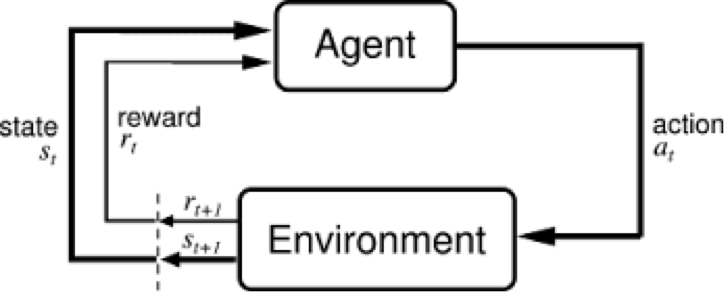
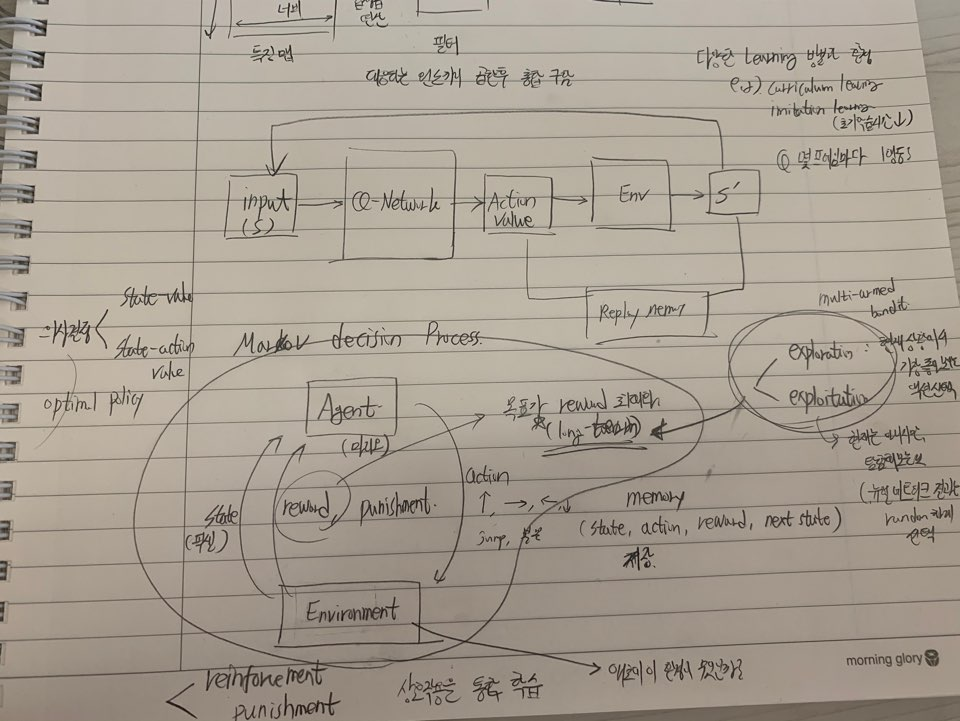

# Reinforce Learning

- 의문
- 강화학습 프레임워크(생각)
- 다양한 Learning 방법과 Environment들

## 의문

- 슈퍼마리오의 경우, 몇 프레임마다 행위나 상태를 저장하는지?

## 강화학습 이란

- 개요
  - 여러 단계를 거쳐 복잡한 목표를 달성하거나 특정 차원을 따라 최대화하는 방법을 학습하는 목표 지향적인 알고리즘
    - e.g
      - 여러 동작을 통하여 게임에서 얻는 점수 최대화
- 특징
  - 즉각적인 행동과 그로 인해 생기는 지연된 보상(delayed return)과 관련된 어려운 문제를 해결
  - e.g
    - 바둑 게임의 보상함수는 게임이 끝나고 계가 후에 주어짐
- 구성
  - 에이전트
    - **새로운 상태와 보상을 다음 행동으로 변환하는 함수**
      - 알 수 있는 함수
    - 행동을 취하는 주체. 배송 서비스를 수행하는 드론, 비디오 게임에서 슈퍼 마리오.
  - 행동(A)
    - `A`는 에이전트가 취할 수 있는 모든 행동을 말함
    - 에이전트는 수행 가능한 행동의 리스트 중에서 앞으로 할 행동을 선택해야 함
    - 예시
      - 비디오 게임에서의 리스트는 오른쪽이나 왼쪽으로 달리기, 높거나 낮게 점프하기, 웅크리거나 서있기
      - 주식 시장에서의 리스트는 유가 증권 및 파생상품 구매, 판매, 보유 등
  - 할인율(Discount factor(`γ`))
    - 0과 1사이의 값으로 설정
    - 이 값에 시간이 지남에 따라 에이전트가 발견하는 미래의 보상이 곱해져 에이전트가 선택한 행동에 대한 보상 효과를 약화시킴
    - 미래 보상의 현재가치
    - 예시
      - `γ=0.8`이고 3단계를 거쳐 10점의 보상을 받으면 보상의 현재가치는 `0.8^3 x 10`
  - 환경(Environment)
    - **에이전트의 현재 상태 및 행동을 취하여 보상과 다음 상태를 반환하는 함수**
      - 블랙박스 함수
      - 에이전트가 이동하는 세계
      - 물리법칙과 사회의 규칙
  - 상태(S)
    - 에이전트가 인식하는 구체적이고 즉각적인 자신의 상황
    - 도구, 장애물, 적, 보상과 같은 중요한 요인들과 관련하여 에이전트가 마주하는 특정 장소와 시간이며 즉각적인 구성을 의미
  - 보상(R)
    - 에이전트의 행동에 대한 성공이나 실패를 측정하는 피드백
    - 특정 상태에서 에이전트는 선택한 행동을 출력 값으로 환경으로 보내고 환경은 그에 따른 에이전트의 새로운 상태와 보상을 반환. 에이전트에 의해 평가된 보상은 즉시 주어질 수도, 지연될 수도 있음
  - 정책(π)
    - 에이전트가 현재 상태를 기준으로 다음의 행동을 결정하는 데 사용하는 전략
    - 에이전트는 특정한 상태에서 보상을 최대화할 수 있는 행동을 선택
  - 가치(V)
    - 단기적인 보상인 `R`과 달리, `value`는 장기적인 관점에서의 할인된 기댓값
    - `Vπ(s)`란 현재 상태에서 정책 `π`에 따른 기대되는 보상을 의미
  - Q-value또는 action-value (Q)
    - 현재의 상태에서 취하는 행동 a를 고려
    - `Qπ(s,a)`는 정책에 따라 행동을 a를 취할 경우 현재 상태 s에서 받을 장기적인 리턴
  - 궤도(Trajectory)
    - 그 상태에 영향을 미치는 연속적인 상태와 행동
  - 강화학습 알고리즘
    - 에이전트가 앞으로 누적될 보상을 최대화하는 일련의 행동으로 정의되는 정책을 찾는 방법

## 강화학습 프레임워크(생각)

- Marcov Decision Process
  - 구성 요소
    - Agent
      - environment속에서 action을 행함
    - Environment
      - action에 대한 다음 state와 reward(punishment)를 agent로 제공
  - 목표
    - **\*long-term reward 최대화**
      - exploration
        - 현재의 최선의 판단은 아니지만, 탐험해보는 것
      - exploitation
        - 현재 상황에서 가장 좋아보이는 액션 선택

## 다양한 Learning 방법과 Environment들

- learning의 종류
  - curriculum learning
    - 쉬운 문제부터 차근차근 풀도록 학습구조를 설정
  - imitation learning
    - 선생님을 붙여두고 학습
    - 초기 학습시간 단축
