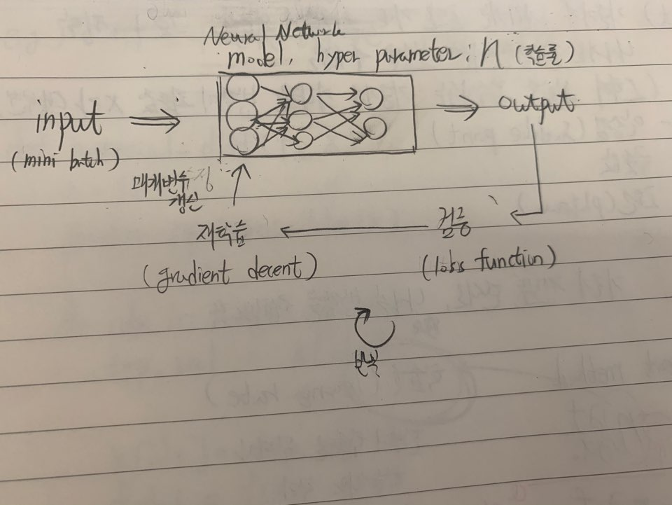
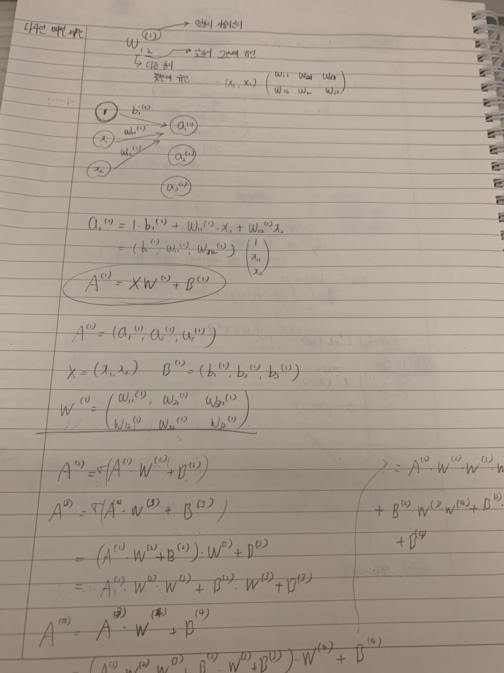
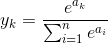
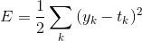
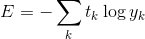
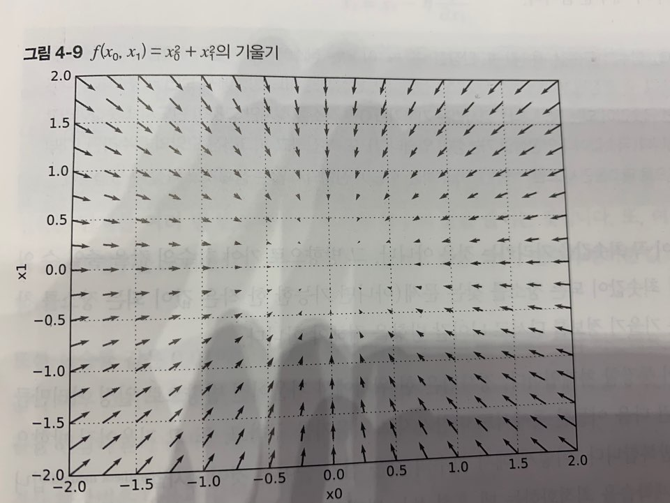
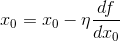
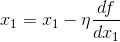

# Deep learning from scratch

- 의문
- 큰 그림
- 1 퍼셉트론
- 2 신경망
- 3 신경망 학습
- 4 오차역전파법
- 5 학습 관련 기술들

## 의문

- *numpy 사용법 익히기*

## 큰 그림



## 1. 퍼셉트론

### 1.1 퍼셉트론이란?

여기에서는 인공 뉴런, 단순 퍼셉트론으로 불리는 것

- 정의
  - 다수의 신호(흐름)를 입력으로 받아 하나의 신호를 출력
- 매개변수
  - 가중치
  - 편향
- 동작
  - 다른 뉴런(노드)으로부터의 입력 신호에 각각 고유한 가중치를 곱하고 그 합이 정해진 한계를 넘을 때만 1을 출력
  - 가중치가 클 수록 그 신호가 더 중요함을 의미
    - 가중치는 전류의 저항의 역작용을 함
  - 예시
    - y
      - 0 `(w1x1 + w2x2 <= θ)`
      - 1 `(w1x1 + w2x2 > θ)`

### 1.2 단순한 논리 회로

- 퍼셉트론을 이용한 논리 회로 구축
  - AND
  - NAND
- 퍼셉트론의 매개변수 값(가중치, 임계값)을 정하는 주체
  - 인간
    - NAND 게이트 등
  - 컴퓨터
    - 매개변수의 값을 컴퓨터가 자동으로 정하게 하는 작업을 **학습** 이라 함
    - 사람은 퍼셉트론의 구조(모델)를 고민하고, 컴퓨터에 학습할 데이터를 주는 일을 함
- **퍼셉트론으로 논리 회로를 구현할 수 있는데, 구조 자체는 똑같으나, 세 가지 게이트에서 다른 것은 매개변수(가중치와 임계값) 뿐**

### 2.3 퍼셉트론 구현하기

- AND
  - `w1x1 + w2x2 + b > 0 => 1`
  - `w1x1 + w2x2 + b <= 0 => 0`
  - `(w1, w2 = 0.5, b = -0.7)`
- NAND
  - `w1x1 + w2x2 + b > 0 => 1`
  - `w1x1 + w2x2 + b <= 0 => 0`
  - `(w1, w2 = -0.5, b = 0.7)`
- OR
  - `w1x1 + w2x2 + b > 0 => 1`
  - `w1x1 + w2x2 + b <= 0 => 0`
  - `(w1, w2 = 0.5, b = -0.3)`
- XOR
  - 단층 퍼셉트론으로 구현 불가
  - 2층 퍼셉트론으로 구현 가능

단층 퍼셉트론은 직선형 영역만 표현할 수 있고, 다층 퍼셉트론은 비선형 영역도 표현할 수 있다.
2층 퍼셉트론이면 컴퓨터를 만들 수 있다.

## 2. 신경망

### 2.1 활성화 함수

- 정의
  - 입력신호의 총합을 출력 신호로 변화시켜주는 함수
    - `y = h(b+w1x1+w2x2)`
    - `h(x) = { 0 (x≦0), 1 (x>0)}`
- 종류
  - 계단 함수
    - `h(x) = { 1 (x>0), 0 (x<=0)}`
      - 비선형 함수
  - 시그모이드 함수
    - `h(x) = 1/(1+e^-x)`
      - 비선형 함수
      - 연속함수
      - 단조증가함수
        - 입력이 중요하면 큰 값 출력, 중요하지 않으면 작은 값 출력
  - ReLU(Rectified Linear Unit) 함수
    - `h(x) = { x (x>0), 0 (x<=0) }`
    - 최근에 많이 사용됨
      - *왜 최근에 많이 사용되지?*
- 퍼셉트론과 신경망의 주된 차이
  - 활성화 함수 뿐
  - 신경망의 활성화 함수는 비선형 함수여야 함(시그모이드 함수 or ReLU 함수)
    - 선형 함수는 가감승제, 합성해도 계속 선형함수이기 때문에, 신경망의 층을 아무리 깊게 해도, 은닉층이 없는 네트워크로도 똑같은 기능을 할 수 있어버림

### 2.2 신경망 모델 계산



```py
def init_network():
  network = {}
  # it should be initialized with proper paramters(for now, it is just dummy)
  network['W1'] = np.array([[0.1, 0.3, 0.5], [0.2, 0.4, 0.6]]))
  network['b1'] = np.array([0.1, 0.2, 0.3])
  network['W2'] = np.array([[0.1, 0.4], [0.2, 0.5], [0.3, 0.6]])
  network['b2'] = np.array([0.1, 0.2])
  network['W3'] = np.array([[0.1, 0.3], [0.2, 0.4]])
  network['b3'] = np.array([0.1, 0.2])

  return network

# 순전파 함수
def forward(network, x):
  W1, W2, W3 = network['W1'], network['W2'], network['W3']
  b1, b2, b3 = network['b1'], network['b2'], network['b3']

  a1 = np.dot(x, W1) + b1
  z1 = sigmoid(a1)
  a2 = np.dot(z1, W2) + b2
  z2 = sigmoid(a2)
  a3 = np.dot(z2, W3) + b3
  y = identity_function(a3)

  return y

network = init_network()
x = np.array([1.0, 0.5])
y = forward(network, x)
print(y)
```

### 2.3 출력층 설계하기

- 어떤 딥러닝 문제냐에 따라서 출력층에서 사용하는 활성화 함수가 달라짐
  - 회귀(입력데이터에서 연속적인 수치 예측)
    - I(항등함수)
  - 분류(데이터가 어느 클래스에 속하는가)
    - softmax
      - *이 함수는 무슨 배경으로 등장했고, 어떤 특징을 갖는가? - 수학적으로*



- softmax 함수 특징
  - ① `sigma_{k=1}^{n}(y_k) = 1`
  - ② `y_k`는 단조증가 함수
  - ③ 클래스 인식을 확률적(통계적)으로 가능하게 함(값 0 ~ 1)
- 주의
  - 어차피 분류의 문제에서는 가장 출력값이 큰 뉴런에 해당하는 클래스로만 인식하므로, 굳이 softmax함수를 적용할 필요가 없다.
    - 대신, 학습할때에는 softmax함수를 사용
    - 추론에서는 사용하지 않음

### 2.4 용어 설명

- 정규화
  - 데이터를 특정 범위로 변환하는 것
- 전처리
  - 신경망의 입력데이터에 pre-processing 특정변환을 가하는것
- 백색화(whitening)
  - 전체 데이터를 균일하게 분포시킴
- 배치(batch)
  - 하나로 묶은 입력 데이터
  - 느린 I/O 비율을 줄임
    - 데이터 전체에서 표본을 추출한 것
- 학습
  - 정의
    - 훈련 데이터로부터 가중치・매개변수의 최적값을 자동으로 획득하는 것
- 학습지표
  - 정의
    - 손실 함수의 값
- python pickle
  - 파이썬 프로그램 실행 중에 특정 객체를 파일로 저장하는 기능

### 2.5 신경망의 추론 처리

- 구성
  - 입력층 뉴런 784개
    - 이미지 크기 `28x28`
  - 출력층 뉴런 10개
    - 문제가 0에서 9까지의 숫자를 구분하는 문제이기 때문
  - 은닉층
    - 첫 번째
      - 50개 뉴런
    - 두 번째
      - 100개 뉴런
- 구현

```py
import pickle
import numpy as np
from dataset.mnist import load_mnist
from functions import softmax, sigmoid

def get_data():
    # normalize는 전처리 프로세스에 해당
    (x_train, t_train), (x_test, t_test) = load_mnist(normalize=True, flatten=True, one_hot_label=False)
    return x_test, t_test

def init_network():
    with open("sample_weight.pkl", 'rb') as f:
        network = pickle.load(f)

    return network

def predict(network, x):
    W1, W2, W3 = network['W1'], network['W2'], network['W3']
    b1, b2, b3 = network['b1'], network['b2'], network['b3']

    a1 = np.dot(x, W1) + b1
    z1 = sigmoid(a1)
    a2 = np.dot(z1, W2) + b2
    z2 = sigmoid(a2)
    a3 = np.dot(z2, W3) + b3
    y = softmax(a3)

    return y

x, t = get_data()
network = init_network()

# without batch
accuracy_count = 0
for i in range(len(x)):
    y = predict(network, x[i])
    p = np.argmax(y)
    if p == t[i]:
        accuracy_count += 1

print("Accuracy: " + str(float(accuracy_count) / len(x)))

# with batch
batch_size = 100
accuracy_count = 0

for i in range(0, len(x), batch_size):
    x_batch = x[i:i+batch_size]
    y_batch = predict(network, x_batch)
    p = np.argmax(y_batch, axis=1) # 1번째 차원을 축으로
    accuracy_count += np.sum(p == t[i:i+batch_size])

print("Accuracy: " + str(float(accuracy_count) / len(x)))
```

- 배치 처리의 필요성
  - 배치
    - 하나로 묶은 입력 데이터
  - 배치 처리의 이점
    - ① 수치 계산 라이브러리가 큰 배열을 효율적으로 처리할 수 있도록 고도로 최적화 되어있음
    - ② 느린 I/O를 통한 데이터 읽는 횟수가 줄어 CPU / GPU를 이용한 순수 계산 수행 비율이 증가

## 3. 신경망 학습

### 3.1 우리의 목표

- **손실 함수의 결과값을 가장 작게 만드는 가중치 매개 변수 찾기**
  - 경사법
- 데이터 주도 학습
  - 데이터가 핵심
  - 데이터에서 패턴 추출(기계 학습)
    - 사람의 개입 배제
- 참고) 문제 해결 방법
  - ① 사람의 알고리즘(사람 중심)
  - ② 사람이 문제에서의 feature(입력 데이터에서 본질적인 데이터를 정확하게 추출할 수 있도록 설계된 변환기)를 추출 후 기계학습 구동
  - ③ 사람은 데이터만 제공하고 기계가 알아서 최적화(데이터 중심)
    - deep-learning = end-to-end machine learning(종단간 기계학습)
    - 그렇기 떄문에, 모든 문제를 같은 맥락에서 풀 수 있고, 주어진 데이터를 온전히 학습하고, 주어진 문제 패턴을 발견하려 시도

### 3.2 손실 함수

- 손실 함수
  - 정의
    - 신경망 성능의 "나쁨"을 나타내는 지표(현재의 신경망이 훈련 데이터를 얼마나 잘 처리하지 못하는가)
      - 만일, 정확도를 지표로 삼으면 (e.g) 100개중 33개가 맞아서 33%의 정확도), 미분값이 대부분의 장소에서 0이 되어 매개변수 갱신이 안됨



- 평균제곱오차(MSE - Mean Squared Error)
  - `E = 1/2・sigma_{k}(y_k - t_k)^2`
    - `y_k`는 k번쨰 뉴런의 신경망의 출력값
    - `t_k`는 k번쨰 뉴런의 정답 레이블
      - e.g) `y = [0.1, 0.05, 0.6, 0.0, 0.05, 0.1, 0.0, 0.1, 0.0, 0.0]`
      - `t = [0, 0, 1, 0, 0, 0, 0, 0, 0, 0] (원 핫 인코딩)`



- 교차 엔트로피 오차(CEE - Cross Entropy Error)
  - `E = -sigma_{k}(t_k・log(y_k))`
    - *왜 하필 이 함수를 쓰는가? - 애초에 어떤 배경으로 나타난 함수인가? 정보엔트로피와의 관계는 무엇인가?*
- **왜 정확도 대신 손실함수를 기준으로 학습을 할까?**
  - 정확도를 기준으로 파라미터를 구하려고 할 경우, 손실 함수에 대한 가중치의 편미분값이 대부분의 변화에도 0이 될 것이기 때문
  - 활성화 함수에서 계단함수 대신 시그모이드를 사용하는 이유도, 가중치의 변화를 계단함수가 대부분의 경우 흡수해버리기 때문(즉, 가중치를 변화 시켜도 손실함수의 변화가 계단함수에 흡수되어 버린다)

### 3.3 미니배치 학습

- 신경망의 학습
  - 정의
    - 손실함수 값을 최대한 줄여주는 매개변수를 탐색
  - 방법
    - 매개변수의 손실함수에 대한 미분값을 계산(그래서 활성화함수를 연속함수인 시그모이드 사용)
      - 가중치 매개변수의 값을 조금 변화시키면, 손실함수는 어떻게 변하는가


- 수식으로 미니 배치 적용한 손실함수 표현
  - `E = -1/N・sigma_{n}sigma_{k}(t_nk・log(y_nk))`
    - 데이터를 N개로 확장하고, N으로 나누어 정규화(평균 손실 함수)
  - 데이터가 너무 많으면 손실함수의 값을 구하기 힘들어짐
  - 데이터 일부를 추려 근사치로 이용가능(mini-batch)
    - 예시
      - 60,000장의 훈련 데이터 중에서 100장을 무작위로 뽑아 그 100장만 학습

### 3.4 손실 함수의 값을 최대한 줄이는 가중치 찾기

- 수치 미분(numerical_diff)
  - 정의
    - 무한소가 아닌, 아주 작은 차분으로 미분하는 것(근사)(`1e-4`)
      - c.f) 해석적 미분: 무한소를 이용한, 수학적인 미분(이론)

수치 미분의 예

```py
# 수치미분의 코드 예시
def numerical_diff(f, x):
    h = 1e-4 # 너무 작은 값이면 rounding error가 발생
    return (f(x+h) - f(x-h))/ (2*h) # 중앙 차분
```



- 기울기(gradient)
  - 정의
    - 모든 변수의 편미분을 벡터로(카르테지안 곱의 원소로) 정리한 것을 gradient라 함
      - e.g) `x0, x1의 편미분 동시에 계산 = (df/dx0, df/dx1)`
  - 특징
    - **기울기가 가리키는 방향은 각 장소에서 함수의 출력값을 가장 크게 줄이는 방향**
      - *수학적으로 왜?*
  - 의문
    - *gradient 를 구할 때, 왜, (x, y)와 같은 값 형태로 f에 input을 주어주는가?*
      - 어떤 점에서 미분을 하더라도, 결과적으로는 일차식인 것 처럼 간주되어 수치미분이 가능해짐

numerical gradient를 구하는 코드

```py
def numerical_gradient(f, x):
  h = 1e-4
  grad = np.zeros_like(x)

  for idx in range(x.size):
    tmp_val = x[idx]

    x[idx] = temp_val + h
    fxh1 = f(x)

    x[idx] = temp_val - h
    fxh2 = f(x)

    grad[idx] = (fxh1-fxh2)/(2*h)
    x[idx] = tmp_val

  return grad
```

gradient decent 수식





...

- 경사법(경사하강법)
  - 정의
    - 손실함수가 최솟값이 되는 매개변수(가중치, 편향)을 찾아야 함
    - 그것이 가능한 방법중에서 "기울기"를 잘 활용해 함수의 최솟값을 찾는 것이 경사법
  - 주의
    - 기울기가 가리키는 곳으로 가야 최솟값이 있는지, 그곳이 정말 나아가야 할 방향인지는 보장되지 않음
    - 오히려 복잡한 함수에서는 기울기가 가리키는 방향에 최솟값이 없는 경우가 대부분
      - e.g) 안장점(saddie point), 극솟값, 고원(plateau)
    - 그럼에도 불구하고 기울기 정보를 단서로 나아갈 방향을 정해야 함
  - 방법
    - `x0 = x0 - η・df/dx0`
      - `η`는 학습률(한번 학습에서 얼마나 학습해야 할지 - 매개변수값을 얼마나 갱신해야 할지)
      - `η`를 너무 크거나 작게 하면 안됨. 적당히 좋은 값 설정이 필요

gradient decent의 구현

```py
def gradient_decent(f, init_x, lr=0.01, step_num=100):
  x = init_x

  for i in range(step_num):
    grad = numerical_gradient(f,x)
    x -= lr * grad

  return x
```

- 하이퍼 파라미터
  - 정의
    - 사람이 직접 설정해야 하는 매개변수
    - 여러 후보값 중에서 시험을 통해 가장 잘 학습하는 값을 찾는 과정을 거쳐야 함
  - 예시
    - `η`


### 3.5 신경망에서 기울기

- `dL/dW`
  - `L`는 손실함수
  - `W`는 가중치 행렬

간단한 신경망 예시

```py
class simpleNet:
    def __init__(self):
        self.W = np.random.randn(2,3) # 정규분포로 초기화

    def predict(self, x):
        return np.dot(x, self.W)

    def loss(self, x, t):
        z = self.predict(x)
        y = softmax(z)
        loss = cross_entropy_error(y, t)

        return loss

def f(W):
    return net.loss(x, t)

net = simpleNet()

x = np.array([0.6, 0.9])
p = net.predict(x)

dW = numerical_gradient(f, net.W)
```

### 3.6 TwoLayerNet

- 신경망 학습 절차
  - 1단계 - 미니배치
    - 무작위 선출이므로 확률적 경사하강 법(Stochastic Gradient Decent - SGD)이라 부름
  - 2단계 - 기울기 산출
  - 3단계 - 매개변수 갱신
  - 4단계 - 1~3단계 반복

```py
import numpy as np
from functions import sigmoid, softmax, cross_entropy_error, numerical_gradient

class TwoLayerNet:
    def __init__(self, input_size, hidden_size, output_size, weight_init_std=0.01):
        self.params = {}
        self.params['W1'] = weight_init_std * np.random.randn(input_size, hidden_size)
        self.params['b1'] = np.zeros(hidden_size)

        self.params['W2'] = weight_init_std * np.random.randn(hidden_size, output_size)
        self.params['b2'] = np.zeros(output_size)

    def predict(self, x):
        W1, W2 = self.params['W1'], self.params['W2']
        b1, b2 = self.params['b1'], self.params['b2']

        a1 = np.dot(x, W1) + b1
        z1 = sigmoid(a1)
        a2 = np.dot(z1, W2) + b2
        y = softmax(a2)

        return y

    def loss(self, x, t):
        y = self.predict(x)

        return cross_entropy_error(y, t)

    def accuracy(self, x, t):
        y = self.predict(x)
        y = np.argmax(y, axis=1)
        t = np.argmax(t, axis=1)

        accuracy = np.sum(y == t) / float(x.shape[0])
        return accuracy

    def numerical_gradient(self, x, t):
        loss_W = lambda W: self.loss(x, t)

        grads = {}
        grads['W1'] = numerical_gradient(loss_W, self.params['W1'])
        grads['b1'] = numerical_gradient(loss_W, self.params['b1'])
        grads['W2'] = numerical_gradient(loss_W, self.params['W2'])
        grads['b2'] = numerical_gradient(loss_W, self.params['b2'])

        return grads

    def gradient(self, x, t):
      # 오차역전파법 - 다음장
      # 수치 미분을 사용할 떄와 거의 같은 결과를 훨씬 빠르게 얻을 수 있음
      pass

if __name__ == '__main__':
    from dataset.mnist import load_mnist

    (x_train, t_train), (x_test, t_test) = load_mnist(normalize=True, one_hot_label=True)

    network = TwoLayerNet(input_size=784, hidden_size=50, output_size=10)

    # hyper-parameter
    iters_num = 1000
    train_size = x_train.shape[0]
    batch_size = 100
    learning_rate = 0.1

    train_loss_list = []
    train_acc_list = []
    test_acc_list = []

    iter_per_epoch = max(train_size / batch_size, 1)

    for i in range(iters_num):
        print(i)
        # get mini-batch
        batch_mask = np.random.choice(train_size, batch_size)
        x_batch = x_train[batch_mask]
        t_batch = t_train[batch_mask]

        # get gradient
        grad = network.gradient(x_batch, t_batch)

        # update parameters
        # (gradient decent)
        for key in ('W1', 'b1', 'W2', 'b2'):
            network.params[key] -= learning_rate * grad[key]

        # the registration of the learning process
        loss = network.loss(x_batch, t_batch)
        train_loss_list.append(loss)

        if i % iter_per_epoch == 0:
            train_acc = network.accuracy(x_train, t_train)
            test_acc = network.accuracy(x_test, t_test)
            train_acc_list.append(train_acc)
            test_acc_list.append(test_acc)
            print("train acc, test acc : " + str(train_acc) + ", " + str(test_acc))

    import matplotlib.pylab as plt
    x_axis = range(iters_num)
    y_axis = train_loss_list
    plt.plot(x_axis, y_axis)
    plt.show()
```

- 위 코드에 대한 부가 설명
  - ① 가중치 매개변수 초깃값을 무엇으로 설정하냐가 신경망 학습의 성공을 좌우하기도 함
  - ② 훈련 데이터의 미니배치에 대한 손실 함수의 값이 작아지고 있다는 것은 신경망이 잘 학습하고 있다는 방증
  - ③ test데이터를 사용하여, 오버피팅 되어있는지 확인해야 함
    - 훈련하지 않은 데이터로 평가가 필요
  - ④ train데이터와 test데이터에 둘다 정확도가 비슷하게 올라가고 나아지고 있으면 overfitting이 아니다.
    - 오버피팅이 시작되면, 그때에 조기에 중단하고 예방해야한다
    - e.g)
      - 가중치 감소
      - 드롭아웃

## 4. 오차역전파법

### 4.1 계산 그래프

- 개요
  - 계산 과정을 그래프로 나타낸 것
- 구성
  - 노드
    - 연산자
  - 에지
    - 값
- 단어 설명
  - 순전파(forward propagation)
    - 계산을 왼쪽에서 오른쪽으로 진행하는 단계
  - 역전파(backward propagation)
    - 계산을 오른쪽에서 왼쪽으로 진행하는 단계
- 국소적 계산
  - 정의
    - *자신* 과 직접 관계된 작은 범위의 계산
- 장점
  - ① 전체 계산이 아무리 복잡해도 각 노드에서는 단순한 계산에 집중하여 문제를 단순화 할 수 있음
  - ② 중간 계산 결과를 모두 보관할 수 있음
  - ③ 역전파를 통해 미분을 쉽게 계산가능
    - **국소적 미분을 오른쪽에서 왼쪽으로 전달**

### 4.2 연쇄법칙

- 개요
  - 국소적 미분을 전달하는 원리
- 연쇄법칙
  - 합성함수
    - 정의
      - 여러 함수로 구성된 함수
    - 합성함수의 미분
      - 합성 함수의 미분은 합성 함수를 구성하는 각 함수의 미분의 곱으로 나타낼 수 있다
  - `역전파 == 연쇄법칙`

### 4.3 역전파

Chainrule을 이용한 Dynamic Programming의 응용

- 덧셈 노드
  - `z = x + y`
    - `dL/dx(우리가 구하고 싶은 미분계수) = dL/dz x dz/dx`
      - `dz/dx = 1`
      - `dz/dy = 1`
  - 특징
    - 상류에서 전해진 미분에 1을 곱하여 하류로 흘림
- 곱셈 노드
  - `z = xy`
    - `dL/dx(우리가 구하고 싶은 미분계수) = dL/dz x dz/dx`
      - `dz/dx = y`
      - `dz/dy = x`
  - 특징
    - 상류의 값에 순전파 때의 입력 신호들을 서로 바꾼 값을 곱해서 하류로 보냄
      - 국소적 미분 계산을 위해 순방향 입력 신호의 값이 필요하여 저장해둠

### 4.4 단순한 계층 구현하기

```py
class MulLayer:
  def __init__(self):
    self.x = None
    self.y = None

  def forward(self, x, y):
    self.x = x
    self.y = y
    out = x * y

    return out

  def backward(self, dout):
    dx = dout * self.y
    dy = dout * self.x

    return dx, dy

class AddLayer:
  def __init__(self):
    pass

  def forward(self, x, y):
    out = x + y
    return out

  def backward(self, dout):
    dx = dout * 1
    dy = dout * 1

    return dx, dy
```

### 4.5 활성화 함수 계층 구현하기

- 활성화 함수 계층
  - ReLU
  - Sigmoid
    - 합성함수로 쪼개기
      - `y = 1/(1+e^-x) = 1/x ◦ x+1 ◦ e^x ◦ -x`
    - sigmoid 계층의 역전파
      - `dL/dy * y^2 * e^-x = dL/dy * y * (1-y)`
        - 순전파의 출력 만으로도 역전파를 계산할 수 있음

```py
class Relu:
  def __init__(self):
    self.mask = None

  def forward(self, x):
    self.mask = (x <= 0)
    out = x.copy()
    out[self.mask] = 0

    return out

  def backward(self, dout):
    dout[self.mask] = 0
    dx = douts

    return dx

class Sigmoid:
  def __init__(self):
    self.out = None

  def forward(self, x):
    out = 1 / (1 + np.exp(-x))
    self.out = out

    return out

  def backward(self, dout):
    dx = dout * (1.0 - self.out) * self.out

    return dx
```

### 4.6 Affine/Softmax 계층 구현하기

*체 위의 아핀공간이 무엇인가?*

*Affine계층의 역전파의 경우 왜 행렬이 transpose되는가?*

- Affine(아핀) 계층
  - 개요
    - 신경망의 순전파 때 수행하는 행렬의 곱은 기하학에서는 어파인 변환(affine transformation)이라고 함. 이 책에서 Affine 변환을 수행하는 처리를 'Affine 계층' 이라는 이름으로 구현
  - `Y = X・W + B`
    - `dL/dX = dL/dY・dY/dX = dL/dY・tW(전치 행렬)`
      - `(N,2) = (N,3)・(3,2)`
    - `dL/dW = dY/dW・dL/dY(행렬의 사이즈를 맞춰야 해서지만 수학적으로는 왜?) = tX・dL/dY`
      - `(2,3) = (2,N)・(N,3)`
      - `[AxB]_k^l = ak1b1l + ak2b2l + ... + aknbnl`
        - **`akl`에 대한(`1≦k,l≦n`) `AxB`의 편미분 = blk**
    - 행렬의 크기 구하는법? 어떻게 생각해야 하는가?
      - gradient라는 것은 각 원소에 대한 기울기 벡터들을 의미하는데, 그렇다는 것은 원소의 개수와 형태만큼 기울기가 나오는 것이 자명

```py
class Affine:
  def __init__(self, W, b):
    self.W = W
    self.b = b
    self.x = None
    self.dW = None
    self.db = None

  def forward(self, x):
    self.x = x
    out = np.dot(x, self.W) + self.b

    return out

  def backward(self, dout):
    dx = np.dot(dout, self.W.T)
    self.dW = np.dot(self.x.T, dout)
    self.db = np.sum(dout, axis=0) # why np.sum(...)?

    return dx
```

- Softmax-with-Loss 계층
  - 개요
    - 출력층에서 사용하는 소프트맥스 함수와 손실 함수인 교차 엔트로피 오차도 포함한 계층
  - 참고
    - 신경망에서 수행하는 작업
      - 학습
        - Softmax-with-loss 계층을 사용
      - 추론
        - Softmax-with-loss 계층을 사용하지 않음
          - 가장 높은 점수만 알면 되므로
  - 결과(3-class 분류의 경우)
    - `(y1-t1, y2-t2, y3-t3)`
      - 교차 엔트로피 오차라는 함수가 이렇게 설계되었음
      - 이는 회귀의 출력층에서 사용하는 항등 함수의 손실 함수로 평균 제곱 오차를 이용 하는 이유도 같음. 그 경우도 `(y1-t1, y2-t2, y3-t3)`으로 말끔하게 떨어짐
  - 구체적 예시
    - 예1
      - 정답 레이블 `(0, 1, 0)`, softmax계층의 출력 `(0.3, 0.2, 0.5)` 인경우
      - 신경망이 제대로 인식하지 못하고 있음
      - 역전파 = `(0.3, -0.8, 0.5)`
      - softmax 계층의 앞 계층들은 그 큰 오차로부터 큰 깨달음을 얻게 됨
        - 미분값이 크게 전달되므로
    - 예2
      - 정답 레이블 `(0, 1, 0)`, softmax계층의 출력 `(0.01, 0.99, 0)` 인경우
      - 신경망이 제대로 인식하고 있음
      - 역전파 = `(0.01, -0.01, 0)`
      - 오차가 작으므로 학습하는 정도도 작아짐

Softmax-with-Loss 계층의 구현

```py
class SoftmaxWithLoss:
  def __init__(self):
    self.loss = None
    self.y = None
    self.t = None

  def forward(self, x, t):
    self.t = t
    self.y = softmax(x)
    self.loss = cross_entropy_error(self.y, self.t)
    return self.loss

  def backward(self, dout=1):
    batch_size = self.t.shape[0]
    dx = (self.y - self.t) / batch_size

    return dx
```

### 4.7 오차 역전파법 구현하기

- 신경망 학습의 전체 그림
  - 1단계 - 미니배치
  - 2단계 - 기울기 산출
    - 수치미분 대신 오차 역전파법 이용
  - 3단계 - 매개변수 갱신(학습)
  - 4단계 - 반복

```py
from collections import OrderedDict
from common.layers import *
import numpy as np

class TwoLayerNet:
    def __init__(self, input_size, hidden_size, output_size, weight_init_std=0.01):
        self.params = {}

        self.params['W1'] = weight_init_std * np.random.randn(input_size, hidden_size)
        self.params['b1'] = np.zeros(hidden_size)
        self.params['W2'] = weight_init_std * np.random.randn(hidden_size, output_size)
        self.params['b2'] = np.zeros(output_size)

        # modulize all the layers
        self.layers = OrderedDict()
        self.layers['Affine1'] = Affine(self.params['W1'], self.params['b1'])
        self.layers['Relu1'] = Relu()
        self.layers['Affine2'] = Affine(self.params['W2'], self.params['b2'])

        self.lastLayer = SoftmaxWithLoss()

    def predict(self, x):
        for layer in self.layers.values():
            x = layer.forward(x)

        return x

    def loss(self, x, t):
        y = self.predict(x)
        return self.lastLayer.forward(y, t)

    def accuracy(self, x, t):
        y = self.predict(x)
        y = np.argmax(y, axis=1)
        if t.ndim != 1:
            t = np.argmax(t, axis=1)

        accuracy = np.sum(y == t) / float(x.shape[0])

        return accuracy

    def numerical_gradient(self, x, t):
        lossW = lambda W: self.loss(x, t)

        grads = {}
        grads['W1'] = numerical_gradient(lossW, self.params['W1'])
        grads['b1'] = numerical_gradient(lossW, self.params['b1'])
        grads['W2'] = numerical_gradient(lossW, self.params['W2'])
        grads['b2'] = numerical_gradient(lossW, self.params['b2'])

        return grads

    def gradient(self, x, t):
        # forwardpropagation
        y = self.loss(x, t)

        # backpropagation
        dout = 1
        dout = self.lastLayer.backward(dout)

        layers = list(self.layers.values())
        layers.reverse()

        for layer in layers:
            dout = layer.backward(dout)

        grads = {}
        grads['W1'] = self.layers['Affine1'].dW
        grads['b1'] = self.layers['Affine1'].db
        grads['W2'] = self.layers['Affine2'].dW
        grads['b2'] = self.layers['Affine2'].db

        return grads
```

- 위 코드 해설
  - 신경망의 구성 요소를 계층으로 추상화한(모듈화) 덕분에, 깊은 신경망을 만들고 싶으면, 단순히 필요한 만큼 계층을 추가해 주면 됨
- 오차역전파법으로 구한 기울기 검증하기
  - 기울기 확인(gradient check)
    - 수치 미분의 결과와 오차역전파법의 결과를 비교하여 오차역전파법을 제대로 구현했는지 검증

```py
(x_train, t_train), (x_test, t_test) = load_mnist(normalize=True, one_hot_label=True)

network = TwoLayerNet(input_size=784, hidden_size=50, output_size=10)

x_batch = x_train[:3]
t_batch = t_train[:3]

grad_numerical = network.numerical_gradient(x_batch, t_batch)
grad_backprop = network.gradient(x_batch, t_batch)

for key in grad_numerical.keys():
  diff = np.average(np.abs(grad_backprop[key] - grad_numerical[key]))
  print(key + ":" + str(diff))
  # b1: 9.7e-13
  # w2: 8.4e-13
  # b2: 1.1e-10
  # w1: 2.2e-13
```

- 이번 장에서 배운 내용
  - ① 계산 그래프를 이용하면 계산 과정을 시각적으로 파악할 수 있다.
  - ② 계산 그래프의 노드는 국소적 계산으로 구성된다. 국소적 계산을 조합해 전체 계산을 구성한다.
  - ③ 계산 그래프의 순전파는 통상의 계산을 수행한다. 한편, 계산 그래프의 역전파로는 각 노드의 미분을 구할 수 있다.
    - 합성함수의 chain rule
  - ④ 신경망의 구성 요소를 계층으로 구현하여 기울기를 효율적으로 계산할 수 있다(오차역전파법)
    - 모든 계층에서 forward / backward 메서드 구현
  - ⑤ 수치 미분과 오차역전파법의 결과를 비교하면 오차역전파법의 구현에 잘못이 없는지 확인할 수 있다(기울기 확인)

## 5. 학습 관련 기술들

- 가중치 매개변수의 최적값 탐색하는 최적화 방법
- 가중치 매개변수 초깃값
- 하이퍼파라미터 설정 방법
- 오버피팅 대응
  - 가중치 감소
  - 드롭아웃
- 배치 정규화

### 5.1 매개변수 갱신

- 최적화
  - 정의
    - 신경망 학습의 목적은 손실 함수의 값을 가능한 한 낮추는 매개변수를 찾는것인데, 이는 곧 매개변수의 최적값을 찾는 문제이며 이를 최적화라 함
    - 매개변수의 공간은 매우 넓고 복잡해서 최적의 솔루션은 쉽게 못 찾아 정말 어려움
  - SGD(확률적 경사 하강법)
    - 매개변수의 기울기를 구해, 기울어진 방향으로 매개변수의 값을 갱신하는 일을 몇 번이고 반복해서 최적의 값에 다가감
- 종류
  - SGD
  - Momentum
  - AdaGrad
  - Adam

#### 1. SGD

- 수식
  - `W <- W - η*dL/dW`

```py
class SGD:
  def __init__(self, lr=0.01):
    self.lr = lr

  def update(self, params, grads):
    for key in params.keys():
      params[key] -= self.lr * grads[key]

# ... 코드의 사용

network = TwoLayerNet(...)
optimizer = SGD()

for i in range(10000):
  ...
  x_batch, t_batch = get_mini_batch(...)
  grads = network.gradient(x_batch, t_batch)
  params = network.params
  # 최적화를 담당할 클래스를 분리해서 구현하여 기능을 모듈화
  optimizer.update(params, grads)
  ...
```

- 단점
  - 예시
    - `f(x,y) = 1/20*x^2 + y^2`함수의 최솟값 찾기
    - SGD에 의한 최적화 경로
      - 심하게 굽이진 움직임으로 상당히 비효율적 움직임을 보여줌

#### 2. Momentum

- 개요
  - 운동량을 뜻하는 단어로 물리와 관계가 있음
- 수식
  - `v <- av - η*dL/dW`
  - `W <- W + v`
  - 해석
    - *`v`는 물리의 속도에 해당. 기울기 방향으로 힘을 받아 물체가 가속된다는 물리 법칙을 나타냄*
      - *어째서 그런 해석이 가능한거지?*
        - av가 W의 갱신할 때 sgd와 비교해서 마찰력같은 역할(`W <- W + av - η*dL/dW`)을 하므로써, 갱신값이 적어짐
    - 공간 바닥을 구르는 듯한 움직임을 보여줌
    - `av`는 물체가 아무런 힘을 받지 않을 때 서서히 하강시키는 역할을 함(`a = 0.9`등의 값으로 설정)
      - 물리에서의 지면 마찰이나 공기 저항에 해당

```py
class Momentum:
  def __init__(self, lr=0.01, momentum=0.9):
    self.lr = lr
    self.momentum = momentum
    self.v = None

  def update(self, params, grads):
    if self.v is None:
      self.v = {}
      for key, val in params.items():
        self.v[key] = np.zeros_like(val)

    for key in params.key():
      self.v[key] = self.momentum*self.v[key] - self.lr * grads[key]
      params[key] += self.v[key]
```

#### 3. AdaGrad

- 개요
  - 신경망 학습에서는 학습률(`η`)값이 매우 중요함
    - 값이 너무 작으면 학습 시간이 너무 길어지고, 너무 크면 발산하여 학습이 제대로 이루어지지 않음
  - AdaGrad는 각각의 매개변수의 맞춤형 학습률 값을 만들어줌
    - 학습률 감소(learning rate decay) 기술을 활용
- 수식
  - `h <- h + dL/dW ◉ dL/dW`
    - `◉`는 행렬의 각 원소의 곱
  - `W <- W - η・1/root(h)・dL/dW`
  - 해석
    - `h`는 기존 기울기 값을 제곱하여 계속 더해줌
    - 매개변수 갱신에서`1/root(h)`를 곱해 학습률을 조정. 매개변수 중에서 많이 움직인(크게 갱신된) 원소는 학습률이 낮아진다는 뜻
    - 즉, 학습률 감소가 매개변수의 원소마다 다르게 적용 됨
    - 학습을 계속 진행할 수록 갱신 강도가 약해지므로 무한히 계속하면 어느 순간 갱신량이 0이 되어서 전혀 갱신하지 않게 됨
      - RMSProp 라는 방법은 과거의 기울기는 서서히 잊고 새로운 기울기 정보를 크게 반영하는 방식. **지수이동평균(EMA)** 으로 과거 기울기의 반영 규모를 기하급수적으로 감소시킴

```py
class AdaGrad:
  def __init__(self, lr=0.01):
    self.lr = lr
    self.h = None

  def update(self, params, grads):
    if self.h is None:
      self.h = {}
      for key, val in params.items():
        self.h[key] = np.zeros_like(val)

    for key in params.keys():
      self.h[key] += grads[key] * grads[key]
      # self.h[key]에 0이 들어있어도 나누는 사태를 막아줌
      # 대부분 딥 러닝 프레임워크 에서는 이 값도 인수로 설정 가능
      params[key] -= lr * grads[key] / (np.sqrt(self.h[key]) + 1e-7)
```

#### 4. Adam

- 개요
  - Momentum + AdaGrad
    - 직관적으로 두 기법의 융합(정확한 설명은 아님)
  - *하이퍼파라미터의 편향 보정이 진행됨*
    - *편향 보정?*

#### 어느 갱신 방법을 사용할 것인가

- 풀어야 할 문제가 어느것이냐에 따라 다름
- 하이퍼파리미터(학습률 등)의 설정에 따라서도 바뀜
- 지금도 많은 연구에서 SGD를 사용하고, 모멘텀과 AdaGrad도 시도할 만한 가치가 있음
  - 요즈음에는 Adam에 만족하는 사람들도 많음
