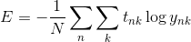

# Deep learning from scratch

- 의문
- 큰 그림
- 1 퍼셉트론
- 2 신경망
- 3 신경망 학습

## 의문

## 큰 그림


## 1. 퍼셉트론

### 1.1 퍼셉트론이란?

여기에서는 인공 뉴런, 단순 퍼셉트론으로 불리는 것

- 정의
  - 다수의 신호(흐름)를 입력으로 받아 하나의 신호를 출력
- 매개변수
  - 가중치
  - 편향
- 동작
  - 다른 뉴런(노드)으로부터의 입력 신호에 각각 고유한 가중치를 곱하고 그 합이 정해진 한계를 넘을 때만 1을 출력
  - 가중치가 클 수록 그 신호가 더 중요함을 의미
    - 가중치는 전류의 저항의 역작용을 함
  - 예시
    - y
      - 0 `(w1x1 + w2x2 <= θ)`
      - 1 `(w1x1 + w2x2 > θ)`

### 1.2 단순한 논리 회로

- 퍼셉트론을 이용한 논리 회로 구축
  - AND
  - NAND
- 퍼셉트론의 매개변수 값(가중치, 임계값)을 정하는 주체
  - 인간
    - NAND 게이트 등
  - 컴퓨터
    - 매개변수의 값을 컴퓨터가 자동으로 정하게 하는 작업을 **학습** 이라 함
    - 사람은 퍼셉트론의 구조(모델)를 고민하고, 컴퓨터에 학습할 데이터를 주는 일을 함
- **퍼셉트론으로 논리 회로를 구현할 수 있는데, 구조 자체는 똑같으나, 세 가지 게이트에서 다른 것은 매개변수(가중치와 임계값) 뿐**

### 2.3 퍼셉트론 구현하기

- AND
  - `w1x1 + w2x2 + b > 0 => 1`
  - `w1x1 + w2x2 + b <= 0 => 0`
  - `(w1, w2 = 0.5, b = -0.7)`
- NAND
  - `w1x1 + w2x2 + b > 0 => 1`
  - `w1x1 + w2x2 + b <= 0 => 0`
  - `(w1, w2 = -0.5, b = 0.7)`
- OR
  - `w1x1 + w2x2 + b > 0 => 1`
  - `w1x1 + w2x2 + b <= 0 => 0`
  - `(w1, w2 = 0.5, b = -0.3)`
- XOR
  - 단층 퍼셉트론으로 구현 불가
  - 2층 퍼셉트론으로 구현 가능

단층 퍼셉트론은 직선형 영역만 표현할 수 있고, 다층 퍼셉트론은 비선형 영역도 표현할 수 있다.
2층 퍼셉트론이면 컴퓨터를 만들 수 있다.

## 2. 신경망

### 2.1 활성화 함수

- 정의
  - 입력신호의 총합을 출력 신호로 변화시켜주는 함수
    - `y = h(b+w1x1+w2x2)`
    - `h(x) = { 0 (x≦0), 1 (x>0)}`
- 종류
  - 계단 함수
    - `h(x) = { 1 (x>0), 0 (x<=0)}`
      - 비선형 함수
  - 시그모이드 함수
    - `h(x) = 1/(1+e^-x)`
      - 비선형 함수
      - 연속함수
      - 단조증가함수
        - 입력이 중요하면 큰 값 출력, 중요하지 않으면 작은 값 출력
  - ReLU(Rectified Linear Unit) 함수
    - `h(x) = { x (x>0), 0 (x<=0) }`
    - 최근에 많이 사용됨
      - *왜 최근에 많이 사용되지?*
- 퍼셉트론과 신경망의 주된 차이
  - 활성화 함수 뿐
  - 신경망의 활성화 함수는 비선형 함수여야 함(시그모이드 함수 or ReLU 함수)
    - 선형 함수는 가감승제, 합성해도 계속 선형함수이기 때문에, 신경망의 층을 아무리 깊게 해도, 은닉층이 없는 네트워크로도 똑같은 기능을 할 수 있어버림

### 2.2 신경망 모델 계산


```py
def init_network():
  network = {}
  # it should be initialized with proper paramters(for now, it is just dummy)
  network['W1'] = np.array([[0.1, 0.3, 0.5], [0.2, 0.4, 0.6]]))
  network['b1'] = np.array([0.1, 0.2, 0.3])
  network['W2'] = np.array([[0.1, 0.4], [0.2, 0.5], [0.3, 0.6]])
  network['b2'] = np.array([0.1, 0.2])
  network['W3'] = np.array([[0.1, 0.3], [0.2, 0.4]])
  network['b3'] = np.array([0.1, 0.2])

  return network

# 순전파 함수
def forward(network, x):
  W1, W2, W3 = network['W1'], network['W2'], network['W3']
  b1, b2, b3 = network['b1'], network['b2'], network['b3']

  a1 = np.dot(x, W1) + b1
  z1 = sigmoid(a1)
  a2 = np.dot(z1, W2) + b2
  z2 = sigmoid(a2)
  a3 = np.dot(z2, W3) + b3
  y = identity_function(a3)

  return y

network = init_network()
x = np.array([1.0, 0.5])
y = forward(network, x)
print(y)
```

### 2.3 출력층 설계하기

- 어떤 딥러닝 문제냐에 따라서 출력층에서 사용하는 활성화 함수가 달라짐
  - 회귀(입력데이터에서 연속적인 수치 예측)
    - I(항등함수)
  - 분류(데이터가 어느 클래스에 속하는가)
    - softmax
      - *이 함수는 무슨 배경으로 등장했고, 어떤 특징을 갖는가? - 수학적으로*


- softmax 함수 특징
  - ① `sigma_{k=1}^{n}(y_k) = 1`
  - ② `y_k`는 단조증가 함수
  - ③ 클래스 인식을 확률적(통계적)으로 가능하게 함(값 0 ~ 1)
- 주의
  - 어차피 분류의 문제에서는 가장 출력값이 큰 뉴런에 해당하는 클래스로만 인식하므로, 굳이 softmax함수를 적용할 필요가 없다.
    - 대신, 학습할때에는 softmax함수를 사용
    - 추론에서는 사용하지 않음

### 2.4 용어 설명

- 정규화
  - 데이터를 특정 범위로 변환하는 것
- 전처리
  - 신경망의 입력데이터에 pre-processing 특정변환을 가하는것
- 백색화(whitening)
  - 전체 데이터를 균일하게 분포시킴
- 배치(batch)
  - 하나로 묶은 입력 데이터
  - 느린 I/O 비율을 줄임
    - 데이터 전체에서 표본을 추출한 것
- 학습
  - 정의
    - 훈련 데이터로부터 가중치・매개변수의 최적값을 자동으로 획득하는 것
- 학습지표
  - 정의
    - 손실 함수의 값
- python pickle
  - 파이썬 프로그램 실행 중에 특정 객체를 파일로 저장하는 기능

### 2.5 신경망의 추론 처리

- 구성
  - 입력층 뉴런 784개
    - 이미지 크기 `28x28`
  - 출력층 뉴런 10개
    - 문제가 0에서 9까지의 숫자를 구분하는 문제이기 때문
  - 은닉층
    - 첫 번째
      - 50개 뉴런
    - 두 번째
      - 100개 뉴런
- 구현

```py
import pickle
import numpy as np
from dataset.mnist import load_mnist
from functions import softmax, sigmoid

def get_data():
    # normalize는 전처리 프로세스에 해당
    (x_train, t_train), (x_test, t_test) = load_mnist(normalize=True, flatten=True, one_hot_label=False)
    return x_test, t_test

def init_network():
    with open("sample_weight.pkl", 'rb') as f:
        network = pickle.load(f)

    return network

def predict(network, x):
    W1, W2, W3 = network['W1'], network['W2'], network['W3']
    b1, b2, b3 = network['b1'], network['b2'], network['b3']

    a1 = np.dot(x, W1) + b1
    z1 = sigmoid(a1)
    a2 = np.dot(z1, W2) + b2
    z2 = sigmoid(a2)
    a3 = np.dot(z2, W3) + b3
    y = softmax(a3)

    return y

x, t = get_data()
network = init_network()

# without batch
accuracy_count = 0
for i in range(len(x)):
    y = predict(network, x[i])
    p = np.argmax(y)
    if p == t[i]:
        accuracy_count += 1

print("Accuracy: " + str(float(accuracy_count) / len(x)))

# with batch
batch_size = 100
accuracy_count = 0

for i in range(0, len(x), batch_size):
    x_batch = x[i:i+batch_size]
    y_batch = predict(network, x_batch)
    p = np.argmax(y_batch, axis=1) # 1번째 차원을 축으로
    accuracy_count += np.sum(p == t[i:i+batch_size])

print("Accuracy: " + str(float(accuracy_count) / len(x)))
```

- 배치 처리의 필요성
  - 배치
    - 하나로 묶은 입력 데이터
  - 배치 처리의 이점
    - ① 수치 계산 라이브러리가 큰 배열을 효율적으로 처리할 수 있도록 고도로 최적화 되어있음
    - ② 느린 I/O를 통한 데이터 읽는 횟수가 줄어 CPU / GPU를 이용한 순수 계산 수행 비율이 증가

## 3. 신경망 학습

### 3.1 우리의 목표

- **손실 함수의 결과값을 가장 작게 만드는 가중치 매개 변수 찾기**
  - 경사법
- 데이터 주도 학습
  - 데이터가 핵심
  - 데이터에서 패턴 추출(기계 학습)
    - 사람의 개입 배제
- 참고) 문제 해결 방법
  - ① 사람의 알고리즘(사람 중심)
  - ② 사람이 문제에서의 feature(입력 데이터에서 본질적인 데이터를 정확하게 추출할 수 있도록 설계된 변환기)를 추출 후 기계학습 구동
  - ③ 사람은 데이터만 제공하고 기계가 알아서 최적화(데이터 중심)
    - deep-learning = end-to-end machine learning(종단간 기계학습)
    - 그렇기 떄문에, 모든 문제를 같은 맥락에서 풀 수 있고, 주어진 데이터를 온전히 학습하고, 주어진 문제 패턴을 발견하려 시도

### 3.2 손실 함수

- 손실 함수
  - 정의
    - 신경망 성능의 "나쁨"을 나타내는 지표(현재의 신경망이 훈련 데이터를 얼마나 잘 처리하지 못하는가)
      - 만일, 정확도를 지표로 삼으면 (e.g) 100개중 33개가 맞아서 33%의 정확도), 미분값이 대부분의 장소에서 0이 되어 매개변수 갱신이 안됨


- 평균제곱오차(MSE - Mean Squared Error)
  - `E = 1/2・sigma_{k}(y_k - t_k)^2`
    - `y_k`는 k번쨰 뉴런의 신경망의 출력값
    - `t_k`는 k번쨰 뉴런의 정답 레이블
      - e.g) `y = [0.1, 0.05, 0.6, 0.0, 0.05, 0.1, 0.0, 0.1, 0.0, 0.0]`
      - `t = [0, 0, 1, 0, 0, 0, 0, 0, 0, 0] (원 핫 인코딩)`


- 교차 엔트로피 오차(CEE - Cross Entropy Error)
  - `E = -sigma_{k}(t_k・log(y_k))`
    - *왜 하필 이 함수를 쓰는가? - 애초에 어떤 배경으로 나타난 함수인가? 정보엔트로피와의 관계는 무엇인가?*
- **왜 정확도 대신 손실함수를 기준으로 학습을 할까?**
  - 정확도를 기준으로 파라미터를 구하려고 할 경우, 손실 함수에 대한 가중치의 편미분값이 대부분의 변화에도 0이 될 것이기 때문
  - 활성화 함수에서 계단함수 대신 시그모이드를 사용하는 이유도, 가중치의 변화를 계단함수가 대부분의 경우 흡수해버리기 때문(즉, 가중치를 변화 시켜도 손실함수의 변화가 계단함수에 흡수되어 버린다)

### 3.3 미니배치 학습

- 신경망의 학습
  - 정의
    - 손실함수 값을 최대한 줄여주는 매개변수를 탐색
  - 방법
    - 매개변수의 손실함수에 대한 미분값을 계산(그래서 활성화함수를 연속함수인 시그모이드 사용)
      - 가중치 매개변수의 값을 조금 변화시키면, 손실함수는 어떻게 변하는가



- 수식으로 미니 배치 적용한 손실함수 표현
  - `E = -1/N・sigma_{n}sigma_{k}(t_nk・log(y_nk))`
    - 데이터를 N개로 확장하고, N으로 나누어 정규화(평균 손실 함수)
  - 데이터가 너무 많으면 손실함수의 값을 구하기 힘들어짐
  - 데이터 일부를 추려 근사치로 이용가능(mini-batch)
    - 예시
      - 60,000장의 훈련 데이터 중에서 100장을 무작위로 뽑아 그 100장만 학습

### 3.4 손실 함수의 값을 최대한 줄이는 가중치 찾기

- 수치 미분(numerical_diff)
  - 정의
    - 무한소가 아닌, 아주 작은 차분으로 미분하는 것(근사)(`1e-4`)
      - c.f) 해석적 미분: 무한소를 이용한, 수학적인 미분(이론)

수치 미분의 예

```py
# 수치미분의 코드 예시
def numerical_diff(f, x):
    h = 1e-4 # 너무 작은 값이면 rounding error가 발생
    return (f(x+h) - f(x-h))/ (2*h) # 중앙 차분
```


- 기울기(gradient)
  - 정의
    - 모든 변수의 편미분을 벡터로(카르테지안 곱의 원소로) 정리한 것을 gradient라 함
      - e.g) `x0, x1의 편미분 동시에 계산 = (df/dx0, df/dx1)`
  - 특징
    - **기울기가 가리키는 방향은 각 장소에서 함수의 출력값을 가장 크게 줄이는 방향**
      - *수학적으로 왜?*
  - 의문
    - *gradient 를 구할 때, 왜, (x, y)와 같은 값 형태로 f에 input을 주어주는가?*
      - 어떤 점에서 미분을 하더라도, 결과적으로는 일차식인 것 처럼 간주되어 수치미분이 가능해짐

numerical gradient를 구하는 코드

```py
def numerical_gradient(f, x):
  h = 1e-4
  grad = np.zeros_like(x)

  for idx in range(x.size):
    tmp_val = x[idx]

    x[idx] = temp_val + h
    fxh1 = f(x)

    x[idx] = temp_val - h
    fxh2 = f(x)

    grad[idx] = (fxh1-fxh2)/(2*h)
    x[idx] = tmp_val

  return grad
```

gradient decent 수식


...

- 경사법(경사하강법)
  - 정의
    - 손실함수가 최솟값이 되는 매개변수(가중치, 편향)을 찾아야 함
    - 그것이 가능한 방법중에서 "기울기"를 잘 활용해 함수의 최솟값을 찾는 것이 경사법
  - 주의
    - 기울기가 가리키는 곳으로 가야 최솟값이 있는지, 그곳이 정말 나아가야 할 방향인지는 보장되지 않음
    - 오히려 복잡한 함수에서는 기울기가 가리키는 방향에 최솟값이 없는 경우가 대부분
      - e.g) 안장점(saddie point), 극솟값, 고원(plateau)
    - 그럼에도 불구하고 기울기 정보를 단서로 나아갈 방향을 정해야 함
  - 방법
    - `x0 = x0 - η・df/dx0`
      - `η`는 학습률(한번 학습에서 얼마나 학습해야 할지 - 매개변수값을 얼마나 갱신해야 할지)
      - `η`를 너무 크거나 작게 하면 안됨. 적당히 좋은 값 설정이 필요

gradient decent의 구현

```py
def gradient_decent(f, init_x, lr=0.01, step_num=100):
  x = init_x

  for i in range(step_num):
    grad = numerical_gradient(f,x)
    x -= lr * grad

  return x
```

- 하이퍼 파라미터
  - 정의
    - 사람이 직접 설정해야 하는 매개변수
    - 여러 후보값 중에서 시험을 통해 가장 잘 학습하는 값을 찾는 과정을 거쳐야 함
  - 예시
    - `η`


### 3.5 신경망에서 기울기

- `dL/dW`
  - `L`는 손실함수
  - `W`는 가중치 행렬

간단한 신경망 예시

```py
class simpleNet:
    def __init__(self):
        self.W = np.random.randn(2,3) # 정규분포로 초기화

    def predict(self, x):
        return np.dot(x, self.W)

    def loss(self, x, t):
        z = self.predict(x)
        y = softmax(z)
        loss = cross_entropy_error(y, t)

        return loss

def f(W):
    return net.loss(x, t)

net = simpleNet()

x = np.array([0.6, 0.9])
p = net.predict(x)

dW = numerical_gradient(f, net.W)
```

### 3.6 TwoLayerNet

- 신경망 학습 절차
  - 1단계 - 미니배치
    - 무작위 선출이므로 확률적 경사하강 법(Stochastic Gradient Decent - SGD)이라 부름
  - 2단계 - 기울기 산출
  - 3단계 - 매개변수 갱신
  - 4단계 - 1~3단계 반복

```py
import numpy as np
from functions import sigmoid, softmax, cross_entropy_error, numerical_gradient

class TwoLayerNet:
    def __init__(self, input_size, hidden_size, output_size, weight_init_std=0.01):
        self.params = {}
        self.params['W1'] = weight_init_std * np.random.randn(input_size, hidden_size)
        self.params['b1'] = np.zeros(hidden_size)

        self.params['W2'] = weight_init_std * np.random.randn(hidden_size, output_size)
        self.params['b2'] = np.zeros(output_size)

    def predict(self, x):
        W1, W2 = self.params['W1'], self.params['W2']
        b1, b2 = self.params['b1'], self.params['b2']

        a1 = np.dot(x, W1) + b1
        z1 = sigmoid(a1)
        a2 = np.dot(z1, W2) + b2
        y = softmax(a2)

        return y

    def loss(self, x, t):
        y = self.predict(x)

        return cross_entropy_error(y, t)

    def accuracy(self, x, t):
        y = self.predict(x)
        y = np.argmax(y, axis=1)
        t = np.argmax(t, axis=1)

        accuracy = np.sum(y == t) / float(x.shape[0])
        return accuracy

    def numerical_gradient(self, x, t):
        loss_W = lambda W: self.loss(x, t)

        grads = {}
        grads['W1'] = numerical_gradient(loss_W, self.params['W1'])
        grads['b1'] = numerical_gradient(loss_W, self.params['b1'])
        grads['W2'] = numerical_gradient(loss_W, self.params['W2'])
        grads['b2'] = numerical_gradient(loss_W, self.params['b2'])

        return grads

    def gradient(self, x, t):
      # 오차역전파법 - 다음장
      # 수치 미분을 사용할 떄와 거의 같은 결과를 훨씬 빠르게 얻을 수 있음
      pass

if __name__ == '__main__':
    from dataset.mnist import load_mnist

    (x_train, t_train), (x_test, t_test) = load_mnist(normalize=True, one_hot_label=True)

    network = TwoLayerNet(input_size=784, hidden_size=50, output_size=10)

    # hyper-parameter
    iters_num = 1000
    train_size = x_train.shape[0]
    batch_size = 100
    learning_rate = 0.1

    train_loss_list = []
    train_acc_list = []
    test_acc_list = []

    iter_per_epoch = max(train_size / batch_size, 1)

    for i in range(iters_num):
        print(i)
        # get mini-batch
        batch_mask = np.random.choice(train_size, batch_size)
        x_batch = x_train[batch_mask]
        t_batch = t_train[batch_mask]

        # get gradient
        grad = network.gradient(x_batch, t_batch)

        # update parameters
        # (gradient decent)
        for key in ('W1', 'b1', 'W2', 'b2'):
            network.params[key] -= grad[key]

        # the registration of the learning process
        loss = network.loss(x_batch, t_batch)
        train_loss_list.append(loss)

        if i % iter_per_epoch == 0:
            train_acc = network.accuracy(x_train, t_train)
            test_acc = network.accuracy(x_test, t_test)
            train_acc_list.append(train_acc)
            test_acc_list.append(test_acc)
            print("train acc, test acc : " + str(train_acc) + ", " + str(test_acc))

    import matplotlib.pylab as plt
    x_axis = range(iters_num)
    y_axis = train_loss_list
    plt.plot(x_axis, y_axis)
    plt.show()
```

- 위 코드에 대한 부가 설명
  - ① 가중치 매개변수 초깃값을 무엇으로 설정하냐가 신경망 학습의 성공을 좌우하기도 함
  - ② 훈련 데이터의 미니배치에 대한 손실 함수의 값이 작아지고 있다는 것은 신경망이 잘 학습하고 있다는 방증
  - ③ test데이터를 사용하여, 오버피팅 되어있는지 확인해야 함
    - 훈련하지 않은 데이터로 평가가 필요
  - ④ train데이터와 test데이터에 둘다 정확도가 비슷하게 올라가고 나아지고 있으면 overfitting이 아니다.
    - 오버피팅이 시작되면, 그때에 조기에 중단하고 예방해야한다
    - e.g)
      - 가중치 감소
      - 드롭아웃
