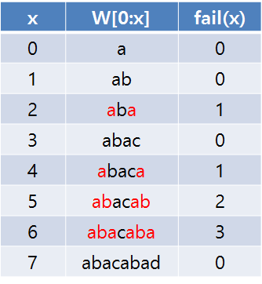

# KMP

- 의문
- 문제
- 개요
  - 실패 함수
- 코드 예시

## 의문

## 문제

- 엄청나게 긴 문자열에서 특정 문자열을 어떻게 찾을 것인가?

## 개요

- 원리
  - 앞 뒤가 반복되는 문자는 다시 처음부터 알아보지 말고 건너 뛰어서 문자열 비교를 하자

### 실패 함수(failure function)

KMP failure function example



- 정의
  - 찾으려는 문자의 위치마다 불일치가 발생했을 때, j가 어디로 이동해야 하는지 나타내는 값
    - `fail(6) = 2 >> j=6에서 틀렸을 때, j=2로 가서 다시 비교`
- 주의
  - 실패 함수의 정의는 `fail(j1) = j2` 즉, j1의 위치에서 문자열 비교가 틀렸을 경우 j2를 i와 비교한다.가 됨
  - 그러나 실패 함수를 구현하기 위한 table(list)는 `fail[j1-1] = j2` 로 변환해줘야 함
    - 왜냐하면 table은 단순히 substring의 접두사와 접미사가 얼마나 겹쳐있는지만 확인하기 때문
    - `fail[j1]`의 뜻은, `j1+1`에서 문자 미스매칭이 발생했을 경우, `fail[j1]`이 접두사와 접미사가 일치하는 개수이므로, 해당 값을 인덱스로 갖는 `j1`과 i를 다시 비교하라는 뜻

## 코드 예시

백준 9253 스페셜 저지

```py
from typing import List

A = input()
B = input()
U = input()


def KMP(string: str, target: str) -> List[int]:
    def create_failure_table(target: str) -> List[int]:
        failure_table = [0 for _ in range(len(target))]

        j=0
        for i in range(1, len(target)):
            while j>0 and target[i] != target[j]:
                j = failure_table[j-1]

            if target[i] == target[j]:
                j += 1
                failure_table[i] = j

        return failure_table

    matched_target_index_list = []

    target_failure_table = create_failure_table(target)

    j=0
    for i in range(0, len(string)):
        while j>0 and string[i] != target[j]:
            # j번째가 틀렸으므로, j를 fail(j)값으로 되돌림
            # 그런데, fail(j) = failure_table[j-1]
            j = target_failure_table[j-1]

        if string[i] == target[j]:
            if j == len(target)-1:
                matched_target_index_list.append(i-len(target)+1)
                # j+1번째에서 틀렸다고 가정하고 다시 j를 되돌림(j번째 까지는 맞았으므로)
                j = target_failure_table[j]
            else:
                j += 1

    return matched_target_index_list

if len(U) > len(A) or len(U) > len(B):
    print('NO')
elif len(KMP(A, U)) > 0 and len(KMP(B, U)) > 0:
    print('YES')
else:
    print('NO')
```
