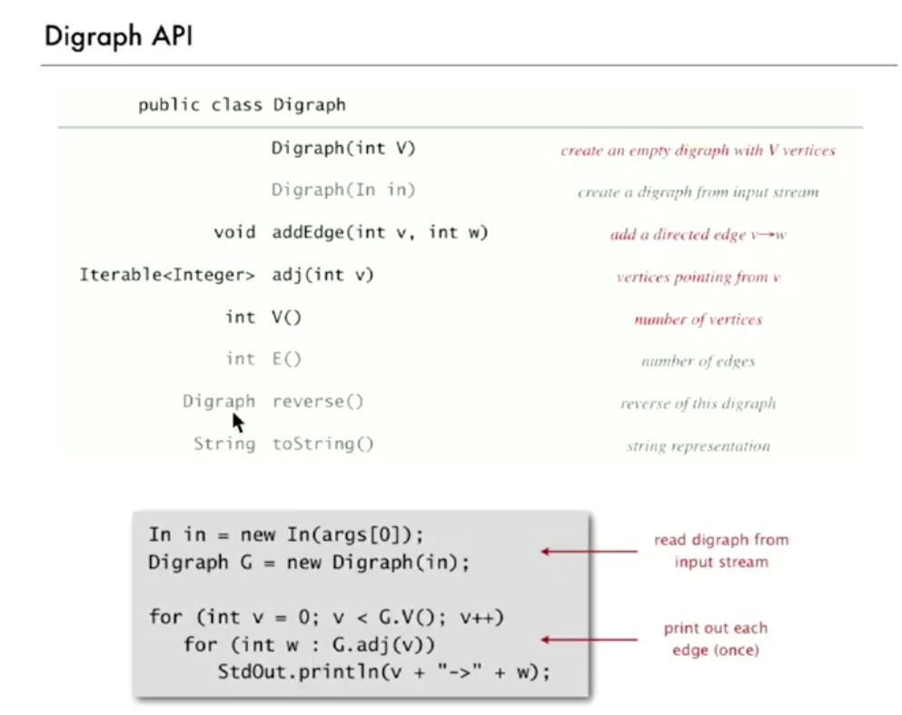
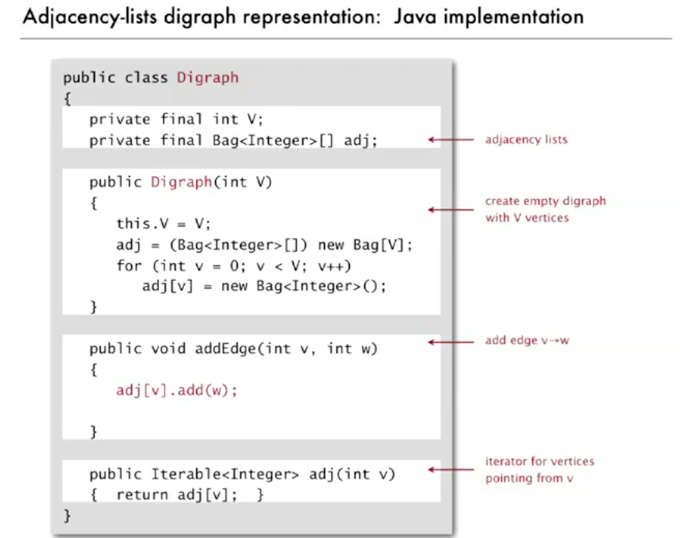
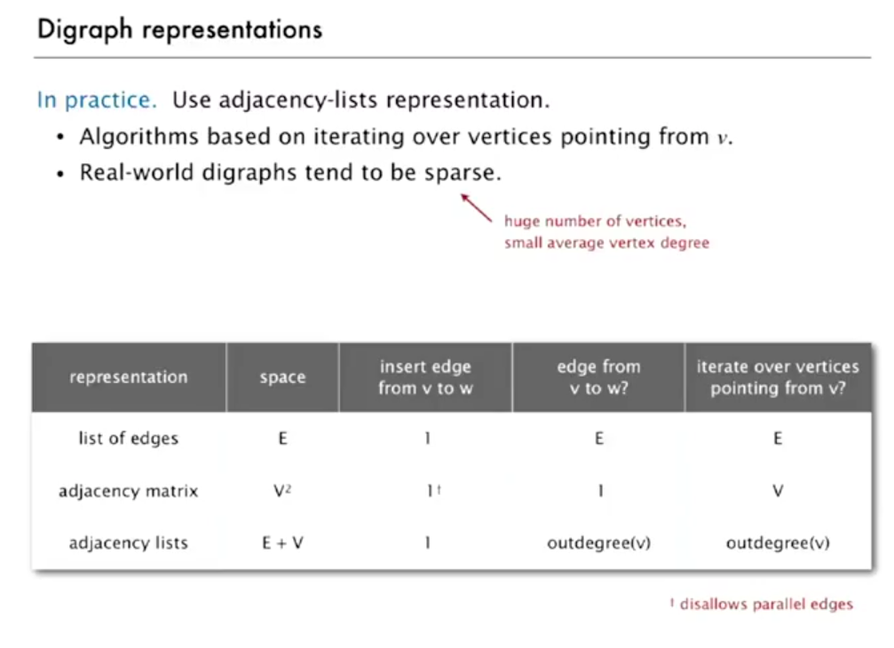
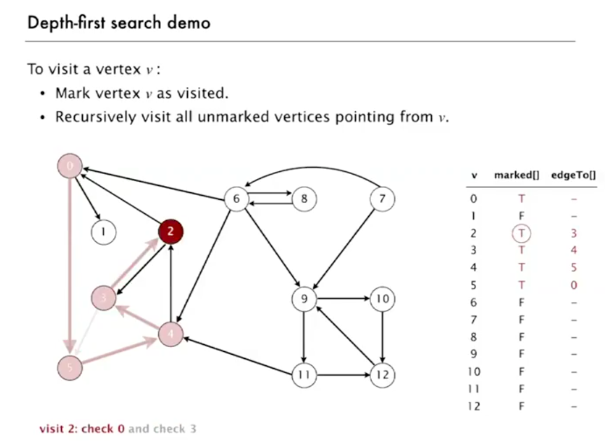
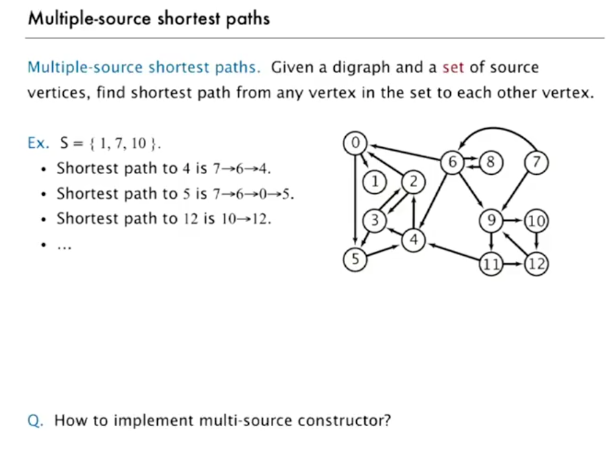
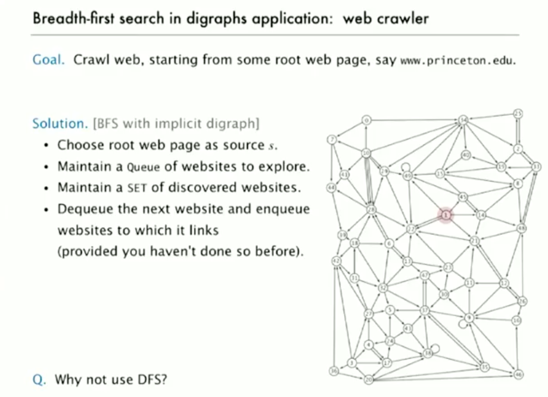
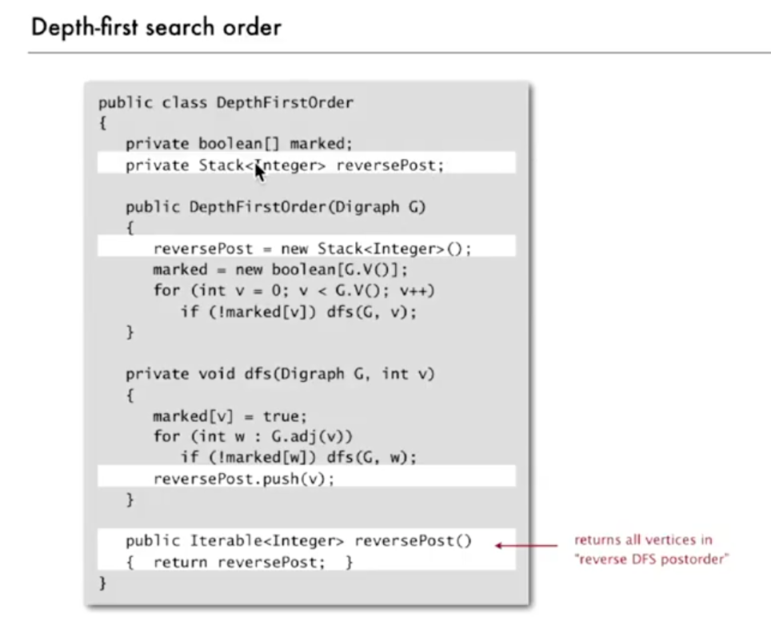
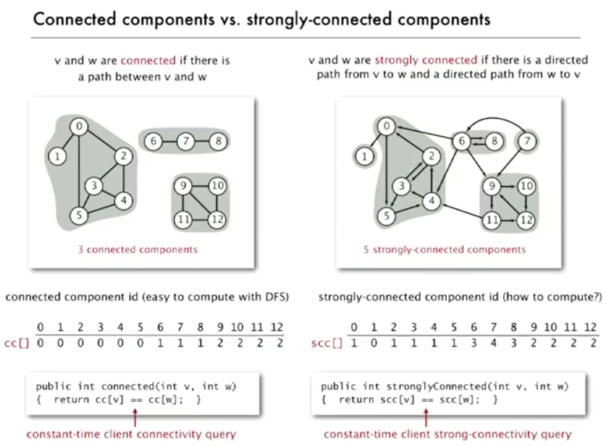
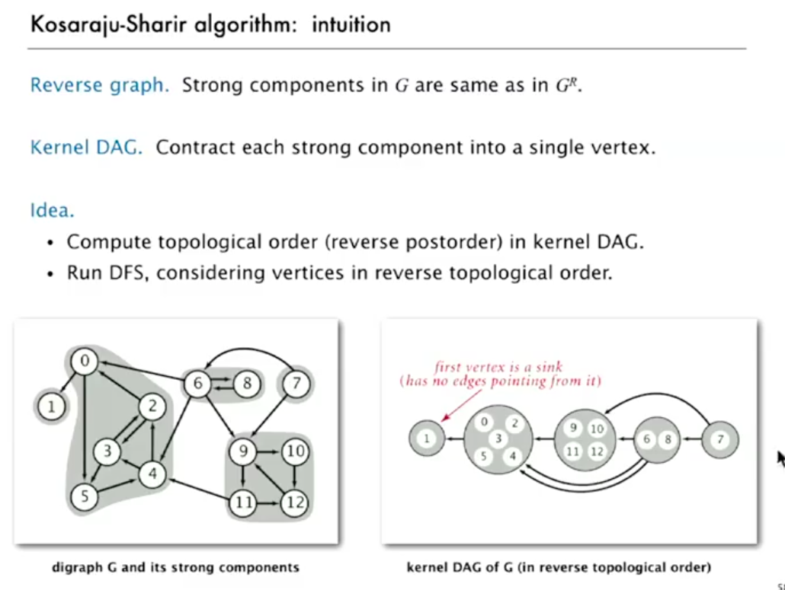
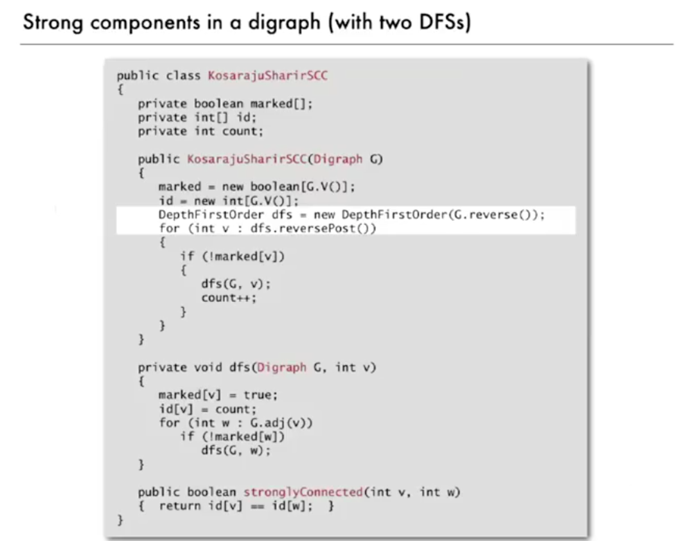

# Directed graph

## 정의

- 방향이 있는 간선에 의해서 서로 연결된 정점들의 집합
- outdegree
  - 특정 정점으로부터 떠나는 간선의 개수
- indegree
  - 특정 정점으로 들어오는 간선의 개수
- 예시
  - 길 네트워크
    - 정점: 교차로
    - 간선: 일방 통행로
  - 웹
  - 금융
    - 정점: 은행
    - 간선: 거래

## 문제

- 경로
  - 정점 s에서 t까지의 방향이 있는 경로가 존재하는가?
- 최단 경로
  - 정점 s에서 t까지의 방향이 있는 최단 경로는?
- 위상 정렬(Topological sort)
  - 모든 정점이 위로 향하는 방향이 있는 그래프를 그릴 수 있는가?
- 강한 연결(String connectivity)
  - 모든 정점과 정점간에 직접적으로 연결된 경로가 존재하는가?
- *Transitive closure*
  - For which vertices v and w is there a path from v to w?
- 페이지 랭크 알고리즘(PageRank)
  - 웹 페이지의 중요성이란 무엇인가?

- *How many different digraphs are there on V vertices? Allow self-loops but do not allow parallel edges.*
  - 2^(V^2)

## 그래프 API

- 실제 그래프는 매우 크고 듬성듬성(sparse)하기 때문에 인접 리스트(adjacent list)를 활용

## 방향 그래프 서치(Digraph Search)

### 방향 그래프에서의 dfs

- 비 방향 그래프에서의 방식과 같음
  - 모든 비 방향 그래프는 방향 그래프이다(양쪽 방향이 있는 간선)
  - dfs는 방향 그래프 알고리즘

- 응용
  - 프로그램 제어 흐름 분석(린트 시스템?)
    - 모든 프로그램은 방향 그래프임
    - 정점: 명령 블록
    - 간선: 점프
    - 도달할 수 없는 코드 제거
    - 무한 루프 감지
  - 가비지 컬렉터(garbage collector)
    - 모든 데이터 구조는 방향 그래프
    - 정점: 객체
    - 간선: 참조
    - 루트: 프로그램에 의해서 직접적으로 접근할 수 있는 객체(e.g 스택)
    - 도달 가능한 객체: 프로그램에 의해서 간접적으로 접근가능한 오브젝트
    - 마크 스윕 알고리즘
      - 마크: 모든 접근 가능한 객체를 마킹함
      - 스윕: 오브젝트가 마크되지 않으면 버려짐(사용할 수 있는 리스트로 옮김)

### 방향 그래프에서의 bfs

- 비 방향 그래프에서의 방식과 같음
  - 모든 비 방향 그래프는 방향 그래프이다(양쪽 방향이 있는 간선)
  - bfs는 방향 그래프 알고리즘
- 최단 경로(최소 수의 간선)를 구하는데에 사용됨

- 웅용
  - 다중 출발점 최단 경로
    - 출발 정점들의 집합과 방향 그래프가 있을때, 출발 정점의 집합에서 다른 정점까지의 최단 경로를 찾아라
    - bfs를 사용하는데, 출발 정점의 집합의 모든 정점을 bfs큐에 넣고 실행
  - 웹 크롤링
    - 루트 웹 페이지에서 연결된 모든 웹 페이지를 크롤링함

## 위상 정렬(Topological Sort)

- 문제
  - 어떠한 일이 순서대로 끝나야 하는 제약이 있을 떄, 어떠한 순서대로 스케쥴을 짜야하는가?
- 방향 그래프 모델
  - 정점: 일
  - 간선: 순서 제약
  - 회로가 없는 그래프(DAG Directed Acyclic Graph)
- 해결
  - dfs(후위 탐색, postorder search)
  - 스택으로 값을 저장하면 됨
- 응용
  - 방향 그래프에서의  회로 검출

## 강한 요소(Strong Components)

- 정의
  - 방향 그래프에서 정점 v에서 w까지의 경로가 존재하고, w에서 v까지의 경로가 존재하면, 정점 v와 w는 강하게 연결되어있다.
  - 즉, 회로가 존재한다는 얘기
- 특징
  - v는 v와 강하게 연결 되어있다
  - v가 w와 강하게 연결 되어있다면, w는 v와 강하게 연결 되어있다.
  - v가 w와 강하게 연결 되어있고, w가 x와 강하게 연결되어있으면, v는 x와 강하게 연결되어있다.
- 응용
  - 천적 관계 그래프
    - 정점: 종
    - 간선: 생산자에서 소비자
    - 강한 요소: 공통 에너지 흐름의 종들의 부분집합
  - 소프트웨어 모듈
    - 점: 소프트웨어 모듈
    - 간선: 모듈에서 의존까지
    - 강한 요소: 서로 상호작용하는 모듈의 부분집합

### Kosaraju-Sharir 알고리즘

- 영감
  - 리버스 그래프
    - G의 강한 요소는 리버스G와 같다
  - 커널 DAG(Directed acyclic graph 유향 비순환 그래프)
    - 각각의 강한 요소를 하나의 점으로 수축(contract)
- 아이디어
  - 커널 DAG를 위상 정렬함
  - 위상 정렬의 반대 방향으로 dfs알고리즘을 실행
